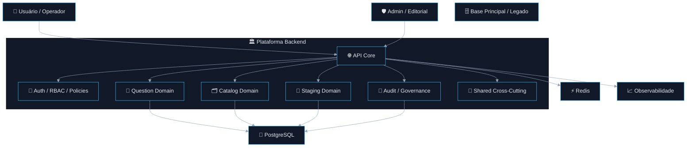
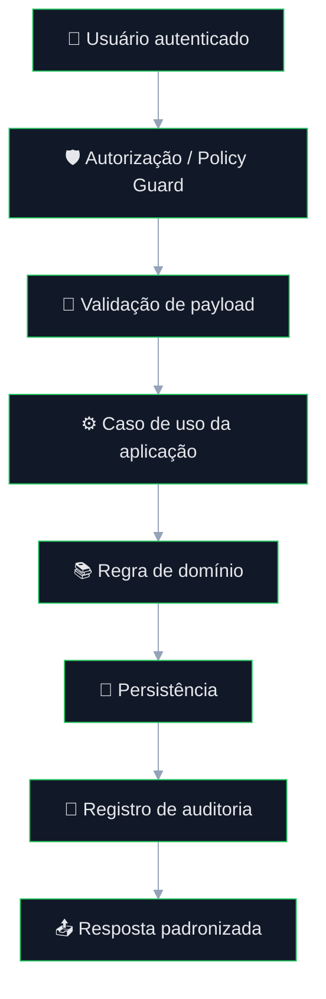
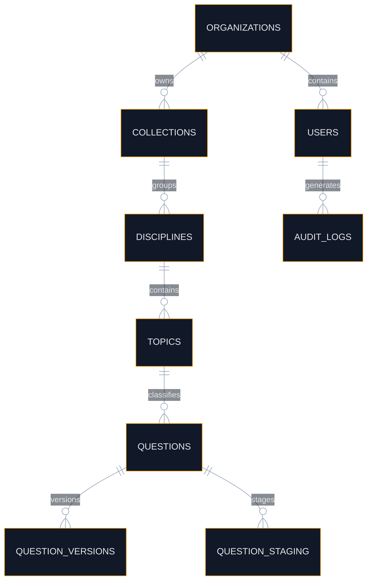
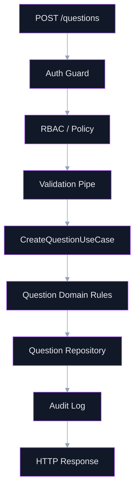
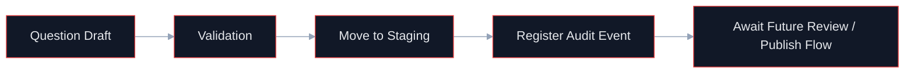
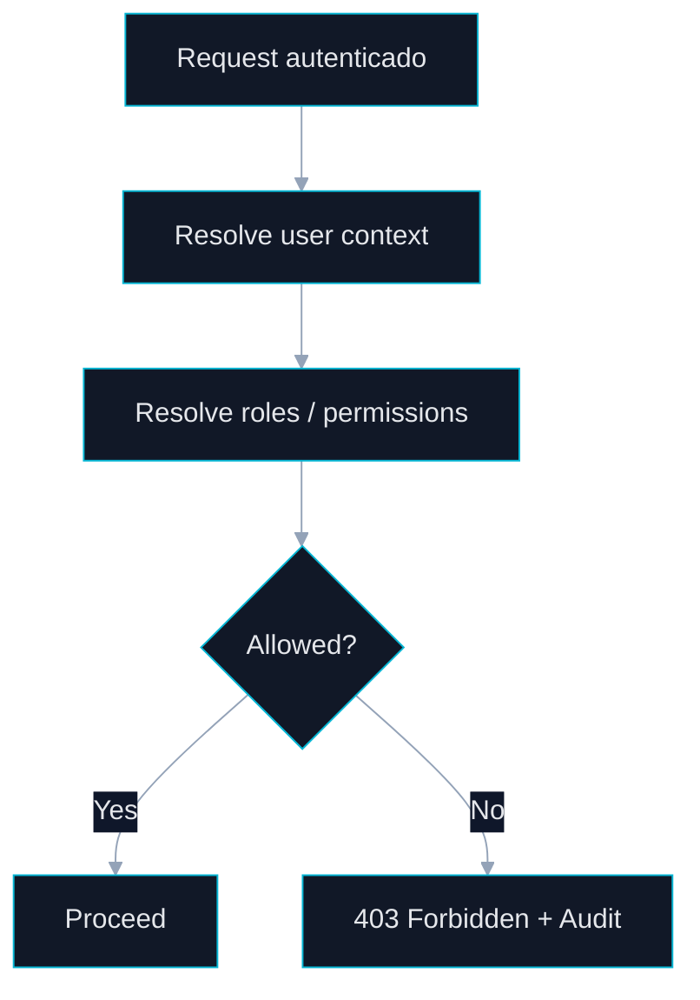
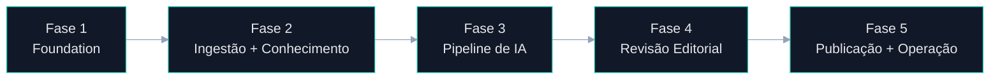

# Plataforma de Questões com IA

<div align="center">


</div>

<br />

> Plataforma backend orientada a domínio para **governança, criação, staging, revisão futura e publicação controlada de questões**, projetada com foco em **segurança**, **auditabilidade**, **modularidade**, **resiliência operacional** e **evolução incremental por fases**.

---

## 📌 Status Atual do Projeto

> **O projeto encontra-se oficialmente na `FASE 1 — Fundação Segura`.**
>
> A arquitetura completa da plataforma já foi decidida, porém a implementação atual está **deliberadamente limitada ao núcleo estrutural**, assegurando que a evolução para ingestão, IA, revisão editorial e publicação aconteça **sem reescrita do core**, **sem acoplamento indevido** e **sem dívida arquitetural prematura**.

### O que isso significa na prática

A plataforma **ainda não está operando como pipeline completo de IA**.  
Neste momento, ela estabelece a camada correta para suportar:

- identidade e acesso;
- controle de domínio;
- taxonomia e organização de conteúdo;
- CRUD governado de questões;
- staging antes de fluxos futuros de revisão/publicação;
- observabilidade mínima e auditabilidade;
- padrões técnicos permanentes de arquitetura.

---

# Sumário

- [1. Visão Geral](#1-visão-geral)
- [2. Objetivo da Plataforma](#2-objetivo-da-plataforma)
- [3. Estado Atual do Projeto](#3-estado-atual-do-projeto)
- [4. Escopo da Fase 1](#4-escopo-da-fase-1)
- [5. Direção Arquitetural](#5-direção-arquitetural)
- [6. Princípios Arquiteturais](#6-princípios-arquiteturais)
- [7. Arquitetura de Alto Nível](#7-arquitetura-de-alto-nível)
- [8. Fluxo Operacional da Fase 1](#8-fluxo-operacional-da-fase-1)
- [9. Bounded Contexts da Fase 1](#9-bounded-contexts-da-fase-1)
- [10. Organização Arquitetural por Camadas](#10-organização-arquitetural-por-camadas)
- [11. Estrutura Sugerida do Repositório](#11-estrutura-sugerida-do-repositório)
- [12. Modelo de Dados da Fase 1](#12-modelo-de-dados-da-fase-1)
- [13. Segurança](#13-segurança)
- [14. Observabilidade](#14-observabilidade)
- [15. Resiliência e Confiabilidade](#15-resiliência-e-confiabilidade)
- [16. Contratos e Convenções Técnicas](#16-contratos-e-convenções-técnicas)
- [17. Fluxos Técnicos em Mermaid](#17-fluxos-técnicos-em-mermaid)
- [18. Fora do Escopo da Fase 1](#18-fora-do-escopo-da-fase-1)
- [19. Roadmap Incremental](#19-roadmap-incremental)
- [20. Critérios de Pronto da Fase 1](#20-critérios-de-pronto-da-fase-1)
- [21. Stack Técnica](#21-stack-técnica)
- [22. Conclusão](#22-conclusão)

---

# 1. Visão Geral

A plataforma foi concebida como uma **base operacional governada para produção de questões**, preparada para evoluir até um pipeline completo com:

- ingestão de conteúdo;
- recuperação contextual;
- agentes especializados;
- revisão humana;
- publicação controlada;
- observabilidade e governança ponta a ponta.

A implementação atual existe para garantir que a base da solução seja **estruturalmente correta antes da automação pesada**.

Em termos arquiteturais, a Fase 1 entrega o que mais importa no início de uma plataforma desse tipo:

- **fronteiras internas fortes**;
- **segurança por padrão**;
- **consistência de domínio**;
- **modelo evolutivo seguro**;
- **capacidade de auditoria**;
- **preparação real para pipeline futuro**.

### Decisão central da arquitetura

> **IA nunca deve operar diretamente sobre o coração editorial e operacional sem um núcleo seguro, rastreável, versionável e governado.**

Essa decisão evita:

- contaminação da base principal;
- automação sem controle;
- acoplamento entre domínio e vendor;
- crescimento técnico desordenado;
- perda de governança operacional.

---

# 2. Objetivo da Plataforma

A plataforma existe para suportar, com segurança e governança, o ciclo de vida de produção de questões e seus metadados, com possibilidade de evolução para automação assistida por IA.

## Objetivos principais

- centralizar entidades acadêmicas e editoriais;
- permitir organização por coleções, temas e tópicos;
- manter um banco de questões governado;
- suportar staging antes de publicação;
- registrar autoria, revisão, alterações e contexto operacional;
- criar uma base tecnicamente correta para expansão futura com IA.

## Objetivos técnicos

- manter **baixo acoplamento** entre domínio e infraestrutura;
- garantir **segurança por padrão**;
- preservar **auditabilidade ponta a ponta**;
- suportar **crescimento incremental sem reescrita estrutural**;
- preparar o sistema para **pipeline assíncrono e modular**.

---

# 3. Estado Atual do Projeto

O projeto encontra-se na **Fase 1 — Fundação Segura**.

Nesta etapa, o sistema **ainda não é a plataforma completa de IA**.  
Ele representa o **núcleo arquitetural e operacional** sobre o qual as capacidades avançadas serão adicionadas de forma controlada.

## Capacidades efetivamente pertencentes à Fase 1

- identidade e acesso;
- segregação de responsabilidades;
- governança de domínio;
- persistência inicial;
- estrutura de staging;
- rastreabilidade;
- observabilidade básica;
- contratos e padrões de evolução.

## Capacidades conscientemente adiadas

- ingestão documental;
- retrieval vetorial;
- OCR;
- agentes especializados;
- pipeline assíncrono multi-step;
- revisão automatizada;
- publicação orquestrada.

Essa delimitação é **intencional e correta**. Em projetos dessa natureza, antecipar pipeline avançado sem foundation costuma produzir uma base frágil, cara de manter e difícil de operar.

---

# 4. Escopo da Fase 1

A Fase 1 cobre exclusivamente os elementos fundamentais para o funcionamento seguro da plataforma.

## Funcionalidades incluídas

### Segurança e acesso
- autenticação;
- autorização baseada em papéis e permissões;
- controle de acesso por contexto organizacional;
- isolamento por tenant/organização quando aplicável.

### Núcleo de domínio
- coleções;
- disciplinas/temas/tópicos;
- taxonomias básicas;
- estrutura inicial de classificação;
- gerenciamento de questões manuais.

### Banco de questões
- criação de questões;
- edição;
- versionamento básico;
- status editorial;
- staging controlado.

### Governança e rastreabilidade
- auditoria básica;
- trilha de alteração;
- logs estruturados;
- correlação mínima de requests.

### Base operacional
- banco principal operacional;
- estrutura de módulos;
- contratos internos;
- validação de entrada;
- tratamento consistente de erros.

---

# 5. Direção Arquitetural

A arquitetura adotada é um **Monólito Modular**, organizado por **bounded contexts**, com **Clean Architecture** e **Hexagonal Architecture** como princípios de composição interna.

Essa escolha equilibra corretamente:

- simplicidade operacional;
- separação de responsabilidades;
- clareza de domínio;
- facilidade de manutenção;
- extração futura de serviços, se necessária.

## Motivos da escolha

A solução precisa:

- preservar coesão de domínio;
- evitar fragmentação prematura;
- permitir crescimento seguro;
- sustentar observabilidade e auditoria;
- reduzir custo operacional inicial.

Microsserviços neste estágio adicionariam complexidade operacional cedo demais, sem retorno proporcional.

## Resultado arquitetural esperado

Ao final da evolução planejada, esta base deverá sustentar:

- módulos coesos;
- pipeline controlado;
- integração desacoplada com providers;
- ACL explícita para legado;
- expansão segura para IA e revisão editorial;
- extração futura de capacidades específicas, se economicamente justificável.

---

# 6. Princípios Arquiteturais

A plataforma é guiada pelos princípios abaixo.

## 6.1 Domain First
O domínio define o sistema. Framework, banco, fila e integrações não definem a regra de negócio.

## 6.2 Secure by Default
Toda entrada, integração e saída é tratada como potencialmente insegura até validação explícita.

## 6.3 Staging Before Publish
Nenhum conteúdo operacionalmente sensível deve ser tratado como definitivo sem camada intermediária controlada.

## 6.4 Everything Auditable
A plataforma deve ser rastreável em requests, ações, mudanças e eventos relevantes.

## 6.5 Low Coupling, High Cohesion
Cada módulo possui responsabilidade clara e dependências explícitas.

## 6.6 Observability by Design
Logs, métricas e tracing não são acessórios; fazem parte da arquitetura.

## 6.7 Incremental Evolution
A evolução ocorre por fases, preservando o núcleo e evitando reescrita estrutural.

---

# 7. Arquitetura de Alto Nível

Mesmo na Fase 1, a arquitetura já nasce preparada para a forma final da plataforma.

## Visão consolidada



## Leitura arquitetural

A Fase 1 concentra-se em:

- **API Core** como ponto de entrada e controle;
- **Auth / RBAC** como camada obrigatória de proteção;
- **Question Domain** como núcleo de conteúdo;
- **Catalog Domain** como classificação e organização;
- **Staging Domain** como proteção editorial;
- **Audit / Governance** como base de rastreabilidade.

A estrutura já deixa espaço para:

- orquestração futura;
- filas;
- processamento assíncrono;
- IA;
- retrieval;
- publicação governada.

---

# 8. Fluxo Operacional da Fase 1

O fluxo atual é intencionalmente mais enxuto do que a arquitetura final.

## Fluxo principal



## Interpretação técnica

Na Fase 1, o sistema opera como uma **plataforma governada de CRUD e staging**, e não como um pipeline de IA.

A ordem correta do fluxo é:

1. identidade;
2. autorização;
3. validação;
4. caso de uso;
5. domínio;
6. persistência;
7. auditoria;
8. resposta padronizada.

Essa ordem evita que regras críticas sejam “puladas” por acoplamento indevido em controller, service ou adapter.

---

# 9. Bounded Contexts da Fase 1

A separação por contexto evita crescimento desordenado e facilita evolução futura.

## 9.1 `auth`
Responsável por:

- autenticação;
- sessão/token;
- identidade;
- autorização;
- RBAC;
- guards e policies.

## 9.2 `organizations` / `tenancy`
Responsável por:

- tenant;
- organização;
- escopo organizacional;
- segregação de dados;
- governança de acesso.

## 9.3 `catalog`
Responsável por:

- coleções;
- disciplinas;
- temas;
- tópicos;
- taxonomias;
- relacionamentos classificatórios.

## 9.4 `questions`
Responsável por:

- entidade principal de questão;
- conteúdo;
- metadados;
- versão inicial;
- estado editorial básico.

## 9.5 `staging`
Responsável por:

- rascunhos;
- estado transitório;
- preparação para futura revisão/publicação;
- isolamento da base definitiva.

## 9.6 `audit`
Responsável por:

- trilha de eventos;
- registro de alterações;
- autoria;
- contexto operacional.

---

# 10. Organização Arquitetural por Camadas

Cada módulo deve seguir a mesma disciplina estrutural.

## Padrão interno

```text
interfaces -> application -> domain -> contracts/ports -> infrastructure
```

## Responsabilidade por camada

### `interfaces`
Contém:
- controllers;
- DTOs de entrada/saída;
- handlers;
- serializers;
- interceptors específicos de borda.

**Não deve conter regra de negócio.**

### `application`
Contém:
- casos de uso;
- orquestração transacional;
- coordenação entre contratos;
- serviços de aplicação.

**Coordena o fluxo, mas não concentra a regra de domínio.**

### `domain`
Contém:
- entidades;
- value objects;
- políticas;
- invariantes;
- serviços de domínio;
- contratos do negócio.

**É o centro da modelagem.**

### `contracts/ports`
Contém:
- interfaces de repositórios;
- gateways;
- serviços externos abstratos;
- contratos de comunicação.

**Impede vazamento de infraestrutura para o domínio.**

### `infrastructure`
Contém:
- ORM;
- adapters;
- repositories concretos;
- cache;
- mensageria;
- integrações.

**Implementa tecnologia, não regra de negócio.**

---

# 11. Estrutura Sugerida do Repositório

A estrutura abaixo representa a forma esperada do projeto na Fase 1.

```text
src/
├── bootstrap/
│   ├── app/
│   ├── validation/
│   ├── exceptions/
│   ├── telemetry/
│   └── security/
│
├── config/
│   ├── app/
│   ├── database/
│   ├── auth/
│   ├── cache/
│   ├── telemetry/
│   └── security/
│
├── shared/
│   ├── constants/
│   ├── enums/
│   ├── types/
│   ├── helpers/
│   ├── exceptions/
│   ├── validation/
│   ├── sanitization/
│   ├── security/
│   └── telemetry/
│
├── infra/
│   ├── database/
│   ├── cache/
│   ├── logger/
│   └── http/
│
├── modules/
│   ├── auth/
│   ├── organizations/
│   ├── catalog/
│   ├── questions/
│   ├── staging/
│   └── audit/
│
├── database/
│   ├── migrations/
│   ├── seeds/
│   └── factories/
│
└── main.ts
```

---

# 12. Modelo de Dados da Fase 1

## Entidades centrais

- `users`
- `roles`
- `permissions`
- `organizations`
- `collections`
- `disciplines`
- `topics`
- `questions`
- `question_versions`
- `question_staging`
- `audit_logs`

## Relacionamentos esperados



## Leitura do modelo

Esse modelo busca garantir, já na Fase 1:

- identidade e governança de autoria;
- classificação consistente do banco de questões;
- versionamento mínimo viável;
- staging como estado intermediário controlado;
- rastreabilidade de alterações.

---

# 13. Segurança

A segurança é um requisito estrutural da arquitetura.

## Controles mínimos da Fase 1

- autenticação obrigatória;
- autorização por papel e política;
- validação forte de payload;
- sanitização de entrada;
- tratamento de erro sem vazamento sensível;
- segregação de credenciais;
- hardening básico de borda;
- trilha mínima de auditoria.

## Diretrizes obrigatórias

1. Nenhuma rota sensível sem autenticação.
2. Nenhuma operação de escrita sem autorização explícita.
3. Nenhum payload entra no domínio sem validação.
4. Nenhuma exceção técnica deve vazar stack sensível em produção.
5. Nenhum dado operacional crítico deve ser alterado sem rastreabilidade.

---

# 14. Observabilidade

A observabilidade é nativa, não opcional.

## Componentes mínimos

- logs estruturados;
- correlation id;
- tracing básico;
- métricas operacionais essenciais;
- health checks.

## Eventos importantes da Fase 1

- login e autenticação;
- falhas de autorização;
- criação/edição de questões;
- movimentação de staging;
- falhas de validação;
- erros internos relevantes.

## Objetivo operacional

Mesmo nesta fase inicial, a plataforma já deve permitir:

- troubleshooting consistente;
- correlação de requests;
- rastreabilidade mínima de falhas;
- leitura operacional confiável do comportamento do sistema.

---

# 15. Resiliência e Confiabilidade

Mesmo sem pipeline pesado nesta fase, o sistema já deve nascer com padrões de robustez.

## Fundamentos

- tratamento consistente de erro;
- validação determinística;
- transações quando necessário;
- isolamento de responsabilidade;
- contratos estáveis;
- previsibilidade operacional.

## O que esta fase ainda não exige como centro operacional

- filas complexas;
- DLQ;
- reprocessamento por step;
- circuit breaker avançado;
- retries distribuídos.

Esses elementos pertencem à evolução planejada, mas a fundação deve ser compatível com sua futura introdução.

---

# 16. Contratos e Convenções Técnicas

## Convenções gerais

- API versionada por prefixo;
- DTOs explícitos;
- erros padronizados;
- enumeração de status relevantes;
- naming consistente;
- módulos isolados por contexto.

## Exemplo de versionamento

```text
/api/v1/...
```

## Status sugeridos na Fase 1

### Question status
- `draft`
- `staged`
- `active`
- `archived`

### Audit event type
- `created`
- `updated`
- `deleted`
- `status_changed`
- `access_denied`

---

# 17. Fluxos Técnicos em Mermaid

## 17.1 Fluxo de criação de questão



## 17.2 Fluxo de staging



## 17.3 Fluxo de autorização



## 17.4 Evolução arquitetural prevista



---

# 18. Fora do Escopo da Fase 1

Os elementos abaixo fazem parte da direção arquitetural do produto, mas **não pertencem à implementação corrente desta fase**.

## Capacidades futuras

- upload de materiais-base;
- parsing de documentos;
- OCR;
- chunking;
- embeddings;
- retrieval vetorial;
- agentes especializados;
- geração automática de questões;
- revisão automática multiagente;
- score de confiança;
- deduplicação semântica;
- publicação assistida por pipeline;
- exportação avançada;
- dashboards operacionais completos.

A presença desses elementos neste documento existe para **preservar coerência arquitetural futura**, e não para indicar que já estejam implementados nesta etapa.

---

# 19. Roadmap Incremental

## Fase 1 — Fundação Segura
- auth;
- RBAC;
- tenants/organização;
- coleções;
- temas/tópicos;
- CRUD de questões manuais;
- staging;
- logs estruturados;
- observabilidade mínima.

## Fase 2 — Ingestão e Conhecimento
- upload;
- parsing;
- chunking;
- indexação;
- busca contextual.

## Fase 3 — Pipeline de IA
- jobs;
- workers;
- agentes;
- validação automática;
- governança de execução.

## Fase 4 — Revisão Editorial
- filas editoriais;
- revisão humana;
- comparação de versões;
- aprovação/reprovação.

## Fase 5 — Publicação e Operação
- publicação controlada;
- integração com legado;
- métricas avançadas;
- alertas;
- dashboards.

---

# 20. Critérios de Pronto da Fase 1

A Fase 1 é considerada tecnicamente consistente quando possuir:

- autenticação funcional;
- autorização aplicável aos principais recursos;
- CRUD estável de entidades centrais;
- staging básico funcional;
- persistência consistente;
- logs estruturados mínimos;
- tratamento padronizado de erros;
- documentação coerente com a fase;
- cobertura mínima de testes nas áreas críticas.

---

# 21. Stack Técnica

## Backend
- **NestJS**
- **TypeScript**
- **Zod** ou **class-validator**

## Persistência
- **PostgreSQL**
- ORM conforme estratégia do projeto

## Cache / Coordenação
- **Redis**

## Observabilidade
- **Pino**
- **OpenTelemetry**
- métricas básicas compatíveis com expansão futura

## Infraestrutura
- **Docker**
- **Docker Compose**

---

# 22. Conclusão

A Fase 1 não representa uma versão simplificada ou improvisada da plataforma final.  
Ela representa a **camada estrutural correta** para que o sistema evolua sem acoplamento indevido, perda de governança ou crescimento desordenado.

O valor desta fase está em estabelecer, desde o início:

- segurança;
- disciplina arquitetural;
- domínio consistente;
- staging controlado;
- rastreabilidade;
- base operacional sustentável.

A partir dessa fundação, as próximas fases podem adicionar IA, automação, revisão avançada e publicação governada sem comprometer a integridade da solução.

---

# Licença

Definição de licença conforme política do repositório.

