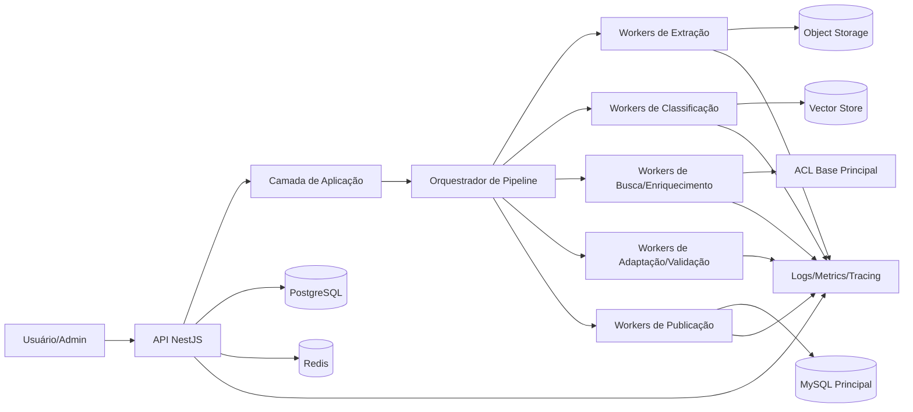
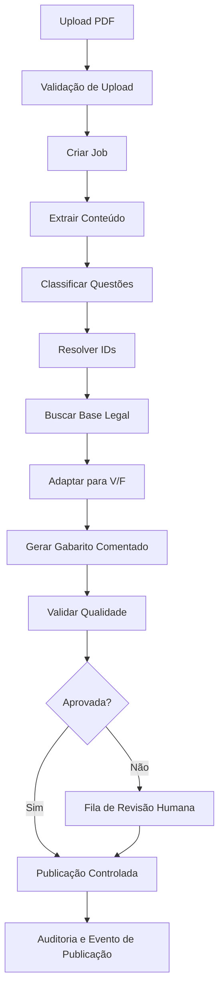
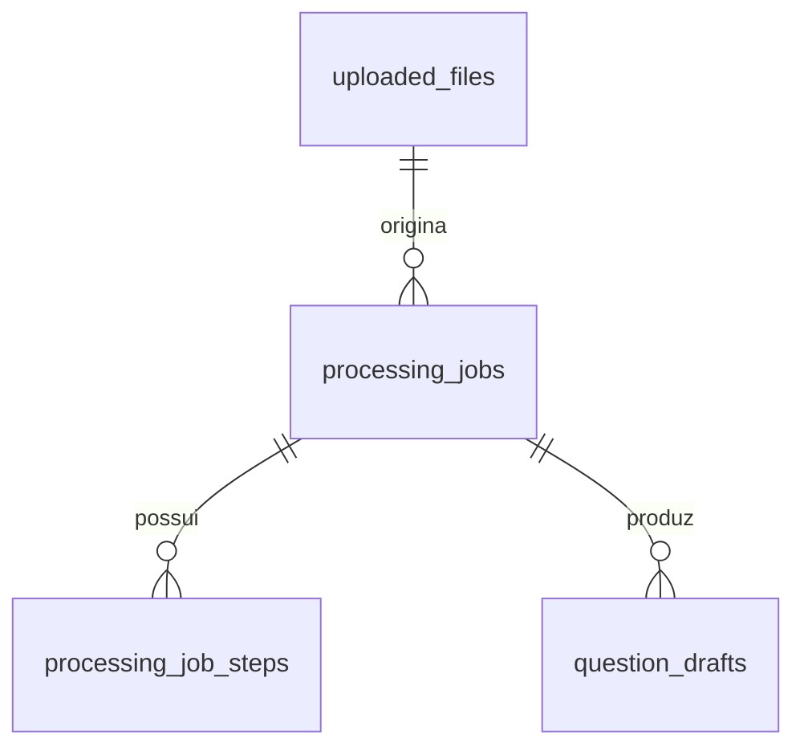
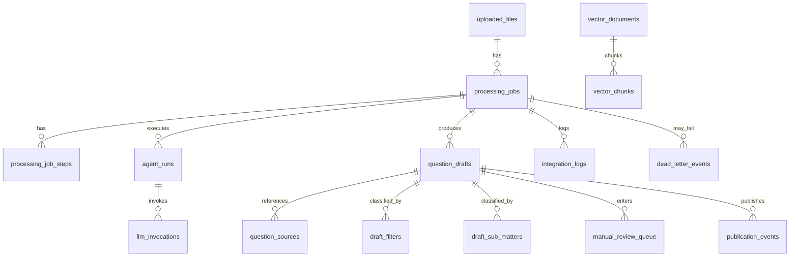

# 🧠 Arquitetura Técnica — Agente de Geração de Questões com IA

<p align="center">


</p>

> Documento técnico de arquitetura, dados, observabilidade, resiliência, organização de código, contratos, filas, integrações e fluxos do serviço de IA responsável por transformar PDFs de provas em questões no formato Verdadeiro/Falso, com classificação, fundamentação legal, validação, revisão humana e publicação controlada.

---

## 📚 Sumário

- [1. Objetivo](#1-objetivo)
- [2. Escopo do Documento](#2-escopo-do-documento)
- [3. Contexto do Problema](#3-contexto-do-problema)
- [4. Objetivos do Sistema](#4-objetivos-do-sistema)
- [5. Requisitos Funcionais](#5-requisitos-funcionais)
- [6. Requisitos Não Funcionais](#6-requisitos-não-funcionais)
- [7. Premissas e Restrições](#7-premissas-e-restrições)
- [8. Decisões Arquiteturais Centrais](#8-decisões-arquiteturais-centrais)
- [9. Princípios Arquiteturais](#9-princípios-arquiteturais)
- [10. Visão Geral da Solução](#10-visão-geral-da-solução)
- [11. Visão Sistêmica da Plataforma](#11-visão-sistêmica-da-plataforma)
- [12. Arquitetura de Alto Nível](#12-arquitetura-de-alto-nível)
- [13. Arquitetura Hexagonal Aplicada](#13-arquitetura-hexagonal-aplicada)
- [14. Clean Architecture Aplicada](#14-clean-architecture-aplicada)
- [15. Bounded Contexts e Responsabilidades](#15-bounded-contexts-e-responsabilidades)
- [16. Fluxograma Geral da Aplicação](#16-fluxograma-geral-da-aplicação)
- [17. Fluxo Macro do Sistema](#17-fluxo-macro-do-sistema)
- [18. Jornada Completa do Dado](#18-jornada-completa-do-dado)
- [19. Pipeline Multiagente](#19-pipeline-multiagente)
- [20. Orquestração do Pipeline](#20-orquestração-do-pipeline)
- [21. Estratégia de Jobs e Workers](#21-estratégia-de-jobs-e-workers)
- [22. Estratégia de Filas e Prioridades](#22-estratégia-de-filas-e-prioridades)
- [23. Matriz de Jobs, Dependências e Ordem de Execução](#23-matriz-de-jobs-dependências-e-ordem-de-execução)
- [24. Estratégia de Reprocessamento](#24-estratégia-de-reprocessamento)
- [25. Estado Atual da Base Principal](#25-estado-atual-da-base-principal)
- [26. Interpretação Técnica do Modelo Atual](#26-interpretação-técnica-do-modelo-atual)
- [27. Modelo de Dados Futuro](#27-modelo-de-dados-futuro)
- [28. Estratégia de Persistência](#28-estratégia-de-persistência)
- [29. Estratégia de Banco por Responsabilidade](#29-estratégia-de-banco-por-responsabilidade)
- [30. Diagrama ER do Modelo Atual](#30-diagrama-er-do-modelo-atual)
- [31. Diagrama ER do Modelo Futuro](#31-diagrama-er-do-modelo-futuro)
- [32. Dicionário de Banco de Dados](#32-dicionário-de-banco-de-dados)
- [33. Dicionário de Estados e Status](#33-dicionário-de-estados-e-status)
- [34. Taxonomia Contextual e Pedagógica](#34-taxonomia-contextual-e-pedagógica)
- [35. Estratégia de Classificação e Resolução de IDs](#35-estratégia-de-classificação-e-resolução-de-ids)
- [36. Estratégia de Busca Semântica e Fundamentação Legal](#36-estratégia-de-busca-semântica-e-fundamentação-legal)
- [37. Estratégia de Adaptação para Verdadeiro/Falso](#37-estratégia-de-adaptação-para-verdadeirofalso)
- [38. Estratégia de Geração de Gabarito Comentado](#38-estratégia-de-geração-de-gabarito-comentado)
- [39. Estratégia de Validação de Qualidade](#39-estratégia-de-validação-de-qualidade)
- [40. Estratégia de Revisão Humana](#40-estratégia-de-revisão-humana)
- [41. Estratégia de Publicação Controlada](#41-estratégia-de-publicação-controlada)
- [42. Regras de Publicação e Anti-Corrupção de Dados](#42-regras-de-publicação-e-anti-corrupção-de-dados)
- [43. Segurança Global da Plataforma](#43-segurança-global-da-plataforma)
- [44. Segurança de Uploads](#44-segurança-de-uploads)
- [45. Segurança de Integrações](#45-segurança-de-integrações)
- [46. Segurança de Prompts e Saídas de IA](#46-segurança-de-prompts-e-saídas-de-ia)
- [47. Sanitização e Normalização Global](#47-sanitização-e-normalização-global)
- [48. Helpers, Utilitários e Normalizadores Globais](#48-helpers-utilitários-e-normalizadores-globais)
- [49. Estratégia de Validação de Payloads](#49-estratégia-de-validação-de-payloads)
- [50. Contratos, DTOs, Enums e Tipos](#50-contratos-dtos-enums-e-tipos)
- [51. Contratos Internos entre Agents](#51-contratos-internos-entre-agents)
- [52. Contratos Externos e Gateways](#52-contratos-externos-e-gateways)
- [53. API — Estratégia Geral](#53-api--estratégia-geral)
- [54. API — Convenções de Projeto](#54-api--convenções-de-projeto)
- [55. API — Mapeamento Completo de Rotas](#55-api--mapeamento-completo-de-rotas)
- [56. API — Regex de Validação e Roteamento](#56-api--regex-de-validação-e-roteamento)
- [57. API — Contratos JSON de Entrada e Saída](#57-api--contratos-json-de-entrada-e-saída)
- [58. API — Exemplos de Requests e Responses](#58-api--exemplos-de-requests-e-responses)
- [59. Estratégia de Versionamento da API](#59-estratégia-de-versionamento-da-api)
- [60. Logs Estruturados](#60-logs-estruturados)
- [61. Observabilidade](#61-observabilidade)
- [62. Estratégia de Métricas](#62-estratégia-de-métricas)
- [63. Estratégia de Tracing Distribuído](#63-estratégia-de-tracing-distribuído)
- [64. Correlation IDs, Trace IDs e Span IDs](#64-correlation-ids-trace-ids-e-span-ids)
- [65. Painéis Operacionais e Dashboards](#65-painéis-operacionais-e-dashboards)
- [66. Estratégia de Alertas e SLOs](#66-estratégia-de-alertas-e-slos)
- [67. Timeouts](#67-timeouts)
- [68. Retries](#68-retries)
- [69. Circuit Breaker](#69-circuit-breaker)
- [70. Fallbacks e Estratégias de Degradação](#70-fallbacks-e-estratégias-de-degradação)
- [71. Bulkheads, Backpressure e Contenção](#71-bulkheads-backpressure-e-contenção)
- [72. Dead Letter Queue (DLQ)](#72-dead-letter-queue-dlq)
- [73. Estratégia de Idempotência](#73-estratégia-de-idempotência)
- [74. Locks Distribuídos e Exclusão Mútua](#74-locks-distribuídos-e-exclusão-mútua)
- [75. Estratégia de Cache com Redis](#75-estratégia-de-cache-com-redis)
- [76. Estratégia de Storage de Arquivos](#76-estratégia-de-storage-de-arquivos)
- [77. Estratégia de Indexação Vetorial](#77-estratégia-de-indexação-vetorial)
- [78. Estratégia de Ingestão de Base Legal](#78-estratégia-de-ingestão-de-base-legal)
- [79. Estratégia de Integração com a Base Principal](#79-estratégia-de-integração-com-a-base-principal)
- [80. Anti-Corruption Layer com MySQL Principal](#80-anti-corruption-layer-com-mysql-principal)
- [81. Estratégia de Auditoria e Rastreabilidade](#81-estratégia-de-auditoria-e-rastreabilidade)
- [82. Estratégia de Testes](#82-estratégia-de-testes)
- [83. Regras Arquiteturais Obrigatórias](#83-regras-arquiteturais-obrigatórias)
- [84. Convenções de Código e Qualidade](#84-convenções-de-código-e-qualidade)
- [85. Arquitetura de Pastas e Arquivos](#85-arquitetura-de-pastas-e-arquivos)
- [86. Organização por Camadas](#86-organização-por-camadas)
- [87. Organização por Responsabilidade](#87-organização-por-responsabilidade)
- [88. Organização por Fases do Projeto](#88-organização-por-fases-do-projeto)
- [89. Tree View Vertical Completa](#89-tree-view-vertical-completa)
- [90. Mapeamento Arquivo a Arquivo por Responsabilidade](#90-mapeamento-arquivo-a-arquivo-por-responsabilidade)
- [91. Roadmap Técnico de Evolução](#91-roadmap-técnico-de-evolução)
- [92. Fases de Implementação](#92-fases-de-implementação)
- [93. Matriz de Entregáveis por Fase](#93-matriz-de-entregáveis-por-fase)
- [94. Riscos Técnicos e Mitigações](#94-riscos-técnicos-e-mitigações)
- [95. Runbooks Operacionais](#95-runbooks-operacionais)
- [96. Estratégia de Evolução e Escalabilidade](#96-estratégia-de-evolução-e-escalabilidade)
- [97. Próximos Passos](#97-próximos-passos)
- [98. Conclusão](#98-conclusão)

---

## 1. Objetivo

Definir a arquitetura técnica integral de uma plataforma especializada em transformar provas em PDF em questões estruturadas no formato **Verdadeiro/Falso**, enriquecidas com classificação pedagógica, fundamentação legal, rastreabilidade de origem, validação automática, revisão humana opcional e publicação controlada em ambiente produtivo.

O documento estabelece base arquitetural, organizacional e operacional para implementação real, sustentando evolução segura, observável e resiliente.

---

## 2. Escopo do Documento

Este documento cobre:

- arquitetura lógica, física e operacional;
- fluxos síncronos e assíncronos;
- pipeline multiagente;
- contratos internos e externos;
- API HTTP;
- persistência relacional, vetorial e cache;
- segurança ponta a ponta;
- observabilidade, auditoria e rastreabilidade;
- resiliência e tolerância a falhas;
- organização de código, módulos e camadas;
- estratégia de testes;
- roadmap e fases de implementação.

Fora de escopo explícito:

- UI final do revisor humano;
- engine final de cobrança/licenciamento;
- política comercial;
- detalhes de provisioning cloud específico por provedor.

---

## 3. Contexto do Problema

O processo manual de extrair questões de provas em PDF, reinterpretá-las no formato Verdadeiro/Falso, classificá-las, contextualizá-las e vinculá-las a bases legais é operacionalmente caro, sujeito a inconsistência semântica e baixa escalabilidade.

Os problemas centrais são:

- heterogeneidade do material de entrada;
- ambiguidade na classificação por disciplina, assunto e subassunto;
- necessidade de fundamentação normativa confiável;
- risco de publicar item incorreto ou pedagogicamente fraco;
- necessidade de trilha completa de auditoria;
- necessidade de integração segura com base principal legada.

---

## 4. Objetivos do Sistema

### 4.1 Objetivos funcionais

- receber PDF de prova;
- extrair questões e metadados;
- classificar contexto temático;
- resolver IDs da taxonomia interna;
- buscar base legal e material de apoio;
- adaptar questão para Verdadeiro/Falso;
- gerar gabarito comentado;
- validar qualidade e consistência;
- permitir revisão humana;
- publicar de forma segura e rastreável.

### 4.2 Objetivos não funcionais

- suportar processamento assíncrono massivo;
- garantir observabilidade fim a fim;
- operar com idempotência e reprocessamento seguro;
- proteger dados, prompts e integrações;
- permitir evolução modular por agentes;
- manter baixo acoplamento entre IA, domínio e integrações.

---

## 5. Requisitos Funcionais

| ID | Requisito | Prioridade |
|---|---|---|
| RF-01 | Upload de PDF com validação de tipo, tamanho e integridade | Alta |
| RF-02 | Criação de job de processamento rastreável | Alta |
| RF-03 | Extração de texto, blocos e questões | Alta |
| RF-04 | Classificação disciplinar e pedagógica | Alta |
| RF-05 | Resolução de matter/submatter/topic IDs | Alta |
| RF-06 | Busca semântica de fundamentação legal | Alta |
| RF-07 | Geração de versão V/F | Alta |
| RF-08 | Geração de justificativa e gabarito comentado | Alta |
| RF-09 | Validação de qualidade com score e motivos | Alta |
| RF-10 | Encaminhamento para revisão humana quando necessário | Média |
| RF-11 | Publicação controlada na base principal | Alta |
| RF-12 | Reprocessamento por etapa | Alta |
| RF-13 | Auditoria de eventos de publicação | Alta |
| RF-14 | Consulta de status do job e etapas | Alta |
| RF-15 | DLQ e análise de falhas irreversíveis | Média |

---

## 6. Requisitos Não Funcionais

| ID | Requisito | Meta |
|---|---|---|
| RNF-01 | Disponibilidade do plano de controle | ≥ 99,9% |
| RNF-02 | Durabilidade de evidências e trilhas | Alta |
| RNF-03 | Observabilidade | Logs + métricas + tracing |
| RNF-04 | Segurança | Secure by default |
| RNF-05 | Resiliência | Retry + timeout + fallback + DLQ |
| RNF-06 | Escalabilidade | Workers horizontais independentes |
| RNF-07 | Testabilidade | Unit, integration, contract, e2e |
| RNF-08 | Governança | Versionamento de contratos e prompts |
| RNF-09 | Idempotência | Garantia por operação crítica |
| RNF-10 | Auditabilidade | Rastreabilidade por request/job/agent |

---

## 7. Premissas e Restrições

### 7.1 Premissas

- a entrada primária é um PDF textual ou OCRável;
- existe taxonomia principal previamente definida;
- existe base legal consolidável em pipeline de ingestão;
- existe base principal legada em MySQL ou compatível;
- o sistema pode operar com revisão humana parcial.

### 7.2 Restrições

- modelos de IA podem gerar saídas inconsistentes;
- PDFs malformados exigem tratamento específico;
- acoplamento direto à base principal deve ser evitado;
- publicação automática total não é o modo padrão em contexto regulatório;
- evidência de origem e fundamentação deve ser preservada.

---

## 8. Decisões Arquiteturais Centrais

### 8.1 Stack principal

- **NestJS** para API, orquestração e módulos de aplicação;
- **PostgreSQL** como banco principal operacional do serviço de IA;
- **Redis** para cache, locks distribuídos, filas leves e coordenação;
- **BullMQ** ou equivalente para jobs/workers;
- **pgvector** ou store vetorial equivalente para embeddings e busca semântica;
- **Object Storage** para PDFs, artefatos e evidências;
- **OpenTelemetry** para tracing e métricas;
- **Prometheus + Grafana** para monitoramento;
- **ELK/OpenSearch/Loki** para logs estruturados.

### 8.2 Decisões estruturais

- adoção de arquitetura **hexagonal** para isolar domínio de tecnologia;
- uso de **Clean Architecture** para organizar fluxo de dependência;
- separação entre **módulos de domínio**, **ports**, **adapters** e **infraestrutura**;
- pipeline **assíncrono multiestágio** para extração, classificação, enriquecimento, validação e publicação;
- **Anti-Corruption Layer** para integração com sistema principal legado.

### 8.3 Trade-offs

| Decisão | Ganho | Custo |
|---|---|---|
| Pipeline assíncrono | escalabilidade, isolamento de falhas | maior complexidade operacional |
| Multiagente | modularidade e especialização | aumento de latência agregada |
| Revisão humana opcional | qualidade e governança | custo operacional |
| Banco operacional separado | autonomia e segurança | sincronização adicional |
| Busca vetorial + filtros | maior precisão contextual | custo de indexação e manutenção |

---

## 9. Princípios Arquiteturais

- **🧱 Baixo acoplamento** entre domínio e IA;
- **🎯 Alta coesão** por bounded context;
- **🛡️ Segurança por padrão** em toda fronteira de entrada/saída;
- **📊 Observabilidade por padrão** em cada operação relevante;
- **♻️ Resiliência por padrão** em integrações, jobs e publicação;
- **🧪 Testabilidade por construção**;
- **🧭 Governança explícita** de contratos, prompts, enums e status;
- **📦 Modularidade evolutiva**;
- **🔍 Auditabilidade ponta a ponta**;
- **📚 Anti-corrupção semântica** entre base gerada e base principal.

---

## 10. Visão Geral da Solução

A solução é um serviço especializado que recebe um artefato documental, o normaliza, o interpreta, o decompõe em questões, o enriquece com taxonomia e base legal, produz uma variante canônica no formato Verdadeiro/Falso, atribui justificativas e scores de qualidade, e entrega um draft auditável pronto para revisão ou publicação.

O sistema é orientado a **job orchestration**, não a request-response monolítico.

---

## 11. Visão Sistêmica da Plataforma



---

## 12. Arquitetura de Alto Nível

A arquitetura é composta por cinco macrozonas:

1. **Camada de Entrada**: API HTTP, autenticação, autorização, upload e consulta.
2. **Camada de Aplicação**: casos de uso, orquestração e políticas de fluxo.
3. **Camada de Domínio**: entidades, value objects, regras, invariantes e serviços de domínio.
4. **Camada de Infraestrutura**: filas, persistência, storage, LLM gateways, vector search e integrações externas.
5. **Camada Operacional**: observabilidade, auditoria, segurança, retry, fallback, tracing, métricas e automação operacional.

---

## 13. Arquitetura Hexagonal Aplicada

### 13.1 Portas de entrada

- `CreateProcessingJobUseCase`
- `GetProcessingJobStatusUseCase`
- `RetryProcessingStepUseCase`
- `PublishQuestionDraftUseCase`
- `ListDraftsForReviewUseCase`

### 13.2 Portas de saída

- `UploadedFileRepositoryPort`
- `ProcessingJobRepositoryPort`
- `QuestionDraftRepositoryPort`
- `VectorSearchPort`
- `LlmGatewayPort`
- `LegalBaseGatewayPort`
- `MainDatabasePublicationPort`
- `ObjectStoragePort`
- `DistributedLockPort`
- `MetricsPort`
- `AuditTrailPort`

### 13.3 Adapters

- REST controllers;
- BullMQ processors;
- Prisma/TypeORM repositories;
- Redis lock adapter;
- OpenAI/LLM adapter;
- pgvector adapter;
- MySQL ACL adapter;
- S3-compatible adapter.

---

## 14. Clean Architecture Aplicada

### 14.1 Direção das dependências

A dependência aponta sempre para o centro:

- infraestrutura depende de aplicação e domínio;
- adapters dependem de contratos;
- domínio não conhece NestJS, BullMQ, Redis, banco nem provider de LLM.

### 14.2 Camadas

| Camada | Responsabilidade |
|---|---|
| Interface | entrada/saída HTTP, filas e serialização |
| Application | casos de uso, orquestração, políticas |
| Domain | regras centrais, invariantes, serviços puros |
| Infrastructure | implementações técnicas, gateways, banco, cache |

---

## 15. Bounded Contexts e Responsabilidades

| Contexto | Responsabilidade |
|---|---|
| Ingestion | upload, validação, storage, checksum |
| Extraction | parsing de PDF, OCR, segmentação |
| Classification | classificação temática, taxonomia e resolução de IDs |
| Knowledge Retrieval | busca legal, semântica e evidências |
| Transformation | conversão para V/F e gabarito comentado |
| Quality | score, validação, flags e gates |
| Review | fila humana, ajustes, decisão |
| Publication | publicação controlada e integração legada |
| Observability | trilhas, logs, métricas e tracing |
| Governance | prompts, contratos, versionamento e política |

---

## 16. Fluxograma Geral da Aplicação



---

## 17. Fluxo Macro do Sistema

1. O usuário autenticado envia o PDF.
2. O sistema valida tamanho, MIME, assinatura e checksum.
3. O artefato é persistido em object storage e metadados em banco.
4. Um `processing_job` é criado com correlação global.
5. Cada etapa gera `processing_job_steps` e `agent_runs`.
6. Drafts são produzidos, enriquecidos, validados e colocados em revisão ou publicação.
7. Publicação gera evento auditável e sincronização controlada com a base principal.

---

## 18. Jornada Completa do Dado

| Etapa | Entrada | Transformação | Saída | Persistência |
|---|---|---|---|---|
| Upload | PDF bruto | validação + hash + storage | uploaded_file | object storage + uploaded_files |
| Extração | PDF | OCR/parsing/segmentação | blocos e questões extraídas | question_sources + agent_runs |
| Classificação | texto da questão | taxonomia + score | classificação preliminar | question_drafts |
| Resolução de IDs | labels/classificação | matching com catálogos | IDs canônicos | draft_filters/draft_sub_matters |
| Busca legal | texto + taxonomia | embeddings + retrieval | evidências/fundamentos | vector_chunks + question_sources |
| Adaptação | questão + evidências | reescrita V/F | draft V/F | question_drafts |
| Gabarito | draft V/F | justificativa | answer commentary | question_drafts |
| Validação | draft completo | regras + score | aprovado/revisão | manual_review_queue |
| Publicação | draft aprovado | ACL + persistência | item publicado | publication_events |

---

## 19. Pipeline Multiagente

### 19.1 PDF Extraction Agent

**Objetivo:** converter documento bruto em estrutura textual confiável.

**Entradas:** arquivo PDF, metadados de upload, hints de idioma.

**Saídas:** blocos textuais, páginas, questões detectadas, coordenadas, score de confiança da extração.

**Responsabilidades:**

- extrair texto nativo quando possível;
- acionar OCR quando necessário;
- identificar cabeçalhos, rodapés e ruído;
- detectar numeração de questões;
- preservar evidência de origem.

### 19.2 Classification Agent

**Objetivo:** inferir disciplina, assunto, subassunto, tema pedagógico e complexidade.

**Saídas:** classificação textual + score + explicação.

### 19.3 ID Resolution Agent

**Objetivo:** converter classificações livres em IDs canônicos da taxonomia principal.

**Regras:** correspondência exata, fuzzy, semântica, fallback manual.

### 19.4 Search Agent

**Objetivo:** recuperar base legal e conteúdo normativo relevante.

**Estratégia:** hybrid search = filtros estruturados + embeddings + ranking contextual.

### 19.5 Adaptation Agent

**Objetivo:** transformar questão original em formato V/F sem corromper o núcleo conceitual.

### 19.6 Answer Key Agent

**Objetivo:** produzir gabarito, comentário técnico, justificativa e base legal.

### 19.7 Validation Agent

**Objetivo:** detectar alucinação, fragilidade, inconsistência semântica, ausência de fundamento e ambiguidade.

### 19.8 Review Assist Agent (Opcional)

**Objetivo:** apoiar o revisor com resumo de riscos, divergências e recomendações.

### 19.9 Publication Guard Agent (Opcional)

**Objetivo:** bloquear publicação quando houver risco alto, dados incompletos ou integridade insuficiente.

---

## 20. Orquestração do Pipeline

A orquestração é **state-driven** e **event-oriented**. Cada etapa atualiza o estado do job e produz eventos internos de transição. Não há chamada sequencial rígida em memória entre todos os agentes; a composição é dirigida por fila e persistência.

### Estados centrais do job

- `PENDING`
- `UPLOADED`
- `EXTRACTING`
- `CLASSIFYING`
- `RESOLVING_IDS`
- `SEARCHING`
- `ADAPTING`
- `ANSWERING`
- `VALIDATING`
- `MANUAL_REVIEW`
- `READY_TO_PUBLISH`
- `PUBLISHED`
- `FAILED`
- `PARTIALLY_FAILED`
- `CANCELLED`

---

## 21. Estratégia de Jobs e Workers

### Princípios

- um job principal por arquivo/processamento;
- subtarefas independentes por etapa e por questão;
- workers especializados por bounded context;
- isolamento de filas por criticidade e custo computacional;
- reentrância e idempotência obrigatórias.

### Tipos de worker

- `ingestion-worker`
- `extraction-worker`
- `classification-worker`
- `resolution-worker`
- `search-worker`
- `adaptation-worker`
- `answer-key-worker`
- `validation-worker`
- `review-assist-worker`
- `publication-worker`
- `dead-letter-worker`

---

## 22. Estratégia de Filas e Prioridades

| Fila | Responsabilidade | Prioridade |
|---|---|---|
| `q.ingestion` | upload, checksum, criação de job | alta |
| `q.extraction` | parsing/OCR | alta |
| `q.classification` | classificação temática | média |
| `q.resolution` | resolução de IDs | média |
| `q.search` | busca semântica/legal | média |
| `q.adaptation` | adaptação V/F | média |
| `q.answering` | gabarito comentado | média |
| `q.validation` | validação e score | alta |
| `q.review` | preparação revisão humana | baixa |
| `q.publication` | publicação controlada | crítica |
| `q.dlq` | eventos falhos | crítica |

---

## 23. Matriz de Jobs, Dependências e Ordem de Execução

| Ordem | Job | Gatilho | Depende de | Saída | Retry | Fallback |
|---|---|---|---|---|---|---|
| 1 | `PersistUploadedFileJob` | upload concluído | nenhuma | arquivo persistido | 3x | abortar job |
| 2 | `ExtractQuestionsJob` | arquivo persistido | 1 | questões extraídas | 2x | OCR alternativo |
| 3 | `ClassifyQuestionJob` | extração concluída | 2 | taxonomia preliminar | 2x | classificador reduzido |
| 4 | `ResolveIdsJob` | classificação concluída | 3 | IDs canônicos | 2x | fila manual |
| 5 | `SearchLegalBasisJob` | IDs resolvidos | 4 | evidências legais | 2x | busca keyword |
| 6 | `AdaptTrueFalseJob` | busca concluída | 5 | draft V/F | 2x | template conservador |
| 7 | `GenerateAnswerKeyJob` | adaptação concluída | 6 | justificativa | 2x | comentário mínimo |
| 8 | `ValidateDraftJob` | gabarito concluído | 7 | score/falhas | 1x | revisão humana |
| 9 | `PrepareManualReviewJob` | score abaixo da meta | 8 | item na fila humana | 0 | N/A |
| 10 | `PublishDraftJob` | aprovado | 8 ou 9 | publicado | 3x | rollback/compensação |

---

## 24. Estratégia de Reprocessamento

O reprocessamento é granular por etapa e por draft. Cada etapa registra:

- versão do prompt;
- versão do modelo;
- versão do contrato de entrada;
- hash do payload normalizado;
- motivo de reprocessamento;
- operador solicitante;
- timestamp e correlação.

Modos de reprocessamento:

- **replay total**;
- **replay por etapa**;
- **replay por questão**;
- **replay forçado com override de prompt/modelo**;
- **replay pós-correção manual**.

---

## 25. Estado Atual da Base Principal

Assume-se uma base principal legada orientada à publicação de questões e taxonomias canônicas em MySQL, já utilizada por outros sistemas, contendo:

- disciplinas, assuntos, subassuntos;
- filtros pedagógicos;
- questões oficiais/publicadas;
- relações de fonte/origem;
- possivelmente convenções e constraints históricas não totalmente alinhadas ao novo serviço.

---

## 26. Interpretação Técnica do Modelo Atual

A base principal deve ser tratada como **sistema de registro final**, não como ambiente de processamento intermediário. O serviço de IA opera com autonomia em Postgres e publica apenas artefatos validados por meio de ACL.

Implicações:

- evita contaminação precoce da base principal;
- permite evolução do modelo de IA sem quebrar legado;
- facilita rastreabilidade e compensação.

---

## 27. Modelo de Dados Futuro

O modelo futuro separa três dimensões:

1. **Operacional**: jobs, steps, drafts, revisão, publicação;
2. **Conhecimento**: fontes, chunks, embeddings, evidências;
3. **Governança**: idempotência, auditoria, integração, DLQ, runs de agentes.

---

## 28. Estratégia de Persistência

| Tipo de dado | Tecnologia | Uso |
|---|---|---|
| Jobs, drafts, estados | PostgreSQL | consistência transacional |
| Locks, cache, coordenação | Redis | baixa latência |
| PDFs e artefatos | Object Storage | durabilidade e custo |
| Embeddings e chunks | PostgreSQL + pgvector | busca semântica |
| Logs | plataforma centralizada | troubleshooting |
| Métricas | Prometheus | monitoramento |
| Traces | Jaeger/Tempo/OTel backend | rastreamento |

---

## 29. Estratégia de Banco por Responsabilidade

- **PostgreSQL**: operação do serviço, estado do pipeline, drafts, auditoria e indexação vetorial;
- **MySQL Principal**: persistência final canônica, acessada apenas via ACL;
- **Redis**: locks, idempotência efêmera, caches quentes e filas auxiliares;
- **Object Storage**: binários e artefatos imutáveis.

---

## 30. Diagrama ER do Modelo Atual



---

## 31. Diagrama ER do Modelo Futuro



---

## 32. Dicionário de Banco de Dados

### 32.1 `processing_jobs`

| Campo | Tipo | Regra |
|---|---|---|
| id | UUID | PK |
| correlation_id | UUID | índice único |
| uploaded_file_id | UUID | FK |
| status | VARCHAR(50) | índice |
| current_step | VARCHAR(100) | índice |
| priority | SMALLINT | default 5 |
| created_by_user_id | BIGINT | nullable |
| started_at | TIMESTAMP | nullable |
| finished_at | TIMESTAMP | nullable |
| failure_reason | TEXT | nullable |
| metadata_json | JSONB | sanitizado |
| created_at | TIMESTAMP | obrigatório |
| updated_at | TIMESTAMP | obrigatório |

### 32.2 `processing_job_steps`

Armazena histórico de cada etapa, tempos, tentativas, payload hash, input/output resumidos e erro normalizado.

### 32.3 `uploaded_files`

Armazena nome lógico, path físico, checksum SHA-256, MIME validado, tamanho, status de antivírus, status de parsing e metadados de origem.

### 32.4 `question_drafts`

Entidade central do conteúdo gerado, com texto original, texto adaptado, tipo V/F, gabarito, justificativa, score de qualidade, versão de prompt e flags de publicação.

### 32.5 `question_sources`

Relação entre draft e evidências: página do PDF, chunk legal, norma, artigo, fonte institucional e score de relevância.

### 32.6 `draft_filters`

Relação N:N entre draft e filtros/assuntos/classificações complementares.

### 32.7 `draft_sub_matters`

Relação entre draft e subassuntos canônicos resolvidos.

### 32.8 `agent_runs`

Registra execução por agente com entrada, saída, modelo, prompt versionado, latência, custo estimado, status e fallback utilizado.

### 32.9 `llm_invocations`

Registra invocação granular de provedor de LLM, incluindo provider, model, timeout, tokens, resposta truncada sanitizada, erro, retry e trace id.

### 32.10 `integration_logs`

Registra chamadas externas: ACL MySQL, base legal, storage, OCR, embeddings e provedores auxiliares.

### 32.11 `manual_review_queue`

Controla fila de revisão com prioridade, motivo, score, decisão, operador, SLA e comentário de revisão.

### 32.12 `publication_events`

Auditoria de publicação, tentativa, rollback, compensação e resposta da base principal.

### 32.13 `vector_documents`

Documento lógico indexado, origem, hash, versão, idioma e status de ingestão vetorial.

### 32.14 `vector_chunks`

Chunks com embedding, hash, posição, metadata, norma associada e score interno.

### 32.15 `idempotency_keys`

Chaves de idempotência por endpoint/operação, hash de requisição, owner, TTL e resultado resumido.

### 32.16 `dead_letter_events`

Eventos falhos com payload sanitizado, motivo, stack resumida, tentativas esgotadas e ação sugerida.

---

## 33. Dicionário de Estados e Status

| Contexto | Estados |
|---|---|
| Job | PENDING, RUNNING, FAILED, PARTIALLY_FAILED, COMPLETED |
| Step | NOT_STARTED, IN_PROGRESS, SUCCEEDED, FAILED, RETRYING, SKIPPED |
| Draft | RAW, ENRICHED, ADAPTED, VALIDATED, NEEDS_REVIEW, APPROVED, PUBLISHED, REJECTED |
| Review | QUEUED, CLAIMED, REVIEWED, RETURNED, APPROVED, REJECTED |
| Publication | READY, SENT, CONFIRMED, FAILED, COMPENSATED |

---

## 34. Taxonomia Contextual e Pedagógica

A taxonomia deve distinguir:

- disciplina;
- matéria;
- submatéria;
- tema;
- tipo de assertiva;
- nível cognitivo;
- complexidade;
- grau de literalidade normativa;
- sensibilidade a atualização legal.

---

## 35. Estratégia de Classificação e Resolução de IDs

A classificação ocorre em duas fases:

1. inferência semântica livre pelo agente;
2. resolução controlada por catálogo canônico.

### Estratégias de matching

- exato por alias normalizado;
- fuzzy com limiar configurável;
- semântico com embeddings;
- regra contextual baseada em edital/banca;
- fallback para revisão humana quando ambiguidade persistir.

---

## 36. Estratégia de Busca Semântica e Fundamentação Legal

A busca utiliza pipeline híbrido:

1. filtros por área normativa e jurisdição;
2. busca lexical por artigo, lei, inciso e expressão;
3. busca vetorial por similaridade semântica;
4. reranking por contexto da questão;
5. corte por score mínimo e confiabilidade da fonte.

---

## 37. Estratégia de Adaptação para Verdadeiro/Falso

A adaptação deve preservar o núcleo conceitual da questão, evitando alteração que mude competência, sujeito normativo, temporalidade ou exceções relevantes.

### Regras de segurança semântica

- não inverter sentido sem evidência;
- evitar generalização excessiva;
- manter escopo normativo;
- explicitar condição de validade quando necessário;
- proibir formulações ambíguas ou com dupla negação não controlada.

---

## 38. Estratégia de Geração de Gabarito Comentado

O gabarito comentado deve conter:

- resposta V ou F;
- justificativa textual objetiva;
- base legal citada;
- explicação pedagógica;
- observação sobre pegadinha/armadilha conceitual, quando aplicável.

---

## 39. Estratégia de Validação de Qualidade

### Gates mínimos

- consistência com questão original;
- consistência com base legal;
- ausência de contradição interna;
- score mínimo de clareza;
- score mínimo de fundamentação;
- inexistência de ambiguidade crítica;
- presença de metadados obrigatórios.

### Resultado

- aprovado;
- aprovado com ressalva;
- revisão manual;
- rejeitado.

---

## 40. Estratégia de Revisão Humana

A revisão humana atua como controle de qualidade e mecanismo de exceção. Deve permitir:

- aprovar sem alteração;
- editar draft;
- trocar classificação;
- trocar fundamento legal;
- rejeitar publicação;
- reencaminhar etapa específica.

---

## 41. Estratégia de Publicação Controlada

A publicação é um processo separado e protegido, com ACL, validações finais, lock distribuído, idempotência e auditoria.

A base principal só recebe item cuja consistência já foi confirmada.

---

## 42. Regras de Publicação e Anti-Corrupção de Dados

- nunca gravar diretamente em tabelas legadas a partir do domínio interno;
- mapear DTO interno para contrato canônico de publicação;
- validar enum, comprimento, encoding, obrigatoriedade e coerência semântica antes do envio;
- persistir evento de publicação antes e depois da integração;
- suportar compensação lógica quando confirmação final falhar.

---

## 43. Segurança Global da Plataforma

### Controles principais

- autenticação forte para operadores e admins;
- autorização baseada em papéis e escopos;
- proteção de endpoints internos;
- assinatura opcional de webhooks;
- CORS restritivo;
- rate limit por ator e rota;
- secrets em cofre seguro;
- segregação por ambiente;
- mascaramento de dados sensíveis em logs.

---

## 44. Segurança de Uploads

- validação de MIME real e extensão;
- antivírus/scan de malware;
- limite de tamanho;
- proteção contra zip bombs e PDFs maliciosos;
- storage em bucket isolado;
- nome físico não derivado do nome do usuário;
- checksum obrigatório.

---

## 45. Segurança de Integrações

- credenciais por serviço e ambiente;
- timeout e retry controlados;
- allowlist de hosts;
- SSRF hardening;
- TLS obrigatório;
- rotação de segredos;
- logs sem exposição de segredo.

---

## 46. Segurança de Prompts e Saídas de IA

- versionamento de prompts;
- proteção contra prompt injection via conteúdo do PDF;
- stripping/neutralização de comandos instrucionais maliciosos do documento;
- validação estrutural da saída do modelo;
- limitação de ferramentas e contexto fornecido ao agente;
- bloqueio de publicação com score insuficiente.

---

## 47. Sanitização e Normalização Global

### Aplicações obrigatórias

- trim e colapso de whitespace;
- normalização Unicode;
- remoção de caracteres de controle;
- normalização de aspas e hífens;
- slugification canônica;
- normalização de enum e boolean;
- parsing defensivo de query params;
- encoding seguro UTF-8;
- mascaramento de dados sensíveis.

---

## 48. Helpers, Utilitários e Normalizadores Globais

Estruturas sugeridas:

- `StringNormalizer`
- `EnumNormalizer`
- `DateTimeNormalizer`
- `PayloadSanitizer`
- `SensitiveDataMasker`
- `RouteParamParser`
- `CorrelationContextHelper`
- `IdempotencyKeyBuilder`
- `RetryPolicyResolver`
- `ErrorNormalizer`

---

## 49. Estratégia de Validação de Payloads

Validação em quatro níveis:

1. borda HTTP;
2. borda de fila;
3. contrato entre agentes;
4. invariantes de domínio.

Ferramentas possíveis: `class-validator`, `zod`, contratos JSON schema versionados.

---

## 50. Contratos, DTOs, Enums e Tipos

Devem existir contratos explícitos para:

- upload de arquivo;
- criação de job;
- retorno de status;
- step event;
- input/output de cada agente;
- draft de questão;
- decisão de revisão;
- payload de publicação;
- resposta de publicação;
- erro normalizado.

---

## 51. Contratos Internos entre Agents

Cada agente deve receber um DTO mínimo, previsível e versionado. Exemplo lógico:

```json
{
  "jobId": "uuid",
  "draftId": "uuid",
  "correlationId": "uuid",
  "sourceVersion": 3,
  "payload": {}
}
```

---

## 52. Contratos Externos e Gateways

Gateways externos:

- provider de LLM;
- OCR provider;
- vector indexing service;
- ACL MySQL principal;
- object storage;
- serviço de autenticação, se externo.

Todos devem ter adapter dedicado, timeout, retry policy, error mapping e tracing.

---

## 53. API — Estratégia Geral

A API expõe plano de controle e consulta operacional. O processamento pesado é assíncrono.

### Diretrizes

- endpoints curtos, canônicos e versionados;
- sem lógica de negócio rica no controller;
- resposta com `requestId` e `correlationId` quando aplicável;
- paginação, filtros e ordenação controlados.

---

## 54. API — Convenções de Projeto

- prefixo `/api/v1`;
- recursos no plural;
- uso de `kebab-case` para segmentos compostos;
- IDs externos preferencialmente UUID;
- endpoints operacionais separados de recursos de negócio;
- respostas de erro padronizadas.

---

## 55. API — Mapeamento Completo de Rotas

### 55.1 Upload e jobs

| Método | URI | Nome | Handler | Auth | Observações |
|---|---|---|---|---|---|
| POST | `/api/v1/uploads` | `uploads.create` | `UploadsController.create` | privada | upload de PDF |
| POST | `/api/v1/processing-jobs` | `processing-jobs.create` | `ProcessingJobsController.create` | privada | cria job a partir de upload |
| GET | `/api/v1/processing-jobs/:jobId` | `processing-jobs.get` | `ProcessingJobsController.getById` | privada | status geral |
| GET | `/api/v1/processing-jobs/:jobId/steps` | `processing-jobs.steps` | `ProcessingJobsController.listSteps` | privada | histórico de etapas |
| POST | `/api/v1/processing-jobs/:jobId/retry` | `processing-jobs.retry` | `ProcessingJobsController.retry` | admin | retry total |
| POST | `/api/v1/processing-jobs/:jobId/steps/:stepName/retry` | `processing-jobs.step.retry` | `ProcessingJobsController.retryStep` | admin | retry por etapa |

### 55.2 Drafts e revisão

| Método | URI | Nome | Handler | Auth |
|---|---|---|---|---|
| GET | `/api/v1/question-drafts` | `question-drafts.list` | `QuestionDraftsController.list` | privada |
| GET | `/api/v1/question-drafts/:draftId` | `question-drafts.get` | `QuestionDraftsController.getById` | privada |
| PATCH | `/api/v1/question-drafts/:draftId` | `question-drafts.update` | `QuestionDraftsController.update` | revisor/admin |
| POST | `/api/v1/question-drafts/:draftId/submit-review` | `question-drafts.submit-review` | `QuestionDraftsController.submitReview` | revisor/admin |
| POST | `/api/v1/question-drafts/:draftId/publish` | `question-drafts.publish` | `QuestionDraftsController.publish` | admin |

### 55.3 Operação e observabilidade

| Método | URI | Nome | Handler | Auth |
|---|---|---|---|---|
| GET | `/api/v1/health/live` | `health.live` | `HealthController.live` | pública interna |
| GET | `/api/v1/health/ready` | `health.ready` | `HealthController.ready` | pública interna |
| GET | `/api/v1/metrics` | `metrics.scrape` | `MetricsController.scrape` | interna |
| GET | `/api/v1/audit/publication-events` | `audit.publication-events` | `AuditController.listPublicationEvents` | admin |

---

## 56. API — Regex de Validação e Roteamento

### 56.1 UUID

```regex
^[0-9a-fA-F]{8}-[0-9a-fA-F]{4}-[1-5][0-9a-fA-F]{3}-[89abAB][0-9a-fA-F]{3}-[0-9a-fA-F]{12}$
```

### 56.2 Nome de etapa

```regex
^(extract|classify|resolve-ids|search|adapt|answer-key|validate|review|publish)$
```

### 56.3 Versão de API

```regex
^v[1-9][0-9]*$
```

### 56.4 Slug canônico

```regex
^[a-z0-9]+(?:-[a-z0-9]+)*$
```

### 56.5 Matching/Não matching

- matching `550e8400-e29b-41d4-a716-446655440000`
- non-matching `550e8400e29b41d4a716446655440000`
- matching `resolve-ids`
- non-matching `resolve_ids`

### 56.6 Implicações de segurança

- reduz ambiguidade de roteamento;
- evita exploração por path confusion;
- reduz superfície de entrada inválida;
- simplifica parser e observabilidade.

---

## 57. API — Contratos JSON de Entrada e Saída

### 57.1 Criar job

```json
{
  "uploadedFileId": "uuid",
  "processMode": "standard",
  "reviewPolicy": "auto_if_confident"
}
```

### 57.2 Resposta

```json
{
  "jobId": "uuid",
  "correlationId": "uuid",
  "status": "PENDING"
}
```

---

## 58. API — Exemplos de Requests e Responses

```http
POST /api/v1/processing-jobs
Idempotency-Key: 2b2f6af4-8a45-4d92-a7f5-2e8d3487b111
Authorization: Bearer <token>
Content-Type: application/json
```

```json
{
  "uploadedFileId": "550e8400-e29b-41d4-a716-446655440000",
  "processMode": "standard",
  "reviewPolicy": "auto_if_confident"
}
```

```json
{
  "jobId": "5b9b39ab-7d1d-4db6-b2a1-29de2d6d9a01",
  "correlationId": "970af8cd-6374-4c0c-9f0a-f129c13c6d44",
  "status": "PENDING",
  "links": {
    "self": "/api/v1/processing-jobs/5b9b39ab-7d1d-4db6-b2a1-29de2d6d9a01"
  }
}
```

---

## 59. Estratégia de Versionamento da API

- versionamento por URI (`/v1`);
- compatibilidade retroativa dentro da major;
- breaking changes apenas em nova major;
- versionamento paralelo temporário quando necessário;
- contratos publicados e testados por contract tests.

---

## 60. Logs Estruturados

Campos obrigatórios:

- `timestamp`
- `level`
- `service`
- `environment`
- `requestId`
- `correlationId`
- `traceId`
- `spanId`
- `jobId`
- `draftId`
- `agentName`
- `event`
- `status`
- `durationMs`
- `errorCode`
- `sanitizedPayload`

---

## 61. Observabilidade

A observabilidade deve ser transversal à API, workers, ACL, LLMs, vector search, storage e revisão.

### Pilares

- logs estruturados;
- métricas de throughput, latência e falha;
- traces distribuídos;
- dashboards operacionais;
- alertas por SLO.

---

## 62. Estratégia de Métricas

### Métricas-chave

- jobs criados por minuto;
- tempo total por pipeline;
- latência por agente;
- taxa de retry;
- taxa de fallback;
- taxa de revisão humana;
- taxa de publicação bem-sucedida;
- erro por integração;
- volume por fila;
- profundidade da DLQ.

---

## 63. Estratégia de Tracing Distribuído

Cada request inicia `traceId`. Cada job/step/agent run cria spans filhos. Chamadas para LLM, Redis, Postgres, MySQL, OCR e vector search devem ser instrumentadas.

---

## 64. Correlation IDs, Trace IDs e Span IDs

- `requestId`: identifica requisição HTTP;
- `correlationId`: une upload, job, revisão e publicação;
- `traceId`: visão distribuída de execução;
- `spanId`: operação específica.

Todos devem ser propagados em headers, fila e logs.

---

## 65. Painéis Operacionais e Dashboards

### Painéis mínimos

- saúde da API;
- filas e workers;
- latência por etapa;
- erros por integração;
- revisão humana pendente;
- publicação por período;
- falhas de classificação e resolução de ID;
- custo/consumo de LLM.

---

## 66. Estratégia de Alertas e SLOs

### SLOs iniciais

- 95% dos jobs concluídos em até X minutos;
- 99% das publicações confirmadas sem intervenção;
- erro por integração crítica abaixo de Y%;
- backlog de revisão abaixo de limiar operacional.

### Alertas

- fila crítica saturada;
- aumento anormal de DLQ;
- falha consecutiva na ACL de publicação;
- queda brusca de score médio de qualidade;
- timeouts de LLM acima do limite.

---

## 67. Timeouts

Timeouts devem ser explícitos por adapter:

- OCR: 30s a 90s;
- LLM: 10s a 45s por chamada;
- Vector search: 2s a 5s;
- ACL MySQL: 3s a 10s;
- Object storage: 5s a 15s.

Sem timeout implícito ou infinito.

---

## 68. Retries

- retry apenas para falhas transitórias;
- backoff exponencial com jitter;
- limite por operação;
- sem retry cego em erro semântico/dados inválidos;
- publicação com idempotência obrigatória.

---

## 69. Circuit Breaker

Aplicar circuit breaker em:

- provider de LLM;
- ACL MySQL principal;
- OCR externo;
- search service externo, se houver.

Estados: `closed`, `open`, `half-open`.

---

## 70. Fallbacks e Estratégias de Degradação

Exemplos:

- OCR alternativo quando parser nativo falhar;
- busca lexical quando vector search estiver indisponível;
- revisão humana obrigatória quando score de confiança cair;
- publicação postergada quando ACL estiver indisponível.

---

## 71. Bulkheads, Backpressure e Contenção

- filas separadas por criticidade;
- pools de worker distintos por custo computacional;
- limites de concorrência por agente;
- rejeição controlada quando backlog exceder limiar;
- suspensão de ingestão quando capacidade estiver saturada.

---

## 72. Dead Letter Queue (DLQ)

Todo evento esgotado deve ir para DLQ com:

- payload sanitizado;
- erro normalizado;
- número de tentativas;
- contexto operacional;
- ação sugerida.

---

## 73. Estratégia de Idempotência

Idempotência obrigatória em:

- criação de job;
- retries administrativos;
- publicação;
- callbacks externos;
- replays de integração.

Chave composta sugerida:

`actor + route + payload_hash + semantic_scope`

---

## 74. Locks Distribuídos e Exclusão Mútua

Locks Redis para:

- impedir dupla publicação do mesmo draft;
- evitar concorrência de revisão conflitiva;
- serializar reprocessamento de mesma etapa em mesmo draft.

---

## 75. Estratégia de Cache com Redis

Usos principais:

- catálogos e taxonomias quentes;
- aliases de classificação;
- resultados de busca semântica curta;
- sessões operacionais de revisão;
- locks e deduplicação efêmera.

---

## 76. Estratégia de Storage de Arquivos

- bucket por ambiente;
- prefixo por data e tenant, se aplicável;
- versionamento de objetos;
- checksum persistido;
- lifecycle policy para retenção e arquivamento;
- acesso mínimo necessário.

---

## 77. Estratégia de Indexação Vetorial

Fluxo:

1. ingestão de documentos legais;
2. normalização;
3. chunking com sobreposição controlada;
4. embeddings;
5. persistência vetorial com metadados;
6. reindexação versionada.

---

## 78. Estratégia de Ingestão de Base Legal

A base legal deve ser tratada como domínio próprio com pipeline de ingestão, curadoria, versionamento, vigência e revogação.

---

## 79. Estratégia de Integração com a Base Principal

A integração com o sistema principal deve ocorrer exclusivamente por ACL, desacoplando modelo interno de modelo legado.

---

## 80. Anti-Corruption Layer com MySQL Principal

Responsabilidades da ACL:

- mapear domínio interno para contrato canônico;
- validar compatibilidade;
- traduzir erros legados para erro normalizado;
- impedir propagação de semântica acoplada do legado.

---

## 81. Estratégia de Auditoria e Rastreabilidade

Toda ação relevante deve produzir trilha com:

- quem executou;
- quando;
- sobre qual entidade;
- qual contrato e qual versão;
- qual resultado;
- qual evidência associada.

---

## 82. Estratégia de Testes

### 82.1 Testes Unitários

Domínio, normalizadores, validadores, políticas e mappers.

### 82.2 Testes de Integração

Repositórios, Redis, filas, object storage, ACL, vector search.

### 82.3 Testes de Contrato

HTTP, eventos de fila, DTOs internos e ACL de publicação.

### 82.4 Testes End-to-End

Upload → pipeline → revisão → publicação.

### 82.5 Testes de Resiliência

Timeouts, retries, breaker, fallback, DLQ, replay.

### 82.6 Testes de Carga e Stress

Saturação de filas, burst de uploads, latência de agentes, throughput por worker.

---

## 83. Regras Arquiteturais Obrigatórias

- domínio não importa infraestrutura;
- controllers sem regra de negócio;
- adapters externos sem vazamento de DTO legado para domínio;
- toda integração crítica com timeout, retry e tracing;
- toda operação crítica com idempotência ou lock;
- toda publicação com auditoria explícita.

---

## 84. Convenções de Código e Qualidade

- TypeScript estrito;
- lint e format obrigatórios;
- naming consistente;
- casos de uso unitários por responsabilidade;
- erro normalizado centralizado;
- comentários mínimos, técnicos e úteis;
- contratos versionados.

---

## 85. Arquitetura de Pastas e Arquivos

A estrutura deve refletir módulos por contexto e camadas internas.

---

## 86. Organização por Camadas

- `interfaces`
- `application`
- `domain`
- `infrastructure`
- `shared`
- `bootstrap`
- `docs`
- `test`

---

## 87. Organização por Responsabilidade

- `ingestion`
- `extraction`
- `classification`
- `resolution`
- `knowledge-retrieval`
- `transformation`
- `quality`
- `review`
- `publication`
- `governance`
- `observability`

---

## 88. Organização por Fases do Projeto

### Fase 1 — Fundação

Base NestJS, autenticação, banco, Redis, observabilidade mínima, upload seguro.

### Fase 2 — Pipeline

Jobs, filas, workers, estados, persistência operacional.

### Fase 3 — Inteligência

Agentes, busca semântica, taxonomia, validação.

### Fase 4 — Publicação

ACL, revisão, auditoria e integração controlada.

### Fase 5 — Hardening

SLOs, painéis, carga, resiliência avançada e operação madura.

---

## 89. Tree View Vertical Completa

```text
src/
├── app.module.ts
├── main.ts
├── bootstrap/
│   ├── config.bootstrap.ts
│   ├── logger.bootstrap.ts
│   ├── metrics.bootstrap.ts
│   └── tracing.bootstrap.ts
├── shared/
│   ├── constants/
│   ├── enums/
│   ├── errors/
│   ├── helpers/
│   ├── normalizers/
│   ├── sanitizers/
│   ├── telemetry/
│   └── utils/
├── modules/
│   ├── ingestion/
│   │   ├── interfaces/http/
│   │   ├── application/use-cases/
│   │   ├── domain/entities/
│   │   ├── domain/services/
│   │   ├── domain/contracts/
│   │   └── infrastructure/
│   ├── extraction/
│   ├── classification/
│   ├── resolution/
│   ├── knowledge-retrieval/
│   ├── transformation/
│   ├── quality/
│   ├── review/
│   ├── publication/
│   ├── governance/
│   └── observability/
├── infra/
│   ├── db/postgres/
│   ├── db/mysql/
│   ├── redis/
│   ├── queues/
│   ├── storage/
│   ├── vector/
│   ├── llm/
│   └── security/
├── config/
├── docs/
└── test/
    ├── unit/
    ├── integration/
    ├── contract/
    ├── e2e/
    └── resilience/
```

---

## 90. Mapeamento Arquivo a Arquivo por Responsabilidade

Exemplos centrais:

- `create-processing-job.use-case.ts`: cria job e dispara pipeline inicial;
- `extract-questions.processor.ts`: worker de extração;
- `classify-question.service.ts`: serviço de classificação;
- `resolve-taxonomy-ids.use-case.ts`: resolução canônica;
- `search-legal-basis.gateway.ts`: porta de busca legal;
- `publish-draft.use-case.ts`: caso de uso de publicação;
- `mysql-publication.acl-adapter.ts`: ACL do legado;
- `correlation-context.interceptor.ts`: propagação de contexto;
- `error-normalizer.ts`: normalização de falhas;
- `idempotency.guard.ts`: proteção de duplicidade.

---

## 91. Roadmap Técnico de Evolução

1. fundação e controle operacional;
2. pipeline mínimo funcional;
3. enriquecimento semântico e base legal;
4. revisão humana e publicação;
5. hardening, SLO e otimização de custo.

---

## 92. Fases de Implementação

### 92.1 Fase 1 — Fundação da Plataforma

**Objetivo:** preparar infraestrutura de execução, observabilidade básica, segurança e upload.

### 92.2 Fase 2 — Núcleo de Pipeline

**Objetivo:** estabelecer jobs, filas, persistência de estado e orquestração.

### 92.3 Fase 3 — Agentes Inteligentes

**Objetivo:** incorporar extração avançada, classificação, resolução, busca e transformação.

### 92.4 Fase 4 — Publicação Segura

**Objetivo:** revisão, ACL, publicação controlada e auditoria forte.

### 92.5 Fase 5 — Operação e Hardening

**Objetivo:** elevar maturidade operacional, SLOs, testes de estresse, contingência e governança.

---

## 93. Matriz de Entregáveis por Fase

| Fase | Entregáveis principais |
|---|---|
| 1 | API base, auth, upload, Postgres, Redis, logs mínimos |
| 2 | jobs, steps, filas, workers, status e retry |
| 3 | agentes, vector search, base legal, validation score |
| 4 | revisão, ACL, publicação e auditoria |
| 5 | SLOs, dashboards, DLQ madura, carga, hardening |

---

## 94. Riscos Técnicos e Mitigações

| Risco | Impacto | Mitigação |
|---|---|---|
| OCR ruim | perda de extração | fallback OCR + revisão |
| classificação ambígua | taxonomia incorreta | resolução híbrida + fila manual |
| alucinação de IA | publicação incorreta | validation gate + revisão |
| indisponibilidade do legado | atraso de publicação | breaker + retry + fila de compensação |
| saturação de filas | lentidão global | bulkheads + autoscaling |
| regressão de prompts | queda de qualidade | versionamento + replay controlado |

---

## 95. Runbooks Operacionais

### Runbook 1 — Fila de publicação saturada

1. verificar backlog e taxa de erro;
2. checar ACL e MySQL principal;
3. inspecionar circuit breaker;
4. pausar ingestão se necessário;
5. reprocessar lotes seguros.

### Runbook 2 — Aumento de DLQ

1. agrupar por erro normalizado;
2. identificar etapa predominante;
3. validar mudança recente de prompt/modelo;
4. executar replay controlado.

---

## 96. Estratégia de Evolução e Escalabilidade

A escalabilidade ocorre por:

- expansão horizontal de workers;
- separação de filas por tipo de carga;
- particionamento lógico por job/draft;
- tuning de vector search;
- cache seletivo de taxonomia e fontes frequentes;
- evolução do pipeline para execução parcial paralela por questão.

---

## 97. Próximos Passos

1. consolidar contratos e enums iniciais;
2. fechar modelo relacional operacional;
3. implementar upload seguro e criação de job;
4. construir pipeline mínimo com extração e status;
5. adicionar classificação e resolução de IDs;
6. integrar busca legal e adaptação V/F;
7. implantar revisão/publicação controlada;
8. concluir hardening operacional.

---

## 98. Conclusão

A plataforma proposta estrutura o problema de geração de questões com IA como um **pipeline enterprise modular, auditável, resiliente e orientado a governança**, separando claramente processamento operacional, enriquecimento semântico, controle de qualidade e publicação em sistema legado.

A combinação de **NestJS + PostgreSQL + Redis + filas + vector search + ACL + observabilidade forte** permite construir um serviço apto para ambiente produtivo real, com evolução incremental, forte controle de risco e base adequada para operação em larga escala.

