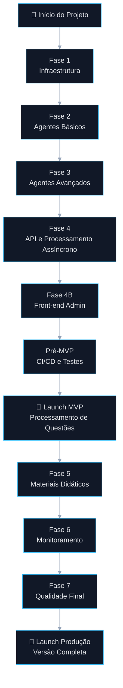
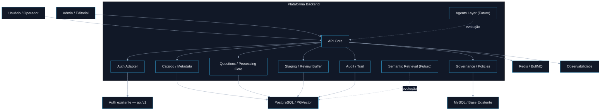
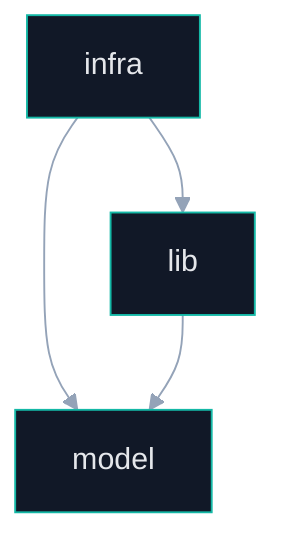
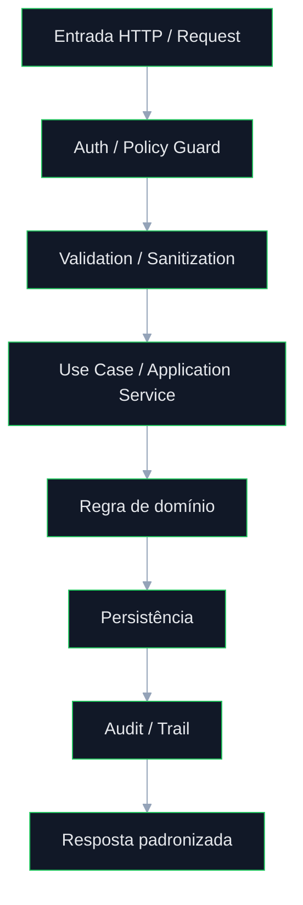
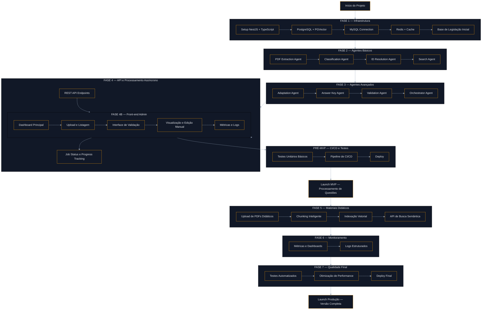
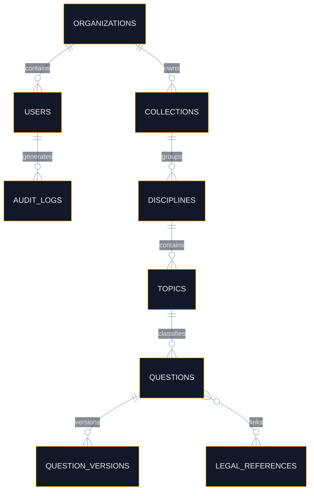

# Plataforma de Questões com IA

<div align="center">


</div>

<br />

<div align="center">

## 🏛️ Arquitetura orientada a domínio para processamento, governança, revisão e evolução incremental de questões com suporte a IA

Projeto desenhado para crescimento em fases, com foco em **segurança**, **modularidade**, **rastreabilidade operacional**, **baixo acoplamento**, **processamento assíncrono**, **reaproveitamento de infraestrutura existente** e **expansão sustentável até produção completa**.

</div>

---

# 📚 Sumário

- [1. Visão Executiva](#1-visão-executiva)
- [2. Status Atual do Projeto](#2-status-atual-do-projeto)
- [3. Decisão Arquitetural Oficial](#3-decisão-arquitetural-oficial)
- [4. Objetivo da Plataforma](#4-objetivo-da-plataforma)
- [5. Roadmap Oficial por Fases](#5-roadmap-oficial-por-fases)
- [6. Interpretação Arquitetural do Roadmap](#6-interpretação-arquitetural-do-roadmap)
- [7. Mapa Completo de Entregáveis por Fase](#7-mapa-completo-de-entregáveis-por-fase)
- [8. Escopo Real da Fase 1](#8-escopo-real-da-fase-1)
- [9. O que ainda não pertence à Fase 1](#9-o-que-ainda-não-pertence-à-fase-1)
- [10. Princípios Arquiteturais](#10-princípios-arquiteturais)
- [11. Visão Arquitetural de Alto Nível](#11-visão-arquitetural-de-alto-nível)
- [12. Reaproveitamento da Autenticação da `api/v1`](#12-reaproveitamento-da-autenticação-da-apiv1)
- [13. Estrutura Arquitetural por Módulo](#13-estrutura-arquitetural-por-módulo)
- [14. Regras de Dependência Obrigatórias](#14-regras-de-dependência-obrigatórias)
- [15. Bounded Contexts da Plataforma](#15-bounded-contexts-da-plataforma)
- [16. Fluxo Operacional da Fase 1](#16-fluxo-operacional-da-fase-1)
- [17. Fluxo Completo de Evolução do Produto](#17-fluxo-completo-de-evolução-do-produto)
- [18. Fluxo de Processamento de Questões (MVP)](#18-fluxo-de-processamento-de-questões-mvp)
- [19. Fluxo de Expansão para Materiais Didáticos](#19-fluxo-de-expansão-para-materiais-didáticos)
- [20. Tree View Arquitetural Proposta](#20-tree-view-arquitetural-proposta)
- [21. Modelo de Dados Conceitual da Fase 1](#21-modelo-de-dados-conceitual-da-fase-1)
- [22. Segurança](#22-segurança)
- [23. Observabilidade](#23-observabilidade)
- [24. Resiliência e Confiabilidade](#24-resiliência-e-confiabilidade)
- [25. ACL e Isolamento do Legado](#25-acl-e-isolamento-do-legado)
- [26. Pipeline Futuro e Compatibilidade Evolutiva](#26-pipeline-futuro-e-compatibilidade-evolutiva)
- [27. MVP vs Produção Completa](#27-mvp-vs-produção-completa)
- [28. Riscos Técnicos e Trade-offs](#28-riscos-técnicos-e-trade-offs)
- [29. Critérios de Pronto da Fase 1](#29-critérios-de-pronto-da-fase-1)
- [30. Stack Técnica](#30-stack-técnica)
- [31. Conclusão](#31-conclusão)

---

# 1. Visão Executiva

A **Plataforma de Questões com IA** foi concebida como uma base arquitetural robusta para suportar, com segurança e governança, o ciclo de vida de processamento, estruturação, revisão, enriquecimento e evolução de questões a partir de materiais-base e fluxos inteligentes.

A solução foi desenhada para evoluir progressivamente até um pipeline completo envolvendo:

- ingestão de PDFs;
- extração de conteúdo;
- classificação e enriquecimento de metadados;
- resolução de identificadores e vínculos;
- busca contextual e semântica;
- adaptação e transformação assistida por IA;
- geração de justificativas;
- validação automatizada;
- orquestração por agentes;
- processamento assíncrono;
- interface administrativa;
- revisão humana;
- observabilidade operacional;
- hardening para produção completa.

Entretanto, **o projeto não deve ser descrito como se todas essas capacidades já estivessem implementadas em produção**.

A implementação atual deve ser entendida dentro da **Fase 1 — Infraestrutura / Fundação Segura**, que representa a base correta sobre a qual as fases posteriores serão construídas.

## Tese arquitetural central

> **A arquitetura não foi desenhada para “resolver apenas o agora”. Ela foi desenhada para suportar o roadmap inteiro, sem que a base precise ser refeita a cada nova fase.**

Isso significa que:

- a Fase 1 precisa ser sólida o suficiente para sustentar as fases seguintes;
- o README precisa separar com precisão **estado atual**, **MVP** e **versão completa**;
- o roadmap precisa ser refletido como **evolução arquitetural real**, e não apenas como backlog visual.

---

# 2. Status Atual do Projeto

## 🟢 Situação correta do projeto

O projeto encontra-se na etapa de **fundação estrutural**, correspondente à **Fase 1**, ainda que a arquitetura global já esteja desenhada para sustentar todas as fases seguintes.

## O que isso significa tecnicamente

A base atual precisa estar pronta para suportar:

- persistência principal;
- integração com legado;
- cache;
- contratos internos;
- módulos coesos;
- autenticação reaproveitada;
- expansão futura com filas, agentes, indexação vetorial e operação assíncrona.

## O que não deve ser comunicado de forma incorreta

Ainda **não deve ser tratado como já pronto**:

- pipeline multiagente completo;
- orquestração plena em produção;
- busca semântica completa em produção;
- observabilidade madura;
- interface operacional completa;
- endurecimento final de produção.

---

# 3. Decisão Arquitetural Oficial

A direção arquitetural aprovada para a plataforma é:

## ✅ **Monólito Modular Pragmático por Domínio**

com:

- **NestJS + TypeScript**;
- organização por **módulos de domínio**;
- estrutura interna por módulo em:
  - `infra/`
  - `model/`
  - `lib/`
- uso disciplinado de `shared/`;
- reaproveitamento da autenticação já existente da `api/v1`;
- integração com base existente via **MySQL / ACL**;
- persistência principal em **PostgreSQL + PGVector**;
- coordenação e evolução assíncrona com **Redis + BullMQ**;
- uso seletivo de conceitos de Clean/Hexagonal **sem excesso de abstração**.

## Motivos da decisão

Essa arquitetura oferece o melhor equilíbrio entre:

- simplicidade operacional;
- clareza de ownership;
- baixa fricção de evolução;
- facilidade de manutenção;
- observabilidade centralizada;
- capacidade de crescer sem fragmentação prematura.

## O que foi conscientemente evitado

### ❌ Microsserviços prematuros
Porque aumentariam:
- custo operacional;
- overhead de tracing;
- contratos distribuídos;
- dificuldade de troubleshooting.

### ❌ Abstração excessiva no core
Porque geraria:
- boilerplate desnecessário;
- lentidão de evolução;
- custo cognitivo desproporcional.

### ❌ Duplicação de autenticação
Porque criaria:
- drift de identidade;
- inconsistência de escopo;
- divergência de regras de acesso.

---

# 4. Objetivo da Plataforma

A plataforma existe para suportar, com segurança e governança, o ciclo de vida de transformação de insumos em questões processadas, validadas, enriquecidas e operacionalmente utilizáveis, preservando compatibilidade futura com IA e com o ecossistema existente.

## Objetivos principais

- estruturar o pipeline de processamento de questões;
- centralizar metadados e classificações;
- suportar agentes de enriquecimento e validação;
- preparar o sistema para processamento assíncrono;
- permitir operação humana assistida;
- sustentar expansão para materiais didáticos e busca semântica.

---

# 5. Roadmap Oficial por Fases

O roadmap oficial da plataforma, conforme definido, está organizado da seguinte forma:

1. **Fase 1 — Infraestrutura**
2. **Fase 2 — Agentes Básicos**
3. **Fase 3 — Agentes Avançados**
4. **Fase 4 — API e Processamento Assíncrono**
5. **Fase 4B — Front-end Admin**
6. **Pré-MVP — CI/CD e Testes**
7. **🚀 Launch MVP — Processamento de Questões**
8. **Fase 5 — Materiais Didáticos**
9. **Fase 6 — Monitoramento**
10. **Fase 7 — Qualidade Final**
11. **🎉 Launch Produção — Versão Completa**

## Fluxograma executivo do roadmap



---

# 6. Interpretação Arquitetural do Roadmap

O roadmap deve ser lido em dois planos simultâneos.

## Plano A — Estado atual da implementação
A implementação atual está concentrada na **fundação correta** do sistema, com foco em infraestrutura, contratos, organização modular, persistência, integração, autenticação e preparo do pipeline.

## Plano B — Arquitetura alvo já decidida
Mesmo antes da implementação completa das próximas fases, a arquitetura precisa nascer compatível com:

- agentes;
- orquestração;
- filas;
- processamento assíncrono;
- indexação vetorial;
- busca semântica;
- observabilidade;
- endurecimento para produção.

> **A base atual deve respeitar o roadmap inteiro, mesmo que a implementação ainda esteja nos estágios iniciais.**

## Interpretação correta do roadmap

### O que já precisa existir na fundação
- boundaries corretos;
- contratos claros;
- persistência principal;
- compatibilidade com integração legada;
- cache;
- auth reaproveitada;
- desenho compatível com jobs e workers.

### O que só deve ser considerado como evolução
- pipeline multiagente completo;
- UI operacional madura;
- observabilidade plena;
- expansão vetorial;
- qualidade final de produção.

---

# 7. Mapa Completo de Entregáveis por Fase

## 🟦 Fase 1 — Infraestrutura

### Objetivo
Estabelecer a fundação técnica e operacional mínima correta da plataforma.

### Entregáveis
- Setup **NestJS + TypeScript**
- **PostgreSQL + PGVector**
- **MySQL Connection**
- **Redis + Cache**
- base inicial de **legislação / conhecimento primário**
- configuração de ambiente
- bootstrap do projeto
- contratos estruturais iniciais
- camada de integração com auth existente

### Resultado esperado
Ao final da Fase 1, o projeto precisa ter **uma fundação sólida e extensível**, ainda que sem pipeline avançado operacional.

---

## 🟪 Fase 2 — Agentes Básicos

### Objetivo
Introduzir os primeiros componentes automatizados do pipeline.

### Entregáveis
- **PDF Extraction Agent**
- **Classification Agent**
- **ID Resolution Agent**
- **Search Agent**

### Resultado esperado
A plataforma passa a possuir os primeiros blocos funcionais para:

- extrair conteúdo;
- enriquecer metadados;
- resolver vínculos;
- buscar contexto relevante.

---

## 🟧 Fase 3 — Agentes Avançados

### Objetivo
Adicionar inteligência editorial e validação semântica ao fluxo.

### Entregáveis
- **Adaptation Agent**
- **Answer Key Agent**
- **Validation Agent**
- **Orchestrator Agent**

### Resultado esperado
A solução passa a suportar:

- reformulação;
- geração de justificativas;
- validação semântica;
- coordenação entre agentes.

---

## 🟩 Fase 4 — API e Processamento Assíncrono

### Objetivo
Transformar o pipeline em um sistema operacional escalável.

### Entregáveis
- **REST API Endpoints**
- **Bull / BullMQ Queues**
- **Job Status e Progress Tracking**

### Resultado esperado
O sistema deixa de ser apenas um conjunto de blocos lógicos e passa a operar como uma plataforma de execução assíncrona.

---

## 🟥 Fase 4B — Front-end Admin

### Objetivo
Entregar a superfície humana de operação do MVP.

### Entregáveis
- dashboard principal
- upload e listagem
- interface de validação
- visualização de questões
- edição manual
- métricas e logs operacionais

### Resultado esperado
A operação humana passa a interagir diretamente com o fluxo do produto.

---

## 🟨 Pré-MVP — CI/CD e Testes

### Objetivo
Garantir lançabilidade mínima antes do MVP.

### Entregáveis
- testes unitários básicos
- pipeline de CI/CD
- deploy inicial

### Resultado esperado
O produto torna-se lançável com previsibilidade operacional mínima.

---

## 🚀 Launch MVP — Processamento de Questões

### Objetivo
Entregar a primeira versão funcional e utilizável da plataforma.

### Resultado esperado
Nesse ponto, a plataforma já deve ser capaz de:

- receber insumos;
- processar questões;
- coordenar etapas essenciais;
- disponibilizar uma operação mínima utilizável.

---

## 🟦 Fase 5 — Materiais Didáticos

### Objetivo
Expandir a plataforma para materiais-base e busca semântica.

### Entregáveis
- upload de PDFs didáticos
- chunking inteligente
- indexação vetorial
- API de busca semântica

### Resultado esperado
A solução passa a operar também como plataforma de conhecimento contextualizado.

---

## 🟪 Fase 6 — Monitoramento

### Objetivo
Consolidar visibilidade operacional madura.

### Entregáveis
- métricas
- dashboards
- logs estruturados

### Resultado esperado
A plataforma torna-se observável de forma consistente.

---

## 🟩 Fase 7 — Qualidade Final

### Objetivo
Endurecimento final antes da versão completa de produção.

### Entregáveis
- testes automatizados
- otimização de performance
- deploy final

### Resultado esperado
A plataforma alcança um patamar de robustez adequado para operação completa.

---

## 🎉 Launch Produção — Versão Completa

### Objetivo
Consolidar a versão completa da solução em produção.

### Resultado esperado
A plataforma opera com:

- pipeline completo;
- superfície operacional;
- observabilidade madura;
- expansão vetorial;
- qualidade endurecida.

---

# 8. Escopo Real da Fase 1

A Fase 1 é a camada fundacional da plataforma.

## Entregas corretas da Fase 1

### 🧱 Infraestrutura Base
- Setup **NestJS + TypeScript**
- estrutura de bootstrap
- configuração de ambiente
- base de módulos

### 🐘 Persistência Principal
- **PostgreSQL** como banco principal
- **PGVector** para compatibilidade futura com indexação vetorial
- estrutura inicial de entidades e migrações

### 🗄️ Integração com Base Existente
- conexão **MySQL** para leitura e/ou integração com base legada
- preparação para ACL

### ⚡ Cache e Coordenação
- **Redis**
- base para cache
- compatibilidade futura com filas e jobs

### 📚 Base Inicial de Conhecimento
- estrutura inicial para legislação e referência canônica

### 🔐 Segurança Estrutural
- autenticação reaproveitada
- autorização
- proteção básica de borda
- validação e sanitização

---

# 9. O que ainda não pertence à Fase 1

Os itens abaixo pertencem ao roadmap da solução, mas **não devem ser tratados como entregues agora**.

- agentes completos em produção;
- orquestração completa do pipeline;
- filas operacionais maduras;
- interface admin completa;
- upload e gestão avançada de materiais didáticos;
- chunking inteligente;
- indexação vetorial operacional;
- API semântica madura;
- dashboards completos;
- otimização final de performance;
- endurecimento final de produção.

---

# 10. Princípios Arquiteturais

## 10.1 Domain First
O domínio e o roadmap do produto definem a arquitetura.

## 10.2 Secure by Default
Toda entrada e integração é tratada como potencialmente insegura até validação explícita.

## 10.3 Modular by Responsibility
Cada módulo representa uma responsabilidade clara.

## 10.4 Shared with Discipline
`shared/` existe apenas para transversalidade real.

## 10.5 Async-Ready by Design
Mesmo antes da operação assíncrona completa, a base já deve nascer compatível com jobs, filas e workers.

## 10.6 Everything Auditable
Toda operação relevante deve poder ser rastreada.

## 10.7 Incremental Evolution
A arquitetura precisa evoluir sem reescrita estrutural.

## 10.8 Legacy Isolation
O legado deve ser consumido via ACL, e não internalizado diretamente no domínio novo.

---

# 11. Visão Arquitetural de Alto Nível



## Leitura técnica

A arquitetura separa desde a base:

- entrada HTTP;
- identidade e autorização;
- núcleo de processamento;
- catálogo e metadados;
- staging e revisão futura;
- auditoria;
- governança;
- integração com legado;
- compatibilidade com agentes e busca semântica.

---

# 12. Reaproveitamento da Autenticação da `api/v1`

A nova plataforma **não deve implementar um sistema paralelo de autenticação**.

Ela deve:

- reaproveitar a infraestrutura de identidade existente;
- validar contexto e escopo via camada de adaptação;
- manter consistência com o ambiente atual;
- reduzir custo de integração e risco de drift.

## Fluxo arquitetural da autenticação


---

# 13. Estrutura Arquitetural por Módulo

Cada módulo segue uma organização interna simples, previsível e disciplinada.

```text
modules/<modulo>/
├── infra/
├── model/
└── lib/
```

## `model/`
Contém:
- DTOs;
- enums;
- interfaces;
- schemas;
- contratos;
- tipos;
- validações.

## `infra/`
Contém:
- controllers;
- services;
- repositories;
- processors;
- gateways;
- clients;
- adapters.

## `lib/`
Contém:
- helpers;
- parsers;
- mappers;
- normalizers;
- factories;
- utilitários do módulo.

---

# 14. Regras de Dependência Obrigatórias

## Permitido
- `infra` usar `model`;
- `infra` usar `lib`;
- `lib` usar `model`.

## Proibido
- `model` depender de `infra`;
- `lib` acessar integrações externas diretamente;
- `shared` virar “depósito genérico”;
- domínio absorver semântica do legado.

## Diagrama de dependência permitida



---

# 15. Bounded Contexts da Plataforma

## Contextos estruturais da solução

### Núcleo atual / fundacional
- `auth`
- `organizations`
- `catalog`
- `questions`
- `staging`
- `audit`
- `governance`

### Evolução prevista
- `ingestion`
- `extraction`
- `classification`
- `resolution`
- `search`
- `adaptation`
- `answer-key`
- `validation`
- `orchestration`
- `materials`
- `monitoring`
- `quality`
- `publication`

---

# 16. Fluxo Operacional da Fase 1



## Interpretação

A Fase 1 não é “vazia” apenas por não conter ainda todo o pipeline futuro.  
Ela já precisa garantir:

- segurança;
- estruturação;
- previsibilidade;
- persistência;
- rastreabilidade;
- base correta para expansão.

---

# 17. Fluxo Completo de Evolução do Produto

O fluxo abaixo traduz o roadmap em uma leitura arquitetural de ponta a ponta, sem cortes de texto e com nomes completos.



---

# 18. Fluxo de Processamento de Questões (MVP)

Este diagrama representa o caminho lógico do produto até o **Launch MVP**.


## Objetivo desse fluxo
Esse pipeline representa a primeira cadeia funcional do produto, combinando:

- extração;
- classificação;
- enriquecimento;
- adaptação;
- validação;
- operação humana.

---

# 19. Fluxo de Expansão para Materiais Didáticos

Após o MVP, a solução evolui para ingestão de materiais-base e busca semântica.


---

# 20. Tree View Arquitetural Proposta

```text
src/
├── main.ts
├── app.module.ts
│
├── bootstrap/
│   ├── app.bootstrap.ts
│   ├── config.bootstrap.ts
│   ├── logger.bootstrap.ts
│   ├── validation.bootstrap.ts
│   ├── exception-filters.bootstrap.ts
│   ├── metrics.bootstrap.ts
│   ├── tracing.bootstrap.ts
│   ├── queues.bootstrap.ts
│   ├── swagger.bootstrap.ts
│   └── shutdown.bootstrap.ts
│
├── config/
│   ├── app.config.ts
│   ├── auth.config.ts
│   ├── db.config.ts
│   ├── redis.config.ts
│   ├── queue.config.ts
│   ├── storage.config.ts
│   ├── llm.config.ts
│   ├── vector.config.ts
│   ├── observability.config.ts
│   ├── security.config.ts
│   └── feature-flags.config.ts
│
├── modules/
│   ├── auth/
│   │   ├── infra/
│   │   ├── model/
│   │   └── lib/
│   ├── organizations/
│   ├── catalog/
│   ├── questions/
│   ├── staging/
│   ├── audit/
│   ├── governance/
│   ├── ingestion/
│   ├── extraction/
│   ├── classification/
│   ├── resolution/
│   ├── search/
│   ├── adaptation/
│   ├── answer-key/
│   ├── validation/
│   ├── orchestration/
│   ├── materials/
│   ├── monitoring/
│   ├── quality/
│   └── publication/
│
├── shared/
│   ├── infra/
│   ├── model/
│   └── lib/
│
├── docs/
│   ├── architecture/
│   ├── adr/
│   ├── contracts/
│   └── runbooks/
│
└── test/
    ├── unit/
    ├── integration/
    ├── contract/
    ├── e2e/
    └── load/
```

---

# 21. Modelo de Dados Conceitual da Fase 1

## Entidades centrais esperadas

- `users`
- `roles`
- `permissions`
- `organizations`
- `collections`
- `disciplines`
- `topics`
- `legal_references`
- `questions`
- `question_versions`
- `audit_logs`

## Diagrama conceitual



---

# 22. Segurança

## Controles mínimos da fundação

- autenticação obrigatória;
- autorização por escopo e política;
- validação forte de payload;
- sanitização de entrada;
- proteção contra vazamento de erro sensível;
- segregação de credenciais;
- trilha mínima de auditoria.

## Regras obrigatórias

1. Nenhuma rota sensível sem autenticação.
2. Nenhuma operação crítica sem autorização explícita.
3. Nenhum payload entra no domínio sem validação.
4. Nenhuma exceção técnica deve vazar stack em produção.
5. Nenhuma integração com legado deve bypassar a ACL.

---

# 23. Observabilidade

A observabilidade deve crescer junto com o roadmap.

## Na fundação
- logs estruturados;
- correlation id;
- tracing básico;
- health checks.

## No MVP
- status de jobs;
- visibilidade de pipeline;
- falhas por etapa.

## Na produção completa
- dashboards operacionais;
- métricas de throughput;
- métricas de falha;
- visibilidade por agente;
- logs estruturados maduros.

---

# 24. Resiliência e Confiabilidade

A base já deve nascer preparada para evolução operacional.

## Fundamentos
- tratamento consistente de erro;
- previsibilidade operacional;
- isolamento de responsabilidade;
- contratos estáveis;
- compatibilidade com retries e jobs.

## Evolução posterior
- retries por etapa;
- DLQ;
- reprocessamento;
- tolerância a falhas em agentes;
- observabilidade de degradação.

---

# 25. ACL e Isolamento do Legado

A base principal / legado **não deve contaminar o domínio novo**.

## Regra obrigatória
Toda integração com a base existente deve passar por uma **ACL (Anti-Corruption Layer)**.

## Fluxo conceitual


---

# 26. Pipeline Futuro e Compatibilidade Evolutiva

A arquitetura atual já nasce preparada para o pipeline completo futuro.


## Interpretação
Esse fluxo **não significa que tudo já está pronto hoje**.  
Ele existe para mostrar que a fundação foi desenhada para receber esse pipeline sem exigir reestruturação radical.

---

# 27. MVP vs Produção Completa

## 🚀 MVP — Processamento de Questões
O MVP representa a primeira versão operacional utilizável da plataforma, com pipeline funcional mínimo, API, processamento assíncrono e superfície administrativa inicial.

## 🎉 Produção Completa
A versão completa adiciona:

- materiais didáticos;
- chunking;
- indexação vetorial;
- busca semântica;
- observabilidade madura;
- qualidade endurecida;
- performance otimizada;
- operação sustentável em escala.

## Tabela comparativa

| Dimensão | MVP | Produção Completa |
|---|---|---|
| Pipeline de agentes | Básico / funcional | Completo / robusto |
| API | Operacional | Endurecida |
| Filas | Essenciais | Maturidade operacional |
| Admin | Superfície inicial | Operação madura |
| Busca semântica | Não obrigatória | Ativa |
| Observabilidade | Básica | Completa |
| Qualidade | Mínima lançável | Hardening final |

---

# 28. Riscos Técnicos e Trade-offs

## Riscos controlados pela arquitetura

### 1. Acoplamento com legado
**Mitigação:** ACL + boundaries explícitos.

### 2. Crescimento desordenado do monólito
**Mitigação:** modularização por domínio + regras de dependência.

### 3. Explosão prematura de complexidade
**Mitigação:** roadmap incremental + fases bem separadas.

### 4. Duplicação de identidade/autorização
**Mitigação:** reuso da auth da `api/v1`.

### 5. Reescrita estrutural no meio do roadmap
**Mitigação:** arquitetura preparada desde a fundação para filas, vetores, agentes e evolução assíncrona.

---

# 29. Critérios de Pronto da Fase 1

A Fase 1 é considerada consistente quando possuir:

- setup estrutural estável;
- PostgreSQL + PGVector configurados;
- integração MySQL controlada;
- Redis funcional;
- autenticação integrada;
- contratos internos claros;
- logs mínimos;
- validação e sanitização;
- documentação coerente com a fase.

---

# 30. Stack Técnica

## Backend
- **NestJS**
- **TypeScript**

## Persistência
- **PostgreSQL**
- **PGVector**

## Integração
- **MySQL**

## Coordenação
- **Redis**
- **BullMQ**

## Observabilidade
- **Pino**
- **OpenTelemetry**

## Infraestrutura
- **Docker**
- **Docker Compose**

---

# 31. Conclusão

A arquitetura definida para esta plataforma não existe apenas para “organizar o código”.

Ela existe para garantir que o produto possa crescer corretamente ao longo das fases planejadas, preservando:

- segurança;
- consistência;
- governança;
- modularidade;
- rastreabilidade;
- compatibilidade com evolução futura.

A **Fase 1** deve ser entendida como a **fundação correta do produto**, e não como um recorte improvisado.

A partir dela, as fases seguintes podem ser adicionadas sem comprometer a integridade da solução.

<div align="center">

## 🚀 A fundação correta reduz reescrita, reduz acoplamento e acelera a evolução segura do produto

</div>
