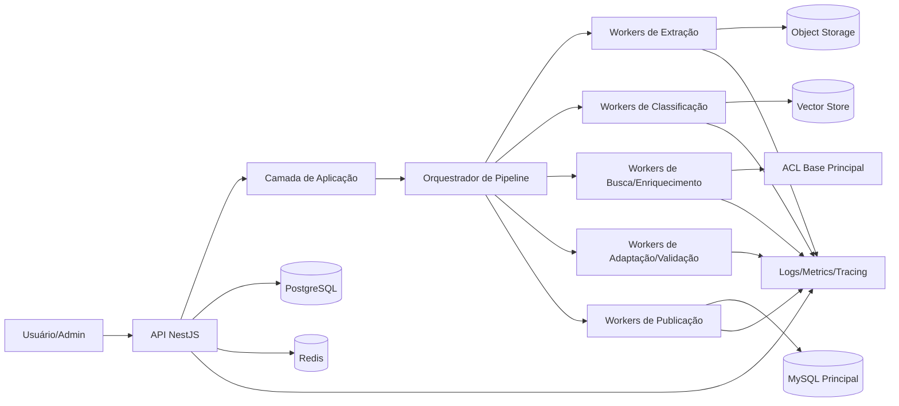
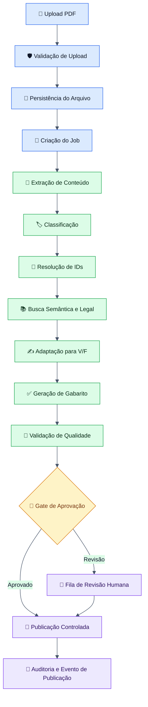
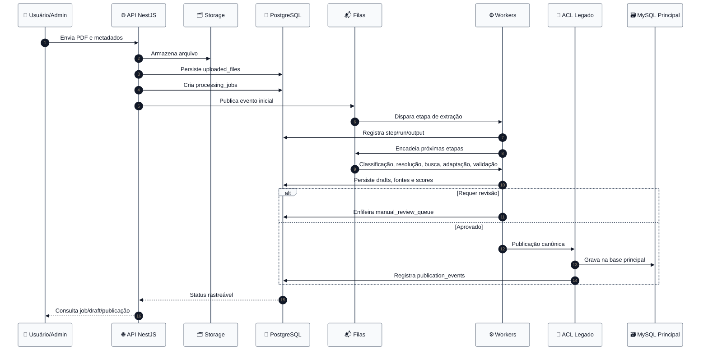
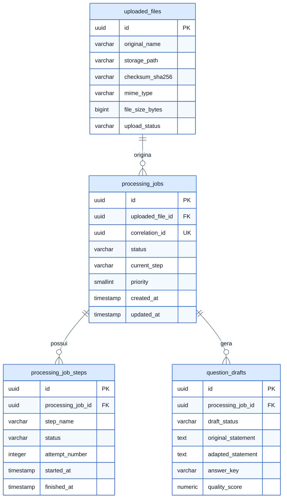
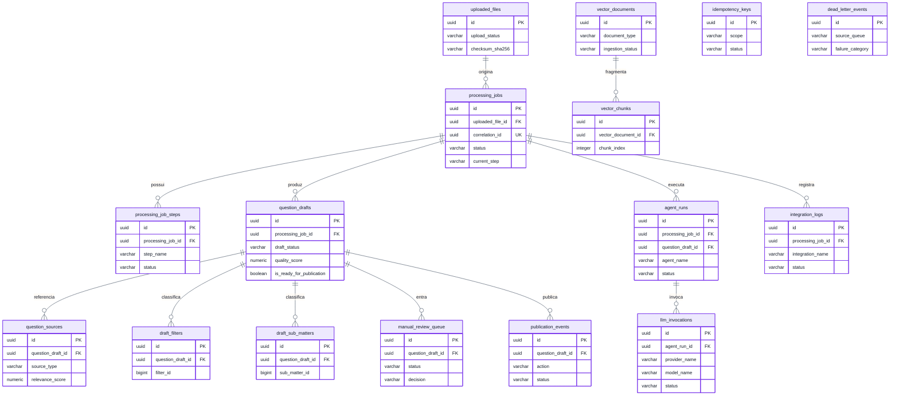

# 🧠 Arquitetura Técnica — Agente de Geração de Questões com IA

<p align="center">


</p>

> Documento técnico de arquitetura, dados, observabilidade, resiliência, organização de código, contratos, filas, integrações e fluxos do serviço de IA responsável por transformar PDFs de provas em questões no formato Verdadeiro/Falso, com classificação, fundamentação legal, validação, revisão humana e publicação controlada.

---

## 📚 Sumário

- [1. Objetivo](#1-objetivo)
- [2. Escopo do Documento](#2-escopo-do-documento)
- [3. Contexto do Problema](#3-contexto-do-problema)
- [4. Objetivos do Sistema](#4-objetivos-do-sistema)
- [5. Requisitos Funcionais](#5-requisitos-funcionais)
- [6. Requisitos Não Funcionais](#6-requisitos-não-funcionais)
- [7. Premissas e Restrições](#7-premissas-e-restrições)
- [8. Decisões Arquiteturais Centrais](#8-decisões-arquiteturais-centrais)
- [9. Princípios Arquiteturais](#9-princípios-arquiteturais)
- [10. Visão Geral da Solução](#10-visão-geral-da-solução)
- [11. Visão Sistêmica da Plataforma](#11-visão-sistêmica-da-plataforma)
- [12. Arquitetura de Alto Nível](#12-arquitetura-de-alto-nível)
- [13. Arquitetura Hexagonal Aplicada](#13-arquitetura-hexagonal-aplicada)
- [14. Clean Architecture Aplicada](#14-clean-architecture-aplicada)
- [15. Bounded Contexts e Responsabilidades](#15-bounded-contexts-e-responsabilidades)
- [16. Fluxograma Geral da Aplicação](#16-fluxograma-geral-da-aplicação)
- [17. Fluxo Macro do Sistema](#17-fluxo-macro-do-sistema)
- [18. Jornada Completa do Dado](#18-jornada-completa-do-dado)
- [19. Pipeline Multiagente](#19-pipeline-multiagente)
- [20. Orquestração do Pipeline](#20-orquestração-do-pipeline)
- [21. Estratégia de Jobs e Workers](#21-estratégia-de-jobs-e-workers)
- [22. Estratégia de Filas e Prioridades](#22-estratégia-de-filas-e-prioridades)
- [23. Matriz de Jobs, Dependências e Ordem de Execução](#23-matriz-de-jobs-dependências-e-ordem-de-execução)
- [24. Estratégia de Reprocessamento](#24-estratégia-de-reprocessamento)
- [25. Estado Atual da Base Principal](#25-estado-atual-da-base-principal)
- [26. Interpretação Técnica do Modelo Atual](#26-interpretação-técnica-do-modelo-atual)
- [27. Modelo de Dados Futuro](#27-modelo-de-dados-futuro)
- [28. Estratégia de Persistência](#28-estratégia-de-persistência)
- [29. Estratégia de Banco por Responsabilidade](#29-estratégia-de-banco-por-responsabilidade)
- [30. Diagrama ER do Modelo Atual](#30-diagrama-er-do-modelo-atual)
- [31. Diagrama ER do Modelo Futuro](#31-diagrama-er-do-modelo-futuro)
- [32. Dicionário de Banco de Dados](#32-dicionário-de-banco-de-dados)
- [33. Dicionário de Estados e Status](#33-dicionário-de-estados-e-status)
- [34. Taxonomia Contextual e Pedagógica](#34-taxonomia-contextual-e-pedagógica)
- [35. Estratégia de Classificação e Resolução de IDs](#35-estratégia-de-classificação-e-resolução-de-ids)
- [36. Estratégia de Busca Semântica e Fundamentação Legal](#36-estratégia-de-busca-semântica-e-fundamentação-legal)
- [37. Estratégia de Adaptação para Verdadeiro/Falso](#37-estratégia-de-adaptação-para-verdadeirofalso)
- [38. Estratégia de Geração de Gabarito Comentado](#38-estratégia-de-geração-de-gabarito-comentado)
- [39. Estratégia de Validação de Qualidade](#39-estratégia-de-validação-de-qualidade)
- [40. Estratégia de Revisão Humana](#40-estratégia-de-revisão-humana)
- [41. Estratégia de Publicação Controlada](#41-estratégia-de-publicação-controlada)
- [42. Regras de Publicação e Anti-Corrupção de Dados](#42-regras-de-publicação-e-anti-corrupção-de-dados)
- [43. Segurança Global da Plataforma](#43-segurança-global-da-plataforma)
- [44. Segurança de Uploads](#44-segurança-de-uploads)
- [45. Segurança de Integrações](#45-segurança-de-integrações)
- [46. Segurança de Prompts e Saídas de IA](#46-segurança-de-prompts-e-saídas-de-ia)
- [47. Sanitização e Normalização Global](#47-sanitização-e-normalização-global)
- [48. Helpers, Utilitários e Normalizadores Globais](#48-helpers-utilitários-e-normalizadores-globais)
- [49. Estratégia de Validação de Payloads](#49-estratégia-de-validação-de-payloads)
- [50. Contratos, DTOs, Enums e Tipos](#50-contratos-dtos-enums-e-tipos)
- [51. Contratos Internos entre Agents](#51-contratos-internos-entre-agents)
- [52. Contratos Externos e Gateways](#52-contratos-externos-e-gateways)
- [53. API — Estratégia Geral](#53-api--estratégia-geral)
- [54. API — Convenções de Projeto](#54-api--convenções-de-projeto)
- [55. API — Mapeamento Completo de Rotas](#55-api--mapeamento-completo-de-rotas)
- [56. API — Regex de Validação e Roteamento](#56-api--regex-de-validação-e-roteamento)
- [57. API — Contratos JSON de Entrada e Saída](#57-api--contratos-json-de-entrada-e-saída)
- [58. API — Exemplos de Requests e Responses](#58-api--exemplos-de-requests-e-responses)
- [59. Estratégia de Versionamento da API](#59-estratégia-de-versionamento-da-api)
- [60. Logs Estruturados](#60-logs-estruturados)
- [61. Observabilidade](#61-observabilidade)
- [62. Estratégia de Métricas](#62-estratégia-de-métricas)
- [63. Estratégia de Tracing Distribuído](#63-estratégia-de-tracing-distribuído)
- [64. Correlation IDs, Trace IDs e Span IDs](#64-correlation-ids-trace-ids-e-span-ids)
- [65. Painéis Operacionais e Dashboards](#65-painéis-operacionais-e-dashboards)
- [66. Estratégia de Alertas e SLOs](#66-estratégia-de-alertas-e-slos)
- [67. Timeouts](#67-timeouts)
- [68. Retries](#68-retries)
- [69. Circuit Breaker](#69-circuit-breaker)
- [70. Fallbacks e Estratégias de Degradação](#70-fallbacks-e-estratégias-de-degradação)
- [71. Bulkheads, Backpressure e Contenção](#71-bulkheads-backpressure-e-contenção)
- [72. Dead Letter Queue (DLQ)](#72-dead-letter-queue-dlq)
- [73. Estratégia de Idempotência](#73-estratégia-de-idempotência)
- [74. Locks Distribuídos e Exclusão Mútua](#74-locks-distribuídos-e-exclusão-mútua)
- [75. Estratégia de Cache com Redis](#75-estratégia-de-cache-com-redis)
- [76. Estratégia de Storage de Arquivos](#76-estratégia-de-storage-de-arquivos)
- [77. Estratégia de Indexação Vetorial](#77-estratégia-de-indexação-vetorial)
- [78. Estratégia de Ingestão de Base Legal](#78-estratégia-de-ingestão-de-base-legal)
- [79. Estratégia de Integração com a Base Principal](#79-estratégia-de-integração-com-a-base-principal)
- [80. Anti-Corruption Layer com MySQL Principal](#80-anti-corruption-layer-com-mysql-principal)
- [81. Estratégia de Auditoria e Rastreabilidade](#81-estratégia-de-auditoria-e-rastreabilidade)
- [82. Estratégia de Testes](#82-estratégia-de-testes)
- [83. Regras Arquiteturais Obrigatórias](#83-regras-arquiteturais-obrigatórias)
- [84. Convenções de Código e Qualidade](#84-convenções-de-código-e-qualidade)
- [85. Arquitetura de Pastas e Arquivos](#85-arquitetura-de-pastas-e-arquivos)
- [86. Organização por Camadas](#86-organização-por-camadas)
- [87. Organização por Responsabilidade](#87-organização-por-responsabilidade)
- [88. Organização por Fases do Projeto](#88-organização-por-fases-do-projeto)
- [89. Tree View Vertical Completa](#89-tree-view-vertical-completa)
- [90. Mapeamento Arquivo a Arquivo por Responsabilidade](#90-mapeamento-arquivo-a-arquivo-por-responsabilidade)
- [91. Roadmap Técnico de Evolução](#91-roadmap-técnico-de-evolução)
- [92. Fases de Implementação](#92-fases-de-implementação)
- [93. Matriz de Entregáveis por Fase](#93-matriz-de-entregáveis-por-fase)
- [94. Riscos Técnicos e Mitigações](#94-riscos-técnicos-e-mitigações)
- [95. Runbooks Operacionais](#95-runbooks-operacionais)
- [96. Estratégia de Evolução e Escalabilidade](#96-estratégia-de-evolução-e-escalabilidade)
- [97. Próximos Passos](#97-próximos-passos)
- [98. Conclusão](#98-conclusão)

---

## 1. Objetivo

Definir a arquitetura técnica integral de uma plataforma especializada em transformar provas em PDF em questões estruturadas no formato **Verdadeiro/Falso**, enriquecidas com classificação pedagógica, fundamentação legal, rastreabilidade de origem, validação automática, revisão humana opcional e publicação controlada em ambiente produtivo.

O documento estabelece base arquitetural, organizacional e operacional para implementação real, sustentando evolução segura, observável e resiliente.

---

## 2. Escopo do Documento

Este documento cobre:

- arquitetura lógica, física e operacional;
- fluxos síncronos e assíncronos;
- pipeline multiagente;
- contratos internos e externos;
- API HTTP;
- persistência relacional, vetorial e cache;
- segurança ponta a ponta;
- observabilidade, auditoria e rastreabilidade;
- resiliência e tolerância a falhas;
- organização de código, módulos e camadas;
- estratégia de testes;
- roadmap e fases de implementação.

Fora de escopo explícito:

- UI final do revisor humano;
- engine final de cobrança/licenciamento;
- política comercial;
- detalhes de provisioning cloud específico por provedor.

---

## 3. Contexto do Problema

O processo manual de extrair questões de provas em PDF, reinterpretá-las no formato Verdadeiro/Falso, classificá-las, contextualizá-las e vinculá-las a bases legais é operacionalmente caro, sujeito a inconsistência semântica e baixa escalabilidade.

Os problemas centrais são:

- heterogeneidade do material de entrada;
- ambiguidade na classificação por disciplina, assunto e subassunto;
- necessidade de fundamentação normativa confiável;
- risco de publicar item incorreto ou pedagogicamente fraco;
- necessidade de trilha completa de auditoria;
- necessidade de integração segura com base principal legada.

---

## 4. Objetivos do Sistema

### 4.1 Objetivos funcionais

- receber PDF de prova;
- extrair questões e metadados;
- classificar contexto temático;
- resolver IDs da taxonomia interna;
- buscar base legal e material de apoio;
- adaptar questão para Verdadeiro/Falso;
- gerar gabarito comentado;
- validar qualidade e consistência;
- permitir revisão humana;
- publicar de forma segura e rastreável.

### 4.2 Objetivos não funcionais

- suportar processamento assíncrono massivo;
- garantir observabilidade fim a fim;
- operar com idempotência e reprocessamento seguro;
- proteger dados, prompts e integrações;
- permitir evolução modular por agentes;
- manter baixo acoplamento entre IA, domínio e integrações.

---

## 5. Requisitos Funcionais

| ID | Requisito | Prioridade |
|---|---|---|
| RF-01 | Upload de PDF com validação de tipo, tamanho e integridade | Alta |
| RF-02 | Criação de job de processamento rastreável | Alta |
| RF-03 | Extração de texto, blocos e questões | Alta |
| RF-04 | Classificação disciplinar e pedagógica | Alta |
| RF-05 | Resolução de matter/submatter/topic IDs | Alta |
| RF-06 | Busca semântica de fundamentação legal | Alta |
| RF-07 | Geração de versão V/F | Alta |
| RF-08 | Geração de justificativa e gabarito comentado | Alta |
| RF-09 | Validação de qualidade com score e motivos | Alta |
| RF-10 | Encaminhamento para revisão humana quando necessário | Média |
| RF-11 | Publicação controlada na base principal | Alta |
| RF-12 | Reprocessamento por etapa | Alta |
| RF-13 | Auditoria de eventos de publicação | Alta |
| RF-14 | Consulta de status do job e etapas | Alta |
| RF-15 | DLQ e análise de falhas irreversíveis | Média |

---

## 6. Requisitos Não Funcionais

| ID | Requisito | Meta |
|---|---|---|
| RNF-01 | Disponibilidade do plano de controle | ≥ 99,9% |
| RNF-02 | Durabilidade de evidências e trilhas | Alta |
| RNF-03 | Observabilidade | Logs + métricas + tracing |
| RNF-04 | Segurança | Secure by default |
| RNF-05 | Resiliência | Retry + timeout + fallback + DLQ |
| RNF-06 | Escalabilidade | Workers horizontais independentes |
| RNF-07 | Testabilidade | Unit, integration, contract, e2e |
| RNF-08 | Governança | Versionamento de contratos e prompts |
| RNF-09 | Idempotência | Garantia por operação crítica |
| RNF-10 | Auditabilidade | Rastreabilidade por request/job/agent |

---

## 7. Premissas e Restrições

### 7.1 Premissas

- a entrada primária é um PDF textual ou OCRável;
- existe taxonomia principal previamente definida;
- existe base legal consolidável em pipeline de ingestão;
- existe base principal legada em MySQL ou compatível;
- o sistema pode operar com revisão humana parcial.

### 7.2 Restrições

- modelos de IA podem gerar saídas inconsistentes;
- PDFs malformados exigem tratamento específico;
- acoplamento direto à base principal deve ser evitado;
- publicação automática total não é o modo padrão em contexto regulatório;
- evidência de origem e fundamentação deve ser preservada.

---

## 8. Decisões Arquiteturais Centrais

### 8.1 Stack principal

- **NestJS** para API, orquestração e módulos de aplicação;
- **PostgreSQL** como banco principal operacional do serviço de IA;
- **Redis** para cache, locks distribuídos, filas leves e coordenação;
- **BullMQ** ou equivalente para jobs/workers;
- **pgvector** ou store vetorial equivalente para embeddings e busca semântica;
- **Object Storage** para PDFs, artefatos e evidências;
- **OpenTelemetry** para tracing e métricas;
- **Prometheus + Grafana** para monitoramento;
- **ELK/OpenSearch/Loki** para logs estruturados.

### 8.2 Decisões estruturais

- adoção de arquitetura **hexagonal** para isolar domínio de tecnologia;
- uso de **Clean Architecture** para organizar fluxo de dependência;
- separação entre **módulos de domínio**, **ports**, **adapters** e **infraestrutura**;
- pipeline **assíncrono multiestágio** para extração, classificação, enriquecimento, validação e publicação;
- **Anti-Corruption Layer** para integração com sistema principal legado.

### 8.3 Trade-offs

| Decisão | Ganho | Custo |
|---|---|---|
| Pipeline assíncrono | escalabilidade, isolamento de falhas | maior complexidade operacional |
| Multiagente | modularidade e especialização | aumento de latência agregada |
| Revisão humana opcional | qualidade e governança | custo operacional |
| Banco operacional separado | autonomia e segurança | sincronização adicional |
| Busca vetorial + filtros | maior precisão contextual | custo de indexação e manutenção |

---

## 9. Princípios Arquiteturais

- **🧱 Baixo acoplamento** entre domínio e IA;
- **🎯 Alta coesão** por bounded context;
- **🛡️ Segurança por padrão** em toda fronteira de entrada/saída;
- **📊 Observabilidade por padrão** em cada operação relevante;
- **♻️ Resiliência por padrão** em integrações, jobs e publicação;
- **🧪 Testabilidade por construção**;
- **🧭 Governança explícita** de contratos, prompts, enums e status;
- **📦 Modularidade evolutiva**;
- **🔍 Auditabilidade ponta a ponta**;
- **📚 Anti-corrupção semântica** entre base gerada e base principal.

---

## 10. Visão Geral da Solução

A solução é um serviço especializado que recebe um artefato documental, o normaliza, o interpreta, o decompõe em questões, o enriquece com taxonomia e base legal, produz uma variante canônica no formato Verdadeiro/Falso, atribui justificativas e scores de qualidade, e entrega um draft auditável pronto para revisão ou publicação.

O sistema é orientado a **job orchestration**, não a request-response monolítico.

---

## 11. Visão Sistêmica da Plataforma



---

## 12. Arquitetura de Alto Nível

A arquitetura é composta por cinco macrozonas:

1. **Camada de Entrada**: API HTTP, autenticação, autorização, upload e consulta.
2. **Camada de Aplicação**: casos de uso, orquestração e políticas de fluxo.
3. **Camada de Domínio**: entidades, value objects, regras, invariantes e serviços de domínio.
4. **Camada de Infraestrutura**: filas, persistência, storage, LLM gateways, vector search e integrações externas.
5. **Camada Operacional**: observabilidade, auditoria, segurança, retry, fallback, tracing, métricas e automação operacional.

---

## 13. Arquitetura Hexagonal Aplicada

### 13.1 Portas de entrada

- `CreateProcessingJobUseCase`
- `GetProcessingJobStatusUseCase`
- `RetryProcessingStepUseCase`
- `PublishQuestionDraftUseCase`
- `ListDraftsForReviewUseCase`

### 13.2 Portas de saída

- `UploadedFileRepositoryPort`
- `ProcessingJobRepositoryPort`
- `QuestionDraftRepositoryPort`
- `VectorSearchPort`
- `LlmGatewayPort`
- `LegalBaseGatewayPort`
- `MainDatabasePublicationPort`
- `ObjectStoragePort`
- `DistributedLockPort`
- `MetricsPort`
- `AuditTrailPort`

### 13.3 Adapters

- REST controllers;
- BullMQ processors;
- Prisma/TypeORM repositories;
- Redis lock adapter;
- OpenAI/LLM adapter;
- pgvector adapter;
- MySQL ACL adapter;
- S3-compatible adapter.

---

## 14. Clean Architecture Aplicada

### 14.1 Direção das dependências

A dependência aponta sempre para o centro:

- infraestrutura depende de aplicação e domínio;
- adapters dependem de contratos;
- domínio não conhece NestJS, BullMQ, Redis, banco nem provider de LLM.

### 14.2 Camadas

| Camada | Responsabilidade |
|---|---|
| Interface | entrada/saída HTTP, filas e serialização |
| Application | casos de uso, orquestração, políticas |
| Domain | regras centrais, invariantes, serviços puros |
| Infrastructure | implementações técnicas, gateways, banco, cache |

---

## 15. Bounded Contexts e Responsabilidades

| Contexto | Responsabilidade |
|---|---|
| Ingestion | upload, validação, storage, checksum |
| Extraction | parsing de PDF, OCR, segmentação |
| Classification | classificação temática, taxonomia e resolução de IDs |
| Knowledge Retrieval | busca legal, semântica e evidências |
| Transformation | conversão para V/F e gabarito comentado |
| Quality | score, validação, flags e gates |
| Review | fila humana, ajustes, decisão |
| Publication | publicação controlada e integração legada |
| Observability | trilhas, logs, métricas e tracing |
| Governance | prompts, contratos, versionamento e política |

---

## 16. Fluxograma Geral da Aplicação



---

## 17. Fluxo Macro do Sistema



---

## 18. Jornada Completa do Dado

| Etapa | Entrada | Transformação | Saída | Persistência |
|---|---|---|---|---|
| Upload | PDF bruto | validação + hash + storage | uploaded_file | object storage + uploaded_files |
| Extração | PDF | OCR/parsing/segmentação | blocos e questões extraídas | question_sources + agent_runs |
| Classificação | texto da questão | taxonomia + score | classificação preliminar | question_drafts |
| Resolução de IDs | labels/classificação | matching com catálogos | IDs canônicos | draft_filters/draft_sub_matters |
| Busca legal | texto + taxonomia | embeddings + retrieval | evidências/fundamentos | vector_chunks + question_sources |
| Adaptação | questão + evidências | reescrita V/F | draft V/F | question_drafts |
| Gabarito | draft V/F | justificativa | answer commentary | question_drafts |
| Validação | draft completo | regras + score | aprovado/revisão | manual_review_queue |
| Publicação | draft aprovado | ACL + persistência | item publicado | publication_events |

---

## 19. Pipeline Multiagente

### 19.1 PDF Extraction Agent

**Objetivo:** converter documento bruto em estrutura textual confiável.

**Entradas:** arquivo PDF, metadados de upload, hints de idioma.

**Saídas:** blocos textuais, páginas, questões detectadas, coordenadas, score de confiança da extração.

**Responsabilidades:**

- extrair texto nativo quando possível;
- acionar OCR quando necessário;
- identificar cabeçalhos, rodapés e ruído;
- detectar numeração de questões;
- preservar evidência de origem.

### 19.2 Classification Agent

**Objetivo:** inferir disciplina, assunto, subassunto, tema pedagógico e complexidade.

**Saídas:** classificação textual + score + explicação.

### 19.3 ID Resolution Agent

**Objetivo:** converter classificações livres em IDs canônicos da taxonomia principal.

**Regras:** correspondência exata, fuzzy, semântica, fallback manual.

### 19.4 Search Agent

**Objetivo:** recuperar base legal e conteúdo normativo relevante.

**Estratégia:** hybrid search = filtros estruturados + embeddings + ranking contextual.

### 19.5 Adaptation Agent

**Objetivo:** transformar questão original em formato V/F sem corromper o núcleo conceitual.

### 19.6 Answer Key Agent

**Objetivo:** produzir gabarito, comentário técnico, justificativa e base legal.

### 19.7 Validation Agent

**Objetivo:** detectar alucinação, fragilidade, inconsistência semântica, ausência de fundamento e ambiguidade.

### 19.8 Review Assist Agent (Opcional)

**Objetivo:** apoiar o revisor com resumo de riscos, divergências e recomendações.

### 19.9 Publication Guard Agent (Opcional)

**Objetivo:** bloquear publicação quando houver risco alto, dados incompletos ou integridade insuficiente.

---

## 20. Orquestração do Pipeline

A orquestração é **state-driven** e **event-oriented**. Cada etapa atualiza o estado do job e produz eventos internos de transição. Não há chamada sequencial rígida em memória entre todos os agentes; a composição é dirigida por fila e persistência.

### Estados centrais do job

- `PENDING`
- `UPLOADED`
- `EXTRACTING`
- `CLASSIFYING`
- `RESOLVING_IDS`
- `SEARCHING`
- `ADAPTING`
- `ANSWERING`
- `VALIDATING`
- `MANUAL_REVIEW`
- `READY_TO_PUBLISH`
- `PUBLISHED`
- `FAILED`
- `PARTIALLY_FAILED`
- `CANCELLED`

---

## 21. Estratégia de Jobs e Workers

### Princípios

- um job principal por arquivo/processamento;
- subtarefas independentes por etapa e por questão;
- workers especializados por bounded context;
- isolamento de filas por criticidade e custo computacional;
- reentrância e idempotência obrigatórias.

### Tipos de worker

- `ingestion-worker`
- `extraction-worker`
- `classification-worker`
- `resolution-worker`
- `search-worker`
- `adaptation-worker`
- `answer-key-worker`
- `validation-worker`
- `review-assist-worker`
- `publication-worker`
- `dead-letter-worker`

---

## 22. Estratégia de Filas e Prioridades

| Fila | Responsabilidade | Prioridade |
|---|---|---|
| `q.ingestion` | upload, checksum, criação de job | alta |
| `q.extraction` | parsing/OCR | alta |
| `q.classification` | classificação temática | média |
| `q.resolution` | resolução de IDs | média |
| `q.search` | busca semântica/legal | média |
| `q.adaptation` | adaptação V/F | média |
| `q.answering` | gabarito comentado | média |
| `q.validation` | validação e score | alta |
| `q.review` | preparação revisão humana | baixa |
| `q.publication` | publicação controlada | crítica |
| `q.dlq` | eventos falhos | crítica |

---

## 23. Matriz de Jobs, Dependências e Ordem de Execução

| Ordem | Job | Gatilho | Depende de | Saída | Retry | Fallback |
|---|---|---|---|---|---|---|
| 1 | `PersistUploadedFileJob` | upload concluído | nenhuma | arquivo persistido | 3x | abortar job |
| 2 | `ExtractQuestionsJob` | arquivo persistido | 1 | questões extraídas | 2x | OCR alternativo |
| 3 | `ClassifyQuestionJob` | extração concluída | 2 | taxonomia preliminar | 2x | classificador reduzido |
| 4 | `ResolveIdsJob` | classificação concluída | 3 | IDs canônicos | 2x | fila manual |
| 5 | `SearchLegalBasisJob` | IDs resolvidos | 4 | evidências legais | 2x | busca keyword |
| 6 | `AdaptTrueFalseJob` | busca concluída | 5 | draft V/F | 2x | template conservador |
| 7 | `GenerateAnswerKeyJob` | adaptação concluída | 6 | justificativa | 2x | comentário mínimo |
| 8 | `ValidateDraftJob` | gabarito concluído | 7 | score/falhas | 1x | revisão humana |
| 9 | `PrepareManualReviewJob` | score abaixo da meta | 8 | item na fila humana | 0 | N/A |
| 10 | `PublishDraftJob` | aprovado | 8 ou 9 | publicado | 3x | rollback/compensação |

---

## 24. Estratégia de Reprocessamento

O reprocessamento é granular por etapa e por draft. Cada etapa registra:

- versão do prompt;
- versão do modelo;
- versão do contrato de entrada;
- hash do payload normalizado;
- motivo de reprocessamento;
- operador solicitante;
- timestamp e correlação.

Modos de reprocessamento:

- **replay total**;
- **replay por etapa**;
- **replay por questão**;
- **replay forçado com override de prompt/modelo**;
- **replay pós-correção manual**.

---

## 25. Estado Atual da Base Principal

Assume-se uma base principal legada orientada à publicação de questões e taxonomias canônicas em MySQL, já utilizada por outros sistemas, contendo:

- disciplinas, assuntos, subassuntos;
- filtros pedagógicos;
- questões oficiais/publicadas;
- relações de fonte/origem;
- possivelmente convenções e constraints históricas não totalmente alinhadas ao novo serviço.

---

## 26. Interpretação Técnica do Modelo Atual

A base principal deve ser tratada como **sistema de registro final**, não como ambiente de processamento intermediário. O serviço de IA opera com autonomia em Postgres e publica apenas artefatos validados por meio de ACL.

Implicações:

- evita contaminação precoce da base principal;
- permite evolução do modelo de IA sem quebrar legado;
- facilita rastreabilidade e compensação.

---

## 27. Modelo de Dados Futuro

O modelo futuro separa três dimensões:

1. **Operacional**: jobs, steps, drafts, revisão, publicação;
2. **Conhecimento**: fontes, chunks, embeddings, evidências;
3. **Governança**: idempotência, auditoria, integração, DLQ, runs de agentes.

---

## 28. Estratégia de Persistência

| Tipo de dado | Tecnologia | Uso |
|---|---|---|
| Jobs, drafts, estados | PostgreSQL | consistência transacional |
| Locks, cache, coordenação | Redis | baixa latência |
| PDFs e artefatos | Object Storage | durabilidade e custo |
| Embeddings e chunks | PostgreSQL + pgvector | busca semântica |
| Logs | plataforma centralizada | troubleshooting |
| Métricas | Prometheus | monitoramento |
| Traces | Jaeger/Tempo/OTel backend | rastreamento |

---

## 29. Estratégia de Banco por Responsabilidade

- **PostgreSQL**: operação do serviço, estado do pipeline, drafts, auditoria e indexação vetorial;
- **MySQL Principal**: persistência final canônica, acessada apenas via ACL;
- **Redis**: locks, idempotência efêmera, caches quentes e filas auxiliares;
- **Object Storage**: binários e artefatos imutáveis.

---

## 30. Diagrama ER do Modelo Atual



---

## 31. Diagrama ER do Modelo Futuro



---

## 32. Dicionário de Banco de Dados

> Todas as tabelas abaixo são propostas para o banco operacional do serviço de IA em PostgreSQL, com exceção de metadados transitórios de cache/lock que permanecem em Redis. As colunas foram definidas para implementação real, observabilidade forte, auditoria, idempotência e reprocessamento controlado.

### Convenções gerais de modelagem

- chaves primárias em `UUID`;
- colunas temporais em `TIMESTAMP WITH TIME ZONE` quando aplicável;
- `JSONB` para metadados estruturados e payloads sanitizados;
- índices específicos em colunas de consulta operacional intensa;
- status controlados por enums de aplicação;
- campos de auditoria explícitos em tabelas críticas;
- hashes persistidos para deduplicação, idempotência e rastreabilidade.

### 32.1 `processing_jobs`

| Coluna | Tipo | Null | Default | Índice | Descrição |
|---|---|---:|---|---|---|
| `id` | UUID | Não | `gen_random_uuid()` | PK | Identificador único do job de processamento. |
| `correlation_id` | UUID | Não | — | UK | Identificador transversal para correlacionar upload, job, steps, revisão e publicação. |
| `uploaded_file_id` | UUID | Não | — | IDX/FK | Referência ao arquivo de origem em `uploaded_files`. |
| `status` | VARCHAR(50) | Não | `'PENDING'` | IDX | Estado global do job. |
| `current_step` | VARCHAR(100) | Sim | `NULL` | IDX | Etapa corrente do pipeline no momento da consulta. |
| `priority` | SMALLINT | Não | `5` | IDX | Prioridade operacional do job para roteamento de fila. |
| `process_mode` | VARCHAR(50) | Não | `'standard'` | — | Modo de execução, como `standard`, `strict`, `high-confidence`. |
| `review_policy` | VARCHAR(50) | Não | `'auto_if_confident'` | — | Política de revisão aplicada ao job. |
| `requested_by_user_id` | BIGINT | Sim | `NULL` | IDX | Usuário/ator que solicitou o processamento. |
| `source_system` | VARCHAR(100) | Sim | `NULL` | — | Sistema de origem do job, útil para integrações futuras. |
| `job_group_key` | VARCHAR(150) | Sim | `NULL` | IDX | Chave lógica para agrupamento operacional ou particionamento. |
| `is_reprocessing` | BOOLEAN | Não | `false` | — | Indica se o job foi criado como reprocessamento. |
| `reprocessing_reason` | TEXT | Sim | `NULL` | — | Motivo declarado para reprocessamento. |
| `input_snapshot_json` | JSONB | Sim | `NULL` | GIN opcional | Snapshot sanitizado da intenção original de processamento. |
| `metadata_json` | JSONB | Sim | `NULL` | GIN opcional | Metadados adicionais de controle, semântica ou operação. |
| `started_at` | TIMESTAMPTZ | Sim | `NULL` | IDX | Momento efetivo de início do job. |
| `finished_at` | TIMESTAMPTZ | Sim | `NULL` | IDX | Momento de conclusão, falha terminal ou cancelamento. |
| `last_heartbeat_at` | TIMESTAMPTZ | Sim | `NULL` | IDX | Último heartbeat operacional para detectar jobs órfãos. |
| `failure_code` | VARCHAR(100) | Sim | `NULL` | — | Código normalizado da falha terminal, quando houver. |
| `failure_reason` | TEXT | Sim | `NULL` | — | Motivo textual da falha terminal, sanitizado. |
| `created_at` | TIMESTAMPTZ | Não | `now()` | IDX | Data de criação do registro. |
| `updated_at` | TIMESTAMPTZ | Não | `now()` | IDX | Data da última atualização. |

**Índices recomendados**

- `UK_processing_jobs_correlation_id`
- `IDX_processing_jobs_status_created_at`
- `IDX_processing_jobs_uploaded_file_id`
- `IDX_processing_jobs_requested_by_user_id`
- `IDX_processing_jobs_priority_status`

**Observações de modelagem**

- `correlation_id` não substitui `id`; ele existe para unificar trilhas distribuídas.
- `current_step` é denormalizado para acelerar painéis e consultas operacionais.
- `last_heartbeat_at` reduz risco de job “preso” sem diagnóstico.

### 32.2 `processing_job_steps`

| Coluna | Tipo | Null | Default | Índice | Descrição |
|---|---|---:|---|---|---|
| `id` | UUID | Não | `gen_random_uuid()` | PK | Identificador único da etapa executada. |
| `processing_job_id` | UUID | Não | — | IDX/FK | Referência ao job pai. |
| `step_name` | VARCHAR(100) | Não | — | IDX | Nome canônico da etapa: `extract`, `classify`, `resolve-ids`, etc. |
| `status` | VARCHAR(50) | Não | `'NOT_STARTED'` | IDX | Estado atual da etapa. |
| `attempt_number` | INTEGER | Não | `1` | — | Número da tentativa corrente. |
| `max_attempts` | INTEGER | Não | `1` | — | Máximo configurado de tentativas. |
| `queue_name` | VARCHAR(100) | Sim | `NULL` | IDX | Fila responsável pela execução. |
| `worker_name` | VARCHAR(150) | Sim | `NULL` | — | Worker lógico que executou a etapa. |
| `input_hash` | VARCHAR(128) | Sim | `NULL` | IDX | Hash do input normalizado da etapa. |
| `input_snapshot_json` | JSONB | Sim | `NULL` | — | Resumo sanitizado do input da etapa. |
| `output_snapshot_json` | JSONB | Sim | `NULL` | — | Resumo sanitizado do output da etapa. |
| `step_metadata_json` | JSONB | Sim | `NULL` | — | Metadados técnicos adicionais. |
| `started_at` | TIMESTAMPTZ | Sim | `NULL` | IDX | Início da tentativa da etapa. |
| `finished_at` | TIMESTAMPTZ | Sim | `NULL` | IDX | Finalização da tentativa. |
| `duration_ms` | BIGINT | Sim | `NULL` | IDX | Duração total da tentativa em milissegundos. |
| `next_retry_at` | TIMESTAMPTZ | Sim | `NULL` | IDX | Próxima janela elegível de retry. |
| `failure_code` | VARCHAR(100) | Sim | `NULL` | — | Código normalizado de erro da tentativa. |
| `failure_reason` | TEXT | Sim | `NULL` | — | Descrição sanitizada da falha. |
| `fallback_used` | BOOLEAN | Não | `false` | — | Indica se houve fallback nessa tentativa. |
| `fallback_name` | VARCHAR(100) | Sim | `NULL` | — | Nome do fallback aplicado. |
| `created_at` | TIMESTAMPTZ | Não | `now()` | IDX | Data de criação. |
| `updated_at` | TIMESTAMPTZ | Não | `now()` | IDX | Data de atualização. |

### 32.3 `uploaded_files`

| Coluna | Tipo | Null | Default | Índice | Descrição |
|---|---|---:|---|---|---|
| `id` | UUID | Não | `gen_random_uuid()` | PK | Identificador do arquivo enviado. |
| `storage_bucket` | VARCHAR(150) | Não | — | — | Bucket/container físico de armazenamento. |
| `storage_path` | VARCHAR(500) | Não | — | UK | Caminho único do objeto no storage. |
| `original_name` | VARCHAR(255) | Não | — | — | Nome original enviado pelo usuário. |
| `sanitized_name` | VARCHAR(255) | Não | — | — | Nome lógico sanitizado para exibição segura. |
| `mime_type` | VARCHAR(100) | Não | — | IDX | MIME validado do arquivo. |
| `detected_extension` | VARCHAR(20) | Não | — | — | Extensão real detectada após validação. |
| `file_size_bytes` | BIGINT | Não | — | IDX | Tamanho do arquivo em bytes. |
| `checksum_sha256` | VARCHAR(64) | Não | — | UK | Hash SHA-256 do binário recebido. |
| `upload_status` | VARCHAR(50) | Não | `'UPLOADED'` | IDX | Estado do upload no pipeline de ingestão. |
| `scan_status` | VARCHAR(50) | Não | `'PENDING'` | IDX | Situação do antivírus/scan de malware. |
| `scan_provider` | VARCHAR(100) | Sim | `NULL` | — | Ferramenta/serviço responsável pelo scan. |
| `scan_result_json` | JSONB | Sim | `NULL` | — | Resultado sanitizado do scanner. |
| `is_encrypted_pdf` | BOOLEAN | Não | `false` | — | Indica se o PDF está protegido/criptografado. |
| `page_count` | INTEGER | Sim | `NULL` | — | Total de páginas estimado após parsing. |
| `language_hint` | VARCHAR(20) | Sim | `NULL` | — | Idioma declarado ou inferido. |
| `uploaded_by_user_id` | BIGINT | Sim | `NULL` | IDX | Ator responsável pelo upload. |
| `source_ip_hash` | VARCHAR(128) | Sim | `NULL` | — | Hash do IP de origem para auditoria mínima. |
| `origin_channel` | VARCHAR(100) | Sim | `NULL` | — | Canal de origem: painel, API interna, integração. |
| `retention_until` | TIMESTAMPTZ | Sim | `NULL` | IDX | Data prevista para retenção do artefato. |
| `created_at` | TIMESTAMPTZ | Não | `now()` | IDX | Data de criação. |
| `updated_at` | TIMESTAMPTZ | Não | `now()` | IDX | Data de atualização. |

### 32.4 `question_drafts`

| Coluna | Tipo | Null | Default | Índice | Descrição |
|---|---|---:|---|---|---|
| `id` | UUID | Não | `gen_random_uuid()` | PK | Identificador do draft de questão gerado. |
| `processing_job_id` | UUID | Não | — | IDX/FK | Referência ao job que produziu o draft. |
| `source_question_external_id` | VARCHAR(150) | Sim | `NULL` | IDX | ID externo da questão, se reconhecido na origem. |
| `draft_status` | VARCHAR(50) | Não | `'RAW'` | IDX | Estado do draft no pipeline de transformação. |
| `source_page_number` | INTEGER | Sim | `NULL` | — | Página do PDF de onde a questão foi extraída. |
| `source_question_number` | VARCHAR(50) | Sim | `NULL` | — | Numeração reconhecida da questão original. |
| `original_statement` | TEXT | Não | — | — | Enunciado original extraído do PDF. |
| `original_alternatives_json` | JSONB | Sim | `NULL` | — | Alternativas originais, quando existirem. |
| `adapted_statement` | TEXT | Sim | `NULL` | — | Enunciado reescrito no formato V/F. |
| `statement_type` | VARCHAR(30) | Não | `'TRUE_FALSE'` | — | Tipo de assertiva suportado pelo draft. |
| `expected_answer_key` | VARCHAR(10) | Sim | `NULL` | — | Resposta V/F produzida pelo pipeline. |
| `answer_commentary` | TEXT | Sim | `NULL` | — | Gabarito comentado técnico/pedagógico. |
| `legal_basis_summary` | TEXT | Sim | `NULL` | — | Resumo textual da fundamentação legal. |
| `pedagogical_notes` | TEXT | Sim | `NULL` | — | Observações pedagógicas auxiliares. |
| `quality_score` | NUMERIC(5,2) | Sim | `NULL` | IDX | Score consolidado de qualidade. |
| `clarity_score` | NUMERIC(5,2) | Sim | `NULL` | — | Score de clareza textual. |
| `legal_grounding_score` | NUMERIC(5,2) | Sim | `NULL` | — | Score de aderência/fundamentação legal. |
| `consistency_score` | NUMERIC(5,2) | Sim | `NULL` | — | Score de consistência interna/semântica. |
| `hallucination_risk_level` | VARCHAR(20) | Sim | `NULL` | IDX | Nível de risco de alucinação. |
| `requires_manual_review` | BOOLEAN | Não | `false` | IDX | Indica necessidade de revisão humana. |
| `is_ready_for_publication` | BOOLEAN | Não | `false` | IDX | Draft apto para publicação controlada. |
| `published_at` | TIMESTAMPTZ | Sim | `NULL` | IDX | Momento da publicação confirmada. |
| `active_prompt_version` | VARCHAR(50) | Sim | `NULL` | — | Versão do prompt principal usada na geração. |
| `active_model_version` | VARCHAR(100) | Sim | `NULL` | — | Modelo/versão usado na geração principal. |
| `draft_metadata_json` | JSONB | Sim | `NULL` | GIN opcional | Metadados adicionais de enriquecimento e pipeline. |
| `created_at` | TIMESTAMPTZ | Não | `now()` | IDX | Data de criação. |
| `updated_at` | TIMESTAMPTZ | Não | `now()` | IDX | Data de atualização. |

### 32.5 `question_sources`

| Coluna | Tipo | Null | Default | Índice | Descrição |
|---|---|---:|---|---|---|
| `id` | UUID | Não | `gen_random_uuid()` | PK | Identificador da fonte associada ao draft. |
| `question_draft_id` | UUID | Não | — | IDX/FK | Draft referenciado. |
| `source_type` | VARCHAR(50) | Não | — | IDX | Tipo da fonte: `PDF_PAGE`, `LEGAL_CHUNK`, `NORMATIVE_ARTICLE`, etc. |
| `source_reference` | VARCHAR(255) | Não | — | — | Referência textual principal da fonte. |
| `document_title` | VARCHAR(255) | Sim | `NULL` | — | Título do documento de origem. |
| `document_version` | VARCHAR(100) | Sim | `NULL` | — | Versão/vigência do documento quando aplicável. |
| `page_number` | INTEGER | Sim | `NULL` | — | Página relevante da fonte documental. |
| `article_reference` | VARCHAR(100) | Sim | `NULL` | — | Artigo/inciso/parágrafo/ítem normativo. |
| `excerpt_text` | TEXT | Sim | `NULL` | — | Trecho utilizado como evidência. |
| `excerpt_hash` | VARCHAR(128) | Sim | `NULL` | IDX | Hash do trecho para deduplicação. |
| `source_url` | TEXT | Sim | `NULL` | — | URL institucional da fonte, quando existir. |
| `jurisdiction_code` | VARCHAR(50) | Sim | `NULL` | IDX | Jurisdição da norma/conteúdo. |
| `relevance_score` | NUMERIC(5,2) | Sim | `NULL` | IDX | Relevância da fonte para o draft. |
| `selection_reason` | TEXT | Sim | `NULL` | — | Motivo resumido da seleção da evidência. |
| `is_primary_grounding` | BOOLEAN | Não | `false` | — | Indica se a fonte é fundamento principal. |
| `metadata_json` | JSONB | Sim | `NULL` | — | Metadados auxiliares da evidência. |
| `created_at` | TIMESTAMPTZ | Não | `now()` | IDX | Data de criação. |

### 32.6 `draft_filters`

| Coluna | Tipo | Null | Default | Índice | Descrição |
|---|---|---:|---|---|---|
| `id` | UUID | Não | `gen_random_uuid()` | PK | Identificador da relação draft-filtro. |
| `question_draft_id` | UUID | Não | — | IDX/FK | Draft classificado. |
| `filter_id` | BIGINT | Não | — | IDX | Identificador canônico do filtro na base principal. |
| `filter_label` | VARCHAR(255) | Não | — | — | Rótulo do filtro no momento da resolução. |
| `resolution_method` | VARCHAR(50) | Não | — | — | Método de resolução: exact, fuzzy, semantic, manual. |
| `resolution_score` | NUMERIC(5,2) | Sim | `NULL` | — | Score de confiança da resolução. |
| `is_primary` | BOOLEAN | Não | `false` | — | Identifica filtro primário do draft. |
| `resolved_by_agent_run_id` | UUID | Sim | `NULL` | IDX | Agent run responsável pela resolução. |
| `created_at` | TIMESTAMPTZ | Não | `now()` | IDX | Data de criação. |

### 32.7 `draft_sub_matters`

| Coluna | Tipo | Null | Default | Índice | Descrição |
|---|---|---:|---|---|---|
| `id` | UUID | Não | `gen_random_uuid()` | PK | Identificador da relação draft-subassunto. |
| `question_draft_id` | UUID | Não | — | IDX/FK | Draft associado. |
| `sub_matter_id` | BIGINT | Não | — | IDX | ID canônico do subassunto. |
| `sub_matter_label` | VARCHAR(255) | Não | — | — | Rótulo resolvido no momento da classificação. |
| `matter_id` | BIGINT | Sim | `NULL` | IDX | Matéria pai, quando aplicável. |
| `resolution_method` | VARCHAR(50) | Não | — | — | Método de matching/resolução. |
| `resolution_score` | NUMERIC(5,2) | Sim | `NULL` | — | Score de confiança da associação. |
| `resolved_by_agent_run_id` | UUID | Sim | `NULL` | IDX | Execução responsável pela resolução. |
| `created_at` | TIMESTAMPTZ | Não | `now()` | IDX | Data de criação. |

### 32.8 `agent_runs`

| Coluna | Tipo | Null | Default | Índice | Descrição |
|---|---|---:|---|---|---|
| `id` | UUID | Não | `gen_random_uuid()` | PK | Identificador da execução do agente. |
| `processing_job_id` | UUID | Não | — | IDX/FK | Job associado. |
| `question_draft_id` | UUID | Sim | `NULL` | IDX/FK | Draft associado, quando granular por questão. |
| `processing_step_id` | UUID | Sim | `NULL` | IDX/FK | Etapa operacional relacionada. |
| `agent_name` | VARCHAR(100) | Não | — | IDX | Nome canônico do agente executado. |
| `agent_version` | VARCHAR(50) | Sim | `NULL` | — | Versão lógica do agente/prompting strategy. |
| `status` | VARCHAR(50) | Não | `'PENDING'` | IDX | Status da execução do agente. |
| `provider_name` | VARCHAR(100) | Sim | `NULL` | — | Provedor técnico utilizado, quando houver. |
| `model_name` | VARCHAR(100) | Sim | `NULL` | — | Modelo específico utilizado. |
| `input_hash` | VARCHAR(128) | Sim | `NULL` | IDX | Hash do input normalizado. |
| `input_snapshot_json` | JSONB | Sim | `NULL` | — | Resumo sanitizado do input. |
| `output_snapshot_json` | JSONB | Sim | `NULL` | — | Resumo sanitizado do output. |
| `confidence_score` | NUMERIC(5,2) | Sim | `NULL` | — | Score de confiança retornado ou inferido. |
| `cost_estimate_usd` | NUMERIC(12,6) | Sim | `NULL` | — | Custo estimado da execução. |
| `retry_count` | INTEGER | Não | `0` | — | Quantidade de retries da execução. |
| `fallback_used` | BOOLEAN | Não | `false` | — | Indica uso de fallback. |
| `fallback_name` | VARCHAR(100) | Sim | `NULL` | — | Nome do fallback aplicado. |
| `started_at` | TIMESTAMPTZ | Sim | `NULL` | IDX | Início da execução. |
| `finished_at` | TIMESTAMPTZ | Sim | `NULL` | IDX | Fim da execução. |
| `duration_ms` | BIGINT | Sim | `NULL` | IDX | Duração em milissegundos. |
| `failure_code` | VARCHAR(100) | Sim | `NULL` | — | Código de erro normalizado. |
| `failure_reason` | TEXT | Sim | `NULL` | — | Erro sanitizado. |
| `trace_id` | VARCHAR(64) | Sim | `NULL` | IDX | Trace distribuído correlacionado. |
| `created_at` | TIMESTAMPTZ | Não | `now()` | IDX | Data de criação. |

### 32.9 `llm_invocations`

| Coluna | Tipo | Null | Default | Índice | Descrição |
|---|---|---:|---|---|---|
| `id` | UUID | Não | `gen_random_uuid()` | PK | Identificador da invocação ao modelo. |
| `agent_run_id` | UUID | Não | — | IDX/FK | Execução do agente relacionada. |
| `provider_name` | VARCHAR(100) | Não | — | IDX | Nome do provider de IA. |
| `model_name` | VARCHAR(100) | Não | — | IDX | Modelo utilizado. |
| `temperature` | NUMERIC(4,3) | Sim | `NULL` | — | Temperatura aplicada. |
| `max_tokens` | INTEGER | Sim | `NULL` | — | Limite configurado de tokens. |
| `prompt_version` | VARCHAR(50) | Sim | `NULL` | — | Versão do prompt utilizada. |
| `request_payload_hash` | VARCHAR(128) | Sim | `NULL` | IDX | Hash do payload enviado ao modelo. |
| `request_payload_json` | JSONB | Sim | `NULL` | — | Payload sanitizado da requisição. |
| `response_payload_json` | JSONB | Sim | `NULL` | — | Payload sanitizado de resposta. |
| `status` | VARCHAR(50) | Não | `'PENDING'` | IDX | Estado da invocação. |
| `input_tokens` | INTEGER | Sim | `NULL` | — | Tokens de entrada consumidos. |
| `output_tokens` | INTEGER | Sim | `NULL` | — | Tokens de saída consumidos. |
| `total_tokens` | INTEGER | Sim | `NULL` | IDX | Total de tokens utilizados. |
| `duration_ms` | BIGINT | Sim | `NULL` | IDX | Duração da chamada. |
| `timeout_ms` | INTEGER | Sim | `NULL` | — | Timeout configurado. |
| `retry_count` | INTEGER | Não | `0` | — | Número de retries na chamada. |
| `failure_code` | VARCHAR(100) | Sim | `NULL` | — | Código normalizado de falha. |
| `failure_reason` | TEXT | Sim | `NULL` | — | Motivo sanitizado de falha. |
| `trace_id` | VARCHAR(64) | Sim | `NULL` | IDX | Trace distribuído correlacionado. |
| `span_id` | VARCHAR(64) | Sim | `NULL` | — | Span da chamada. |
| `created_at` | TIMESTAMPTZ | Não | `now()` | IDX | Data de criação. |

### 32.10 `integration_logs`

| Coluna | Tipo | Null | Default | Índice | Descrição |
|---|---|---:|---|---|---|
| `id` | UUID | Não | `gen_random_uuid()` | PK | Identificador do log de integração. |
| `processing_job_id` | UUID | Sim | `NULL` | IDX/FK | Job relacionado. |
| `question_draft_id` | UUID | Sim | `NULL` | IDX/FK | Draft relacionado, quando aplicável. |
| `integration_name` | VARCHAR(100) | Não | — | IDX | Nome canônico da integração. |
| `integration_type` | VARCHAR(50) | Não | — | IDX | Tipo: HTTP, DB, STORAGE, OCR, VECTOR, AUTH. |
| `target_system` | VARCHAR(100) | Não | — | — | Sistema/serviço de destino. |
| `operation_name` | VARCHAR(150) | Não | — | — | Operação específica executada. |
| `request_reference` | VARCHAR(255) | Sim | `NULL` | IDX | ID externo/request id da integração. |
| `status` | VARCHAR(50) | Não | `'PENDING'` | IDX | Estado do log de integração. |
| `http_status_code` | INTEGER | Sim | `NULL` | IDX | Código HTTP, quando existir. |
| `request_payload_json` | JSONB | Sim | `NULL` | — | Payload sanitizado enviado. |
| `response_payload_json` | JSONB | Sim | `NULL` | — | Payload sanitizado recebido. |
| `duration_ms` | BIGINT | Sim | `NULL` | IDX | Duração da chamada. |
| `retry_count` | INTEGER | Não | `0` | — | Número de tentativas. |
| `circuit_breaker_state` | VARCHAR(20) | Sim | `NULL` | — | Estado do breaker durante a chamada. |
| `failure_code` | VARCHAR(100) | Sim | `NULL` | — | Código normalizado de falha. |
| `failure_reason` | TEXT | Sim | `NULL` | — | Descrição sanitizada da falha. |
| `trace_id` | VARCHAR(64) | Sim | `NULL` | IDX | Trace distribuído correlacionado. |
| `created_at` | TIMESTAMPTZ | Não | `now()` | IDX | Data de criação. |

### 32.11 `manual_review_queue`

| Coluna | Tipo | Null | Default | Índice | Descrição |
|---|---|---:|---|---|---|
| `id` | UUID | Não | `gen_random_uuid()` | PK | Identificador do item de revisão. |
| `question_draft_id` | UUID | Não | — | IDX/FK | Draft em revisão. |
| `status` | VARCHAR(50) | Não | `'QUEUED'` | IDX | Estado da revisão manual. |
| `review_reason_code` | VARCHAR(100) | Não | — | IDX | Motivo principal que levou o draft à revisão. |
| `review_reason_text` | TEXT | Sim | `NULL` | — | Explicação textual sanitizada do motivo. |
| `priority` | SMALLINT | Não | `5` | IDX | Prioridade operacional de revisão. |
| `assigned_reviewer_user_id` | BIGINT | Sim | `NULL` | IDX | Revisor responsável, quando atribuído. |
| `claimed_at` | TIMESTAMPTZ | Sim | `NULL` | IDX | Momento em que o item foi assumido. |
| `sla_due_at` | TIMESTAMPTZ | Sim | `NULL` | IDX | Prazo operacional da revisão. |
| `decision` | VARCHAR(50) | Sim | `NULL` | IDX | Decisão final do revisor. |
| `decision_comment` | TEXT | Sim | `NULL` | — | Comentário técnico do revisor. |
| `returned_to_step` | VARCHAR(100) | Sim | `NULL` | — | Etapa para a qual o item foi devolvido, se houve retorno. |
| `decision_by_user_id` | BIGINT | Sim | `NULL` | IDX | Usuário que concluiu a revisão. |
| `decision_at` | TIMESTAMPTZ | Sim | `NULL` | IDX | Momento da decisão final. |
| `created_at` | TIMESTAMPTZ | Não | `now()` | IDX | Data de criação. |
| `updated_at` | TIMESTAMPTZ | Não | `now()` | IDX | Data de atualização. |

### 32.12 `publication_events`

| Coluna | Tipo | Null | Default | Índice | Descrição |
|---|---|---:|---|---|---|
| `id` | UUID | Não | `gen_random_uuid()` | PK | Identificador do evento de publicação. |
| `question_draft_id` | UUID | Não | — | IDX/FK | Draft objeto da publicação. |
| `action` | VARCHAR(50) | Não | — | IDX | Ação executada: prepare, publish, confirm, rollback, compensate. |
| `status` | VARCHAR(50) | Não | — | IDX | Estado do evento de publicação. |
| `canonical_payload_json` | JSONB | Sim | `NULL` | — | Payload canônico enviado à ACL. |
| `external_publication_id` | VARCHAR(150) | Sim | `NULL` | IDX | Identificador retornado pelo sistema principal. |
| `target_system` | VARCHAR(100) | Não | `'main-mysql'` | — | Sistema de destino da publicação. |
| `idempotency_key` | VARCHAR(255) | Sim | `NULL` | IDX | Chave de idempotência da publicação. |
| `request_payload_hash` | VARCHAR(128) | Sim | `NULL` | IDX | Hash do payload de publicação. |
| `response_snapshot_json` | JSONB | Sim | `NULL` | — | Resposta sanitizada da integração. |
| `retry_count` | INTEGER | Não | `0` | — | Número de tentativas da publicação. |
| `compensation_applied` | BOOLEAN | Não | `false` | — | Indica aplicação de compensação lógica. |
| `failure_code` | VARCHAR(100) | Sim | `NULL` | — | Código normalizado de falha. |
| `failure_reason` | TEXT | Sim | `NULL` | — | Motivo textual sanitizado da falha. |
| `triggered_by_user_id` | BIGINT | Sim | `NULL` | IDX | Usuário que iniciou a publicação, se manual. |
| `trace_id` | VARCHAR(64) | Sim | `NULL` | IDX | Trace associado à publicação. |
| `created_at` | TIMESTAMPTZ | Não | `now()` | IDX | Data de criação. |

### 32.13 `vector_documents`

| Coluna | Tipo | Null | Default | Índice | Descrição |
|---|---|---:|---|---|---|
| `id` | UUID | Não | `gen_random_uuid()` | PK | Identificador do documento vetorial lógico. |
| `document_type` | VARCHAR(50) | Não | — | IDX | Tipo documental: lei, decreto, jurisprudência, manual etc. |
| `source_system` | VARCHAR(100) | Sim | `NULL` | — | Sistema/origem do documento. |
| `external_reference` | VARCHAR(255) | Sim | `NULL` | IDX | Referência externa do documento. |
| `title` | VARCHAR(500) | Não | — | IDX | Título do documento. |
| `jurisdiction_code` | VARCHAR(50) | Sim | `NULL` | IDX | Jurisdição associada ao conteúdo. |
| `effective_date` | DATE | Sim | `NULL` | IDX | Data de vigência da norma/documento. |
| `revocation_date` | DATE | Sim | `NULL` | IDX | Data de revogação, se aplicável. |
| `language_code` | VARCHAR(10) | Não | `'pt-BR'` | — | Idioma do documento. |
| `content_hash` | VARCHAR(128) | Não | — | UK | Hash do conteúdo para deduplicação/reindexação. |
| `storage_reference` | VARCHAR(500) | Sim | `NULL` | — | Referência ao local de armazenamento do documento integral. |
| `ingestion_status` | VARCHAR(50) | Não | `'PENDING'` | IDX | Status da ingestão vetorial. |
| `embedding_model_name` | VARCHAR(100) | Sim | `NULL` | — | Modelo usado na geração de embeddings. |
| `metadata_json` | JSONB | Sim | `NULL` | GIN opcional | Metadados adicionais do documento. |
| `created_at` | TIMESTAMPTZ | Não | `now()` | IDX | Data de criação. |
| `updated_at` | TIMESTAMPTZ | Não | `now()` | IDX | Data de atualização. |

### 32.14 `vector_chunks`

| Coluna | Tipo | Null | Default | Índice | Descrição |
|---|---|---:|---|---|---|
| `id` | UUID | Não | `gen_random_uuid()` | PK | Identificador do chunk vetorial. |
| `vector_document_id` | UUID | Não | — | IDX/FK | Documento ao qual o chunk pertence. |
| `chunk_index` | INTEGER | Não | — | IDX | Ordem do chunk dentro do documento. |
| `chunk_text` | TEXT | Não | — | — | Texto efetivo do fragmento. |
| `chunk_hash` | VARCHAR(128) | Não | — | UK opcional | Hash do chunk para deduplicação. |
| `token_estimate` | INTEGER | Sim | `NULL` | — | Estimativa de tokens do chunk. |
| `page_start` | INTEGER | Sim | `NULL` | — | Página inicial, se aplicável. |
| `page_end` | INTEGER | Sim | `NULL` | — | Página final, se aplicável. |
| `article_reference` | VARCHAR(100) | Sim | `NULL` | IDX | Artigo/inciso/parágrafo associado ao chunk. |
| `embedding` | VECTOR | Sim | `NULL` | IVFFLAT/HNSW | Embedding persistido no pgvector. |
| `embedding_model_name` | VARCHAR(100) | Sim | `NULL` | — | Modelo usado no embedding deste chunk. |
| `metadata_json` | JSONB | Sim | `NULL` | GIN opcional | Metadados para busca híbrida e filtros. |
| `created_at` | TIMESTAMPTZ | Não | `now()` | IDX | Data de criação. |

### 32.15 `idempotency_keys`

| Coluna | Tipo | Null | Default | Índice | Descrição |
|---|---|---:|---|---|---|
| `id` | UUID | Não | `gen_random_uuid()` | PK | Identificador interno do registro de idempotência. |
| `idempotency_key` | VARCHAR(255) | Não | — | UK | Chave informada ou derivada da operação. |
| `scope` | VARCHAR(100) | Não | — | IDX | Escopo da operação: create-job, publish-draft, callback, etc. |
| `resource_type` | VARCHAR(100) | Sim | `NULL` | — | Tipo de recurso impactado. |
| `resource_id` | UUID | Sim | `NULL` | IDX | Recurso efetivamente protegido. |
| `request_hash` | VARCHAR(128) | Não | — | IDX | Hash do payload normalizado. |
| `status` | VARCHAR(50) | Não | `'IN_PROGRESS'` | IDX | Situação da execução idempotente. |
| `owner_actor_id` | BIGINT | Sim | `NULL` | IDX | Ator que iniciou a operação. |
| `response_snapshot_json` | JSONB | Sim | `NULL` | — | Resumo da resposta devolvida/reaproveitada. |
| `expires_at` | TIMESTAMPTZ | Sim | `NULL` | IDX | Expiração da proteção de idempotência. |
| `created_at` | TIMESTAMPTZ | Não | `now()` | IDX | Data de criação. |
| `updated_at` | TIMESTAMPTZ | Não | `now()` | IDX | Data de atualização. |

### 32.16 `dead_letter_events`

| Coluna | Tipo | Null | Default | Índice | Descrição |
|---|---|---:|---|---|---|
| `id` | UUID | Não | `gen_random_uuid()` | PK | Identificador do evento em DLQ. |
| `source_queue` | VARCHAR(100) | Não | — | IDX | Fila de origem do evento falho. |
| `source_job_id` | UUID | Sim | `NULL` | IDX/FK | Job relacionado ao evento falho. |
| `source_step_name` | VARCHAR(100) | Sim | `NULL` | IDX | Etapa do pipeline associada. |
| `question_draft_id` | UUID | Sim | `NULL` | IDX/FK | Draft relacionado, quando houver granularidade por questão. |
| `failure_category` | VARCHAR(100) | Não | — | IDX | Categoria normalizada da falha. |
| `failure_code` | VARCHAR(100) | Não | — | IDX | Código de erro terminal. |
| `failure_reason` | TEXT | Sim | `NULL` | — | Motivo sanitizado da falha. |
| `attempt_count` | INTEGER | Não | `0` | — | Total de tentativas executadas antes da DLQ. |
| `payload_snapshot_json` | JSONB | Sim | `NULL` | — | Payload sanitizado que falhou. |
| `headers_snapshot_json` | JSONB | Sim | `NULL` | — | Metadados/headers sanitizados do evento. |
| `stack_snapshot` | TEXT | Sim | `NULL` | — | Resumo controlado do stack trace. |
| `suggested_action` | VARCHAR(150) | Sim | `NULL` | — | Ação recomendada: replay, manual-review, discard, inspect. |
| `resolved` | BOOLEAN | Não | `false` | IDX | Indica se o item de DLQ já foi tratado. |
| `resolved_by_user_id` | BIGINT | Sim | `NULL` | IDX | Ator que tratou o item. |
| `resolved_at` | TIMESTAMPTZ | Sim | `NULL` | IDX | Momento de resolução. |
| `resolution_notes` | TEXT | Sim | `NULL` | — | Nota técnica de resolução. |
| `trace_id` | VARCHAR(64) | Sim | `NULL` | IDX | Trace distribuído correlacionado. |
| `created_at` | TIMESTAMPTZ | Não | `now()` | IDX | Data de criação. |

---

## 33. Dicionário de Estados e Status

| Contexto | Estados |
|---|---|
| Job | PENDING, RUNNING, FAILED, PARTIALLY_FAILED, COMPLETED |
| Step | NOT_STARTED, IN_PROGRESS, SUCCEEDED, FAILED, RETRYING, SKIPPED |
| Draft | RAW, ENRICHED, ADAPTED, VALIDATED, NEEDS_REVIEW, APPROVED, PUBLISHED, REJECTED |
| Review | QUEUED, CLAIMED, REVIEWED, RETURNED, APPROVED, REJECTED |
| Publication | READY, SENT, CONFIRMED, FAILED, COMPENSATED |

---

## 34. Taxonomia Contextual e Pedagógica

A taxonomia deve distinguir:

- disciplina;
- matéria;
- submatéria;
- tema;
- tipo de assertiva;
- nível cognitivo;
- complexidade;
- grau de literalidade normativa;
- sensibilidade a atualização legal.

---

## 35. Estratégia de Classificação e Resolução de IDs

A classificação ocorre em duas fases:

1. inferência semântica livre pelo agente;
2. resolução controlada por catálogo canônico.

### Estratégias de matching

- exato por alias normalizado;
- fuzzy com limiar configurável;
- semântico com embeddings;
- regra contextual baseada em edital/banca;
- fallback para revisão humana quando ambiguidade persistir.

---

## 36. Estratégia de Busca Semântica e Fundamentação Legal

A busca utiliza pipeline híbrido:

1. filtros por área normativa e jurisdição;
2. busca lexical por artigo, lei, inciso e expressão;
3. busca vetorial por similaridade semântica;
4. reranking por contexto da questão;
5. corte por score mínimo e confiabilidade da fonte.

---

## 37. Estratégia de Adaptação para Verdadeiro/Falso

A adaptação deve preservar o núcleo conceitual da questão, evitando alteração que mude competência, sujeito normativo, temporalidade ou exceções relevantes.

### Regras de segurança semântica

- não inverter sentido sem evidência;
- evitar generalização excessiva;
- manter escopo normativo;
- explicitar condição de validade quando necessário;
- proibir formulações ambíguas ou com dupla negação não controlada.

---

## 38. Estratégia de Geração de Gabarito Comentado

O gabarito comentado deve conter:

- resposta V ou F;
- justificativa textual objetiva;
- base legal citada;
- explicação pedagógica;
- observação sobre pegadinha/armadilha conceitual, quando aplicável.

---

## 39. Estratégia de Validação de Qualidade

### Gates mínimos

- consistência com questão original;
- consistência com base legal;
- ausência de contradição interna;
- score mínimo de clareza;
- score mínimo de fundamentação;
- inexistência de ambiguidade crítica;
- presença de metadados obrigatórios.

### Resultado

- aprovado;
- aprovado com ressalva;
- revisão manual;
- rejeitado.

---

## 40. Estratégia de Revisão Humana

A revisão humana atua como controle de qualidade e mecanismo de exceção. Deve permitir:

- aprovar sem alteração;
- editar draft;
- trocar classificação;
- trocar fundamento legal;
- rejeitar publicação;
- reencaminhar etapa específica.

---

## 41. Estratégia de Publicação Controlada

A publicação é um processo separado e protegido, com ACL, validações finais, lock distribuído, idempotência e auditoria.

A base principal só recebe item cuja consistência já foi confirmada.

---

## 42. Regras de Publicação e Anti-Corrupção de Dados

- nunca gravar diretamente em tabelas legadas a partir do domínio interno;
- mapear DTO interno para contrato canônico de publicação;
- validar enum, comprimento, encoding, obrigatoriedade e coerência semântica antes do envio;
- persistir evento de publicação antes e depois da integração;
- suportar compensação lógica quando confirmação final falhar.

---

## 43. Segurança Global da Plataforma

### Controles principais

- autenticação forte para operadores e admins;
- autorização baseada em papéis e escopos;
- proteção de endpoints internos;
- assinatura opcional de webhooks;
- CORS restritivo;
- rate limit por ator e rota;
- secrets em cofre seguro;
- segregação por ambiente;
- mascaramento de dados sensíveis em logs.

---

## 44. Segurança de Uploads

- validação de MIME real e extensão;
- antivírus/scan de malware;
- limite de tamanho;
- proteção contra zip bombs e PDFs maliciosos;
- storage em bucket isolado;
- nome físico não derivado do nome do usuário;
- checksum obrigatório.

---

## 45. Segurança de Integrações

- credenciais por serviço e ambiente;
- timeout e retry controlados;
- allowlist de hosts;
- SSRF hardening;
- TLS obrigatório;
- rotação de segredos;
- logs sem exposição de segredo.

---

## 46. Segurança de Prompts e Saídas de IA

- versionamento de prompts;
- proteção contra prompt injection via conteúdo do PDF;
- stripping/neutralização de comandos instrucionais maliciosos do documento;
- validação estrutural da saída do modelo;
- limitação de ferramentas e contexto fornecido ao agente;
- bloqueio de publicação com score insuficiente.

---

## 47. Sanitização e Normalização Global

### Aplicações obrigatórias

- trim e colapso de whitespace;
- normalização Unicode;
- remoção de caracteres de controle;
- normalização de aspas e hífens;
- slugification canônica;
- normalização de enum e boolean;
- parsing defensivo de query params;
- encoding seguro UTF-8;
- mascaramento de dados sensíveis.

---

## 48. Helpers, Utilitários e Normalizadores Globais

Estruturas sugeridas:

- `StringNormalizer`
- `EnumNormalizer`
- `DateTimeNormalizer`
- `PayloadSanitizer`
- `SensitiveDataMasker`
- `RouteParamParser`
- `CorrelationContextHelper`
- `IdempotencyKeyBuilder`
- `RetryPolicyResolver`
- `ErrorNormalizer`

---

## 49. Estratégia de Validação de Payloads

Validação em quatro níveis:

1. borda HTTP;
2. borda de fila;
3. contrato entre agentes;
4. invariantes de domínio.

Ferramentas possíveis: `class-validator`, `zod`, contratos JSON schema versionados.

---

## 50. Contratos, DTOs, Enums e Tipos

Devem existir contratos explícitos para:

- upload de arquivo;
- criação de job;
- retorno de status;
- step event;
- input/output de cada agente;
- draft de questão;
- decisão de revisão;
- payload de publicação;
- resposta de publicação;
- erro normalizado.

---

## 51. Contratos Internos entre Agents

Cada agente deve receber um DTO mínimo, previsível e versionado. Exemplo lógico:

```json
{
  "jobId": "uuid",
  "draftId": "uuid",
  "correlationId": "uuid",
  "sourceVersion": 3,
  "payload": {}
}
```

---

## 52. Contratos Externos e Gateways

Gateways externos:

- provider de LLM;
- OCR provider;
- vector indexing service;
- ACL MySQL principal;
- object storage;
- serviço de autenticação, se externo.

Todos devem ter adapter dedicado, timeout, retry policy, error mapping e tracing.

---

## 53. API — Estratégia Geral

A API expõe plano de controle e consulta operacional. O processamento pesado é assíncrono.

### Diretrizes

- endpoints curtos, canônicos e versionados;
- sem lógica de negócio rica no controller;
- resposta com `requestId` e `correlationId` quando aplicável;
- paginação, filtros e ordenação controlados.

---

## 54. API — Convenções de Projeto

- prefixo `/api/v1`;
- recursos no plural;
- uso de `kebab-case` para segmentos compostos;
- IDs externos preferencialmente UUID;
- endpoints operacionais separados de recursos de negócio;
- respostas de erro padronizadas.

---

## 55. API — Mapeamento Completo de Rotas

A API é dividida em cinco grupos principais:

- borda de ingestão e criação de jobs;
- borda de consulta operacional;
- borda de revisão/publicação;
- borda de auditoria e observabilidade;
- borda interna de health, metrics e callbacks técnicos.

### 55.1 Convenções de segurança e middleware por categoria

| Categoria | Middleware base | Autenticação | Autorização |
|---|---|---|---|
| Públicas internas | request-id, correlation, logging | opcional/rede interna | allowlist |
| Privadas operacionais | request-id, correlation, logging, validation, rate-limit | JWT/session | role/scope |
| Administrativas | request-id, correlation, logging, validation, idempotency | JWT forte | admin/ops |
| Internas assíncronas | request-id, correlation, logging, signature-check | service token / signature | system scope |

### 55.2 Rotas de uploads

| Método | URI | Nome | Controller/Handler | Action | Request DTO | Response DTO | Middleware chain | Auth | Autorização | Side effects |
|---|---|---|---|---|---|---|---|---|---|---|
| POST | `/api/v1/uploads` | `uploads.create` | `UploadsController` | `create()` | `UploadMetadataRequest` + multipart file | `CreateUploadResponse` | correlation, auth, roles, rate-limit, validation | privada | operator/admin | grava arquivo, cria `uploaded_files`, dispara scan |
| GET | `/api/v1/uploads/:uploadId` | `uploads.get` | `UploadsController` | `getById()` | `ParseUuidPipe` | `UploadStatusResponse` | correlation, auth, roles | privada | operator/admin | leitura operacional |
| GET | `/api/v1/uploads/:uploadId/download-metadata` | `uploads.download-metadata` | `UploadsController` | `getDownloadMetadata()` | `ParseUuidPipe` | `UploadStatusResponse` | correlation, auth, roles | privada | operator/admin | consulta metadados de storage |

### 55.3 Rotas de processing jobs

| Método | URI | Nome | Controller/Handler | Action | Request DTO | Response DTO | Middleware chain | Auth | Autorização | Side effects |
|---|---|---|---|---|---|---|---|---|---|---|
| POST | `/api/v1/processing-jobs` | `processing-jobs.create` | `ProcessingJobsController` | `create()` | `CreateProcessingJobRequest` | `ProcessingJobResponse` | correlation, auth, roles, validation, idempotency | privada | operator/admin | cria `processing_jobs`, step inicial, publica fila |
| GET | `/api/v1/processing-jobs` | `processing-jobs.list` | `ProcessingJobsController` | `list()` | query params paginados | `PaginatedProcessingJobsResponse` | correlation, auth, roles, sanitize-query | privada | operator/admin | consulta operacional |
| GET | `/api/v1/processing-jobs/:jobId` | `processing-jobs.get` | `ProcessingJobsController` | `getById()` | `ParseUuidPipe` | `ProcessingJobResponse` | correlation, auth, roles | privada | operator/admin | consulta status completo |
| GET | `/api/v1/processing-jobs/:jobId/steps` | `processing-jobs.steps` | `ProcessingJobsController` | `listSteps()` | `ParseUuidPipe` | `ProcessingJobStepsResponse` | correlation, auth, roles | privada | operator/admin | histórico de etapas |
| GET | `/api/v1/processing-jobs/:jobId/agent-runs` | `processing-jobs.agent-runs` | `ProcessingJobsController` | `listAgentRuns()` | `ParseUuidPipe` | `PaginatedAgentRunsResponse` | correlation, auth, roles | privada | operator/admin | consulta execuções dos agentes |
| POST | `/api/v1/processing-jobs/:jobId/retry` | `processing-jobs.retry` | `ProcessingJobsController` | `retryJob()` | `RetryJobRequest` | `ProcessingJobResponse` | correlation, auth, roles, validation, idempotency | privada | admin/ops | cria replay total do job |
| POST | `/api/v1/processing-jobs/:jobId/steps/:stepName/retry` | `processing-jobs.step.retry` | `ProcessingJobsController` | `retryStep()` | `RetryStepRequest` | `ProcessingJobResponse` | correlation, auth, roles, validation, idempotency, parse-step | privada | admin/ops | reprocessa etapa específica |
| POST | `/api/v1/processing-jobs/:jobId/cancel` | `processing-jobs.cancel` | `ProcessingJobsController` | `cancel()` | `ParseUuidPipe` | `ProcessingJobResponse` | correlation, auth, roles, idempotency | privada | admin/ops | cancela job elegível |

### 55.4 Rotas de drafts

| Método | URI | Nome | Controller/Handler | Action | Request DTO | Response DTO | Middleware chain | Auth | Autorização | Side effects |
|---|---|---|---|---|---|---|---|---|---|---|
| GET | `/api/v1/question-drafts` | `question-drafts.list` | `QuestionDraftsController` | `list()` | filtros paginados | `PaginatedQuestionDraftsResponse` | correlation, auth, roles, sanitize-query | privada | operator/reviewer/admin | consulta drafts |
| GET | `/api/v1/question-drafts/:draftId` | `question-drafts.get` | `QuestionDraftsController` | `getById()` | `ParseUuidPipe` | `QuestionDraftResponse` | correlation, auth, roles | privada | operator/reviewer/admin | consulta detalhada |
| GET | `/api/v1/question-drafts/:draftId/sources` | `question-drafts.sources` | `QuestionDraftsController` | `listSources()` | `ParseUuidPipe` | `QuestionDraftSourcesResponse` | correlation, auth, roles | privada | operator/reviewer/admin | consulta evidências |
| PATCH | `/api/v1/question-drafts/:draftId` | `question-drafts.update` | `QuestionDraftsController` | `update()` | `UpdateQuestionDraftRequest` | `QuestionDraftResponse` | correlation, auth, roles, validation, idempotency | privada | reviewer/admin | atualiza draft manualmente |
| POST | `/api/v1/question-drafts/:draftId/revalidate` | `question-drafts.revalidate` | `QuestionDraftsController` | `revalidate()` | `ParseUuidPipe` | `QuestionDraftResponse` | correlation, auth, roles, idempotency | privada | reviewer/admin | reenvia draft à validação |
| POST | `/api/v1/question-drafts/:draftId/publish` | `question-drafts.publish` | `QuestionDraftsController` | `publish()` | `PublishDraftRequest` | `PublicationResponse` | correlation, auth, roles, validation, idempotency, distributed-lock | privada | admin/publisher | publica draft via ACL |

### 55.5 Rotas de revisão humana

| Método | URI | Nome | Controller/Handler | Action | Request DTO | Response DTO | Middleware chain | Auth | Autorização | Side effects |
|---|---|---|---|---|---|---|---|---|---|---|
| GET | `/api/v1/review-queue` | `review.list` | `ReviewController` | `listQueue()` | filtros paginados | `PaginatedReviewItemsResponse` | correlation, auth, roles, sanitize-query | privada | reviewer/admin | consulta fila |
| POST | `/api/v1/review-queue/:reviewItemId/claim` | `review.claim` | `ReviewController` | `claim()` | `ParseUuidPipe` | `ReviewItemResponse` | correlation, auth, roles, idempotency, distributed-lock | privada | reviewer/admin | atribui item ao revisor |
| POST | `/api/v1/review-queue/:reviewItemId/submit` | `review.submit` | `ReviewController` | `submit()` | `SubmitReviewRequest` | `ReviewItemResponse` | correlation, auth, roles, validation, idempotency | privada | reviewer/admin | decide revisão e pode reencaminhar etapa |
| POST | `/api/v1/review-queue/:reviewItemId/release` | `review.release` | `ReviewController` | `release()` | `ParseUuidPipe` | `ReviewItemResponse` | correlation, auth, roles, idempotency | privada | reviewer/admin | devolve item à fila |

### 55.6 Rotas de publicação e auditoria

| Método | URI | Nome | Controller/Handler | Action | Request DTO | Response DTO | Middleware chain | Auth | Autorização | Side effects |
|---|---|---|---|---|---|---|---|---|---|---|
| GET | `/api/v1/publication-events` | `publication-events.list` | `PublicationController` | `listEvents()` | filtros paginados | `PaginatedPublicationEventsResponse` | correlation, auth, roles, sanitize-query | privada | admin/ops | consulta trilha |
| GET | `/api/v1/publication-events/:eventId` | `publication-events.get` | `PublicationController` | `getById()` | `ParseUuidPipe` | `PublicationEventResponse` | correlation, auth, roles | privada | admin/ops | consulta detalhada |
| POST | `/api/v1/publication-events/:eventId/replay` | `publication-events.replay` | `PublicationController` | `replay()` | `ParseUuidPipe` | `PublicationResponse` | correlation, auth, roles, idempotency | privada | admin/ops | reenvia publicação elegível |
| GET | `/api/v1/audit/publication-events` | `audit.publication-events` | `AuditController` | `listPublicationEvents()` | filtros | `PaginatedAuditEventsResponse` | correlation, auth, roles | privada | admin/auditor | consulta de auditoria |
| GET | `/api/v1/audit/integration-logs` | `audit.integration-logs` | `AuditController` | `listIntegrationLogs()` | filtros | `PaginatedIntegrationLogsResponse` | correlation, auth, roles | privada | admin/ops/auditor | troubleshooting |
| GET | `/api/v1/audit/dead-letter-events` | `audit.dead-letter-events` | `AuditController` | `listDeadLetterEvents()` | filtros | `PaginatedDeadLetterEventsResponse` | correlation, auth, roles | privada | admin/ops | consulta DLQ |

### 55.7 Rotas operacionais, health e observabilidade

| Método | URI | Nome | Controller/Handler | Action | Request DTO | Response DTO | Middleware chain | Auth | Autorização | Side effects |
|---|---|---|---|---|---|---|---|---|---|---|
| GET | `/api/v1/health/live` | `health.live` | `HealthController` | `live()` | — | `HealthResponse` | correlation, internal-route | pública interna | allowlist | liveness |
| GET | `/api/v1/health/ready` | `health.ready` | `HealthController` | `ready()` | — | `HealthResponse` | correlation, internal-route | pública interna | allowlist | readiness |
| GET | `/api/v1/metrics` | `metrics.scrape` | `MetricsController` | `scrape()` | — | text/plain | internal-route, signature-check | interna | observability scope | export Prometheus |
| GET | `/api/v1/system/queues` | `system.queues` | `SystemController` | `listQueues()` | — | `QueuesStatusResponse` | correlation, auth, roles | privada | ops/admin | status das filas |
| GET | `/api/v1/system/workers` | `system.workers` | `SystemController` | `listWorkers()` | — | `WorkersStatusResponse` | correlation, auth, roles | privada | ops/admin | status dos workers |

### 55.8 Erros esperados por família de rota

| Família | Erros frequentes |
|---|---|
| Uploads | `INVALID_FILE_TYPE`, `FILE_TOO_LARGE`, `MALWARE_DETECTED`, `UPLOAD_STORAGE_FAILURE` |
| Jobs | `JOB_NOT_FOUND`, `INVALID_JOB_STATE`, `STEP_RETRY_NOT_ALLOWED`, `IDEMPOTENCY_CONFLICT` |
| Drafts | `DRAFT_NOT_FOUND`, `DRAFT_NOT_EDITABLE`, `VALIDATION_FAILED`, `PUBLICATION_NOT_ALLOWED` |
| Review | `REVIEW_ITEM_NOT_FOUND`, `REVIEW_ALREADY_CLAIMED`, `REVIEW_DECISION_INVALID` |
| Publication | `PUBLICATION_CONFLICT`, `ACL_UNAVAILABLE`, `LEGACY_CONTRACT_MISMATCH` |
| System | `FORBIDDEN_INTERNAL_ROUTE`, `METRICS_EXPORT_DISABLED` |

### 55.9 Fluxo request → middleware → aplicação → domínio → infraestrutura → response


---

## 56. API — Regex de Validação e Roteamento

### 56.1 UUID

```regex
^[0-9a-fA-F]{8}-[0-9a-fA-F]{4}-[1-5][0-9a-fA-F]{3}-[89abAB][0-9a-fA-F]{3}-[0-9a-fA-F]{12}$
```

### 56.2 Nome de etapa

```regex
^(extract|classify|resolve-ids|search|adapt|answer-key|validate|review|publish)$
```

### 56.3 Versão de API

```regex
^v[1-9][0-9]*$
```

### 56.4 Slug canônico

```regex
^[a-z0-9]+(?:-[a-z0-9]+)*$
```

### 56.5 Matching/Não matching

- matching `550e8400-e29b-41d4-a716-446655440000`
- non-matching `550e8400e29b41d4a716446655440000`
- matching `resolve-ids`
- non-matching `resolve_ids`

### 56.6 Implicações de segurança

- reduz ambiguidade de roteamento;
- evita exploração por path confusion;
- reduz superfície de entrada inválida;
- simplifica parser e observabilidade.

---

## 57. API — Contratos JSON de Entrada e Saída

### 57.1 Criar job

```json
{
  "uploadedFileId": "uuid",
  "processMode": "standard",
  "reviewPolicy": "auto_if_confident"
}
```

### 57.2 Resposta

```json
{
  "jobId": "uuid",
  "correlationId": "uuid",
  "status": "PENDING"
}
```

---

## 58. API — Exemplos de Requests e Responses

```http
POST /api/v1/processing-jobs
Idempotency-Key: 2b2f6af4-8a45-4d92-a7f5-2e8d3487b111
Authorization: Bearer <token>
Content-Type: application/json
```

```json
{
  "uploadedFileId": "550e8400-e29b-41d4-a716-446655440000",
  "processMode": "standard",
  "reviewPolicy": "auto_if_confident"
}
```

```json
{
  "jobId": "5b9b39ab-7d1d-4db6-b2a1-29de2d6d9a01",
  "correlationId": "970af8cd-6374-4c0c-9f0a-f129c13c6d44",
  "status": "PENDING",
  "links": {
    "self": "/api/v1/processing-jobs/5b9b39ab-7d1d-4db6-b2a1-29de2d6d9a01"
  }
}
```

---

## 59. Estratégia de Versionamento da API

- versionamento por URI (`/v1`);
- compatibilidade retroativa dentro da major;
- breaking changes apenas em nova major;
- versionamento paralelo temporário quando necessário;
- contratos publicados e testados por contract tests.

---

## 60. Logs Estruturados

Campos obrigatórios:

- `timestamp`
- `level`
- `service`
- `environment`
- `requestId`
- `correlationId`
- `traceId`
- `spanId`
- `jobId`
- `draftId`
- `agentName`
- `event`
- `status`
- `durationMs`
- `errorCode`
- `sanitizedPayload`

---

## 61. Observabilidade

A observabilidade deve ser transversal à API, workers, ACL, LLMs, vector search, storage e revisão.

### Pilares

- logs estruturados;
- métricas de throughput, latência e falha;
- traces distribuídos;
- dashboards operacionais;
- alertas por SLO.

---

## 62. Estratégia de Métricas

### Métricas-chave

- jobs criados por minuto;
- tempo total por pipeline;
- latência por agente;
- taxa de retry;
- taxa de fallback;
- taxa de revisão humana;
- taxa de publicação bem-sucedida;
- erro por integração;
- volume por fila;
- profundidade da DLQ.

---

## 63. Estratégia de Tracing Distribuído

Cada request inicia `traceId`. Cada job/step/agent run cria spans filhos. Chamadas para LLM, Redis, Postgres, MySQL, OCR e vector search devem ser instrumentadas.

---

## 64. Correlation IDs, Trace IDs e Span IDs

- `requestId`: identifica requisição HTTP;
- `correlationId`: une upload, job, revisão e publicação;
- `traceId`: visão distribuída de execução;
- `spanId`: operação específica.

Todos devem ser propagados em headers, fila e logs.

---

## 65. Painéis Operacionais e Dashboards

### Painéis mínimos

- saúde da API;
- filas e workers;
- latência por etapa;
- erros por integração;
- revisão humana pendente;
- publicação por período;
- falhas de classificação e resolução de ID;
- custo/consumo de LLM.

---

## 66. Estratégia de Alertas e SLOs

### SLOs iniciais

- 95% dos jobs concluídos em até X minutos;
- 99% das publicações confirmadas sem intervenção;
- erro por integração crítica abaixo de Y%;
- backlog de revisão abaixo de limiar operacional.

### Alertas

- fila crítica saturada;
- aumento anormal de DLQ;
- falha consecutiva na ACL de publicação;
- queda brusca de score médio de qualidade;
- timeouts de LLM acima do limite.

---

## 67. Timeouts

Timeouts devem ser explícitos por adapter:

- OCR: 30s a 90s;
- LLM: 10s a 45s por chamada;
- Vector search: 2s a 5s;
- ACL MySQL: 3s a 10s;
- Object storage: 5s a 15s.

Sem timeout implícito ou infinito.

---

## 68. Retries

- retry apenas para falhas transitórias;
- backoff exponencial com jitter;
- limite por operação;
- sem retry cego em erro semântico/dados inválidos;
- publicação com idempotência obrigatória.

---

## 69. Circuit Breaker

Aplicar circuit breaker em:

- provider de LLM;
- ACL MySQL principal;
- OCR externo;
- search service externo, se houver.

Estados: `closed`, `open`, `half-open`.

---

## 70. Fallbacks e Estratégias de Degradação

Exemplos:

- OCR alternativo quando parser nativo falhar;
- busca lexical quando vector search estiver indisponível;
- revisão humana obrigatória quando score de confiança cair;
- publicação postergada quando ACL estiver indisponível.

---

## 71. Bulkheads, Backpressure e Contenção

- filas separadas por criticidade;
- pools de worker distintos por custo computacional;
- limites de concorrência por agente;
- rejeição controlada quando backlog exceder limiar;
- suspensão de ingestão quando capacidade estiver saturada.

---

## 72. Dead Letter Queue (DLQ)

Todo evento esgotado deve ir para DLQ com:

- payload sanitizado;
- erro normalizado;
- número de tentativas;
- contexto operacional;
- ação sugerida.

---

## 73. Estratégia de Idempotência

Idempotência obrigatória em:

- criação de job;
- retries administrativos;
- publicação;
- callbacks externos;
- replays de integração.

Chave composta sugerida:

`actor + route + payload_hash + semantic_scope`

---

## 74. Locks Distribuídos e Exclusão Mútua

Locks Redis para:

- impedir dupla publicação do mesmo draft;
- evitar concorrência de revisão conflitiva;
- serializar reprocessamento de mesma etapa em mesmo draft.

---

## 75. Estratégia de Cache com Redis

Usos principais:

- catálogos e taxonomias quentes;
- aliases de classificação;
- resultados de busca semântica curta;
- sessões operacionais de revisão;
- locks e deduplicação efêmera.

---

## 76. Estratégia de Storage de Arquivos

- bucket por ambiente;
- prefixo por data e tenant, se aplicável;
- versionamento de objetos;
- checksum persistido;
- lifecycle policy para retenção e arquivamento;
- acesso mínimo necessário.

---

## 77. Estratégia de Indexação Vetorial

Fluxo:

1. ingestão de documentos legais;
2. normalização;
3. chunking com sobreposição controlada;
4. embeddings;
5. persistência vetorial com metadados;
6. reindexação versionada.

---

## 78. Estratégia de Ingestão de Base Legal

A base legal deve ser tratada como domínio próprio com pipeline de ingestão, curadoria, versionamento, vigência e revogação.

---

## 79. Estratégia de Integração com a Base Principal

A integração com o sistema principal deve ocorrer exclusivamente por ACL, desacoplando modelo interno de modelo legado.

---

## 80. Anti-Corruption Layer com MySQL Principal

Responsabilidades da ACL:

- mapear domínio interno para contrato canônico;
- validar compatibilidade;
- traduzir erros legados para erro normalizado;
- impedir propagação de semântica acoplada do legado.

---

## 81. Estratégia de Auditoria e Rastreabilidade

Toda ação relevante deve produzir trilha com:

- quem executou;
- quando;
- sobre qual entidade;
- qual contrato e qual versão;
- qual resultado;
- qual evidência associada.

---

## 82. Estratégia de Testes

### 82.1 Testes Unitários

Domínio, normalizadores, validadores, políticas e mappers.

### 82.2 Testes de Integração

Repositórios, Redis, filas, object storage, ACL, vector search.

### 82.3 Testes de Contrato

HTTP, eventos de fila, DTOs internos e ACL de publicação.

### 82.4 Testes End-to-End

Upload → pipeline → revisão → publicação.

### 82.5 Testes de Resiliência

Timeouts, retries, breaker, fallback, DLQ, replay.

### 82.6 Testes de Carga e Stress

Saturação de filas, burst de uploads, latência de agentes, throughput por worker.

---

## 83. Regras Arquiteturais Obrigatórias

- domínio não importa infraestrutura;
- controllers sem regra de negócio;
- adapters externos sem vazamento de DTO legado para domínio;
- toda integração crítica com timeout, retry e tracing;
- toda operação crítica com idempotência ou lock;
- toda publicação com auditoria explícita.

---

## 84. Convenções de Código e Qualidade

- TypeScript estrito;
- lint e format obrigatórios;
- naming consistente;
- casos de uso unitários por responsabilidade;
- erro normalizado centralizado;
- comentários mínimos, técnicos e úteis;
- contratos versionados.

---

## 85. Arquitetura de Pastas e Arquivos

A arquitetura de pastas e arquivos deve refletir, de forma explícita, os limites entre domínio, aplicação, interfaces, infraestrutura, segurança, observabilidade e governança. A estrutura não deve ser pensada apenas para organização visual, mas para impor restrições arquiteturais, reduzir acoplamento e facilitar escalabilidade operacional.

### Objetivos da estrutura

- impedir mistura entre regra de negócio e detalhe técnico;
- favorecer evolução por bounded context;
- permitir testes por camada e por módulo;
- explicitar contratos, adapters e fronteiras;
- centralizar componentes transversais reutilizáveis;
- reduzir risco de “código utilitário sem dono”.

### Princípios de organização

- módulos organizados por contexto de negócio;
- internamente, cada módulo organizado por camada;
- componentes transversais em `shared` apenas quando realmente genéricos;
- integrações técnicas em `infra`;
- bootstrap e wiring fora do domínio;
- documentação e ADRs versionadas junto ao projeto;
- testes espelhando a organização do código-fonte.

---

## 86. Organização por Camadas

### 86.1 `interfaces`

Camada de entrada e saída do sistema.

**Responsabilidades:**

- controllers HTTP;
- serializers;
- presenters;
- queue consumers/processors;
- webhooks/callback handlers;
- endpoints operacionais.

**Não deve conter:**

- regra de negócio de domínio;
- acesso direto a banco fora de adapter controlado;
- lógica de integração espalhada.

### 86.2 `application`

Camada de orquestração e casos de uso.

**Responsabilidades:**

- use cases;
- application services;
- DTOs de entrada e saída;
- policies de fluxo;
- orchestration services;
- comandos e queries.

### 86.3 `domain`

Centro da regra de negócio.

**Responsabilidades:**

- entidades;
- value objects;
- serviços de domínio;
- invariantes;
- regras centrais;
- contratos puros de repositórios e gateways.

### 86.4 `infrastructure`

Detalhes de implementação técnica.

**Responsabilidades:**

- repositories concretos;
- adapters de providers;
- integrações externas;
- storage;
- redis;
- filas;
- ORM/SQL;
- OCR/LLM/vector/ACL.

### 86.5 `shared`

Componentes transversais reutilizáveis e estáveis.

**Responsabilidades:**

- enums globais;
- helpers realmente compartilhados;
- normalizers;
- sanitizers;
- exceptions;
- guards;
- interceptors;
- telemetry.

### 86.6 `bootstrap`

Composição da aplicação.

**Responsabilidades:**

- inicialização de módulos;
- configuração global;
- logger;
- tracing;
- métricas;
- validation pipes;
- filtros globais.

---

## 87. Organização por Responsabilidade

### 87.1 Módulos funcionais

- `ingestion`
- `extraction`
- `classification`
- `resolution`
- `knowledge-retrieval`
- `transformation`
- `quality`
- `review`
- `publication`
- `governance`
- `observability`
- `auth`
- `health`
- `audit`

### 87.2 Responsabilidades esperadas por módulo

| Módulo | Responsabilidade primária | Resultado principal |
|---|---|---|
| `ingestion` | upload, checksum, metadata, criação inicial | `uploaded_files` |
| `extraction` | parsing/OCR e segmentação | `question_sources` |
| `classification` | classificação disciplinar/pedagógica | labels e scores |
| `resolution` | resolução de matter/submatter/filter IDs | IDs canônicos |
| `knowledge-retrieval` | busca legal e evidências | fontes fundamentadoras |
| `transformation` | adaptação V/F e gabarito | `question_drafts` |
| `quality` | score, validação e gate | aprovação/revisão/rejeição |
| `review` | fila e decisão humana | decisão auditada |
| `publication` | payload canônico e integração ACL | publicação |
| `governance` | prompts, contratos, políticas | versionamento |
| `observability` | métricas, tracing, logging | telemetria |
| `auth` | autenticação e autorização | controle de acesso |
| `health` | readiness/liveness/operabilidade | diagnóstico |
| `audit` | trilha e consulta de eventos | auditoria |

---

## 88. Organização por Fases do Projeto

### Fase 1 — Fundação

Criação da base NestJS, configuração global, autenticação, banco, Redis, observabilidade mínima, upload seguro e contratos base.

### Fase 2 — Núcleo de Pipeline

Criação de jobs, filas, workers, persistência operacional, status, retries e reprocessamento inicial.

### Fase 3 — Agentes Inteligentes

Incorporação de parsing avançado, classificação, resolução, retrieval legal, adaptação V/F e gabarito comentado.

### Fase 4 — Publicação Segura

Implementação de revisão humana, ACL, publicação controlada, auditoria forte e mecanismos de anti-corrupção.

### Fase 5 — Operação e Hardening

SLOs, dashboards, resiliência avançada, carga, stress, governança madura e preparação para escala.

### Relação entre fases e estrutura

- Fase 1 cria `bootstrap`, `config`, `shared`, `auth`, `health`, `ingestion` inicial e `infra` base.
- Fase 2 expande `queues`, `workers`, `processing_jobs` e módulos de pipeline.
- Fase 3 expande `classification`, `resolution`, `knowledge-retrieval`, `transformation`, `quality`.
- Fase 4 expande `review`, `publication`, `audit`, ACL e política de governança.
- Fase 5 reforça `observability`, `runbooks`, `load tests`, `resilience tests` e automações.

---

## 89. Tree View Vertical Completa

```text
src/
├── main.ts
├── app.module.ts
├── bootstrap/
│   ├── app.bootstrap.ts
│   ├── config.bootstrap.ts
│   ├── logger.bootstrap.ts
│   ├── validation.bootstrap.ts
│   ├── exception-filters.bootstrap.ts
│   ├── metrics.bootstrap.ts
│   ├── tracing.bootstrap.ts
│   ├── queues.bootstrap.ts
│   ├── swagger.bootstrap.ts
│   └── shutdown.bootstrap.ts
├── config/
│   ├── app.config.ts
│   ├── auth.config.ts
│   ├── db.config.ts
│   ├── redis.config.ts
│   ├── queue.config.ts
│   ├── storage.config.ts
│   ├── llm.config.ts
│   ├── ocr.config.ts
│   ├── vector.config.ts
│   ├── observability.config.ts
│   ├── security.config.ts
│   ├── feature-flags.config.ts
│   └── review-policy.config.ts
├── shared/
│   ├── constants/
│   │   ├── app.constants.ts
│   │   ├── headers.constants.ts
│   │   ├── queue-names.constants.ts
│   │   ├── regex.constants.ts
│   │   ├── security.constants.ts
│   │   ├── telemetry.constants.ts
│   │   └── validation.constants.ts
│   ├── enums/
│   │   ├── actor-role.enum.ts
│   │   ├── agent-name.enum.ts
│   │   ├── agent-run-status.enum.ts
│   │   ├── draft-status.enum.ts
│   │   ├── error-code.enum.ts
│   │   ├── file-scan-status.enum.ts
│   │   ├── file-upload-status.enum.ts
│   │   ├── idempotency-status.enum.ts
│   │   ├── integration-status.enum.ts
│   │   ├── job-status.enum.ts
│   │   ├── job-step-name.enum.ts
│   │   ├── job-step-status.enum.ts
│   │   ├── legal-source-type.enum.ts
│   │   ├── lock-scope.enum.ts
│   │   ├── publication-action.enum.ts
│   │   ├── publication-status.enum.ts
│   │   ├── queue-name.enum.ts
│   │   ├── review-decision.enum.ts
│   │   ├── review-status.enum.ts
│   │   ├── risk-level.enum.ts
│   │   ├── statement-type.enum.ts
│   │   ├── taxonomy-resolution-method.enum.ts
│   │   └── validation-outcome.enum.ts
│   ├── errors/
│   │   ├── application.error.ts
│   │   ├── domain.error.ts
│   │   ├── infrastructure.error.ts
│   │   ├── integration.error.ts
│   │   ├── security.error.ts
│   │   └── validation.error.ts
│   ├── exceptions/
│   │   ├── bad-request.exception.ts
│   │   ├── conflict.exception.ts
│   │   ├── forbidden.exception.ts
│   │   ├── not-found.exception.ts
│   │   ├── unauthorized.exception.ts
│   │   └── unprocessable-entity.exception.ts
│   ├── guards/
│   │   ├── auth.guard.ts
│   │   ├── roles.guard.ts
│   │   ├── idempotency.guard.ts
│   │   ├── internal-route.guard.ts
│   │   └── maintenance-mode.guard.ts
│   ├── interceptors/
│   │   ├── correlation.interceptor.ts
│   │   ├── logging.interceptor.ts
│   │   ├── metrics.interceptor.ts
│   │   ├── timeout.interceptor.ts
│   │   ├── tracing.interceptor.ts
│   │   └── transform-response.interceptor.ts
│   ├── pipes/
│   │   ├── parse-uuid.pipe.ts
│   │   ├── parse-step-name.pipe.ts
│   │   ├── sanitize-query.pipe.ts
│   │   └── strict-validation.pipe.ts
│   ├── decorators/
│   │   ├── actor.decorator.ts
│   │   ├── correlation-id.decorator.ts
│   │   ├── public.decorator.ts
│   │   ├── roles.decorator.ts
│   │   └── trace-context.decorator.ts
│   ├── helpers/
│   │   ├── async-context.helper.ts
│   │   ├── correlation-context.helper.ts
│   │   ├── idempotency-key.helper.ts
│   │   ├── object-path.helper.ts
│   │   ├── pagination.helper.ts
│   │   ├── retry-policy.helper.ts
│   │   ├── safe-json.helper.ts
│   │   ├── slug.helper.ts
│   │   ├── time-window.helper.ts
│   │   └── uuid.helper.ts
│   ├── mappers/
│   │   ├── error.mapper.ts
│   │   ├── pagination.mapper.ts
│   │   ├── trace-context.mapper.ts
│   │   └── validation.mapper.ts
│   ├── normalizers/
│   │   ├── array.normalizer.ts
│   │   ├── boolean.normalizer.ts
│   │   ├── datetime.normalizer.ts
│   │   ├── enum.normalizer.ts
│   │   ├── money.normalizer.ts
│   │   ├── numeric.normalizer.ts
│   │   ├── object.normalizer.ts
│   │   ├── slug.normalizer.ts
│   │   ├── string.normalizer.ts
│   │   ├── taxonomy.normalizer.ts
│   │   ├── text-whitespace.normalizer.ts
│   │   ├── timezone.normalizer.ts
│   │   └── unicode.normalizer.ts
│   ├── sanitizers/
│   │   ├── file-metadata.sanitizer.ts
│   │   ├── html-output.sanitizer.ts
│   │   ├── log-payload.sanitizer.ts
│   │   ├── prompt-context.sanitizer.ts
│   │   ├── query-params.sanitizer.ts
│   │   ├── route-params.sanitizer.ts
│   │   ├── sensitive-data.masker.ts
│   │   └── text-input.sanitizer.ts
│   ├── telemetry/
│   │   ├── logger.service.ts
│   │   ├── metrics.service.ts
│   │   ├── trace.service.ts
│   │   ├── audit-context.service.ts
│   │   └── telemetry.types.ts
│   ├── validators/
│   │   ├── enum.validator.ts
│   │   ├── file-type.validator.ts
│   │   ├── hash.validator.ts
│   │   ├── json-schema.validator.ts
│   │   ├── mime-type.validator.ts
│   │   ├── prompt-safety.validator.ts
│   │   ├── regex.validator.ts
│   │   └── uuid.validator.ts
│   └── utils/
│       ├── hash.util.ts
│       ├── hmac.util.ts
│       ├── random.util.ts
│       ├── regex.util.ts
│       └── utf8.util.ts
├── modules/
│   ├── auth/
│   │   ├── auth.module.ts
│   │   ├── interfaces/http/
│   │   │   ├── auth.controller.ts
│   │   │   ├── dto/login.request.ts
│   │   │   └── dto/token.response.ts
│   │   ├── application/
│   │   │   ├── dto/authenticated-actor.dto.ts
│   │   │   ├── services/token-validation.service.ts
│   │   │   └── use-cases/validate-token.use-case.ts
│   │   ├── domain/
│   │   │   ├── entities/authenticated-actor.entity.ts
│   │   │   └── services/authorization-policy.service.ts
│   │   └── infrastructure/
│   │       ├── gateways/auth-provider.gateway.ts
│   │       └── strategies/jwt.strategy.ts
│   ├── health/
│   │   ├── health.module.ts
│   │   ├── interfaces/http/
│   │   │   ├── health.controller.ts
│   │   │   └── dto/health.response.ts
│   │   ├── application/
│   │   │   └── use-cases/check-health.use-case.ts
│   │   └── infrastructure/
│   │       ├── indicators/database.indicator.ts
│   │       ├── indicators/queue.indicator.ts
│   │       ├── indicators/redis.indicator.ts
│   │       └── indicators/storage.indicator.ts
│   ├── audit/
│   │   ├── audit.module.ts
│   │   ├── interfaces/http/
│   │   │   ├── audit.controller.ts
│   │   │   └── dto/list-audit-events.query.ts
│   │   ├── application/
│   │   │   ├── services/audit-recorder.service.ts
│   │   │   └── use-cases/list-publication-events.use-case.ts
│   │   ├── domain/
│   │   │   ├── entities/audit-event.entity.ts
│   │   │   └── contracts/audit-repository.port.ts
│   │   └── infrastructure/
│   │       └── repositories/audit.repository.ts
│   ├── ingestion/
│   │   ├── ingestion.module.ts
│   │   ├── interfaces/http/
│   │   │   ├── uploads.controller.ts
│   │   │   └── dto/
│   │   │       ├── create-upload.response.ts
│   │   │       ├── upload-metadata.request.ts
│   │   │       └── upload-status.response.ts
│   │   ├── application/
│   │   │   ├── dto/
│   │   │   │   ├── create-upload.command.ts
│   │   │   │   └── uploaded-file.dto.ts
│   │   │   ├── services/
│   │   │   │   ├── file-checksum.service.ts
│   │   │   │   ├── file-scan.service.ts
│   │   │   │   └── upload-policy.service.ts
│   │   │   └── use-cases/
│   │   │       ├── create-upload.use-case.ts
│   │   │       └── get-upload-status.use-case.ts
│   │   ├── domain/
│   │   │   ├── entities/uploaded-file.entity.ts
│   │   │   ├── value-objects/file-checksum.vo.ts
│   │   │   ├── value-objects/file-metadata.vo.ts
│   │   │   ├── services/file-integrity.service.ts
│   │   │   └── contracts/
│   │   │       ├── uploaded-file-repository.port.ts
│   │   │       ├── file-storage.port.ts
│   │   │       └── virus-scan.port.ts
│   │   └── infrastructure/
│   │       ├── repositories/uploaded-file.repository.ts
│   │       ├── storage/object-storage.adapter.ts
│   │       ├── scanners/virus-scan.adapter.ts
│   │       └── mappers/uploaded-file.mapper.ts
│   ├── processing/
│   │   ├── processing.module.ts
│   │   ├── interfaces/http/
│   │   │   ├── processing-jobs.controller.ts
│   │   │   └── dto/
│   │   │       ├── create-processing-job.request.ts
│   │   │       ├── processing-job.response.ts
│   │   │       ├── processing-job-steps.response.ts
│   │   │       ├── retry-job.request.ts
│   │   │       └── retry-step.request.ts
│   │   ├── application/
│   │   │   ├── dto/
│   │   │   │   ├── processing-job.dto.ts
│   │   │   │   ├── processing-step.dto.ts
│   │   │   │   └── retry-step.command.ts
│   │   │   ├── orchestrators/
│   │   │   │   ├── pipeline.orchestrator.ts
│   │   │   │   └── reprocessing.orchestrator.ts
│   │   │   ├── services/
│   │   │   │   ├── job-state-machine.service.ts
│   │   │   │   ├── processing-step-recorder.service.ts
│   │   │   │   └── processing-policy.service.ts
│   │   │   └── use-cases/
│   │   │       ├── create-processing-job.use-case.ts
│   │   │       ├── get-processing-job-details.use-case.ts
│   │   │       ├── list-processing-job-steps.use-case.ts
│   │   │       ├── retry-processing-job.use-case.ts
│   │   │       └── retry-processing-step.use-case.ts
│   │   ├── domain/
│   │   │   ├── entities/processing-job.entity.ts
│   │   │   ├── entities/processing-job-step.entity.ts
│   │   │   ├── value-objects/job-priority.vo.ts
│   │   │   ├── services/job-transition.service.ts
│   │   │   └── contracts/
│   │   │       ├── processing-job-repository.port.ts
│   │   │       ├── processing-step-repository.port.ts
│   │   │       └── pipeline-dispatcher.port.ts
│   │   └── infrastructure/
│   │       ├── repositories/
│   │       │   ├── processing-job.repository.ts
│   │       │   └── processing-job-step.repository.ts
│   │       ├── queues/
│   │       │   ├── processing-job.dispatcher.ts
│   │       │   └── queue-routing.service.ts
│   │       └── mappers/
│   │           ├── processing-job.mapper.ts
│   │           └── processing-step.mapper.ts
│   ├── extraction/
│   │   ├── extraction.module.ts
│   │   ├── interfaces/queue/
│   │   │   └── extract-questions.processor.ts
│   │   ├── application/
│   │   │   ├── dto/
│   │   │   │   ├── extract-questions.command.ts
│   │   │   │   └── extracted-question.dto.ts
│   │   │   ├── services/
│   │   │   │   ├── document-segmentation.service.ts
│   │   │   │   └── extraction-result-builder.service.ts
│   │   │   └── use-cases/extract-questions.use-case.ts
│   │   ├── domain/
│   │   │   ├── entities/extracted-question.entity.ts
│   │   │   ├── value-objects/page-coordinate.vo.ts
│   │   │   ├── services/question-detection.service.ts
│   │   │   └── contracts/
│   │   │       ├── pdf-parser.port.ts
│   │   │       ├── ocr-provider.port.ts
│   │   │       └── question-source-repository.port.ts
│   │   └── infrastructure/
│   │       ├── parsers/pdf-parser.adapter.ts
│   │       ├── ocr/ocr-provider.adapter.ts
│   │       ├── repositories/question-source.repository.ts
│   │       └── mappers/extracted-question.mapper.ts
│   ├── classification/
│   │   ├── classification.module.ts
│   │   ├── interfaces/queue/classify-question.processor.ts
│   │   ├── application/
│   │   │   ├── dto/
│   │   │   │   ├── classify-question.command.ts
│   │   │   │   └── classification-result.dto.ts
│   │   │   ├── services/classification-score.service.ts
│   │   │   └── use-cases/classify-question.use-case.ts
│   │   ├── domain/
│   │   │   ├── entities/draft-classification.entity.ts
│   │   │   ├── services/classification-policy.service.ts
│   │   │   └── contracts/
│   │   │       ├── classification-gateway.port.ts
│   │   │       └── question-draft-repository.port.ts
│   │   └── infrastructure/
│   │       ├── gateways/classification-llm.adapter.ts
│   │       ├── repositories/classification.repository.ts
│   │       └── mappers/classification.mapper.ts
│   ├── resolution/
│   │   ├── resolution.module.ts
│   │   ├── interfaces/queue/resolve-ids.processor.ts
│   │   ├── application/
│   │   │   ├── dto/resolve-ids.command.ts
│   │   │   ├── services/taxonomy-match.service.ts
│   │   │   └── use-cases/resolve-ids.use-case.ts
│   │   ├── domain/
│   │   │   ├── entities/taxonomy-resolution.entity.ts
│   │   │   ├── services/resolution-policy.service.ts
│   │   │   └── contracts/
│   │   │       ├── taxonomy-catalog.port.ts
│   │   │       └── resolution-repository.port.ts
│   │   └── infrastructure/
│   │       ├── gateways/taxonomy-catalog.adapter.ts
│   │       ├── repositories/resolution.repository.ts
│   │       └── cache/taxonomy-cache.service.ts
│   ├── knowledge-retrieval/
│   │   ├── knowledge-retrieval.module.ts
│   │   ├── interfaces/queue/search-legal-basis.processor.ts
│   │   ├── application/
│   │   │   ├── dto/
│   │   │   │   ├── search-legal-basis.command.ts
│   │   │   │   └── legal-evidence.dto.ts
│   │   │   ├── services/reranking.service.ts
│   │   │   └── use-cases/search-legal-basis.use-case.ts
│   │   ├── domain/
│   │   │   ├── entities/legal-evidence.entity.ts
│   │   │   ├── services/evidence-selection.service.ts
│   │   │   └── contracts/
│   │   │       ├── vector-search.port.ts
│   │   │       ├── embedding-provider.port.ts
│   │   │       └── legal-source-repository.port.ts
│   │   └── infrastructure/
│   │       ├── vector/pgvector-search.adapter.ts
│   │       ├── embeddings/embedding-provider.adapter.ts
│   │       ├── repositories/legal-source.repository.ts
│   │       └── mappers/legal-evidence.mapper.ts
│   ├── transformation/
│   │   ├── transformation.module.ts
│   │   ├── interfaces/queue/
│   │   │   ├── adapt-true-false.processor.ts
│   │   │   └── generate-answer-key.processor.ts
│   │   ├── application/
│   │   │   ├── dto/
│   │   │   │   ├── adapt-true-false.command.ts
│   │   │   │   ├── generate-answer-key.command.ts
│   │   │   │   └── question-draft.dto.ts
│   │   │   ├── services/
│   │   │   │   ├── draft-builder.service.ts
│   │   │   │   └── semantic-preservation.service.ts
│   │   │   └── use-cases/
│   │   │       ├── adapt-true-false.use-case.ts
│   │   │       └── generate-answer-key.use-case.ts
│   │   ├── domain/
│   │   │   ├── entities/question-draft.entity.ts
│   │   │   ├── services/draft-consistency.service.ts
│   │   │   └── contracts/
│   │   │       ├── transformation-gateway.port.ts
│   │   │       └── question-draft-repository.port.ts
│   │   └── infrastructure/
│   │       ├── gateways/transformation-llm.adapter.ts
│   │       ├── repositories/question-draft.repository.ts
│   │       └── mappers/question-draft.mapper.ts
│   ├── quality/
│   │   ├── quality.module.ts
│   │   ├── interfaces/queue/validate-draft.processor.ts
│   │   ├── application/
│   │   │   ├── dto/
│   │   │   │   ├── validate-draft.command.ts
│   │   │   │   └── draft-validation-result.dto.ts
│   │   │   ├── services/
│   │   │   │   ├── quality-score.service.ts
│   │   │   │   ├── validation-gate.service.ts
│   │   │   │   └── hallucination-risk.service.ts
│   │   │   └── use-cases/validate-draft.use-case.ts
│   │   ├── domain/
│   │   │   ├── entities/draft-validation.entity.ts
│   │   │   ├── services/validation-policy.service.ts
│   │   │   └── contracts/validation-repository.port.ts
│   │   └── infrastructure/
│   │       ├── repositories/validation.repository.ts
│   │       └── mappers/validation.mapper.ts
│   ├── review/
│   │   ├── review.module.ts
│   │   ├── interfaces/http/
│   │   │   ├── review.controller.ts
│   │   │   └── dto/
│   │   │       ├── submit-review.request.ts
│   │   │       └── review-item.response.ts
│   │   ├── interfaces/queue/prepare-manual-review.processor.ts
│   │   ├── application/
│   │   │   ├── dto/
│   │   │   │   ├── review-decision.command.ts
│   │   │   │   └── manual-review-item.dto.ts
│   │   │   ├── services/
│   │   │   │   ├── review-assignment.service.ts
│   │   │   │   └── review-sla.service.ts
│   │   │   └── use-cases/
│   │   │       ├── list-review-queue.use-case.ts
│   │   │       ├── claim-review-item.use-case.ts
│   │   │       └── submit-review.use-case.ts
│   │   ├── domain/
│   │   │   ├── entities/manual-review-item.entity.ts
│   │   │   ├── services/review-decision-policy.service.ts
│   │   │   └── contracts/manual-review-repository.port.ts
│   │   └── infrastructure/
│   │       ├── repositories/manual-review.repository.ts
│   │       └── mappers/manual-review.mapper.ts
│   ├── publication/
│   │   ├── publication.module.ts
│   │   ├── interfaces/http/
│   │   │   ├── publication.controller.ts
│   │   │   └── dto/
│   │   │       ├── publish-draft.request.ts
│   │   │       └── publication.response.ts
│   │   ├── interfaces/queue/publish-draft.processor.ts
│   │   ├── application/
│   │   │   ├── dto/
│   │   │   │   ├── canonical-publication-payload.dto.ts
│   │   │   │   └── publication-result.dto.ts
│   │   │   ├── services/
│   │   │   │   ├── publication-payload-builder.service.ts
│   │   │   │   ├── publication-guard.service.ts
│   │   │   │   └── compensation.service.ts
│   │   │   └── use-cases/
│   │   │       ├── publish-draft.use-case.ts
│   │   │       └── get-publication-status.use-case.ts
│   │   ├── domain/
│   │   │   ├── entities/publication-event.entity.ts
│   │   │   ├── services/publication-policy.service.ts
│   │   │   └── contracts/
│   │   │       ├── publication-event-repository.port.ts
│   │   │       └── main-database-publication.port.ts
│   │   └── infrastructure/
│   │       ├── acl/mysql-publication.acl-adapter.ts
│   │       ├── repositories/publication-event.repository.ts
│   │       └── mappers/publication.mapper.ts
│   ├── governance/
│   │   ├── governance.module.ts
│   │   ├── application/
│   │   │   ├── services/
│   │   │   │   ├── prompt-version.service.ts
│   │   │   │   ├── contract-version.service.ts
│   │   │   │   └── reprocessing-policy.service.ts
│   │   │   └── use-cases/
│   │   │       ├── get-active-prompt-version.use-case.ts
│   │   │       └── validate-contract-version.use-case.ts
│   │   ├── domain/
│   │   │   ├── entities/prompt-version.entity.ts
│   │   │   ├── entities/contract-version.entity.ts
│   │   │   └── contracts/governance-repository.port.ts
│   │   └── infrastructure/
│   │       ├── repositories/governance.repository.ts
│   │       └── stores/prompt-template.store.ts
│   └── observability/
│       ├── observability.module.ts
│       ├── application/
│       │   ├── services/
│       │   │   ├── audit-trail.service.ts
│       │   │   ├── metrics-recorder.service.ts
│       │   │   ├── trace-propagation.service.ts
│       │   │   └── structured-log.service.ts
│       │   └── use-cases/export-operational-metrics.use-case.ts
│       ├── domain/
│       │   ├── entities/agent-run.entity.ts
│       │   ├── entities/integration-log.entity.ts
│       │   ├── entities/llm-invocation.entity.ts
│       │   ├── entities/dead-letter-event.entity.ts
│       │   └── contracts/
│       │       ├── agent-run-repository.port.ts
│       │       ├── integration-log-repository.port.ts
│       │       ├── llm-invocation-repository.port.ts
│       │       └── dead-letter-repository.port.ts
│       └── infrastructure/
│           ├── repositories/
│           │   ├── agent-run.repository.ts
│           │   ├── integration-log.repository.ts
│           │   ├── llm-invocation.repository.ts
│           │   └── dead-letter.repository.ts
│           └── telemetry/
│               ├── prometheus.adapter.ts
│               ├── otel.adapter.ts
│               └── structured-logger.adapter.ts
├── infra/
│   ├── db/
│   │   ├── postgres/
│   │   │   ├── postgres.module.ts
│   │   │   ├── prisma.service.ts
│   │   │   ├── migrations/
│   │   │   ├── seeds/
│   │   │   └── schema/
│   │   └── mysql/
│   │       ├── mysql.module.ts
│   │       ├── mysql-client.service.ts
│   │       └── acl-schema/
│   ├── redis/
│   │   ├── redis.module.ts
│   │   ├── redis.service.ts
│   │   ├── distributed-lock.service.ts
│   │   ├── cache.service.ts
│   │   └── idempotency-store.service.ts
│   ├── queues/
│   │   ├── bullmq.module.ts
│   │   ├── queue-factory.service.ts
│   │   ├── queue-metrics.service.ts
│   │   └── worker-host.factory.ts
│   ├── storage/
│   │   ├── storage.module.ts
│   │   ├── object-storage.service.ts
│   │   └── signed-url.service.ts
│   ├── llm/
│   │   ├── llm.module.ts
│   │   ├── openai.adapter.ts
│   │   ├── llm-request.builder.ts
│   │   └── llm-response.parser.ts
│   ├── ocr/
│   │   ├── ocr.module.ts
│   │   ├── ocr.adapter.ts
│   │   └── ocr-result.parser.ts
│   ├── vector/
│   │   ├── vector.module.ts
│   │   ├── vector-search.adapter.ts
│   │   ├── embedding.adapter.ts
│   │   └── reindex.service.ts
│   └── security/
│       ├── cors.factory.ts
│       ├── csrf.strategy.ts
│       ├── headers.factory.ts
│       ├── secret-manager.service.ts
│       └── request-signature.service.ts
├── docs/
│   ├── architecture/
│   │   ├── context-diagram.md
│   │   ├── containers-diagram.md
│   │   ├── data-model.md
│   │   └── pipeline.md
│   ├── adr/
│   │   ├── ADR-001-clean-architecture.md
│   │   ├── ADR-002-pipeline-async.md
│   │   ├── ADR-003-pgvector.md
│   │   └── ADR-004-acl-legado.md
│   ├── contracts/
│   │   ├── api/
│   │   ├── internal-events/
│   │   └── publication/
│   └── runbooks/
│       ├── publication-backlog.md
│       ├── dlq-reprocessing.md
│       └── vector-reindex.md
└── test/
    ├── fixtures/
    ├── factories/
    ├── unit/
    ├── integration/
    ├── contract/
    ├── e2e/
    ├── resilience/
    └── load/
```

---

## 90. Mapeamento Arquivo a Arquivo por Responsabilidade

### 90.1 Bootstrap e configuração

| Arquivo | Responsabilidade |
|---|---|
| `main.ts` | ponto de entrada da aplicação |
| `app.module.ts` | composição raiz dos módulos |
| `bootstrap/app.bootstrap.ts` | inicialização global |
| `bootstrap/logger.bootstrap.ts` | logger estruturado |
| `bootstrap/tracing.bootstrap.ts` | tracing distribuído |
| `bootstrap/metrics.bootstrap.ts` | métricas e collectors |
| `bootstrap/validation.bootstrap.ts` | validation pipes globais |
| `config/*.config.ts` | configuração tipada por domínio técnico |

### 90.2 Shared transversal

| Grupo | Arquivos | Responsabilidade |
|---|---|---|
| Constants | `shared/constants/*` | valores centrais estáveis |
| Enums | `shared/enums/*` | padronização semântica |
| Errors/Exceptions | `shared/errors/*`, `shared/exceptions/*` | tratamento de falhas |
| Guards | `shared/guards/*` | autenticação, autorização, idempotência |
| Interceptors | `shared/interceptors/*` | correlação, logs, métricas, timeout |
| Pipes | `shared/pipes/*` | parsing/validação defensiva |
| Helpers | `shared/helpers/*` | utilidades técnicas reutilizáveis |
| Normalizers | `shared/normalizers/*` | normalização global |
| Sanitizers | `shared/sanitizers/*` | sanitização e mascaramento |
| Telemetry | `shared/telemetry/*` | abstrações operacionais |

### 90.3 Módulo de ingestão

| Arquivo | Responsabilidade |
|---|---|
| `uploads.controller.ts` | endpoint de upload |
| `create-upload.use-case.ts` | caso de uso de criação de upload |
| `file-checksum.service.ts` | cálculo/validação de hash |
| `upload-policy.service.ts` | políticas de aceite |
| `uploaded-file.entity.ts` | entidade de domínio do arquivo |
| `uploaded-file-repository.port.ts` | contrato de persistência |
| `object-storage.adapter.ts` | integração com storage |
| `virus-scan.adapter.ts` | integração com scanner |

### 90.4 Módulo de processamento

| Arquivo | Responsabilidade |
|---|---|
| `processing-jobs.controller.ts` | criação e consulta de jobs |
| `pipeline.orchestrator.ts` | orquestração macro do fluxo |
| `reprocessing.orchestrator.ts` | replay controlado |
| `job-state-machine.service.ts` | transições válidas |
| `create-processing-job.use-case.ts` | criação do job |
| `retry-processing-step.use-case.ts` | retry granular |
| `processing-job.entity.ts` | entidade raiz do processamento |
| `processing-job-step.entity.ts` | etapa operacional |
| `processing-job.dispatcher.ts` | despacho de filas |

### 90.5 Módulo de extração

| Arquivo | Responsabilidade |
|---|---|
| `extract-questions.processor.ts` | worker da etapa de extração |
| `extract-questions.use-case.ts` | regra de extração |
| `document-segmentation.service.ts` | segmentação por páginas/blocos |
| `question-detection.service.ts` | detecção de questões |
| `pdf-parser.adapter.ts` | parser de PDF |
| `ocr-provider.adapter.ts` | OCR fallback |
| `question-source.repository.ts` | persistência de fontes extraídas |

### 90.6 Módulo de classificação

| Arquivo | Responsabilidade |
|---|---|
| `classify-question.processor.ts` | worker de classificação |
| `classify-question.use-case.ts` | classificação da questão |
| `classification-score.service.ts` | score/classificação |
| `classification-policy.service.ts` | regras de classificação |
| `classification-llm.adapter.ts` | gateway para modelo |

### 90.7 Módulo de resolução

| Arquivo | Responsabilidade |
|---|---|
| `resolve-ids.processor.ts` | worker de resolução |
| `resolve-ids.use-case.ts` | resolução de taxonomia |
| `taxonomy-match.service.ts` | matching e heurísticas |
| `resolution-policy.service.ts` | política de aceitação |
| `taxonomy-catalog.adapter.ts` | acesso ao catálogo canônico |
| `taxonomy-cache.service.ts` | cache de taxonomia |

### 90.8 Módulo de knowledge retrieval

| Arquivo | Responsabilidade |
|---|---|
| `search-legal-basis.processor.ts` | worker de busca |
| `search-legal-basis.use-case.ts` | pipeline de retrieval |
| `reranking.service.ts` | rerank contextual |
| `evidence-selection.service.ts` | seleção de evidências |
| `pgvector-search.adapter.ts` | busca vetorial |
| `embedding-provider.adapter.ts` | embeddings |
| `legal-source.repository.ts` | persistência de fontes legais |

### 90.9 Módulo de transformação

| Arquivo | Responsabilidade |
|---|---|
| `adapt-true-false.processor.ts` | worker de adaptação |
| `generate-answer-key.processor.ts` | worker de gabarito |
| `adapt-true-false.use-case.ts` | transformação para V/F |
| `generate-answer-key.use-case.ts` | geração de justificativa |
| `semantic-preservation.service.ts` | preservação semântica |
| `draft-builder.service.ts` | montagem do draft |
| `transformation-llm.adapter.ts` | provider de transformação |

### 90.10 Módulo de qualidade

| Arquivo | Responsabilidade |
|---|---|
| `validate-draft.processor.ts` | worker de validação |
| `validate-draft.use-case.ts` | validação central |
| `quality-score.service.ts` | score de qualidade |
| `validation-gate.service.ts` | gate de aprovação |
| `hallucination-risk.service.ts` | avaliação de risco |

### 90.11 Módulo de revisão

| Arquivo | Responsabilidade |
|---|---|
| `review.controller.ts` | endpoints de revisão |
| `prepare-manual-review.processor.ts` | worker de preparação de fila |
| `list-review-queue.use-case.ts` | consulta da fila |
| `claim-review-item.use-case.ts` | claim de item |
| `submit-review.use-case.ts` | decisão do revisor |
| `review-assignment.service.ts` | distribuição de revisão |
| `review-sla.service.ts` | SLAs operacionais |

### 90.12 Módulo de publicação

| Arquivo | Responsabilidade |
|---|---|
| `publication.controller.ts` | endpoints de publicação |
| `publish-draft.processor.ts` | worker de publicação |
| `publish-draft.use-case.ts` | caso de uso de publicação |
| `publication-payload-builder.service.ts` | payload canônico |
| `publication-guard.service.ts` | validações finais |
| `compensation.service.ts` | rollback/compensação lógica |
| `mysql-publication.acl-adapter.ts` | integração com legado |
| `publication-event.repository.ts` | trilha de publicação |

### 90.13 Módulo de governança

| Arquivo | Responsabilidade |
|---|---|
| `prompt-version.service.ts` | gestão de versão de prompts |
| `contract-version.service.ts` | gestão de contratos |
| `reprocessing-policy.service.ts` | política de replay |
| `prompt-version.entity.ts` | entidade de prompt |
| `contract-version.entity.ts` | entidade de contrato |
| `prompt-template.store.ts` | catálogo de templates |

### 90.14 Módulo de observabilidade

| Arquivo | Responsabilidade |
|---|---|
| `audit-trail.service.ts` | registro transversal de auditoria |
| `metrics-recorder.service.ts` | emissão de métricas |
| `trace-propagation.service.ts` | correlação/tracing |
| `structured-log.service.ts` | logging estruturado |
| `agent-run.repository.ts` | persistência de agent runs |
| `llm-invocation.repository.ts` | persistência de invocações LLM |
| `dead-letter.repository.ts` | persistência de DLQ |

### 90.15 Infraestrutura técnica comum

| Arquivo | Responsabilidade |
|---|---|
| `prisma.service.ts` | acesso Postgres |
| `mysql-client.service.ts` | cliente legado |
| `distributed-lock.service.ts` | locks distribuídos |
| `cache.service.ts` | abstração de cache |
| `idempotency-store.service.ts` | store de idempotência |
| `queue-factory.service.ts` | fábrica de filas |
| `worker-host.factory.ts` | bootstrap de workers |
| `llm-request.builder.ts` | construção segura de request LLM |
| `llm-response.parser.ts` | parsing defensivo de resposta |
| `request-signature.service.ts` | assinatura/verificação |
| `secret-manager.service.ts` | acesso a segredos |

---

## 91. Roadmap Técnico de Evolução

1. fundação e controle operacional;
2. pipeline mínimo funcional;
3. enriquecimento semântico e base legal;
4. revisão humana e publicação;
5. hardening, SLO e otimização de custo.

---

## 92. Fases de Implementação

### 92.1 Fase 1 — Fundação da Plataforma

**Objetivo:** estabelecer base técnica, segurança, configuração e upload confiável.

**Pastas/arquivos que nascem:**

- `bootstrap/*`
- `config/*`
- `shared/constants/*`
- `shared/enums/*`
- `shared/errors/*`
- `shared/exceptions/*`
- `shared/guards/*`
- `shared/interceptors/*`
- `shared/pipes/*`
- `modules/auth/*`
- `modules/health/*`
- `modules/ingestion/*`
- `infra/db/*`
- `infra/redis/*`
- `infra/storage/*`

### 92.2 Fase 2 — Núcleo de Pipeline

**Objetivo:** introduzir processamento assíncrono, estados, filas e reprocessamento.

**Pastas/arquivos que nascem:**

- `modules/processing/*`
- `infra/queues/*`
- `modules/extraction/interfaces/queue/*`
- `shared/helpers/retry-policy.helper.ts`
- `shared/enums/job-*.enum.ts`

### 92.3 Fase 3 — Agentes Inteligentes

**Objetivo:** incorporar classificação, resolução, retrieval, transformação e validação.

**Pastas/arquivos que nascem:**

- `modules/classification/*`
- `modules/resolution/*`
- `modules/knowledge-retrieval/*`
- `modules/transformation/*`
- `modules/quality/*`
- `infra/llm/*`
- `infra/vector/*`
- `infra/ocr/*`

### 92.4 Fase 4 — Publicação Segura

**Objetivo:** revisão humana, ACL, publicação e auditoria forte.

**Pastas/arquivos que nascem:**

- `modules/review/*`
- `modules/publication/*`
- `modules/audit/*`
- `infra/db/mysql/*`
- `shared/guards/idempotency.guard.ts`
- `infra/security/request-signature.service.ts`

### 92.5 Fase 5 — Operação e Hardening

**Objetivo:** consolidar telemetria madura, segurança avançada, testes e runbooks.

**Pastas/arquivos que nascem/evoluem:**

- `modules/observability/*`
- `docs/runbooks/*`
- `test/resilience/*`
- `test/load/*`
- `bootstrap/shutdown.bootstrap.ts`
- `config/feature-flags.config.ts`
- `infra/security/*`

---

## 93. Matriz de Entregáveis por Fase

| Fase | Entregáveis principais |
|---|---|
| 1 | API base, auth, upload, Postgres, Redis, logs mínimos |
| 2 | jobs, steps, filas, workers, status e retry |
| 3 | agentes, vector search, base legal, validation score |
| 4 | revisão, ACL, publicação e auditoria |
| 5 | SLOs, dashboards, DLQ madura, carga, hardening |

---

## 94. Riscos Técnicos e Mitigações

| Risco | Impacto | Mitigação |
|---|---|---|
| estrutura genérica demais | acoplamento e confusão | modularização por contexto + camadas |
| shared virar dumping ground | perda de coesão | critérios rígidos de transversalidade |
| excesso de adapters sem contrato | fragilidade de integração | ports explícitas |
| crescimento desordenado de enums | inconsistência semântica | catálogo central versionado |
| helpers sem governança | duplicação e bugs | revisão arquitetural periódica |

---

## 95. Runbooks Operacionais

### Runbook 1 — Falha estrutural em módulo de fila

1. verificar fila, worker e dependências Redis;
2. validar se o processor foi carregado pelo bootstrap;
3. checar lock pendente e idempotência;
4. inspecionar métricas e logs por `queueName` e `jobId`.

### Runbook 2 — Inconsistência de taxonomia

1. revisar `resolution` e `taxonomy-cache.service.ts`;
2. comparar aliases, score e método de matching;
3. validar catálogo canônico e invalidar cache;
4. reprocessar etapa de resolução.

### Runbook 3 — Duplicidade de publicação

1. verificar `publication_events` e `idempotency_keys`;
2. inspecionar lock de publicação;
3. confirmar replay ou retry duplicado;
4. executar compensação lógica se necessário.

---

## 96. Estratégia de Evolução e Escalabilidade

A escalabilidade ocorre por:

- expansão horizontal de workers;
- separação de filas por tipo de carga;
- particionamento lógico por job/draft;
- tuning de vector search;
- cache seletivo de taxonomia e fontes frequentes;
- evolução do pipeline para execução parcial paralela por questão;
- clareza estrutural suficiente para modularização futura por serviços.

---

## 97. Próximos Passos

1. congelar catálogo inicial de enums globais;
2. fechar contratos base de upload, job, draft e publicação;
3. consolidar tree view definitiva da Fase 1;
4. mapear migrations iniciais do Postgres;
5. implementar `processing`, `ingestion` e `shared` primeiro;
6. adicionar `classification`, `resolution` e `knowledge-retrieval`;
7. concluir `review`, `publication` e `observability`;
8. formalizar ADRs de decisões críticas.

---

## 98. Conclusão

A estrutura proposta organiza o projeto de forma **modular, escalável, auditável e sustentável**, permitindo que o serviço de geração de questões com IA evolua sem perder governança, observabilidade, segurança e clareza arquitetural.

A tree view completa, associada à separação por responsabilidades, enums globais, normalizadores, sanitizadores, guards, interceptors, adapters, ports e módulos de domínio, cria uma base coerente para implementação enterprise real, evitando truncamento estrutural e reduzindo o risco de crescimento desordenado do código.

