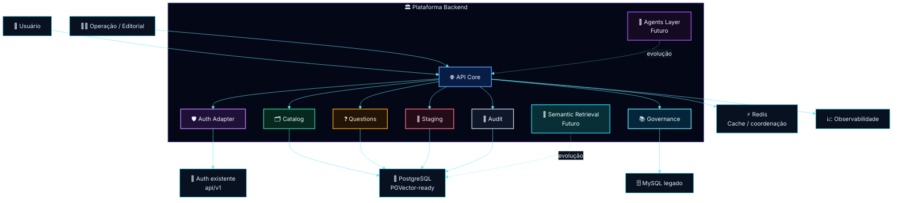
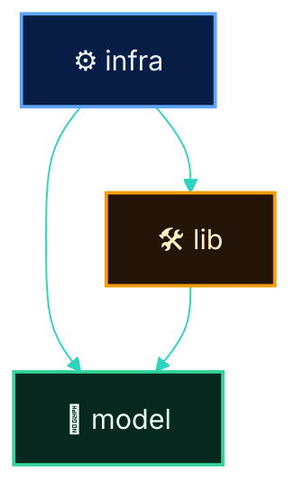
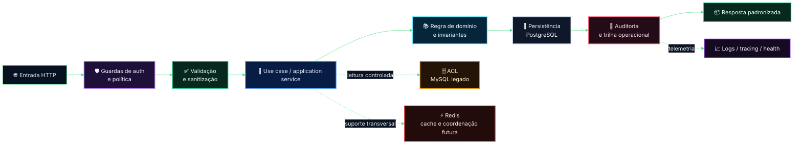
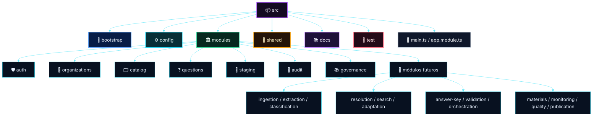
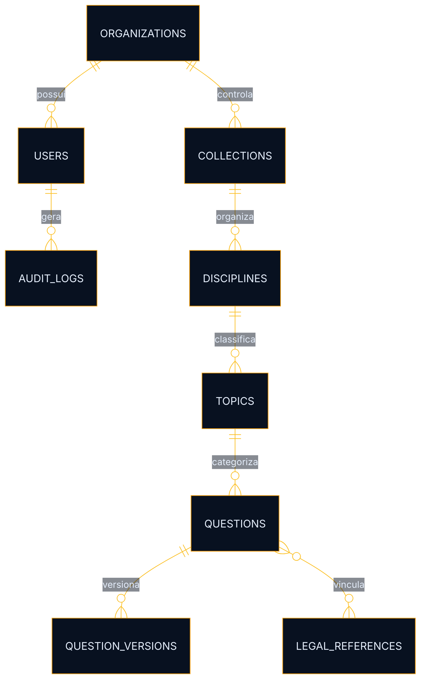

# Plataforma de Questões com IA

<div align="center">


</div>

<div align="center">

## 🏛️ Arquitetura orientada a domínio para processamento, governança, revisão e evolução incremental de questões com suporte a IA

**README técnico principal do repositório, com foco explícito na Fase 1**, etapa atualmente em andamento, preservando compatibilidade arquitetural com as fases futuras do roadmap.

</div>

---

> [!IMPORTANT]
> Este documento é o **README principal do repositório** e descreve a arquitetura da plataforma com foco no estado real do projeto.
>
> O objetivo não é apresentar o roadmap inteiro como se já estivesse implementado, e sim registrar com precisão a fundação em andamento e a direção técnica já definida para as próximas fases.

> [!NOTE]
> O texto foi organizado para funcionar simultaneamente como:
>
> - README executivo-técnico;
> - referência arquitetural do repositório;
> - guia de onboarding;
> - base para revisão técnica;
> - apoio para evolução incremental da solução.

> [!TIP]
> A leitura correta deste documento parte de uma premissa simples: **a Fase 1 está em execução; as demais fases orientam o desenho da base, mas permanecem como evolução planejada**.

---

# 📚 Sumário

- [1. Visão Geral](#1-visão-geral)
- [2. Objetivo do Documento](#2-objetivo-do-documento)
- [3. Status Atual do Projeto](#3-status-atual-do-projeto)
- [4. Diretriz Arquitetural Oficial](#4-diretriz-arquitetural-oficial)
- [5. Objetivo da Plataforma](#5-objetivo-da-plataforma)
- [6. Leitura Correta do Roadmap](#6-leitura-correta-do-roadmap)
- [7. Roadmap por Fases e Status](#7-roadmap-por-fases-e-status)
- [8. Fase 1 — Escopo em Andamento](#8-fase-1--escopo-em-andamento)
- [9. O que Não Faz Parte da Entrega Atual](#9-o-que-não-faz-parte-da-entrega-atual)
- [10. Princípios Arquiteturais](#10-princípios-arquiteturais)
- [11. Visão Arquitetural de Alto Nível](#11-visão-arquitetural-de-alto-nível)
- [12. Reuso da Autenticação da `api/v1`](#12-reuso-da-autenticação-da-apiv1)
- [13. Bounded Contexts da Solução](#13-bounded-contexts-da-solução)
- [14. Estrutura de Módulos do Monólito Modular](#14-estrutura-de-módulos-do-monólito-modular)
- [15. Regras de Dependência](#15-regras-de-dependência)
- [16. Fluxo Operacional Atual da Fase 1](#16-fluxo-operacional-atual-da-fase-1)
- [17. Fluxo Evolutivo do Produto](#17-fluxo-evolutivo-do-produto)
- [18. Tree View Arquitetural Proposta](#18-tree-view-arquitetural-proposta)
- [19. Modelo de Dados Conceitual da Fundação](#19-modelo-de-dados-conceitual-da-fundação)
- [20. Segurança](#20-segurança)
- [21. Observabilidade](#21-observabilidade)
- [22. Resiliência e Confiabilidade](#22-resiliência-e-confiabilidade)
- [23. Integração com Legado via ACL](#23-integração-com-legado-via-acl)
- [24. Stack Técnica](#24-stack-técnica)
- [25. Critérios de Pronto da Fase 1](#25-critérios-de-pronto-da-fase-1)
- [26. Riscos Técnicos e Trade-offs](#26-riscos-técnicos-e-trade-offs)
- [27. Conclusão](#27-conclusão)

---

# 1. Visão Geral

A **Plataforma de Questões com IA** foi concebida como uma solução de evolução incremental para suportar o ciclo de vida de ingestão, estruturação, classificação, enriquecimento, validação, rastreabilidade e operação de questões com apoio de IA.

A arquitetura foi desenhada desde o início para sustentar o roadmap completo do produto, mas a implementação atual está concentrada na **Fase 1 — Fundação Segura**, etapa que estabelece a base técnica necessária para as evoluções seguintes.

## Direção central da solução

A base atual não existe apenas para resolver o início do projeto. Ela existe para evitar reescrita estrutural quando as fases de agentes, filas, busca semântica, revisão humana e observabilidade mais madura forem incorporadas.

## Resultado esperado desta fase

Ao final da Fase 1, a plataforma deve possuir uma fundação consistente em:

- arquitetura modular por domínio;
- autenticação integrada ao ecossistema existente;
- persistência principal preparada para evolução;
- integração controlada com legado;
- base de cache e coordenação;
- validação, segurança e rastreabilidade mínimas;
- contratos internos estáveis;
- organização compatível com crescimento incremental.

> [!IMPORTANT]
> A Fase 1 não é um protótipo descartável. Ela representa a base permanente sobre a qual o produto continuará evoluindo.

---

# 2. Objetivo do Documento

Este documento descreve, de forma técnica e organizada, a arquitetura aprovada para a plataforma, com foco prioritário na **Fase 1**, que é a etapa em andamento.

## Este documento existe para

- registrar a decisão arquitetural oficial;
- deixar explícito o escopo real da fase atual;
- separar corretamente o que está em andamento do que pertence às fases futuras;
- orientar implementação, revisão técnica, onboarding e evolução do projeto;
- servir como referência estável para discussões de arquitetura e execução.

## Este documento não pretende

- comunicar que o roadmap inteiro já está implementado;
- misturar backlog futuro com entrega atual;
- tratar componentes planejados como já operacionais em produção.

> [!NOTE]
> Como README principal, este documento precisa ser útil tanto para quem chega ao repositório pela primeira vez quanto para quem já está implementando partes da solução.

---

# 3. Status Atual do Projeto

## 🟢 Situação atual

O projeto está em **Fase 1 — Fundação Segura**, com foco na estrutura arquitetural e operacional mínima necessária para sustentar as próximas fases.

## O que está em andamento agora

- bootstrap da aplicação NestJS;
- definição dos módulos fundacionais;
- integração com PostgreSQL e preparação para PGVector;
- conexão controlada com MySQL legado;
- base Redis para cache e futura coordenação assíncrona;
- adaptação da autenticação existente da `api/v1`;
- criação dos contratos internos e padrões transversais;
- estrutura inicial de segurança, auditoria e observabilidade.

## O que ainda não está no escopo da fase atual

- pipeline multiagente operacional;
- orquestração avançada com agentes;
- interface administrativa madura;
- busca semântica em produção;
- processamento assíncrono completo com operação estável;
- hardening final de produção.

> [!IMPORTANT]
> Sempre que houver dúvida sobre o estágio do projeto, a leitura correta é: **fundação em andamento, evolução futura planejada**.

---

# 4. Diretriz Arquitetural Oficial

## ✅ Arquitetura aprovada

A solução adota um **Monólito Modular Pragmático por Domínio**, implementado com **NestJS + TypeScript**, com organização interna disciplinada e preparada para evolução incremental.

## Composição arquitetural principal

- **Backend:** NestJS + TypeScript
- **Persistência principal:** PostgreSQL
- **Compatibilidade vetorial futura:** PGVector
- **Integração legada:** MySQL via ACL
- **Cache e coordenação:** Redis
- **Filas e jobs futuros:** BullMQ
- **Auth:** reaproveitamento da `api/v1`
- **Observabilidade:** logs, tracing e métricas progressivas

## Motivos da decisão

Essa abordagem equilibra:

- simplicidade operacional;
- baixo custo cognitivo;
- boa separação de responsabilidades;
- facilidade de manutenção;
- centralização observável do runtime;
- evolução segura sem fragmentação prematura.

## O que foi evitado conscientemente

### ❌ Microsserviços prematuros
Evita aumento de:

- overhead operacional;
- acoplamento distribuído;
- custo de tracing e troubleshooting;
- necessidade precoce de contratos de rede complexos.

### ❌ Core excessivamente abstrato
Evita:

- boilerplate desnecessário;
- desaceleração do desenvolvimento;
- complexidade arquitetural desproporcional ao estágio atual.

### ❌ Nova pilha de autenticação paralela
Evita:

- divergência de identidade;
- regras duplicadas;
- inconsistência de autorização;
- drift entre sistemas.

> [!TIP]
> O monólito modular foi escolhido não como atalho, mas como a melhor estratégia para crescer com disciplina sem antecipar a complexidade de uma arquitetura distribuída.

---

# 5. Objetivo da Plataforma

A plataforma existe para transformar insumos brutos em questões processadas, rastreáveis, classificadas, enriquecidas e operacionalmente utilizáveis, preservando governança, segurança e compatibilidade futura com IA e materiais-base.

## Objetivos estruturais

- centralizar processamento de questões;
- organizar classificação e metadados;
- sustentar revisão humana e trilha operacional;
- preparar o pipeline para automação incremental;
- permitir expansão futura para materiais didáticos e busca semântica.

## Objetivos arquiteturais

- crescer por fases sem reescrita da base;
- manter baixo acoplamento entre domínio novo e legado;
- garantir segurança por padrão;
- suportar operação síncrona agora e assíncrona depois;
- preservar auditabilidade das operações.

---

# 6. Leitura Correta do Roadmap

O roadmap deve ser interpretado em dois níveis complementares.

## Nível 1 — Implementação atual

A implementação real está centrada na construção da fundação correta do sistema.

## Nível 2 — Arquitetura alvo já definida

Mesmo sem todas as fases implementadas, a base atual já precisa nascer compatível com:

- agentes;
- filas;
- jobs;
- processamento assíncrono;
- revisão humana;
- indexação vetorial;
- busca semântica;
- observabilidade operacional madura.

## Interpretação correta

A Fase 1 não representa um experimento provisório. Ela representa a base estrutural do produto.

> [!TIP]
> O roadmap não deve ser lido como lista de funcionalidades já entregues, e sim como orientação explícita para as decisões de arquitetura tomadas agora.

---

# 7. Roadmap por Fases e Status

## Visão consolidada

| Fase | Nome | Status | Objetivo central |
|---|---|---|---|
| 1 | Fundação Segura | 🟢 Em andamento | Estruturar base técnica, integrações, segurança e modularidade |
| 2 | Agentes Básicos | 🟡 Em planejamento | Introduzir extração, classificação, resolução e busca |
| 3 | Agentes Avançados | 🟡 Em planejamento | Adicionar adaptação, gabarito, validação e orquestração |
| 4 | API e Processamento Assíncrono | 🟡 Em planejamento | Expor pipeline e operar com jobs e filas |
| 4B | Front-end Admin | 🟡 Em planejamento | Oferecer superfície humana de operação |
| Pré-MVP | CI/CD e Testes | 🟡 Em planejamento | Garantir lançabilidade mínima |
| MVP | Processamento de Questões | 🟡 Em planejamento | Entregar primeira versão operacional utilizável |
| 5 | Materiais Didáticos | 🟡 Em planejamento | Ingestão, chunking e indexação vetorial |
| 6 | Monitoramento | 🟡 Em planejamento | Consolidar métricas, dashboards e tracing |
| 7 | Qualidade Final | 🟡 Em planejamento | Hardening, otimização e testes completos |
| Produção | Versão Completa | 🟡 Em planejamento | Operação plena e sustentável em escala |

## Fluxograma executivo do roadmap


> [!NOTE]
> O roadmap aparece no README para orientar a evolução da base, não para inflar artificialmente a percepção de entrega atual.

---

# 8. Fase 1 — Escopo em Andamento

> [!IMPORTANT]
> Esta é a única fase atualmente em execução. Todas as demais fases do roadmap devem ser interpretadas como **em planejamento**, servindo como direção arquitetural e não como entrega ativa.

## 🎯 Objetivo da fase

Estabelecer a fundação técnica e arquitetural que sustentará o produto ao longo das próximas fases.

## Escopo funcional da fase atual

### 8.1 Bootstrap da aplicação

- setup de **NestJS + TypeScript**;
- estrutura inicial de módulos;
- configuração de ambiente e inicialização segura;
- padronização de bootstrap transversal.

### 8.2 Persistência principal

- **PostgreSQL** como banco principal;
- preparação de **PGVector** para compatibilidade futura;
- base de entidades, migrações e versionamento de schema.

### 8.3 Integração com legado

- conexão com **MySQL**;
- leitura e interoperabilidade controlada;
- isolamento por **ACL**;
- proibição de vazamento semântico do legado para o domínio novo.

### 8.4 Cache e coordenação

- **Redis** como infraestrutura de apoio;
- suporte a cache inicial;
- base compatível com expansão futura para filas, jobs e workers.

### 8.5 Segurança estrutural

- autenticação integrada à `api/v1`;
- autorização por escopo e política;
- validação forte de payload;
- sanitização e padronização de respostas de erro;
- trilha inicial de auditoria.

### 8.6 Observabilidade inicial

- logs estruturados;
- correlation id;
- health checks;
- tracing básico e pontos de extensibilidade.

### 8.7 Contratos internos da plataforma

- DTOs e schemas consistentes;
- padrões de erro;
- convenções para módulos e serviços;
- bordas preparadas para expansão assíncrona.

## Resultado esperado da Fase 1

A plataforma ainda não precisa entregar o pipeline completo do produto, mas precisa entregar uma base capaz de recebê-lo sem ruptura estrutural.

---

# 9. O que Não Faz Parte da Entrega Atual

Os itens abaixo pertencem ao roadmap global, porém **não devem ser comunicados como implementados na fase atual**.

## Fora do escopo atual

- agentes operacionais completos;
- orquestração multiagente madura;
- upload e processamento editorial completos;
- painel administrativo completo;
- chunking inteligente em produção;
- indexação vetorial ativa em produção;
- busca semântica completa;
- observabilidade operacional madura;
- jobs produtivos com DLQ e reprocessamento consolidados;
- hardening final de performance e confiabilidade.

## Importante

A arquitetura já considera esses elementos, mas a implementação atual permanece focada na base fundacional.

> [!TIP]
> Ser explícito sobre o que ainda não foi entregue melhora alinhamento técnico, reduz ruído entre times e preserva credibilidade arquitetural.

---

# 10. Princípios Arquiteturais

## 10.1 Domínio primeiro
O desenho da solução parte do domínio do produto, não da ferramenta.

## 10.2 Segurança por padrão
Toda entrada, integração e operação é tratada como potencialmente insegura até validação explícita.

## 10.3 Modularidade por responsabilidade
Cada módulo possui fronteira clara, objetivo específico e baixo acoplamento.

## 10.4 Crescimento incremental
A arquitetura deve permitir evolução por fases sem exigir refatoração estrutural ampla.

## 10.5 Legado isolado
O legado é acessado por ACL, nunca absorvido diretamente no core canônico.

## 10.6 Observabilidade desde a base
Mesmo a fase fundacional precisa nascer rastreável.

## 10.7 Preparação para assincronia
Ainda que a fase atual seja majoritariamente fundacional, a arquitetura já deve suportar futuros jobs, filas e workers.

## 10.8 Shared com disciplina
`shared/` deve conter somente elementos transversais genuínos.

> [!NOTE]
> Esses princípios não são apenas preferências de organização. Eles funcionam como restrições práticas para evitar acoplamento, vazamento semântico do legado e crescimento desordenado do monólito.

---

# 11. Visão Arquitetural de Alto Nível



## Leitura técnica

A arquitetura já separa, desde a fundação:

- borda HTTP;
- autenticação e autorização;
- domínio principal;
- auditoria;
- staging para revisão futura;
- governança e conhecimento canônico;
- integração controlada com legado;
- pontos explícitos de evolução para agentes e recuperação semântica.

## Complementos importantes de leitura

- `API Core` representa a borda principal síncrona da solução na fase atual;
- `Auth Adapter` é uma camada de compatibilização, não um novo provedor de identidade;
- `Governance` concentra regras e referências canônicas que sustentam classificação, vínculo e rastreabilidade;
- `Staging` prepara revisão humana e estados intermediários sem poluir o core de questões;
- `Agents Layer` e `Semantic Retrieval` aparecem no diagrama para explicitar compatibilidade evolutiva, e não entrega atual.

> [!TIP]
> O valor desse diagrama está em mostrar claramente o que já faz parte da base e o que já foi reservado como ponto de expansão futura.

---

# 12. Reuso da Autenticação da `api/v1`

A nova plataforma não deve criar um novo mecanismo de autenticação concorrente.

## Estratégia adotada

- reaproveitar identidade já existente;
- adaptar token, contexto e claims ao novo domínio;
- validar permissões por camada de adaptação;
- manter consistência com o ecossistema atual.

## Benefícios

- reduz duplicação de regras;
- evita drift de identidade;
- simplifica governança de acesso;
- reduz custo de integração e operação.

## Fluxo arquitetural de autenticação


> [!IMPORTANT]
> O reuso da autenticação existente evita a criação de dois centros de verdade para identidade e autorização administrativa.

---

# 13. Bounded Contexts da Solução

## Contextos fundacionais

### `auth`
Responsável por adaptação de identidade, contexto autenticado e autorização.

### `organizations`
Responsável pela noção de organização, escopo e pertencimento.

### `catalog`
Responsável por taxonomias, metadados, disciplinas, tópicos e referências estruturais.

### `questions`
Responsável pelo núcleo de questões, versões e estados canônicos.

### `staging`
Responsável por buffers de entrada, revisão e estados intermediários.

### `audit`
Responsável por trilhas de auditoria, rastreabilidade e eventos de operação.

### `governance`
Responsável por regras canônicas, bases de referência e integração com conhecimento estruturante.

## Contextos previstos para evolução

- `ingestion`
- `extraction`
- `classification`
- `resolution`
- `search`
- `adaptation`
- `answer-key`
- `validation`
- `orchestration`
- `materials`
- `monitoring`
- `quality`
- `publication`

> [!NOTE]
> Os bounded contexts futuros já aparecem aqui para orientar o desenho da base, mas não devem ser confundidos com módulos plenamente implementados na fase atual.

---

# 14. Estrutura de Módulos do Monólito Modular

Cada módulo deve seguir uma organização interna simples, previsível e disciplinada.

```text
modules/<modulo>/
├── infra/
├── model/
└── lib/
```

## `model/`

Contém elementos de contrato e modelagem, como:

- DTOs;
- enums;
- interfaces;
- schemas;
- tipos;
- regras declarativas de validação.

## `infra/`

Contém elementos de execução e integração, como:

- controllers;
- services;
- repositories;
- gateways;
- clients;
- processors;
- adapters.

## `lib/`

Contém elementos utilitários e internos do módulo, como:

- parsers;
- helpers;
- mappers;
- normalizers;
- factories.

> [!TIP]
> Essa convenção reduz ambiguidade estrutural e facilita tanto a implementação quanto a leitura do código por novos membros do time.

---

# 15. Regras de Dependência

## Regras permitidas

- `infra` pode depender de `model`;
- `infra` pode depender de `lib`;
- `lib` pode depender de `model`.

## Regras proibidas

- `model` não pode depender de `infra`;
- `lib` não deve acessar integrações externas diretamente;
- `shared` não pode virar depósito genérico;
- o domínio novo não pode herdar semântica do legado.

## Diagrama de dependência permitida



> [!IMPORTANT]
> Essas regras existem para preservar previsibilidade estrutural. Quando elas são quebradas cedo, o monólito modular começa a se comportar como um bloco acoplado.

---

# 16. Fluxo Operacional Atual da Fase 1

Este é o fluxo operacional que representa a lógica da fundação atual da plataforma.



## Leitura da fase atual

Mesmo sem o pipeline completo, a Fase 1 já precisa garantir:

- entrada segura;
- regras de autorização claras;
- payloads validados;
- domínio coeso;
- persistência consistente;
- auditoria mínima;
- previsibilidade de resposta;
- integração legada sem contaminação semântica;
- observabilidade básica desde a borda até a persistência.

## O que este fluxo evidencia

- o caminho principal atual é síncrono e controlado;
- Redis aparece como capacidade fundacional e não como operação assíncrona madura;
- o acesso ao legado ocorre por ACL e nunca diretamente pelo domínio canônico;
- auditoria e telemetria não são apêndices, e sim partes do fluxo mínimo confiável.

---

# 17. Fluxo Evolutivo do Produto

O fluxo abaixo mostra a progressão arquitetural completa da solução, mantendo explícito que se trata de evolução futura sobre a base atual.

```mermaid
%%{init: {'theme':'base','themeVariables': {
  'background':'#020617',
  'primaryColor':'#081120',
  'primaryTextColor':'#e5eefb',
  'primaryBorderColor':'#f59e0b',
  'lineColor':'#fbbf24',
  'secondaryColor':'#0b1220',
  'secondaryTextColor':'#e5eefb',
  'tertiaryColor':'#111827',
  'tertiaryTextColor':'#e5eefb',
  'clusterBkg':'#040816',
  'clusterBorder':'#8b5cf6',
  'fontFamily':'Inter, Segoe UI, Arial'
}}}%%
flowchart TD
    START["🧱 Fundação<br/>Fase 1<br/>Em andamento"] --> A["🤖 Fase 2<br/>Extração e classificação<br/>Em planejamento"]
    A --> B["🧭 Fase 2<br/>Resolução e busca<br/>Em planejamento"]
    B --> C["🧠 Fase 3<br/>Adaptação<br/>Em planejamento"]
    C --> D["📝 Fase 3<br/>Gabarito e justificativa<br/>Em planejamento"]
    D --> E["🧪 Fase 3<br/>Validação<br/>Em planejamento"]
    E --> F["🎛️ Fase 3<br/>Orquestração<br/>Em planejamento"]
    F --> G["📡 Fase 4<br/>API + filas + jobs<br/>Em planejamento"]
    G --> H["🖥️ Fase 4B<br/>Operação humana<br/>Em planejamento"]
    H --> I["🎯 MVP<br/>Processamento de questões<br/>Em planejamento"]
    I --> J["📚 Fase 5<br/>Materiais didáticos e vetores<br/>Em planejamento"]
    J --> K["📈 Fase 6<br/>Monitoramento maduro<br/>Em planejamento"]
    K --> L["🛡️ Fase 7<br/>Hardening final<br/>Em planejamento"]
    L --> M["🏁 Produção<br/>Versão completa<br/>Em planejamento"]

    style START fill:#06281f,stroke:#34d399,stroke-width:2px,color:#ecfdf5
    style A fill:#081d46,stroke:#60a5fa,stroke-width:2px,color:#eff6ff
    style B fill:#05263a,stroke:#67e8f9,stroke-width:2px,color:#ecfeff
    style C fill:#140b22,stroke:#a855f7,stroke-width:2px,color:#f5f3ff
    style D fill:#241408,stroke:#f59e0b,stroke-width:2px,color:#fef3c7
    style E fill:#240b18,stroke:#fb7185,stroke-width:2px,color:#ffe4e6
    style F fill:#0f172a,stroke:#cbd5e1,stroke-width:2px,color:#f8fafc
    style G fill:#082f36,stroke:#22d3ee,stroke-width:2px,color:#ecfeff
    style H fill:#111827,stroke:#94a3b8,stroke-width:2px,color:#f8fafc
    style I fill:#07351f,stroke:#4ade80,stroke-width:2px,color:#f0fdf4
    style J fill:#0d1b3a,stroke:#93c5fd,stroke-width:2px,color:#eff6ff
    style K fill:#1e1038,stroke:#c084fc,stroke-width:2px,color:#f5f3ff
    style L fill:#072014,stroke:#86efac,stroke-width:2px,color:#f0fdf4
    style M fill:#0f172a,stroke:#cbd5e1,stroke-width:2px,color:#f8fafc
```



## Observação de leitura

Este fluxo descreve a direção arquitetural do produto e não deve ser interpretado como descrição da entrega atual.

> [!NOTE]
> A presença das fases futuras no README existe para orientar decisões estruturais presentes, e não para sugerir maturidade operacional inexistente.

---

# 18. Tree View Arquitetural Proposta

## Tree view textual

```text
src/
├── main.ts
├── app.module.ts
│
├── bootstrap/
│   ├── app.bootstrap.ts
│   ├── config.bootstrap.ts
│   ├── logger.bootstrap.ts
│   ├── validation.bootstrap.ts
│   ├── exception-filters.bootstrap.ts
│   ├── metrics.bootstrap.ts
│   ├── tracing.bootstrap.ts
│   ├── queues.bootstrap.ts
│   ├── swagger.bootstrap.ts
│   └── shutdown.bootstrap.ts
│
├── config/
│   ├── app.config.ts
│   ├── auth.config.ts
│   ├── db.config.ts
│   ├── redis.config.ts
│   ├── queue.config.ts
│   ├── storage.config.ts
│   ├── llm.config.ts
│   ├── vector.config.ts
│   ├── observability.config.ts
│   ├── security.config.ts
│   └── feature-flags.config.ts
│
├── modules/
│   ├── auth/
│   │   ├── infra/
│   │   ├── model/
│   │   └── lib/
│   ├── organizations/
│   │   ├── infra/
│   │   ├── model/
│   │   └── lib/
│   ├── catalog/
│   │   ├── infra/
│   │   ├── model/
│   │   └── lib/
│   ├── questions/
│   │   ├── infra/
│   │   ├── model/
│   │   └── lib/
│   ├── staging/
│   │   ├── infra/
│   │   ├── model/
│   │   └── lib/
│   ├── audit/
│   │   ├── infra/
│   │   ├── model/
│   │   └── lib/
│   ├── governance/
│   │   ├── infra/
│   │   ├── model/
│   │   └── lib/
│   ├── ingestion/
│   ├── extraction/
│   ├── classification/
│   ├── resolution/
│   ├── search/
│   ├── adaptation/
│   ├── answer-key/
│   ├── validation/
│   ├── orchestration/
│   ├── materials/
│   ├── monitoring/
│   ├── quality/
│   └── publication/
│
├── shared/
│   ├── infra/
│   ├── model/
│   └── lib/
│
├── docs/
│   ├── architecture/
│   ├── adr/
│   ├── contracts/
│   └── runbooks/
│
└── test/
    ├── unit/
    ├── integration/
    ├── contract/
    ├── e2e/
    └── load/
```

## Tree view visual



## Observação arquitetural

Nem todos os módulos acima precisam estar implementados agora. Parte deles já deve existir como direção estrutural do monólito modular, preservando consistência para as fases seguintes.

> [!TIP]
> A tree view do README deve comunicar intenção arquitetural, e não apenas listar diretórios. Ela ajuda a deixar claro o que já é fundação e o que já foi reservado como espaço de evolução.

---

# 19. Modelo de Dados Conceitual da Fundação

## Entidades centrais esperadas

- `users`
- `roles`
- `permissions`
- `organizations`
- `collections`
- `disciplines`
- `topics`
- `legal_references`
- `questions`
- `question_versions`
- `audit_logs`

## Diagrama conceitual



## Leitura de modelagem

A Fase 1 não precisa esgotar toda a modelagem final, mas precisa estabelecer o núcleo canônico sobre o qual versionamento, classificação e auditoria irão evoluir.

> [!NOTE]
> O valor deste modelo conceitual está menos em representar cada detalhe da persistência agora e mais em deixar claro quais entidades sustentam a semântica central do produto.

---

# 20. Segurança

## Controles mínimos da fundação

- autenticação obrigatória nas rotas protegidas;
- autorização por escopo, papel e política;
- validação forte de entrada;
- sanitização de payload e normalização de contratos;
- segregação segura de credenciais;
- tratamento controlado de exceções;
- auditoria mínima de operações sensíveis.

## Regras obrigatórias

1. Nenhuma rota sensível sem autenticação.
2. Nenhuma operação crítica sem autorização explícita.
3. Nenhum payload entra no domínio sem validação.
4. Nenhum erro técnico sensível deve vazar em produção.
5. Nenhuma integração com legado pode bypassar a ACL.
6. Nenhuma credencial deve estar acoplada ao código da aplicação.

## Segurança por camadas

### Camada de entrada
- guards;
- pipes de validação;
- serialização controlada;
- rate limiting quando aplicável.

### Camada de domínio/aplicação
- verificação de escopo;
- invariantes de uso;
- proibição de operações não autorizadas.

### Camada de infraestrutura
- acesso a banco e integrações com credenciais segregadas;
- observabilidade de falhas;
- timeouts e comportamento defensivo.

> [!IMPORTANT]
> Segurança aqui não é um item complementar. Ela faz parte da definição de pronto da fundação.

---

# 21. Observabilidade

A observabilidade deve amadurecer junto com o produto, mas a base precisa nascer instrumentável.

## Na Fase 1

- logs estruturados;
- correlation id;
- health checks;
- tracing básico;
- pontos de integração para métricas.

## No MVP

- status de jobs;
- visibilidade por etapa do pipeline;
- falhas por componente;
- rastreabilidade por requisição e execução.

## Na produção completa

- dashboards operacionais;
- métricas de throughput;
- métricas de falha;
- observabilidade por agente;
- visibilidade de degradação e fila.

> [!TIP]
> Instrumentar desde a base reduz custo de diagnóstico no futuro e evita que observabilidade vire um esforço tardio e caro.

---

# 22. Resiliência e Confiabilidade

A fundação precisa ser compatível com operação robusta futura.

## Fundamentos esperados agora

- tratamento consistente de erro;
- contratos estáveis;
- separação clara de responsabilidade;
- comportamento previsível em falhas;
- preparação para retries e jobs.

## Evolução prevista

- retries controlados por etapa;
- DLQ;
- reprocessamento;
- idempotência em jobs críticos;
- visibilidade de degradação operacional.

> [!NOTE]
> Mesmo que a operação assíncrona ainda não esteja madura, a base precisa nascer sem bloquear essa evolução.

---

# 23. Integração com Legado via ACL

A base legada não deve contaminar o modelo canônico do novo domínio.

## Regra obrigatória

Toda interação com o legado deve ocorrer por uma **ACL — Anti-Corruption Layer**.

## Objetivos da ACL

- traduzir contratos do legado;
- isolar semântica externa;
- evitar acoplamento estrutural;
- proteger o domínio novo contra regras implícitas e inconsistentes.

## Fluxo conceitual


> [!IMPORTANT]
> A ACL não é apenas uma camada técnica de acesso. Ela é uma proteção semântica do domínio novo contra o legado.

---

# 24. Stack Técnica

## Backend

- **NestJS**
- **TypeScript**

## Persistência

- **PostgreSQL**
- **PGVector**

## Integração

- **MySQL**

## Cache e coordenação

- **Redis**
- **BullMQ**

## Observabilidade

- **Pino**
- **OpenTelemetry**

## Infraestrutura de execução

- **Docker**
- **Docker Compose**

---

# 25. Critérios de Pronto da Fase 1

A Fase 1 pode ser considerada consistente quando atender, no mínimo, aos pontos abaixo.

## Estrutura e bootstrap

- aplicação inicializa de forma previsível;
- configuração de ambiente estável;
- bootstrap transversal definido.

## Persistência e integração

- PostgreSQL operacional;
- PGVector preparado;
- MySQL legado acessado de forma controlada;
- Redis funcional.

## Segurança

- autenticação integrada;
- autorização mínima funcional;
- validação e sanitização implementadas;
- exceções tratadas sem vazamento indevido.

## Arquitetura

- módulos fundacionais definidos;
- regras de dependência respeitadas;
- contratos internos padronizados;
- ACL estabelecida para o legado.

## Operação

- logs estruturados mínimos;
- health checks básicos;
- auditoria inicial disponível.

## Documentação

- arquitetura descrita de forma coerente com a fase atual;
- separação explícita entre fundação atual e evolução futura.

> [!TIP]
> O critério de pronto da Fase 1 não é “ter tudo funcionando”, e sim “ter a base correta pronta para crescer sem ruptura”.

---

# 26. Riscos Técnicos e Trade-offs

## 26.1 Acoplamento com legado

**Risco:** o novo domínio absorver regras implícitas da base existente.

**Mitigação:** ACL, contratos explícitos e adapters dedicados.

## 26.2 Crescimento desordenado do monólito

**Risco:** módulos perderem fronteira e o projeto virar um bloco acoplado.

**Mitigação:** modularização por domínio, regras de dependência e revisão disciplinada.

## 26.3 Complexidade prematura

**Risco:** excesso de abstração e engenharia adiantada travarem a execução.

**Mitigação:** pragmatismo arquitetural com evolução por fase.

## 26.4 Duplicação de identidade e autorização

**Risco:** surgirem dois centros de verdade para autenticação.

**Mitigação:** reuso da `api/v1` com camada de adaptação.

## 26.5 Reescrita estrutural nas próximas fases

**Risco:** a base atual não suportar filas, agentes e busca semântica.

**Mitigação:** preparar desde agora boundaries, contratos, persistência e runtime para a evolução prevista.

> [!NOTE]
> Os trade-offs aqui são conscientes: a arquitetura busca equilíbrio entre disciplina suficiente para crescer e pragmatismo suficiente para não travar a entrega fundacional.

---

# 27. Conclusão

A arquitetura desta plataforma foi definida para viabilizar crescimento seguro, incremental e sustentável, sem sacrificar clareza técnica nem introduzir complexidade prematura.

O ponto central deste README é simples e objetivo:

> **o projeto está na Fase 1, e a documentação precisa refletir isso com precisão.**

A fase atual é a construção da base correta do produto. É nessa etapa que se definem:

- os limites dos módulos;
- a disciplina de dependências;
- a estratégia de integração com legado;
- a reutilização da autenticação existente;
- a preparação para filas, agentes e busca semântica;
- a segurança por padrão;
- a observabilidade mínima necessária.

As demais fases permanecem **em planejamento**, compondo o roadmap de evolução da solução e orientando as decisões arquiteturais da fundação atual.

Quando essa fundação estiver consistente, as etapas seguintes poderão evoluir sobre uma base previsível, auditável e tecnicamente sustentável.

<div align="center">

## 🚀 Fundação correta agora para evolução segura depois

</div>
