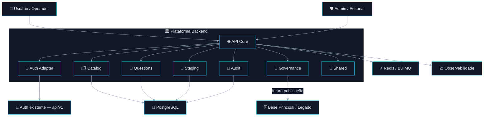
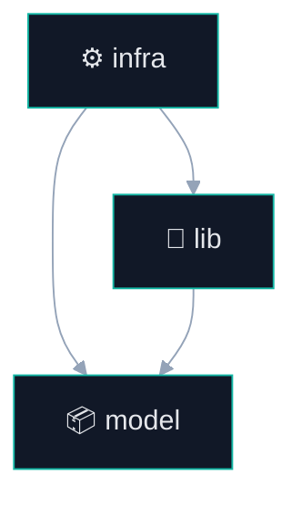
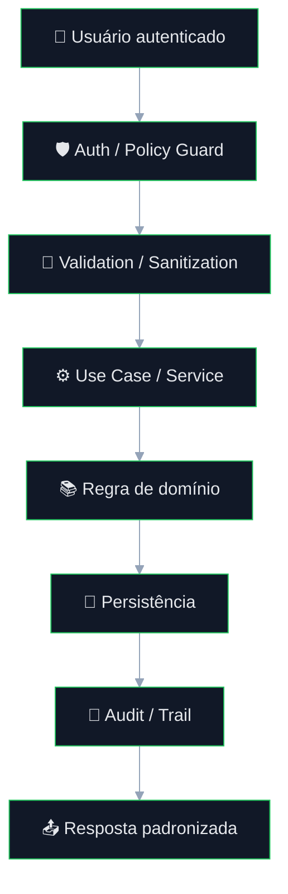
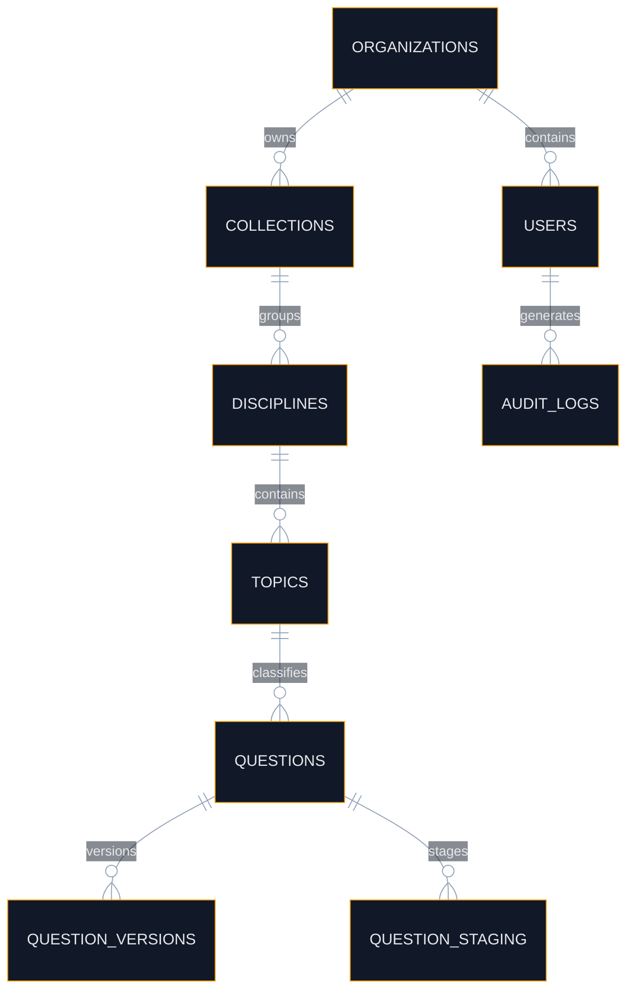

# Plataforma de Questões com IA

<div align="center">


</div>

<br />

<div align="center">

## 🏛️ Arquitetura orientada a domínio para geração, governança, staging, revisão futura e publicação controlada de questões

Projeto estruturado para crescimento incremental com foco em **segurança**, **modularidade**, **rastreamento operacional**, **baixo acoplamento** e **evolução arquitetural sustentável**.

</div>

---

# 📚 Sumário

- [1. Visão Executiva](#1-visão-executiva)
- [2. Status Atual do Projeto](#2-status-atual-do-projeto)
- [3. Decisão Arquitetural Oficial](#3-decisão-arquitetural-oficial)
- [4. Objetivo da Plataforma](#4-objetivo-da-plataforma)
- [5. Escopo Real da Fase 1](#5-escopo-real-da-fase-1)
- [6. O que ainda não pertence à Fase 1](#6-o-que-ainda-não-pertence-à-fase-1)
- [7. Princípios Arquiteturais](#7-princípios-arquiteturais)
- [8. Visão Arquitetural de Alto Nível](#8-visão-arquitetural-de-alto-nível)
- [9. Reaproveitamento da Autenticação da `api/v1`](#9-reaproveitamento-da-autenticação-da-apiv1)
- [10. Estrutura Arquitetural por Módulo](#10-estrutura-arquitetural-por-módulo)
- [11. Regras de Dependência Obrigatórias](#11-regras-de-dependência-obrigatórias)
- [12. Bounded Contexts da Plataforma](#12-bounded-contexts-da-plataforma)
- [13. Fluxo Operacional da Fase 1](#13-fluxo-operacional-da-fase-1)
- [14. Tree View Arquitetural Proposta](#14-tree-view-arquitetural-proposta)
- [15. Modelo de Dados Conceitual da Fase 1](#15-modelo-de-dados-conceitual-da-fase-1)
- [16. Segurança](#16-segurança)
- [17. Observabilidade](#17-observabilidade)
- [18. Resiliência e Confiabilidade](#18-resiliência-e-confiabilidade)
- [19. ACL e Isolamento do Legado](#19-acl-e-isolamento-do-legado)
- [20. Pipeline Futuro e Compatibilidade Evolutiva](#20-pipeline-futuro-e-compatibilidade-evolutiva)
- [21. Roadmap Incremental](#21-roadmap-incremental)
- [22. Critérios de Pronto da Fase 1](#22-critérios-de-pronto-da-fase-1)
- [23. Stack Técnica](#23-stack-técnica)
- [24. Conclusão](#24-conclusão)

---

# 1. Visão Executiva

A **Plataforma de Questões com IA** foi concebida como uma base arquitetural robusta para suportar, com segurança e governança, o ciclo de vida de produção de questões estruturadas.

A solução foi desenhada para evoluir até um pipeline completo envolvendo:

- ingestão documental;
- parsing e estruturação de conteúdo;
- classificação e resolução taxonômica;
- recuperação contextual e normativa;
- transformação assistida por IA;
- revisão humana;
- publicação controlada;
- rastreabilidade ponta a ponta.

Entretanto, **o projeto ainda não está nessa etapa**.

A implementação atual concentra-se exclusivamente na **Fase 1 — Fundação Segura**, cuja responsabilidade é estabelecer a **base técnica correta** sobre a qual as próximas capacidades poderão ser adicionadas **sem reescrita estrutural**, **sem contaminação do domínio** e **sem acoplamento prematuro com complexidade desnecessária**.

### 🎯 Premissa central da arquitetura

> **Automação de IA não deve operar diretamente sobre o núcleo editorial e operacional sem um domínio seguro, rastreável, versionável, auditável e modularizado.**

Essa decisão protege a plataforma contra:

- crescimento desordenado;
- acoplamento com fornecedores ou providers;
- contaminação do modelo interno pelo legado;
- complexidade operacional prematura;
- dificuldade de manutenção e evolução.

---

# 2. Status Atual do Projeto

<div align="center">

## 🟢 O projeto encontra-se oficialmente na **FASE 1 — Fundação Segura**

</div>

## O que isso significa

A arquitetura global já está decidida, mas a implementação atual cobre apenas o que é **estruturalmente necessário e tecnicamente correto** para sustentar a evolução futura.

A Fase 1 não representa uma versão improvisada ou reduzida da plataforma.  
Ela representa o **núcleo fundacional**, responsável por consolidar:

- identidade e acesso;
- boundaries arquiteturais;
- governança do domínio;
- persistência operacional inicial;
- staging controlado;
- auditabilidade;
- observabilidade mínima;
- disciplina de evolução.

## Estado técnico correto da solução neste momento

### ✅ Já faz parte da implementação-alvo da Fase 1
- autenticação integrada ao fluxo existente;
- autorização por escopo, papel e política;
- estrutura modular por domínio;
- base de catálogo e classificação;
- CRUD governado de questões;
- staging editorial;
- persistência operacional;
- logs e trilha mínima de rastreamento.

### 🟡 Já faz parte da arquitetura decidida, mas não da entrega atual
- pipeline assíncrono completo por jobs e steps;
- ingestão documental expandida;
- retrieval semântico;
- transformação avançada assistida por IA;
- revisão humana completa;
- publicação automatizada avançada;
- scoring, retries avançados e governança operacional completa.

Essa separação é **intencional** e **arquiteturalmente correta**.

---

# 3. Decisão Arquitetural Oficial

A direção aprovada para a plataforma é:

## ✅ **Monólito Modular Pragmático por Domínio**

com:

- **NestJS + TypeScript** como stack principal;
- organização por **módulos de domínio**;
- estrutura interna por módulo em:
  - `infra/`
  - `model/`
  - `lib/`
- uso disciplinado de `shared/`;
- reaproveitamento da autenticação já existente da `api/v1`;
- **sem OCR no fluxo base**;
- adoção seletiva de conceitos de **Clean Architecture** e **Hexagonal Architecture**, **sem dogmatismo**.

## Por que essa foi a decisão correta

Essa arquitetura oferece o melhor equilíbrio entre:

- robustez estrutural;
- simplicidade operacional;
- clareza de ownership;
- facilidade de navegação da base;
- baixo acoplamento entre responsabilidades;
- evolução incremental com segurança.

## O que foi conscientemente evitado

### ❌ Microsserviços prematuros
Porque aumentariam:
- custo operacional;
- overhead de tracing;
- complexidade de contratos;
- dificuldade de troubleshooting;
- dispersão de ownership.

### ❌ Clean Architecture rígida desde o início
Porque adicionaria:
- abstrações excessivas;
- boilerplate prematuro;
- custo cognitivo desnecessário;
- formalismo acima da necessidade atual do projeto.

### ❌ OCR como etapa base
Porque o cenário atual já trabalha com **documentos com texto extraível**, tornando o OCR uma complexidade injustificada no caminho crítico.

---

# 4. Objetivo da Plataforma

A plataforma existe para suportar, com segurança e governança, o ciclo de vida de produção de questões e seus metadados, preservando qualidade estrutural, controle editorial e compatibilidade futura com automação assistida por IA.

## Objetivos de negócio

- centralizar questões e seus metadados;
- organizar conteúdo por coleções, disciplinas, temas e tópicos;
- suportar staging antes de publicação;
- preservar autoria, revisão, histórico e rastreabilidade;
- preparar a base para automação assistida.

## Objetivos técnicos

- manter **baixo acoplamento** entre domínio e infraestrutura;
- garantir **segurança por padrão**;
- preservar **auditabilidade ponta a ponta**;
- permitir **evolução incremental sem reescrita**;
- sustentar futura operação assíncrona por pipeline.

---

# 5. Escopo Real da Fase 1

A Fase 1 cobre o **núcleo operacional governado** da plataforma.

## 🛡️ Segurança e Identidade
- integração com autenticação existente;
- autorização por papéis e políticas;
- escopo organizacional / tenancy quando aplicável;
- proteção das rotas e operações sensíveis.

## 🧩 Núcleo de Domínio
- coleções;
- disciplinas;
- temas;
- tópicos;
- taxonomias básicas;
- modelagem inicial do banco de questões.

## 📝 Questões e Conteúdo
- criação de questões;
- edição;
- versionamento básico;
- classificação inicial;
- controle de estado editorial.

## 🧪 Staging e Governança
- área de staging;
- controle transitório de conteúdo;
- preparação para futura revisão/publicação;
- trilha de alteração.

## 📈 Base Operacional
- persistência principal;
- contratos internos;
- estrutura modular;
- validação de entrada;
- tratamento padronizado de erro;
- logs estruturados mínimos.

---

# 6. O que ainda não pertence à Fase 1

Os itens abaixo fazem parte da **direção arquitetural do produto**, mas **não devem ser descritos como entregues agora**.

## Capacidades futuras

- ingestão expandida de materiais-base;
- OCR como fallback opcional;
- pipeline assíncrono completo por jobs e steps;
- parsing documental expandido;
- classificação assistida por modelos;
- retrieval vetorial;
- embeddings;
- resolução canônica avançada;
- transformação semântica assistida por LLM;
- revisão humana completa;
- publicação automatizada governada;
- observabilidade operacional avançada;
- DLQ e reprocessamento fino por etapa.

## Diretriz importante

Esses elementos podem e devem aparecer neste documento como:

- **evolução arquitetural prevista**;
- **compatibilidade futura**;
- **roadmap técnico**;
- **módulos planejados**.

Mas **não como funcionalidades concluídas da fase atual**.

---

# 7. Princípios Arquiteturais

A arquitetura é guiada pelos princípios abaixo.

## 7.1 Domain First
O domínio define a solução. Framework, ORM, fila, cache ou provider não definem regra de negócio.

## 7.2 Secure by Default
Toda entrada, integração e saída deve ser tratada como potencialmente insegura até validação explícita.

## 7.3 Modular by Responsibility
Cada módulo deve representar uma capacidade clara da plataforma, com ownership explícito.

## 7.4 Shared with Discipline
Reuso não deve virar centralização indevida. `shared/` existe apenas para transversalidade real.

## 7.5 Staging Before Publish
Conteúdo relevante não deve atravessar diretamente para publicação sem uma camada intermediária controlada.

## 7.6 Everything Auditable
A plataforma deve ser rastreável por request, operação, mudança de estado e evento relevante.

## 7.7 Incremental Evolution
A base deve crescer por fases, preservando compatibilidade estrutural e evitando reescrita.

## 7.8 Pragmatism over Dogma
Padrões arquiteturais devem ser usados quando agregarem valor real, e não por formalismo.

---

# 8. Visão Arquitetural de Alto Nível

## 🧭 Diagrama Macro da Plataforma



## Leitura técnica

A Fase 1 concentra-se no núcleo operacional que precisa existir antes do pipeline avançado:

- **API Core** como ponto de entrada;
- **Auth Adapter** como camada de reaproveitamento da autenticação existente;
- **Catalog** como base classificatória;
- **Questions** como núcleo do conteúdo;
- **Staging** como proteção editorial;
- **Audit** como base de rastreabilidade;
- **Governance** como guard rail estrutural.

Essa arquitetura já nasce compatível com:

- filas;
- workers;
- steps persistidos;
- ACL de publicação;
- IA assistida;
- revisão humana;
- integração controlada com legado.

---

# 9. Reaproveitamento da Autenticação da `api/v1`

Uma das decisões arquiteturais mais importantes da solução é **não duplicar a infraestrutura de identidade**.

## Diretriz oficial

A nova plataforma **não deve criar um sistema paralelo de autenticação**.

Ela deve:

- reaproveitar o fluxo já existente na `api/v1` do admin atual;
- validar identidade e contexto via camada de adaptação;
- manter consistência com a infraestrutura já estabelecida;
- evitar divergência de regra, sessão, escopo ou política.

## Benefícios

- menor custo de implementação;
- menor dispersão arquitetural;
- menor duplicação de regra;
- maior consistência operacional;
- menor risco de drift entre sistemas.

## Fluxo arquitetural


## Regra obrigatória

> O módulo `auth` da nova plataforma deve funcionar como **camada de integração e adaptação**, e não como **sistema de identidade concorrente**.

---

# 10. Estrutura Arquitetural por Módulo

Cada módulo segue uma organização interna simples, previsível e disciplinada.

## Estrutura padrão

```text
modules/<modulo>/
├── infra/
├── model/
└── lib/
```

## 📦 `model/`
Responsável por definir a forma, o contrato e a estrutura do módulo.

### Exemplos de conteúdo
- DTOs;
- enums;
- interfaces;
- types;
- schemas;
- validações;
- contratos internos entre camadas.

### Papel arquitetural

`model/` representa **a linguagem estrutural do módulo**.

É onde ficam os elementos que descrevem:

- como o dado entra;
- como o dado sai;
- como o dado é validado;
- como o módulo se comunica internamente.

---

## ⚙️ `infra/`
Responsável por implementação concreta, execução e comunicação com o exterior.

### Exemplos de conteúdo
- controllers;
- services;
- processors;
- repositories;
- gateways;
- clients;
- adapters;
- integrações externas.

### Papel arquitetural

`infra/` é a camada que:

- expõe endpoints;
- coordena chamadas;
- acessa banco;
- integra serviços externos;
- executa operações técnicas.

---

## 🧰 `lib/`
Responsável por código de apoio **específico daquele domínio**.

### Exemplos de conteúdo
- helpers;
- parsers;
- mapeadores;
- normalizadores;
- formatadores;
- factories;
- utilitários do módulo.

### Papel arquitetural

`lib/` existe para manter **apoio local do domínio** sem empurrar esse código para `shared/` indevidamente.

---

# 11. Regras de Dependência Obrigatórias

Essas regras devem ser consideradas **não negociáveis**.

## Regras principais

### ✅ Permitido
- `infra` usar `model`;
- `infra` usar `lib`;
- `lib` usar `model`.

### ❌ Proibido
- `model` depender de `infra`;
- `lib` acessar integrações externas diretamente;
- `shared` substituir ownership de módulo;
- domínio falar diretamente a semântica do legado.

## Diagrama de dependência permitida



## Interpretação arquitetural

Essa regra existe para impedir:

- vazamento de framework para o núcleo do módulo;
- mistura entre contrato e execução;
- acoplamento acidental com infraestrutura;
- “efeito bola de neve” no crescimento do monólito.

---

# 12. Bounded Contexts da Plataforma

A arquitetura final prevê múltiplos contextos, mas a Fase 1 concentra apenas uma parte deles em implementação real.

## Módulos estruturais mais relevantes

### 🔐 `auth`
Integração e adaptação da autenticação já existente da `api/v1`.

### 🏢 `organizations`
Escopo organizacional, tenancy e segmentação de contexto.

### 🗂️ `catalog`
Coleções, disciplinas, temas, tópicos e taxonomia base.

### 🧩 `questions`
Núcleo da entidade questão e seus metadados.

### 🧪 `staging`
Estado transitório antes de revisão/publicação futura.

### 📝 `audit`
Registro de eventos críticos e rastreabilidade.

### 📜 `governance`
Políticas, convenções e contratos operacionais.

---

## Módulos previstos para evolução posterior

- `ingestion`
- `processing`
- `extraction`
- `classification`
- `resolution`
- `knowledge-retrieval`
- `transformation`
- `quality`
- `review`
- `publication`
- `observability`
- `health`

Esses módulos já fazem parte da **arquitetura alvo**, mas **não devem ser interpretados como entregues na Fase 1**.

---

# 13. Fluxo Operacional da Fase 1

A Fase 1 opera como um **núcleo governado de CRUD, domínio, autorização, staging e rastreamento**.

## Fluxo principal



## Leitura técnica do fluxo

A ordem correta da execução é:

1. identidade;
2. autorização;
3. validação;
4. aplicação;
5. domínio;
6. persistência;
7. auditoria;
8. resposta.

Essa sequência existe para impedir que:

- regras críticas sejam puladas;
- segurança seja aplicada tarde demais;
- rastreabilidade fique opcional;
- lógica de negócio vaze para controller ou integração.

---

# 14. Tree View Arquitetural Proposta

Abaixo está a estrutura recomendada para a solução com base na decisão aprovada.

```text
src/
├── main.ts
├── app.module.ts
│
├── bootstrap/
│   ├── app.bootstrap.ts
│   ├── config.bootstrap.ts
│   ├── logger.bootstrap.ts
│   ├── validation.bootstrap.ts
│   ├── exception-filters.bootstrap.ts
│   ├── metrics.bootstrap.ts
│   ├── tracing.bootstrap.ts
│   ├── queues.bootstrap.ts
│   ├── swagger.bootstrap.ts
│   └── shutdown.bootstrap.ts
│
├── config/
│   ├── app.config.ts
│   ├── auth.config.ts
│   ├── db.config.ts
│   ├── redis.config.ts
│   ├── queue.config.ts
│   ├── storage.config.ts
│   ├── llm.config.ts
│   ├── vector.config.ts
│   ├── observability.config.ts
│   ├── security.config.ts
│   ├── feature-flags.config.ts
│   └── review-policy.config.ts
│
├── modules/
│   ├── auth/
│   │   ├── infra/
│   │   ├── model/
│   │   └── lib/
│   │
│   ├── organizations/
│   │   ├── infra/
│   │   ├── model/
│   │   └── lib/
│   │
│   ├── catalog/
│   │   ├── infra/
│   │   ├── model/
│   │   └── lib/
│   │
│   ├── questions/
│   │   ├── infra/
│   │   ├── model/
│   │   └── lib/
│   │
│   ├── staging/
│   │   ├── infra/
│   │   ├── model/
│   │   └── lib/
│   │
│   ├── audit/
│   │   ├── infra/
│   │   ├── model/
│   │   └── lib/
│   │
│   ├── governance/
│   │   ├── infra/
│   │   ├── model/
│   │   └── lib/
│   │
│   ├── ingestion/
│   ├── processing/
│   ├── extraction/
│   ├── classification/
│   ├── resolution/
│   ├── knowledge-retrieval/
│   ├── transformation/
│   ├── quality/
│   ├── review/
│   ├── publication/
│   ├── observability/
│   └── health/
│
├── shared/
│   ├── infra/
│   ├── model/
│   └── lib/
│
├── docs/
│   ├── architecture/
│   ├── adr/
│   ├── contracts/
│   └── runbooks/
│
└── test/
    ├── fixtures/
    ├── factories/
    ├── unit/
    ├── integration/
    ├── contract/
    ├── e2e/
    ├── resilience/
    └── load/
```

## Leitura da tree view

### `bootstrap/`
Composição da aplicação, validação, exceções, tracing, métricas, filas, documentação e ciclo de vida.

### `config/`
Isolamento da configuração por responsabilidade técnica.

### `modules/`
Centro da arquitetura, organizado por bounded contexts.

### `shared/`
Recursos genuinamente transversais e reutilizáveis.

### `docs/`
Material arquitetural e operacional do projeto.

### `test/`
Estratégia de qualidade organizada por nível de verificação.

---

# 15. Modelo de Dados Conceitual da Fase 1

A Fase 1 precisa garantir governança mínima do conteúdo e rastreabilidade estrutural.

## Entidades centrais

- `users`
- `roles`
- `permissions`
- `organizations`
- `collections`
- `disciplines`
- `topics`
- `questions`
- `question_versions`
- `question_staging`
- `audit_logs`

## Diagrama conceitual



## Objetivo do modelo

Esse desenho garante, desde a base:

- governança de autoria;
- classificação consistente;
- versionamento mínimo viável;
- staging como camada transitória;
- auditabilidade estrutural.

---

# 16. Segurança

A segurança é um requisito **estrutural**, não opcional.

## Controles mínimos da Fase 1

- autenticação obrigatória;
- autorização por papel e política;
- escopo organizacional quando aplicável;
- validação forte de payload;
- sanitização de entrada;
- proteção contra vazamento de erro sensível;
- segregação de credenciais;
- trilha mínima de auditoria.

## Regras obrigatórias

1. Nenhuma rota sensível sem autenticação.
2. Nenhuma operação de escrita sem autorização explícita.
3. Nenhum payload entra no domínio sem validação.
4. Nenhuma exceção técnica deve vazar stack sensível em produção.
5. Nenhum dado crítico deve ser alterado sem rastreabilidade.

---

# 17. Observabilidade

A observabilidade faz parte da arquitetura desde a fundação.

## Componentes mínimos

- logs estruturados;
- correlation id;
- tracing básico;
- métricas operacionais essenciais;
- health endpoints.

## Eventos que devem ser rastreados

- login e autenticação;
- falhas de autorização;
- criação/edição de questões;
- movimentação de staging;
- falhas de validação;
- erros internos relevantes.

## Objetivo operacional

Mesmo nesta fase inicial, a plataforma já deve permitir:

- troubleshooting consistente;
- correlação de requests;
- rastreabilidade de falhas;
- leitura operacional confiável do comportamento do sistema.

---

# 18. Resiliência e Confiabilidade

Mesmo sem pipeline pesado nesta fase, o sistema já deve nascer com padrões de robustez.

## Fundamentos

- tratamento consistente de erro;
- validação determinística;
- isolamento de responsabilidade;
- contratos estáveis;
- previsibilidade operacional;
- base compatível com retries e evolução futura.

## O que esta fase ainda não exige como centro operacional

- DLQ como núcleo do fluxo;
- reprocessamento fino por step;
- workers especializados por etapa;
- circuit breaker avançado;
- retries distribuídos complexos.

Esses elementos pertencem à evolução prevista, mas a fundação já deve ser compatível com sua futura introdução.

---

# 19. ACL e Isolamento do Legado

A base principal / legado **não deve ditar a semântica interna da nova plataforma**.

## Diretriz obrigatória

O legado deve ficar **sempre atrás de uma ACL (Anti-Corruption Layer)**.

## Por quê

Sem ACL, o sistema tende a sofrer:

- vazamento de semântica antiga para o domínio novo;
- acoplamento estrutural com a base principal;
- dificuldade de evolução;
- regras de negócio contaminadas por restrições históricas.

## Fluxo conceitual


## Regra prática

> O domínio publica intenção e payload canônico. A ACL traduz esse payload para o modelo exigido pelo legado.

---

# 20. Pipeline Futuro e Compatibilidade Evolutiva

A arquitetura atual já nasce preparada para a evolução futura, sem que isso obrigue a antecipação da complexidade agora.

## Pipeline alvo (futuro)


## Diretriz importante

Esse pipeline:

- **faz parte da arquitetura alvo**;
- **não deve ser tratado como entrega atual da Fase 1**;
- **já influencia o desenho correto da fundação**.

Ou seja, a base atual precisa ser **compatível com o pipeline futuro**, mas **não precisa implementá-lo integralmente agora**.

---

# 21. Roadmap Incremental

## 🟢 Fase 1 — Fundação Segura *(atual)*
- auth integrada;
- RBAC / policies;
- tenancy / organização;
- catálogo base;
- CRUD governado de questões;
- staging;
- auditabilidade mínima;
- observabilidade mínima;
- contratos estruturais.

## 🔵 Fase 2 — Ingestão e Conhecimento
- upload;
- extração textual;
- parsing;
- estruturação inicial do pipeline;
- base de conhecimento.

## 🟣 Fase 3 — Pipeline de IA
- jobs e steps persistidos;
- workers;
- classificação assistida;
- transformação semântica;
- governança de execução.

## 🟠 Fase 4 — Revisão Editorial
- filas humanas;
- claim e decisão;
- ajustes;
- aprovação/reprovação.

## 🔴 Fase 5 — Publicação e Operação
- ACL completa;
- publicação controlada;
- observabilidade operacional avançada;
- métricas, alertas e operação madura.

---

# 22. Critérios de Pronto da Fase 1

A Fase 1 é considerada tecnicamente consistente quando possuir:

- autenticação funcional e integrada;
- autorização aplicável aos principais recursos;
- CRUD estável das entidades centrais;
- staging básico funcional;
- persistência consistente;
- logs estruturados mínimos;
- tratamento padronizado de erros;
- documentação coerente com a fase;
- cobertura mínima de testes nas áreas críticas.

---

# 23. Stack Técnica

## Backend
- **NestJS**
- **TypeScript**

## Persistência
- **PostgreSQL**

## Coordenação / Evolução futura
- **Redis**
- **BullMQ**

## Observabilidade
- **Pino**
- **OpenTelemetry**
- métricas compatíveis com expansão futura

## Infraestrutura
- **Docker**
- **Docker Compose**

## Integrações previstas
- autenticação existente da `api/v1`;
- providers LLM;
- storage de objetos;
- serviços auxiliares de catálogo;
- base principal via ACL.

---

# 24. Conclusão

A arquitetura definida para esta plataforma não busca apenas “organizar o código”.  
Ela existe para garantir que o sistema possa crescer com segurança, clareza e previsibilidade operacional.

A **Fase 1** cumpre exatamente esse papel.

Ela estabelece, desde o início:

- uma base **modular**;
- uma fundação **segura**;
- um domínio **governado**;
- uma estrutura **auditável**;
- uma evolução **compatível com o pipeline futuro**.

Essa decisão evita que a plataforma nasça:

- superabstraída;
- operacionalmente cara;
- estruturalmente frágil;
- dependente de improviso arquitetural.

Ao final, o resultado é uma base:

- **técnica e estruturalmente sólida**;
- **simples de manter**;
- **fácil de navegar**;
- **aderente ao estágio atual do projeto**;
- **pronta para crescer sem perder integridade**.

---

<div align="center">

## 🚀 Fase 1 não é uma simplificação da plataforma
### ela é a **fundação correta da plataforma**

</div>

---

# Licença

Definição de licença conforme política do repositório.

