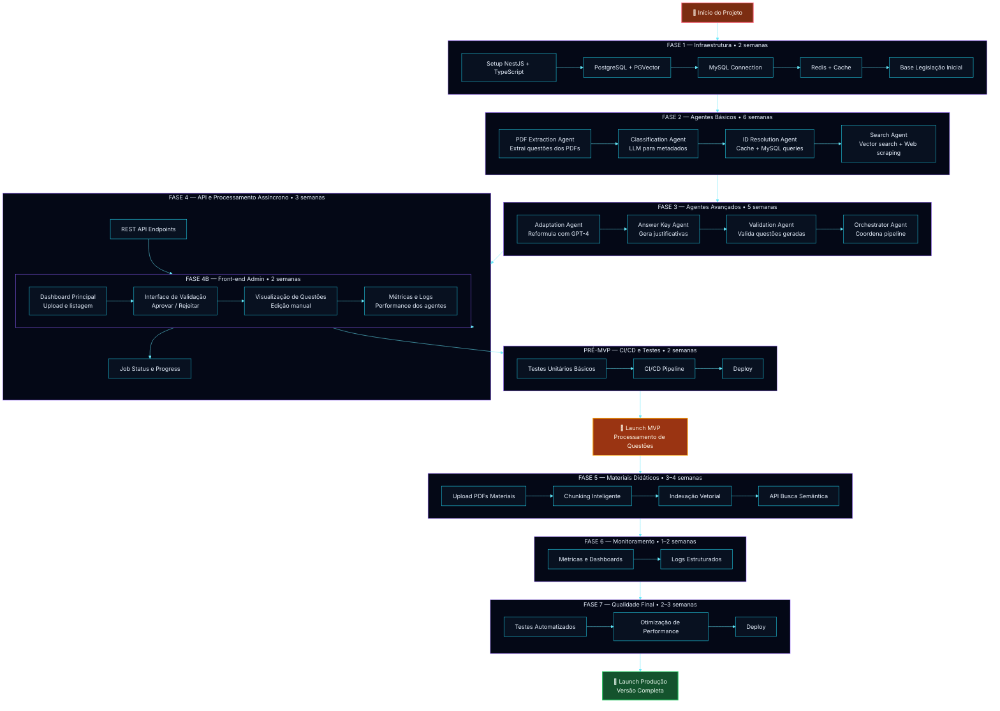
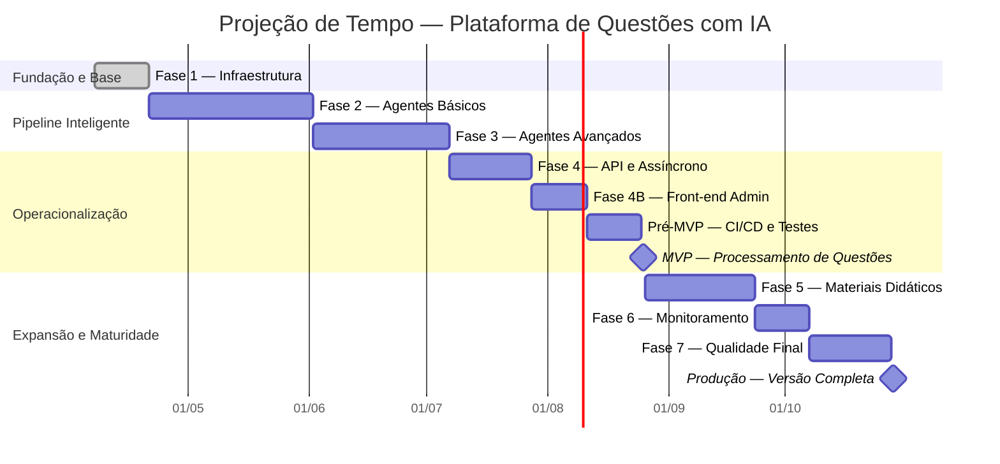
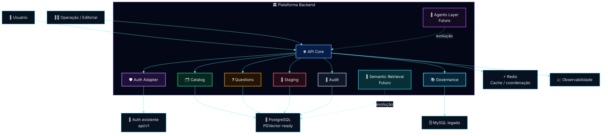
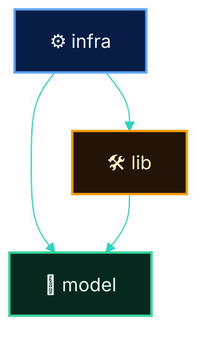
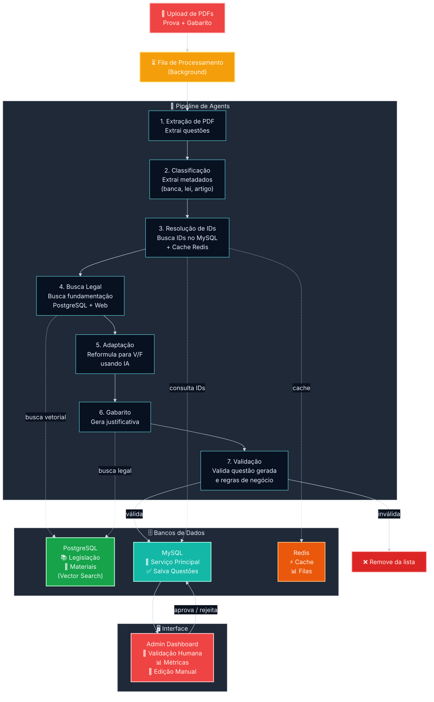
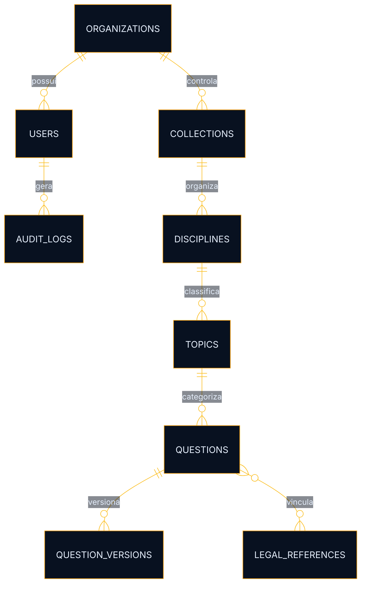

# Plataforma de Questões com IA

<div align="center">


</div>

<div align="center">

## 🏛️ Arquitetura orientada a domínio para processamento, governança, revisão e evolução incremental de questões com suporte a IA

**README técnico principal do repositório, com foco explícito na Fase 1**, preservando compatibilidade arquitetural com as fases futuras do roadmap, do MVP à operação completa.

</div>

---

> [!IMPORTANT]
> Este documento representa o **README principal do repositório** e descreve a arquitetura, o roadmap técnico, a lógica operacional e a projeção de execução da plataforma.
>
> O foco é refletir o estado real do projeto: **a Fase 1 está em andamento**; as demais fases compõem a evolução planejada sobre a fundação atual.

> [!NOTE]
> Este README foi estruturado para funcionar simultaneamente como:
>
> - documento executivo-técnico;
> - referência arquitetural oficial;
> - base de onboarding;
> - guia de implementação;
> - documento de alinhamento entre produto, engenharia e evolução do roadmap.

> [!TIP]
> A leitura correta deste documento parte de uma premissa simples:
>
> **a Fase 1 é a entrega atual; o restante do roadmap orienta o desenho da base e a projeção de evolução do produto.**

---

# 📚 Sumário

- [1. Visão Geral](#1-visão-geral)
- [2. Objetivo do Documento](#2-objetivo-do-documento)
- [3. Status Atual do Projeto](#3-status-atual-do-projeto)
- [4. Diretriz Arquitetural Oficial](#4-diretriz-arquitetural-oficial)
- [5. Objetivo da Plataforma](#5-objetivo-da-plataforma)
- [6. Problema de Negócio e Solução](#6-problema-de-negócio-e-solução)
- [7. Leitura Correta do Roadmap](#7-leitura-correta-do-roadmap)
- [8. Roadmap por Fases e Duração](#8-roadmap-por-fases-e-duração)
- [9. Ciclo Completo das Fases](#9-ciclo-completo-das-fases)
- [10. Fase 1 — Fundação Segura](#10-fase-1--fundação-segura)
- [11. Fase 2 — Agentes Básicos](#11-fase-2--agentes-básicos)
- [12. Fase 3 — Agentes Avançados](#12-fase-3--agentes-avançados)
- [13. Fase 4 — API e Processamento Assíncrono](#13-fase-4--api-e-processamento-assíncrono)
- [14. Fase 4B — Front-end Admin](#14-fase-4b--front-end-admin)
- [15. Pré-MVP — CI/CD e Testes](#15-pré-mvp--cicd-e-testes)
- [16. MVP — Processamento de Questões](#16-mvp--processamento-de-questões)
- [17. Fase 5 — Materiais Didáticos](#17-fase-5--materiais-didáticos)
- [18. Fase 6 — Monitoramento](#18-fase-6--monitoramento)
- [19. Fase 7 — Qualidade Final](#19-fase-7--qualidade-final)
- [20. Projeção de Tempo do Ciclo de Vida](#20-projeção-de-tempo-do-ciclo-de-vida)
- [21. Visão Arquitetural de Alto Nível](#21-visão-arquitetural-de-alto-nível)
- [22. Reuso da Autenticação da `api/v1`](#22-reuso-da-autenticação-da-apiv1)
- [23. Bounded Contexts da Solução](#23-bounded-contexts-da-solução)
- [24. Estrutura de Módulos do Monólito Modular](#24-estrutura-de-módulos-do-monólito-modular)
- [25. Regras de Dependência](#25-regras-de-dependência)
- [26. Pipeline Operacional Completo](#26-pipeline-operacional-completo)
- [27. Modelo de Dados Conceitual da Fundação](#27-modelo-de-dados-conceitual-da-fundação)
- [28. Segurança](#28-segurança)
- [29. Observabilidade](#29-observabilidade)
- [30. Resiliência e Confiabilidade](#30-resiliência-e-confiabilidade)
- [31. Integração com Legado via ACL](#31-integração-com-legado-via-acl)
- [32. Stack Técnica](#32-stack-técnica)
- [33. Critérios de Pronto da Fase 1](#33-critérios-de-pronto-da-fase-1)
- [34. Riscos Técnicos e Trade-offs](#34-riscos-técnicos-e-trade-offs)
- [35. Próximos Passos Recomendados](#35-próximos-passos-recomendados)
- [36. Conclusão](#36-conclusão)

---

# 1. Visão Geral

A **Plataforma de Questões com IA** foi concebida como uma solução orientada a domínio para suportar o ciclo de vida completo de **ingestão, extração, classificação, resolução, enriquecimento, adaptação, validação, revisão e operação de questões** com apoio de IA.

A arquitetura foi desenhada para permitir crescimento **incremental, auditável e sustentável**, sem exigir reescrita estrutural a cada nova capacidade adicionada ao produto.

## Direção central da solução

A base atual não existe apenas para resolver a etapa inicial do projeto. Ela existe para sustentar com segurança as próximas camadas de evolução:

- agentes especializados;
- pipeline assíncrono;
- validação humana;
- materiais didáticos;
- indexação vetorial;
- busca semântica;
- operação observável;
- hardening de produção.

## Resultado esperado da fundação

Ao final da fundação, a plataforma deve possuir uma base consistente em:

- arquitetura modular por domínio;
- autenticação integrada ao ecossistema atual;
- persistência preparada para evolução;
- integração controlada com legado;
- base de cache e coordenação;
- contratos internos estáveis;
- trilha de auditoria e observabilidade mínima;
- compatibilidade real com o roadmap completo.

> [!IMPORTANT]
> Referência técnica: a fundação desta plataforma deve ser tratada como **base estrutural permanente** do produto. Decisões de contrato, boundary, persistência e modularização não devem assumir descarte ou reescrita ampla nas fases seguintes.

---

# 2. Objetivo do Documento

Este documento descreve, de forma técnica, organizada e executiva, a arquitetura aprovada da plataforma, com foco prioritário na **Fase 1**, sem perder a visão do roadmap completo.

## Este documento existe para

- registrar a decisão arquitetural oficial;
- deixar explícito o escopo real da fase atual;
- documentar a lógica de evolução do produto;
- orientar implementação, revisão técnica e onboarding;
- servir como base estável para ADRs, PRs e decisões de escopo;
- alinhar engenharia, arquitetura e visão de entrega.

## Este documento não pretende

- comunicar que o roadmap inteiro já está implementado;
- misturar backlog futuro com entrega atual;
- tratar componentes planejados como se já estivessem operacionais em produção.

---

# 3. Status Atual do Projeto

## 🟢 Situação atual

O projeto está em **Fase 1 — Fundação Segura**, com foco na estrutura arquitetural e operacional mínima necessária para sustentar as próximas fases.

## O que está em andamento agora

- bootstrap da aplicação NestJS;
- definição dos módulos fundacionais;
- integração com PostgreSQL e preparação para PGVector;
- conexão controlada com MySQL legado;
- base Redis para cache e futura coordenação assíncrona;
- adaptação da autenticação existente da `api/v1`;
- contratos internos, validação e padrões transversais;
- base inicial de segurança, auditoria e observabilidade.

## O que ainda não está no escopo da fase atual

- pipeline multiagente operacional;
- orquestração avançada de agentes;
- interface administrativa madura;
- busca semântica em produção;
- operação assíncrona completa;
- hardening final de produção.

> [!IMPORTANT]
> Sempre que houver dúvida sobre o estágio do projeto, a leitura correta é:
>
> **fundação em andamento, evolução futura planejada.**

---

# 4. Diretriz Arquitetural Oficial

## ✅ Arquitetura aprovada

A solução adota um **Monólito Modular Pragmático por Domínio**, implementado com **NestJS + TypeScript**, com organização interna disciplinada e preparada para evolução incremental.

## Composição arquitetural principal

| Camada | Decisão |
|---|---|
| **Runtime principal** | NestJS + TypeScript |
| **Persistência principal** | PostgreSQL |
| **Compatibilidade vetorial futura** | PGVector |
| **Integração legada** | MySQL via ACL |
| **Cache e coordenação** | Redis |
| **Filas e jobs futuros** | BullMQ |
| **Auth** | Reaproveitamento da `api/v1` |
| **Observabilidade** | Logs, tracing e métricas progressivas |

## Motivos da decisão

Essa abordagem equilibra:

- simplicidade operacional;
- baixo custo cognitivo;
- boa separação de responsabilidades;
- facilidade de manutenção;
- centralização observável do runtime;
- evolução segura sem fragmentação prematura.

## O que foi evitado conscientemente

### ❌ Microsserviços prematuros

Evita aumento de:

- overhead operacional;
- acoplamento distribuído;
- custo de tracing e troubleshooting;
- necessidade precoce de contratos de rede complexos.

### ❌ Core excessivamente abstrato

Evita:

- boilerplate desnecessário;
- desaceleração do desenvolvimento;
- complexidade arquitetural desproporcional ao estágio atual.

### ❌ Nova pilha de autenticação paralela

Evita:

- divergência de identidade;
- regras duplicadas;
- inconsistência de autorização;
- drift entre sistemas.

> [!NOTE]
> Referência técnica de decisão: a escolha por monólito modular prioriza **coesão de runtime**, **menor custo operacional** e **controle de boundary interno** nesta fase do produto.

---

# 5. Objetivo da Plataforma

A plataforma existe para transformar insumos brutos em **questões processadas, classificadas, rastreáveis, enriquecidas e operacionalmente utilizáveis**, preservando governança, segurança e compatibilidade futura com IA e materiais-base.

## Objetivos estruturais

- centralizar processamento de questões;
- organizar classificação e metadados;
- sustentar revisão humana e trilha operacional;
- preparar o pipeline para automação incremental;
- permitir expansão futura para materiais didáticos e busca semântica.

## Objetivos arquiteturais

- crescer por fases sem reescrita da base;
- manter baixo acoplamento entre domínio novo e legado;
- garantir segurança por padrão;
- suportar operação síncrona agora e assíncrona depois;
- preservar auditabilidade das operações.

---

# 6. Problema de Negócio e Solução

## Problema central

O fluxo tradicional de produção de questões costuma ser fragmentado, manual e pouco rastreável:

- PDFs chegam de forma desestruturada;
- metadados vêm incompletos ou inconsistentes;
- classificação depende de esforço humano repetitivo;
- vínculos legais e taxonômicos são difíceis de padronizar;
- revisão e gabarito consomem tempo operacional elevado;
- o histórico de decisão se perde entre planilhas, documentos e ferramentas dispersas.

## Solução proposta

A plataforma organiza esse problema como um **pipeline técnico governado**, onde cada etapa do ciclo de vida da questão passa a ter:

- estado explícito;
- responsabilidade arquitetural clara;
- persistência e rastreabilidade;
- capacidade de validação;
- suporte progressivo por IA.

## Resultado esperado

```text
Entrada bruta → Estruturação → Classificação → Enriquecimento →
Validação → Revisão humana → Persistência canônica → Operação
```

---

# 7. Leitura Correta do Roadmap

O roadmap deve ser interpretado em dois níveis complementares.

## Nível 1 — Implementação atual

A implementação real está centrada na construção da fundação correta do sistema.

## Nível 2 — Arquitetura alvo já definida

Mesmo sem todas as fases implementadas, a base atual já precisa nascer compatível com:

- agentes;
- filas;
- jobs;
- processamento assíncrono;
- revisão humana;
- indexação vetorial;
- busca semântica;
- observabilidade operacional madura.

## Interpretação correta

A Fase 1 não representa um experimento provisório. Ela representa a **base estrutural do produto**.

---

# 8. Roadmap por Fases e Duração

## Visão consolidada

| Fase | Nome | Duração estimada | Status | Objetivo central |
|---|---|---:|---|---|
| 1 | Fundação Segura | 2 semanas | 🟢 Em andamento | Estruturar base técnica, integrações, segurança e modularidade |
| 2 | Agentes Básicos | 6 semanas | 🟡 Em planejamento | Introduzir extração, classificação, resolução e busca |
| 3 | Agentes Avançados | 5 semanas | 🟡 Em planejamento | Adicionar adaptação, gabarito, validação e orquestração |
| 4 | API e Processamento Assíncrono | 3 semanas | 🟡 Em planejamento | Expor pipeline e operar com jobs e filas |
| 4B | Front-end Admin | 2 semanas | 🟡 Em planejamento | Oferecer superfície humana de operação |
| Pré-MVP | CI/CD e Testes | 2 semanas | 🟡 Em planejamento | Garantir lançabilidade mínima |
| MVP | Processamento de Questões | Marco | 🟡 Em planejamento | Entregar primeira versão operacional utilizável |
| 5 | Materiais Didáticos | 3–4 semanas | 🟡 Em planejamento | Ingestão, chunking e indexação vetorial |
| 6 | Monitoramento | 1–2 semanas | 🟡 Em planejamento | Consolidar métricas, dashboards e logs |
| 7 | Qualidade Final | 2–3 semanas | 🟡 Em planejamento | Hardening, otimização e testes completos |
| Produção | Versão Completa | Marco | 🟡 Em planejamento | Operação plena e sustentável em escala |

## Leitura executiva do roadmap

A lógica do roadmap é progressiva:

1. **Fundação** para suportar evolução sem reescrita;
2. **Automação inicial** via agentes básicos;
3. **Enriquecimento inteligente** via agentes avançados;
4. **Operacionalização** via API, filas e interface humana;
5. **Expansão de domínio** com materiais e busca semântica;
6. **Maturidade operacional** com monitoramento e hardening.

---

# 9. Ciclo Completo das Fases

Esta seção traduz a lógica da primeira imagem do roadmap para um diagrama Mermaid alinhado ao README principal.

## 9.1 Mermaid — Ciclo completo de fases



## 9.2 Leitura arquitetural do ciclo

Esse diagrama deixa explícito que o roadmap possui **dependência lógica entre fases**, e não apenas agrupamento visual.

### O que ele comunica corretamente

- a fundação precede agentes;
- agentes precedem operação assíncrona madura;
- operação humana e visibilidade administrativa surgem após o pipeline base;
- o MVP ocorre antes da expansão para materiais didáticos;
- observabilidade madura e hardening aparecem após a primeira versão utilizável.

> [!IMPORTANT]
> Referência técnica: o roadmap foi estruturado para minimizar reescrita estrutural. Cada fase existe para reduzir risco técnico da fase seguinte.

---

# 10. Fase 1 — Fundação Segura

> [!IMPORTANT]
> Esta é a **única fase atualmente em execução**. Todas as demais fases do roadmap devem ser interpretadas como **em planejamento**, servindo como direção arquitetural e não como entrega ativa.

## 🎯 Objetivo da fase

Estabelecer a fundação técnica e arquitetural que sustentará o produto ao longo das próximas fases.

## Escopo funcional da fase atual

### 10.1 Bootstrap da aplicação

- setup de **NestJS + TypeScript**;
- estrutura inicial de módulos;
- configuração de ambiente e inicialização segura;
- padronização de bootstrap transversal.

### 10.2 Persistência principal

- **PostgreSQL** como banco principal;
- preparação de **PGVector** para compatibilidade futura;
- base de entidades, migrações e versionamento de schema.

### 10.3 Integração com legado

- conexão com **MySQL**;
- leitura e interoperabilidade controlada;
- isolamento por **ACL**;
- proibição de vazamento semântico do legado para o domínio novo.

### 10.4 Cache e coordenação

- **Redis** como infraestrutura de apoio;
- suporte a cache inicial;
- base compatível com expansão futura para filas, jobs e workers.

### 10.5 Segurança estrutural

- autenticação integrada à `api/v1`;
- autorização por escopo e política;
- validação forte de payload;
- sanitização e padronização de respostas de erro;
- trilha inicial de auditoria.

### 10.6 Observabilidade inicial

- logs estruturados;
- correlation id;
- health checks;
- tracing básico e pontos de extensibilidade.

### 10.7 Contratos internos da plataforma

- DTOs e schemas consistentes;
- padrões de erro;
- convenções para módulos e serviços;
- bordas preparadas para expansão assíncrona.

## Resultado esperado da Fase 1

A plataforma ainda não precisa entregar o pipeline completo do produto, mas precisa entregar uma base capaz de recebê-lo sem ruptura estrutural.

---

# 11. Fase 2 — Agentes Básicos

## 🎯 Objetivo da fase

Introduzir o primeiro conjunto de agentes responsáveis por transformar material bruto em estrutura processável.

## Escopo previsto

### 11.1 PDF Extraction Agent

Responsável por:

- ler PDFs de prova;
- identificar blocos de questões;
- extrair enunciado, alternativas e estrutura inicial;
- reduzir dependência de parsing manual.

### 11.2 Classification Agent

Responsável por:

- inferir metadados relevantes;
- sugerir banca, disciplina, tópico, lei e artigo;
- produzir uma camada inicial de classificação assistida por LLM.

### 11.3 ID Resolution Agent

Responsável por:

- resolver IDs canônicos de entidades já existentes;
- consultar cache Redis;
- consultar MySQL legado quando necessário;
- reduzir duplicidade de entidades e metadados.

### 11.4 Search Agent

Responsável por:

- localizar fundamentação legal e conteúdo contextual;
- combinar base vetorial futura com fontes estruturadas;
- suportar enriquecimento da questão.

## Resultado esperado da Fase 2

Ao final desta fase, o sistema passa a ter **pipeline assistido inicial de ingestão e estruturação**, ainda sem toda a inteligência de adaptação e validação avançada.

---

# 12. Fase 3 — Agentes Avançados

## 🎯 Objetivo da fase

Transformar o pipeline inicial em um fluxo realmente inteligente, capaz de **adaptar, justificar, validar e coordenar** a geração e refinamento das questões.

## Escopo previsto

### 12.1 Adaptation Agent

Responsável por:

- reformular questões para novos formatos;
- gerar variações controladas;
- adaptar conteúdo para V/F, múltipla escolha ou novos formatos;
- preservar coerência pedagógica e jurídica.

### 12.2 Answer Key Agent

Responsável por:

- gerar gabarito;
- produzir justificativa;
- apoiar rastreabilidade de resposta correta.

### 12.3 Validation Agent

Responsável por:

- validar coerência da questão;
- verificar regras de negócio;
- detectar inconsistências antes da persistência final.

### 12.4 Orchestrator Agent

Responsável por:

- coordenar execução das etapas;
- controlar dependências do pipeline;
- organizar ordem, retry e fluxo de decisão.

## Resultado esperado da Fase 3

Ao final desta fase, a plataforma passa a operar como um **pipeline de inteligência assistida**, e não apenas como um fluxo de extração e classificação.

---

# 13. Fase 4 — API e Processamento Assíncrono

## 🎯 Objetivo da fase

Transformar o pipeline em uma **capacidade operacional utilizável por API**, com execução assíncrona e visibilidade de status.

## Escopo previsto

### 13.1 REST API Endpoints

Expor endpoints para:

- upload;
- submissão de processamento;
- consulta de status;
- recuperação de resultados.

### 13.2 Bull / BullMQ Queues

Introduzir filas para:

- desacoplar upload de processamento;
- distribuir carga;
- suportar jobs de longa duração;
- viabilizar reprocessamento.

### 13.3 Job Status e Progress

Permitir visibilidade de:

- estado do job;
- progresso por etapa;
- falha por estágio;
- histórico de execução.

## Resultado esperado da Fase 4

Ao final desta fase, o pipeline deixa de ser apenas uma capacidade técnica interna e passa a ser uma **capacidade operacional formal do sistema**.

---

# 14. Fase 4B — Front-end Admin

## 🎯 Objetivo da fase

Adicionar a superfície humana de operação necessária para governança, validação e acompanhamento.

## Escopo previsto

### 14.1 Dashboard principal

Capaz de:

- listar uploads;
- exibir status;
- navegar por processamentos;
- acompanhar backlog operacional.

### 14.2 Interface de validação

Capaz de:

- aprovar;
- rejeitar;
- marcar inconsistências;
- suportar workflow humano de curadoria.

### 14.3 Visualização de questões

Capaz de:

- abrir questão processada;
- editar manualmente;
- revisar metadados;
- comparar estrutura original e adaptada.

### 14.4 Métricas e logs

Capaz de:

- expor performance por agente;
- exibir erros por estágio;
- fornecer suporte operacional básico.

## Resultado esperado da Fase 4B

Ao final desta fase, a plataforma passa a ter **operabilidade humana real**, e não apenas capacidade técnica de backend.

---

# 15. Pré-MVP — CI/CD e Testes

## 🎯 Objetivo da fase

Preparar a solução para ser lançável de forma minimamente segura e repetível.

## Escopo previsto

### 15.1 Testes unitários básicos

Cobrir:

- serviços críticos;
- validadores;
- mappers;
- contratos internos.

### 15.2 CI/CD Pipeline

Automatizar:

- lint;
- testes;
- build;
- empacotamento;
- fluxo de deploy.

### 15.3 Deploy inicial

Estabelecer a primeira trilha de entrega operacional.

## Resultado esperado

A plataforma passa a ter **lançabilidade mínima confiável**.

---

# 16. MVP — Processamento de Questões

## 🎯 Objetivo do marco

Entregar a primeira versão operacional realmente utilizável do produto.

## O que o MVP representa

O MVP não é apenas “o sistema no ar”. Ele representa o ponto em que o produto já consegue:

- receber entrada real;
- processar questões;
- aplicar lógica de classificação e enriquecimento;
- submeter revisão humana;
- persistir resultado operacional.

## Resultado esperado

```text
Entrada real + pipeline útil + operação humana mínima + persistência confiável
```

---

# 17. Fase 5 — Materiais Didáticos

## 🎯 Objetivo da fase

Expandir a plataforma para além de questões, incorporando **materiais-base** como fonte de apoio e recuperação contextual.

## Escopo previsto

### 17.1 Upload de materiais

Permitir ingestão de PDFs e conteúdos de referência.

### 17.2 Chunking inteligente

Quebrar materiais em blocos semanticamente úteis.

### 17.3 Indexação vetorial

Persistir embeddings e permitir recuperação contextual.

### 17.4 API de busca semântica

Expor capacidade de recuperação de contexto por similaridade.

## Resultado esperado

A plataforma passa a sustentar **fundamentação contextual e recuperação inteligente** a partir de materiais didáticos.

---

# 18. Fase 6 — Monitoramento

## 🎯 Objetivo da fase

Consolidar a camada de operação observável do produto.

## Escopo previsto

### 18.1 Métricas e dashboards

Medir:

- throughput;
- falhas;
- latência;
- distribuição de carga.

### 18.2 Logs estruturados

Padronizar e enriquecer logs por etapa, job e pipeline.

## Resultado esperado

A plataforma passa a ter **visibilidade operacional madura**.

---

# 19. Fase 7 — Qualidade Final

## 🎯 Objetivo da fase

Levar a solução do estágio funcional para o estágio de **robustez operacional e qualidade final**.

## Escopo previsto

### 19.1 Testes automatizados

Expandir cobertura funcional e de integração.

### 19.2 Otimização de performance

Atuar em:

- tempo de processamento;
- consumo de recursos;
- gargalos de persistência e pipeline.

### 19.3 Deploy final

Consolidar a versão pronta para operação completa.

## Resultado esperado

A plataforma passa a estar pronta para **produção completa e sustentável**.

---

# 20. Projeção de Tempo do Ciclo de Vida

Esta seção adiciona um diagrama de projeção temporal cobrindo todo o ciclo de vida das fases.

## 20.1 Projeção executiva de tempo

### Faixa total estimada

Sem considerar paralelizações agressivas, a projeção do ciclo completo fica em aproximadamente:

- **mínimo:** 24 semanas
- **máximo:** 27 semanas

## 20.2 Leitura da projeção

### Tempo até o MVP

- Fase 1 → Fase 4B → Pré-MVP
- estimativa acumulada: **20 semanas**

### Tempo até a versão completa

- MVP → Fase 5 → Fase 7
- estimativa adicional: **4 a 7 semanas**

### Tempo total até produção completa

- estimativa consolidada: **24 a 27 semanas**

## 20.3 Projeção temporal do ciclo



> [!NOTE]
> Referência técnica: esta projeção representa uma **linha-base sequencial conservadora**. O plano real pode reduzir duração com paralelização parcial entre frentes de UI, observabilidade e hardening.

---

# 21. Visão Arquitetural de Alto Nível



## Leitura técnica

A arquitetura já separa, desde a fundação:

- borda HTTP;
- autenticação e autorização;
- domínio principal;
- auditoria;
- staging para revisão futura;
- governança e conhecimento canônico;
- integração controlada com legado;
- pontos explícitos de evolução para agentes e recuperação semântica.

---

# 22. Reuso da Autenticação da `api/v1`

A nova plataforma não deve criar um novo mecanismo de autenticação concorrente.

## Estratégia adotada

- reaproveitar identidade já existente;
- adaptar token, contexto e claims ao novo domínio;
- validar permissões por camada de adaptação;
- manter consistência com o ecossistema atual.

## Benefícios

- reduz duplicação de regras;
- evita drift de identidade;
- simplifica governança de acesso;
- reduz custo de integração e operação.

## Fluxo arquitetural de autenticação


> [!IMPORTANT]
> Referência técnica: o reuso da autenticação da `api/v1` preserva um único centro de verdade para identidade administrativa e evita divergência de sessão, permissão e revogação entre sistemas.

---

# 23. Bounded Contexts da Solução

## Contextos fundacionais

| Contexto | Responsabilidade |
|---|---|
| `auth` | Adaptação de identidade, contexto autenticado e autorização |
| `organizations` | Noção de organização, escopo e pertencimento |
| `catalog` | Taxonomias, metadados, disciplinas, tópicos e referências |
| `questions` | Núcleo de questões, versões e estados canônicos |
| `staging` | Buffers de entrada, revisão e estados intermediários |
| `audit` | Trilhas de auditoria, rastreabilidade e eventos |
| `governance` | Regras canônicas, bases de referência e conhecimento estruturante |

## Contextos previstos para evolução

- `ingestion`
- `extraction`
- `classification`
- `resolution`
- `search`
- `adaptation`
- `answer-key`
- `validation`
- `orchestration`
- `materials`
- `monitoring`
- `quality`
- `publication`

> [!NOTE]
> Referência técnica: os bounded contexts listados como futuros devem influenciar naming, contracts e boundaries, mas não devem introduzir dependências concretas prematuras na implementação atual.

---

# 24. Estrutura de Módulos do Monólito Modular

Cada módulo deve seguir uma organização interna simples, previsível e disciplinada.

```text
modules/<modulo>/
├── infra/
├── model/
└── lib/
```

## `model/`

Contém elementos de contrato e modelagem, como:

- DTOs;
- enums;
- interfaces;
- schemas;
- tipos;
- regras declarativas de validação.

## `infra/`

Contém elementos de execução e integração, como:

- controllers;
- services;
- repositories;
- gateways;
- clients;
- processors;
- adapters.

## `lib/`

Contém elementos utilitários e internos do módulo, como:

- parsers;
- helpers;
- mappers;
- normalizers;
- factories.

---

# 25. Regras de Dependência

## Regras permitidas

- `infra` pode depender de `model`;
- `infra` pode depender de `lib`;
- `lib` pode depender de `model`.

## Regras proibidas

- `model` não pode depender de `infra`;
- `lib` não deve acessar integrações externas diretamente;
- `shared` não pode virar depósito genérico;
- o domínio novo não pode herdar semântica do legado.

## Diagrama de dependência permitida



> [!IMPORTANT]
> Referência técnica: as regras de dependência desta seção devem ser tratadas como **contrato estrutural do repositório**. Qualquer exceção precisa ser explícita, revisada e justificada tecnicamente.

---

# 26. Pipeline Operacional Completo

Esta seção traduz a lógica da segunda imagem para um Mermaid operacional aderente ao README.

## 26.1 Mermaid — Pipeline operacional da plataforma



## 26.2 Leitura do pipeline operacional

Esse pipeline explicita a **lógica de operação alvo do produto**.

### Ordem funcional

1. entrada de material bruto;
2. enfileiramento do processamento;
3. extração e estruturação;
4. classificação e resolução;
5. enriquecimento legal/contextual;
6. adaptação e geração de justificativa;
7. validação;
8. persistência canônica ou descarte;
9. revisão humana e operação administrativa.

### O que esse fluxo resolve

- separa ingestão de processamento;
- reduz dependência de operação manual linear;
- organiza pontos de falha e validação;
- permite futura observabilidade por estágio;
- prepara a plataforma para execução assíncrona madura.

> [!IMPORTANT]
> Referência técnica: este pipeline deve ser tratado como **modelo operacional alvo do produto**, ainda que parte de suas etapas esteja em implementação futura.

---

# 27. Modelo de Dados Conceitual da Fundação

## Entidades centrais esperadas

- `users`
- `roles`
- `permissions`
- `organizations`
- `collections`
- `disciplines`
- `topics`
- `legal_references`
- `questions`
- `question_versions`
- `audit_logs`

## Diagrama conceitual



## Leitura de modelagem

A Fase 1 não precisa esgotar toda a modelagem final, mas precisa estabelecer o núcleo canônico sobre o qual versionamento, classificação e auditoria irão evoluir.

> [!NOTE]
> Referência técnica: o modelo conceitual desta seção serve como base semântica para naming, contratos, migrações iniciais e evolução do versionamento de questões.

---

# 28. Segurança

## Controles mínimos da fundação

- autenticação obrigatória nas rotas protegidas;
- autorização por escopo, papel e política;
- validação forte de entrada;
- sanitização de payload e normalização de contratos;
- segregação segura de credenciais;
- tratamento controlado de exceções;
- auditoria mínima de operações sensíveis.

## Regras obrigatórias

1. Nenhuma rota sensível sem autenticação.
2. Nenhuma operação crítica sem autorização explícita.
3. Nenhum payload entra no domínio sem validação.
4. Nenhum erro técnico sensível deve vazar em produção.
5. Nenhuma integração com legado pode bypassar a ACL.
6. Nenhuma credencial deve estar acoplada ao código da aplicação.

## Segurança por camadas

### Camada de entrada

- guards;
- pipes de validação;
- serialização controlada;
- rate limiting quando aplicável.

### Camada de domínio/aplicação

- verificação de escopo;
- invariantes de uso;
- proibição de operações não autorizadas.

### Camada de infraestrutura

- acesso a banco e integrações com credenciais segregadas;
- observabilidade de falhas;
- timeouts e comportamento defensivo.

> [!IMPORTANT]
> Referência técnica: os controles de segurança descritos nesta seção fazem parte dos **critérios mínimos de aceite da Fase 1** e devem ser considerados requisitos de implementação, não apenas recomendações.

---

# 29. Observabilidade

A observabilidade deve amadurecer junto com o produto, mas a base precisa nascer instrumentável.

## Na Fase 1

- logs estruturados;
- correlation id;
- health checks;
- tracing básico;
- pontos de integração para métricas.

## No MVP

- status de jobs;
- visibilidade por etapa do pipeline;
- falhas por componente;
- rastreabilidade por requisição e execução.

## Na produção completa

- dashboards operacionais;
- métricas de throughput;
- métricas de falha;
- observabilidade por agente;
- visibilidade de degradação e fila.

> [!NOTE]
> Referência técnica: logs estruturados, correlation id e health checks devem ser desenhados de forma compatível com futura instrumentação de métricas, tracing distribuído e execução assíncrona.

---

# 30. Resiliência e Confiabilidade

A fundação precisa ser compatível com operação robusta futura.

## Fundamentos esperados agora

- tratamento consistente de erro;
- contratos estáveis;
- separação clara de responsabilidade;
- comportamento previsível em falhas;
- preparação para retries e jobs.

## Evolução prevista

- retries controlados por etapa;
- DLQ;
- reprocessamento;
- idempotência em jobs críticos;
- visibilidade de degradação operacional.

> [!NOTE]
> Referência técnica: contratos, tratamento de erro e desenho de módulos devem permanecer compatíveis com futura introdução de filas, retries, DLQ e idempotência operacional.

---

# 31. Integração com Legado via ACL

A base legada não deve contaminar o modelo canônico do novo domínio.

## Regra obrigatória

Toda interação com o legado deve ocorrer por uma **ACL — Anti-Corruption Layer**.

## Objetivos da ACL

- traduzir contratos do legado;
- isolar semântica externa;
- evitar acoplamento estrutural;
- proteger o domínio novo contra regras implícitas e inconsistentes.

## Fluxo conceitual


> [!IMPORTANT]
> Referência técnica: a ACL deve concentrar tradução de contratos, adaptação semântica e isolamento das regras implícitas do legado. O domínio canônico não deve consumir estruturas legadas diretamente.

---

# 32. Stack Técnica

## Backend

- **NestJS**
- **TypeScript**

## Persistência

- **PostgreSQL**
- **PGVector**

## Integração

- **MySQL**

## Cache e coordenação

- **Redis**
- **BullMQ**

## Observabilidade

- **Pino**
- **OpenTelemetry**

## Infraestrutura de execução

- **Docker**
- **Docker Compose**

---

# 33. Critérios de Pronto da Fase 1

A Fase 1 pode ser considerada consistente quando atender, no mínimo, aos pontos abaixo.

## Estrutura e bootstrap

- aplicação inicializa de forma previsível;
- configuração de ambiente estável;
- bootstrap transversal definido.

## Persistência e integração

- PostgreSQL operacional;
- PGVector preparado;
- MySQL legado acessado de forma controlada;
- Redis funcional.

## Segurança

- autenticação integrada;
- autorização mínima funcional;
- validação e sanitização implementadas;
- exceções tratadas sem vazamento indevido.

## Arquitetura

- módulos fundacionais definidos;
- regras de dependência respeitadas;
- contratos internos padronizados;
- ACL estabelecida para o legado.

## Operação

- logs estruturados mínimos;
- health checks básicos;
- auditoria inicial disponível.

## Documentação

- arquitetura descrita de forma coerente com a fase atual;
- separação explícita entre fundação atual e evolução futura.

> [!NOTE]
> Referência técnica: os critérios desta seção medem **solidez da fundação arquitetural**, e não completude funcional do roadmap do produto.

---

# 34. Riscos Técnicos e Trade-offs

## 34.1 Acoplamento com legado

**Risco:** o novo domínio absorver regras implícitas da base existente.

**Mitigação:** ACL, contratos explícitos e adapters dedicados.

## 34.2 Crescimento desordenado do monólito

**Risco:** módulos perderem fronteira e o projeto virar um bloco acoplado.

**Mitigação:** modularização por domínio, regras de dependência e revisão disciplinada.

## 34.3 Complexidade prematura

**Risco:** excesso de abstração e engenharia adiantada travarem a execução.

**Mitigação:** pragmatismo arquitetural com evolução por fase.

## 34.4 Duplicação de identidade e autorização

**Risco:** surgirem dois centros de verdade para autenticação.

**Mitigação:** reuso da `api/v1` com camada de adaptação.

## 34.5 Reescrita estrutural nas próximas fases

**Risco:** a base atual não suportar filas, agentes e busca semântica.

**Mitigação:** preparar desde agora boundaries, contratos, persistência e runtime para a evolução prevista.

> [!NOTE]
> Referência técnica: os trade-offs listados devem orientar revisão de PRs, ADRs e decisões de escopo para evitar tanto acoplamento precoce quanto abstração desnecessária.

---

# 35. Próximos Passos Recomendados

## Ordem de execução sugerida

1. consolidar `bootstrap/`, `config/` e `shared/`;
2. estabilizar o `AuthModule` e o reuso da `api/v1`;
3. fechar PostgreSQL + Redis + conexão controlada com MySQL;
4. definir contratos canônicos do domínio (`catalog`, `questions`, `staging`, `audit`);
5. estabelecer ACL do legado;
6. adicionar trilha mínima de auditoria e logs estruturados;
7. fechar critérios de pronto da Fase 1;
8. abrir implementação da Fase 2 sobre base já estável.

## Entregáveis imediatos de maior valor

- `README.md` alinhado ao estado real do projeto;
- `docs/architecture/` com recortes arquiteturais por módulo;
- `docs/adr/` com decisões principais;
- estrutura real do monólito modular no repositório;
- base mínima de testes e contratos.

---

# 36. Conclusão

A arquitetura desta plataforma foi definida para viabilizar crescimento **seguro, incremental e sustentável**, sem sacrificar clareza técnica nem introduzir complexidade prematura.

O ponto central deste README é simples e objetivo:

> **o projeto está na Fase 1, e a documentação precisa refletir isso com precisão.**

A fase atual é a construção da base correta do produto. É nessa etapa que se definem:

- os limites dos módulos;
- a disciplina de dependências;
- a estratégia de integração com legado;
- a reutilização da autenticação existente;
- a preparação para filas, agentes e busca semântica;
- a segurança por padrão;
- a observabilidade mínima necessária.

As demais fases permanecem **em planejamento**, compondo o roadmap de evolução da solução e orientando as decisões arquiteturais da fundação atual.

Quando essa fundação estiver consistente, as etapas seguintes poderão evoluir sobre uma base previsível, auditável e tecnicamente sustentável.

<div align="center">

## 🚀 Fundação correta agora para evolução segura depois

</div>
