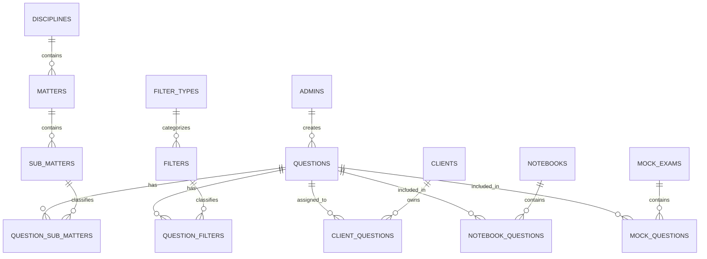
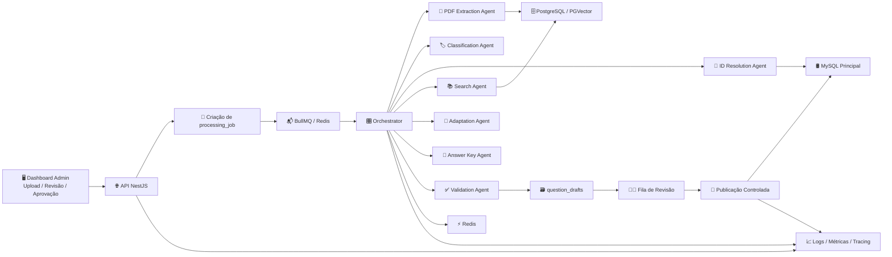
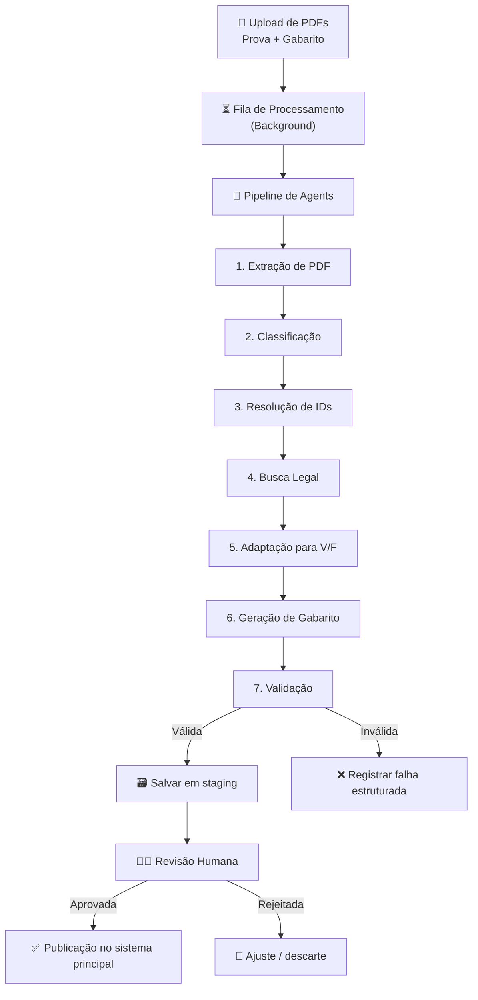
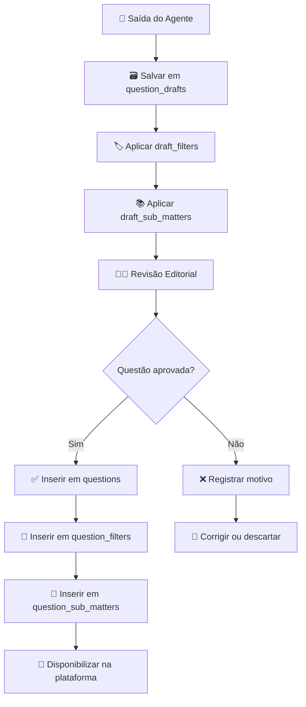
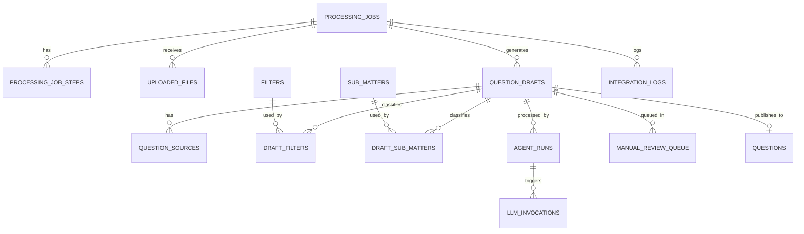

# 🧠 Arquitetura Técnica — Agente de Geração de Questões com IA

<p align="center">


</p>

> Documento técnico de arquitetura, dados, observabilidade, resiliência, organização de código e fluxos do serviço de IA responsável por transformar PDFs de provas em questões no formato Verdadeiro/Falso, com classificação, fundamentação legal, validação, revisão e publicação controlada.

---

## 📚 Sumário

- [1. Objetivo](#1-objetivo)
- [2. Contexto do Problema](#2-contexto-do-problema)
- [3. Objetivos do Sistema](#3-objetivos-do-sistema)
- [4. Visão Geral da Solução](#4-visão-geral-da-solução)
- [5. Princípios Arquiteturais](#5-princípios-arquiteturais)
- [6. Estado Atual da Base Principal](#6-estado-atual-da-base-principal)
- [7. Modelo de Dados Atual](#7-modelo-de-dados-atual)
- [8. Diagrama ER do Modelo Atual](#8-diagrama-er-do-modelo-atual)
- [9. Interpretação Técnica do Modelo Atual](#9-interpretação-técnica-do-modelo-atual)
- [10. Arquitetura Proposta para o Agente](#10-arquitetura-proposta-para-o-agente)
- [11. Fluxograma Geral da Aplicação](#11-fluxograma-geral-da-aplicação)
- [12. Fluxo Macro do Sistema](#12-fluxo-macro-do-sistema)
- [13. Pipeline Multiagente](#13-pipeline-multiagente)
- [14. Classificação Contextual e Taxonomia](#14-classificação-contextual-e-taxonomia)
- [15. Fluxo de Revisão e Publicação](#15-fluxo-de-revisão-e-publicação)
- [16. Modelo de Dados Futuro](#16-modelo-de-dados-futuro)
- [17. Diagrama ER do Modelo Futuro](#17-diagrama-er-do-modelo-futuro)
- [18. Dicionário de Banco de Dados](#18-dicionário-de-banco-de-dados)
- [19. Camadas da Aplicação](#19-camadas-da-aplicação)
- [20. Arquitetura de Pastas e Arquivos](#20-arquitetura-de-pastas-e-arquivos)
- [21. Tree View Vertical da Estrutura](#21-tree-view-vertical-da-estrutura)
- [22. Organização por Responsabilidade](#22-organização-por-responsabilidade)
- [23. Helpers, Normalizadores e Utilitários Globais](#23-helpers-normalizadores-e-utilitários-globais)
- [24. Contratos, DTOs, Enums e Tipos](#24-contratos-dtos-enums-e-tipos)
- [25. Logs Estruturados](#25-logs-estruturados)
- [26. Observabilidade](#26-observabilidade)
- [27. Timeouts, Retries e Circuit Breaker](#27-timeouts-retries-e-circuit-breaker)
- [28. Fallbacks e Estratégias de Degradação](#28-fallbacks-e-estratégias-de-degradação)
- [29. Idempotência](#29-idempotência)
- [30. Segurança, Robustez e Resiliência](#30-segurança-robustez-e-resiliência)
- [31. Erro como Parte do Fluxo](#31-erro-como-parte-do-fluxo)
- [32. Normalização e Qualidade de Dados](#32-normalização-e-qualidade-de-dados)
- [33. Payloads e Contratos JSON](#33-payloads-e-contratos-json)
- [34. Estratégia de Testes](#34-estratégia-de-testes)
- [35. Regras Arquiteturais](#35-regras-arquiteturais)
- [36. Roadmap Técnico](#36-roadmap-técnico)
- [37. Próximos Passos](#37-próximos-passos)
- [38. Conclusão](#38-conclusão)

---

# 1. Objetivo

Este documento descreve a arquitetura técnica do serviço de IA responsável por automatizar a geração de questões para a plataforma, convertendo PDFs de provas e gabaritos em questões no formato **Verdadeiro/Falso**, classificadas, explicadas e prontas para revisão.

A proposta do sistema não é apenas gerar texto, mas operar como um **pipeline técnico robusto**, com foco em:

- qualidade de dados;
- rastreabilidade;
- desacoplamento;
- resiliência;
- observabilidade;
- idempotência;
- revisão humana;
- integração segura com a base principal.

---

# 2. Contexto do Problema

Atualmente, a criação de questões depende de um processo manual que envolve:

- leitura de PDFs de provas;
- transcrição das questões;
- adaptação para o formato Verdadeiro/Falso;
- escrita manual do gabarito comentado;
- classificação e publicação no sistema principal.

Esse fluxo é lento, sujeito a inconsistências e pouco escalável. O novo serviço deve transformar esse processo em uma esteira automatizada, auditável e segura, sem comprometer a qualidade editorial.

---

# 3. Objetivos do Sistema

## 3.1 Processar PDFs de prova e gabarito
Ler arquivos enviados, extrair texto, identificar questões e estruturar a informação.

## 3.2 Classificar metadados automaticamente
Identificar contexto como:

- banca;
- lei;
- artigo;
- disciplina;
- matéria;
- submatéria;
- demais atributos necessários para filtros e taxonomia.

## 3.3 Adaptar questões para o formato da plataforma
Converter a formulação original da prova para o formato Verdadeiro/Falso.

## 3.4 Gerar gabarito comentado minimalista
Produzir explicações curtas e consistentes, priorizando fundamentação legal.

## 3.5 Persistir com segurança
Salvar a saída em uma camada intermediária de staging, permitindo revisão antes da publicação.

## 3.6 Operar com confiabilidade
Ser observável, tolerante a falhas, idempotente e testável.

---

# 4. Visão Geral da Solução

A solução será implementada como um **novo serviço desacoplado**, separado da aplicação principal, utilizando:

- **NestJS + TypeScript**
- **PostgreSQL + PGVector**
- **Redis**
- **Bull/BullMQ**
- **MySQL** para integração com o banco principal
- **Dashboard Admin** para revisão e gestão operacional

O serviço funcionará como uma esteira assíncrona orientada a jobs e agents especializados.

---

# 5. Princípios Arquiteturais

## 5.1 Desacoplamento
O domínio não deve depender diretamente de framework, banco ou provider de IA.

## 5.2 Erro como parte do sistema
Falhas devem ser modeladas como estados explícitos do fluxo.

## 5.3 Rastreabilidade
Toda saída deve poder ser auditada desde a origem até a publicação.

## 5.4 Evolução segura
Novos agents, fontes e regras devem poder ser adicionados sem reescrever o núcleo.

## 5.5 Segurança por padrão
Uploads, integrações, prompts e persistência devem operar com validação e mínimo privilégio.

## 5.6 Observabilidade nativa
Logs, métricas e tracing devem fazer parte da arquitetura desde o início.

## 5.7 Idempotência
Reprocessamentos não devem gerar duplicidade nem efeitos colaterais indevidos.

---

# 6. Estado Atual da Base Principal

A aplicação principal já possui uma base útil para integração do agente.

## 6.1 Entidade central
- `questions`

## 6.2 Classificação contextual
- `filter_types`
- `filters`
- `question_filters`

## 6.3 Classificação pedagógica
- `disciplines`
- `matters`
- `sub_matters`
- `question_sub_matters`

## 6.4 Relacionamentos auxiliares
- `client_questions`
- `notebook_questions`
- `mock_questions`

A base atual já oferece um bom núcleo de publicação, mas ainda não possui uma camada de staging, jobs e evidências voltada para IA.

---

# 7. Modelo de Dados Atual

## 7.1 Tabela `questions`

A tabela `questions` representa a entidade final de publicação.

### Campos identificados

| Campo | Tipo | Finalidade |
|------|------|------------|
| `id` | int | Identificador da questão |
| `user_id` | uuid | Usuário/admin responsável |
| `title` | text | Título da questão |
| `description` | text | Enunciado principal |
| `explanation` | text | Explicação / gabarito |
| `is_true` | boolean | Resposta correta V/F |
| `is_accepted` | boolean | Estado de aceitação |
| `is_from_client` | boolean | Origem externa |
| `ia_generated` | boolean | Indicador de geração por IA |
| `reason_refused` | text | Motivo da rejeição |
| `created_at` | timestamp | Criação |
| `updated_at` | timestamp | Atualização |

### Interpretação técnica

A tabela atende bem o consumo final, mas não comporta sozinha o pipeline de IA, pois faltam:

- vínculo com job;
- score de confiança;
- evidências;
- payload bruto;
- status operacionais intermediários.

---

# 8. Diagrama ER do Modelo Atual



---

# 9. Interpretação Técnica do Modelo Atual

O sistema não modela o contexto da questão como colunas fixas. Em vez de usar campos como:

- `bank_id`
- `year_id`
- `organization_id`
- `position_id`

utiliza um modelo contextual flexível:

```txt
question_filters → filters → filter_types
```

## 9.1 Classificação contextual
Atributos como banca, ano, órgão e cargo devem continuar representados por filtros.

## 9.2 Classificação pedagógica
A estrutura educacional é feita via:

```txt
disciplines → matters → sub_matters → question_sub_matters
```

Essa separação entre contexto e conteúdo pedagógico deve ser preservada.

---

# 10. Arquitetura Proposta para o Agente

O agente deve operar como um microserviço independente, conectado à aplicação principal, mas sem depender diretamente da lógica interna dela.

## 10.1 Responsabilidades do novo serviço

- receber PDFs;
- orquestrar o pipeline;
- extrair questões;
- classificar contexto;
- resolver IDs;
- buscar fundamentação;
- adaptar para V/F;
- gerar explicações;
- validar saída;
- persistir rascunhos;
- publicar conteúdo aprovado.

## 10.2 Componentes principais

- **MySQL** → base principal
- **PostgreSQL + PGVector** → busca semântica e materiais
- **Redis** → cache, locks e filas
- **Bull/BullMQ** → execução assíncrona
- **NestJS** → APIs e orquestração
- **LLM / IA** → classificação, adaptação e geração
- **Dashboard Admin** → revisão humana e monitoramento

---

# 11. Fluxograma Geral da Aplicação



---

# 12. Fluxo Macro do Sistema



---

# 13. Pipeline Multiagente

Cada agent deve possuir responsabilidade única, contrato claro e retorno tipado.

## 13.1 PDF Extraction Agent
Responsável por ler PDFs, extrair texto e estruturar questões.

### Entrada
- arquivo da prova;
- arquivo do gabarito.

### Saída
- questões brutas;
- segmentos identificados;
- erros de parsing, quando existirem.

### Timeout sugerido
- **30s a 90s**, conforme tamanho do arquivo.

### Estratégia de retry
- até **2 tentativas** para falhas transitórias.

## 13.2 Classification Agent
Responsável por identificar metadados contextuais e pedagógicos.

### Saída
- banca;
- lei;
- artigo;
- disciplina;
- matéria;
- submatéria;
- confiança de classificação.

### Timeout sugerido
- **10s a 20s** por lote pequeno;
- **30s** em lote maior.

### Estratégia de retry
- retry somente em falhas transitórias do provider.

## 13.3 ID Resolution Agent
Responsável por transformar metadados em IDs válidos do ecossistema da plataforma.

### Fontes
- MySQL;
- cache Redis.

### Saída
- IDs resolvidos;
- ambiguidades;
- faltas de correspondência.

### Timeout sugerido
- **2s a 5s** por lookup agregado.

### Estratégia de retry
- até **3 tentativas rápidas** com backoff curto.

## 13.4 Search Agent
Responsável por recuperar fundamentação legal e contexto confiável.

### Fontes
- PostgreSQL com PGVector;
- base legal estruturada;
- fallback web controlado.

### Saída
- trechos;
- referências;
- evidências.

### Timeout sugerido
- **5s a 15s** por consulta.

### Estratégia de retry
- retry apenas para indisponibilidade transitória.

## 13.5 Adaptation Agent
Responsável por reformular a questão para o formato V/F.

### Saída
- `title`
- `description`
- `is_true`

### Timeout sugerido
- **10s a 20s**.

## 13.6 Answer Key Agent
Responsável por gerar o gabarito comentado minimalista.

### Saída
- `explanation`

### Timeout sugerido
- **10s a 20s**.

## 13.7 Validation Agent
Responsável por validar consistência, estrutura e regras de negócio.

### Saída
- situação final;
- erros estruturados;
- score final;
- necessidade de revisão manual.

### Timeout sugerido
- **1s a 5s**.

---

# 14. Classificação Contextual e Taxonomia

A classificação é dividida em dois eixos independentes.

## 14.1 Eixo contextual

Representa:

- banca;
- ano;
- órgão;
- cargo;
- tipo de prova;
- demais filtros.

Modelo:

```txt
filter_types → filters → question_filters
```

## 14.2 Eixo pedagógico

Representa:

- disciplina;
- matéria;
- submatéria.

Modelo:

```txt
disciplines → matters → sub_matters → question_sub_matters
```

---

# 15. Fluxo de Revisão e Publicação

O sistema não deve publicar diretamente a saída da IA na tabela final.



---

# 16. Modelo de Dados Futuro

Para suportar IA de forma profissional, será necessário criar uma camada de staging e auditoria.

## 16.1 Novas tabelas propostas

- `processing_jobs`
- `processing_job_steps`
- `uploaded_files`
- `question_drafts`
- `question_sources`
- `draft_filters`
- `draft_sub_matters`
- `agent_runs`
- `llm_invocations`
- `integration_logs`
- `manual_review_queue`

---

# 17. Diagrama ER do Modelo Futuro



---

# 18. Dicionário de Banco de Dados

## 18.1 `processing_jobs`

### Finalidade
Representa a unidade principal de processamento assíncrono disparada por um upload ou solicitação de execução.

### Funções
- rastrear o ciclo completo do job;
- manter status e progresso;
- armazenar referência do processamento;
- suportar retries e reprocessamentos;
- permitir auditoria operacional.

### Campos recomendados

| Campo | Tipo | Descrição |
|------|------|-----------|
| `id` | uuid | Identificador do job |
| `job_key` | varchar | Chave idempotente do job |
| `source_type` | varchar | Tipo da origem, ex.: `pdf_upload` |
| `status` | varchar | Estado atual do job |
| `progress_pct` | integer | Percentual de progresso |
| `input_hash` | varchar | Hash do conteúdo de entrada |
| `requested_by` | uuid nullable | Usuário solicitante |
| `metadata` | jsonb | Metadados do processamento |
| `started_at` | timestamp nullable | Início efetivo |
| `finished_at` | timestamp nullable | Fim efetivo |
| `created_at` | timestamp | Criação |
| `updated_at` | timestamp | Atualização |

### Ligações
- 1:N com `processing_job_steps`
- 1:N com `uploaded_files`
- 1:N com `question_drafts`
- 1:N com `integration_logs`

## 18.2 `processing_job_steps`

### Finalidade
Representa o detalhamento das etapas de um job.

### Funções
- mostrar progresso por fase;
- registrar duração por etapa;
- registrar falhas pontuais;
- facilitar observabilidade e debugging.

### Campos recomendados

| Campo | Tipo | Descrição |
|------|------|-----------|
| `id` | bigserial | Identificador interno |
| `processing_job_id` | uuid | Job pai |
| `step_name` | varchar | Nome da etapa |
| `step_order` | integer | Ordem no pipeline |
| `status` | varchar | Status da etapa |
| `attempt` | integer | Número da tentativa |
| `error_code` | varchar nullable | Código de erro |
| `error_message` | text nullable | Erro resumido |
| `payload` | jsonb nullable | Dados relevantes da etapa |
| `started_at` | timestamp nullable | Início |
| `finished_at` | timestamp nullable | Fim |
| `created_at` | timestamp | Criação |

### Ligações
- N:1 com `processing_jobs`

## 18.3 `uploaded_files`

### Finalidade
Armazenar os arquivos recebidos e seus metadados técnicos.

### Funções
- rastrear origem do upload;
- manter hash e nome original;
- controlar tipo de arquivo;
- permitir deduplicação;
- suportar reprocessamento.

### Campos recomendados

| Campo | Tipo | Descrição |
|------|------|-----------|
| `id` | uuid | Identificador do arquivo |
| `processing_job_id` | uuid | Job relacionado |
| `file_role` | varchar | Papel do arquivo, ex.: `proof`, `answer_key` |
| `original_name` | varchar | Nome original |
| `storage_path` | varchar | Caminho no storage |
| `mime_type` | varchar | MIME validado |
| `size_bytes` | bigint | Tamanho |
| `checksum_sha256` | varchar | Hash do arquivo |
| `is_valid` | boolean | Arquivo válido |
| `validation_errors` | jsonb nullable | Erros de validação |
| `created_at` | timestamp | Criação |

### Ligações
- N:1 com `processing_jobs`

## 18.4 `question_drafts`

### Finalidade
Representa a saída intermediária do agente, antes da publicação.

### Funções
- staging;
- revisão;
- reprocessamento;
- auditoria;
- separação entre IA e produção.

### Campos recomendados

| Campo | Tipo | Descrição |
|------|------|-----------|
| `id` | bigserial | Identificador do draft |
| `processing_job_id` | uuid | Job que gerou o draft |
| `source_question_number` | varchar nullable | Número da questão original |
| `title` | text | Título gerado |
| `description` | text | Enunciado V/F |
| `explanation` | text | Gabarito comentado |
| `is_true` | boolean | Resposta |
| `confidence_score` | numeric(5,2) | Score de confiança |
| `validation_status` | varchar | Situação de validação |
| `review_status` | varchar | Situação editorial |
| `reviewed_by` | uuid nullable | Revisor |
| `review_reason` | text nullable | Motivo de rejeição ou ajuste |
| `raw_payload` | jsonb | Payload bruto consolidado |
| `normalized_payload` | jsonb | Payload normalizado |
| `created_at` | timestamp | Criação |
| `updated_at` | timestamp | Atualização |

### Ligações
- N:1 com `processing_jobs`
- 1:N com `question_sources`
- 1:N com `draft_filters`
- 1:N com `draft_sub_matters`
- 1:N com `agent_runs`
- 1:0..1 com `questions` após publicação lógica

## 18.5 `question_sources`

### Finalidade
Armazenar evidências, referências e trechos usados para fundamentar a questão gerada.

### Funções
- rastrear base legal;
- guardar trechos utilizados;
- permitir auditoria;
- explicar de onde veio a justificativa.

### Campos recomendados

| Campo | Tipo | Descrição |
|------|------|-----------|
| `id` | bigserial | Identificador |
| `question_draft_id` | bigint | Draft relacionado |
| `source_type` | varchar | Tipo da fonte |
| `source_ref` | varchar | Referência da fonte |
| `title` | varchar nullable | Título amigável |
| `excerpt` | text nullable | Trecho utilizado |
| `rank_score` | numeric(8,4) nullable | Score da busca |
| `metadata` | jsonb nullable | Dados adicionais |
| `created_at` | timestamp | Criação |

### Ligações
- N:1 com `question_drafts`

## 18.6 `draft_filters`

### Finalidade
Relacionar drafts aos filtros contextuais da plataforma.

### Funções
- persistir contexto antes da publicação;
- facilitar revisão;
- permitir comparação com a questão final.

### Campos recomendados

| Campo | Tipo | Descrição |
|------|------|-----------|
| `id` | bigserial | Identificador |
| `question_draft_id` | bigint | Draft relacionado |
| `filter_id` | integer | Filtro resolvido |
| `resolution_confidence` | numeric(5,2) nullable | Confiança da resolução |
| `resolution_note` | text nullable | Observação |
| `created_at` | timestamp | Criação |

### Ligações
- N:1 com `question_draft_id`
- N:1 com `filters`

## 18.7 `draft_sub_matters`

### Finalidade
Relacionar drafts à taxonomia pedagógica.

### Funções
- persistir classificação didática do draft;
- permitir revisão antes da publicação.

### Campos recomendados

| Campo | Tipo | Descrição |
|------|------|-----------|
| `id` | bigserial | Identificador |
| `question_draft_id` | bigint | Draft relacionado |
| `sub_matter_id` | integer | Submatéria |
| `position` | integer nullable | Ordem |
| `resolution_confidence` | numeric(5,2) nullable | Confiança |
| `created_at` | timestamp | Criação |

### Ligações
- N:1 com `question_drafts`
- N:1 com `sub_matters`

## 18.8 `agent_runs`

### Finalidade
Registrar cada execução individual de agent sobre um draft ou job.

### Funções
- medir performance por agent;
- suportar troubleshooting;
- entender qual agent falhou;
- versionar execução.

### Campos recomendados

| Campo | Tipo | Descrição |
|------|------|-----------|
| `id` | uuid | Identificador |
| `processing_job_id` | uuid | Job relacionado |
| `question_draft_id` | bigint nullable | Draft relacionado |
| `agent_name` | varchar | Nome do agent |
| `agent_version` | varchar | Versão |
| `status` | varchar | Status |
| `attempt` | integer | Tentativa |
| `input_snapshot` | jsonb nullable | Entrada do agent |
| `output_snapshot` | jsonb nullable | Saída do agent |
| `error_code` | varchar nullable | Código de erro |
| `error_message` | text nullable | Erro |
| `started_at` | timestamp nullable | Início |
| `finished_at` | timestamp nullable | Fim |
| `created_at` | timestamp | Criação |

### Ligações
- N:1 com `processing_jobs`
- N:1 com `question_drafts`

## 18.9 `llm_invocations`

### Finalidade
Rastrear chamadas a modelos de IA.

### Funções
- observabilidade de custo e latência;
- análise de regressão;
- auditoria de prompts;
- troubleshooting de saídas.

### Campos recomendados

| Campo | Tipo | Descrição |
|------|------|-----------|
| `id` | uuid | Identificador |
| `agent_run_id` | uuid | Execução que disparou a chamada |
| `provider_name` | varchar | Provider |
| `model_name` | varchar | Modelo |
| `prompt_version` | varchar | Versão do prompt |
| `request_hash` | varchar | Hash da entrada |
| `input_tokens` | integer nullable | Tokens de entrada |
| `output_tokens` | integer nullable | Tokens de saída |
| `latency_ms` | integer nullable | Latência |
| `status` | varchar | Situação |
| `response_summary` | text nullable | Resumo seguro da resposta |
| `created_at` | timestamp | Criação |

### Ligações
- N:1 com `agent_runs`

## 18.10 `integration_logs`

### Finalidade
Registrar integrações com sistemas externos, especialmente MySQL principal e serviços auxiliares.

### Funções
- auditar chamadas externas;
- registrar falhas;
- medir latência e taxa de erro;
- rastrear publicações.

### Campos recomendados

| Campo | Tipo | Descrição |
|------|------|-----------|
| `id` | bigserial | Identificador |
| `processing_job_id` | uuid | Job relacionado |
| `target_system` | varchar | Sistema de destino |
| `operation_name` | varchar | Operação executada |
| `request_id` | varchar nullable | Correlation ID |
| `status` | varchar | Sucesso ou falha |
| `http_status` | integer nullable | Status HTTP, se houver |
| `latency_ms` | integer nullable | Latência |
| `request_payload` | jsonb nullable | Payload sanitizado |
| `response_payload` | jsonb nullable | Payload sanitizado |
| `error_code` | varchar nullable | Código de erro |
| `error_message` | text nullable | Erro |
| `created_at` | timestamp | Criação |

### Ligações
- N:1 com `processing_jobs`

## 18.11 `manual_review_queue`

### Finalidade
Representar a fila de revisão humana.

### Funções
- listar drafts pendentes;
- priorizar casos sensíveis;
- marcar razão da revisão;
- permitir fluxo editorial claro.

### Campos recomendados

| Campo | Tipo | Descrição |
|------|------|-----------|
| `id` | bigserial | Identificador |
| `question_draft_id` | bigint | Draft relacionado |
| `queue_reason` | varchar | Motivo da revisão |
| `priority` | integer | Prioridade |
| `assigned_to` | uuid nullable | Revisor atribuído |
| `status` | varchar | Situação da fila |
| `created_at` | timestamp | Criação |
| `updated_at` | timestamp | Atualização |

### Ligações
- N:1 com `question_drafts`

---

# 19. Camadas da Aplicação

## 19.1 Domain
Contém entidades, value objects e regras puras.

## 19.2 Application
Contém casos de uso, orquestração e contratos.

## 19.3 Infrastructure
Contém banco, Redis, filas, adapters, web clients e providers de IA.

## 19.4 Interfaces
Contém controllers, DTOs, workers e APIs.

---

# 20. Arquitetura de Pastas e Arquivos

A organização do código deve refletir o domínio e não o framework. A estrutura abaixo privilegia:

- separação por camadas;
- contratos explícitos;
- helpers e normalizadores globais isolados;
- agentes desacoplados;
- facilidade de teste;
- clareza para evolução.

## 20.1 Estratégia de organização

A base deve ser organizada em quatro macrocamadas:

- `core/` → abstrações, contratos, utilitários e domínio compartilhado;
- `modules/` → casos de uso organizados por contexto de negócio;
- `infra/` → implementações técnicas e integrações externas;
- `test/` → testes por nível.

## 20.2 Regras da estrutura

- helpers globais não podem conter regra de negócio;
- normalizadores globais devem ser puros e previsíveis;
- contratos devem viver em camadas estáveis;
- enums compartilhados devem ficar em local centralizado;
- adapters de provider não podem vazar para o domínio;
- DTOs de transporte não substituem entidades de domínio.

---

# 21. Tree View Vertical da Estrutura

```txt
question-ai-service/
├── .github/
│   ├── workflows/
│   │   ├── ci.yml
│   │   ├── cd.yml
│   │   ├── lint.yml
│   │   └── tests.yml
│   ├── pull_request_template.md
│   └── CODEOWNERS
├── docs/
│   ├── architecture/
│   │   ├── agent-architecture.md
│   │   ├── database-dictionary.md
│   │   ├── observability.md
│   │   ├── resilience.md
│   │   ├── api-contracts.md
│   │   └── folder-structure.md
│   ├── adr/
│   │   ├── ADR-001-clean-architecture.md
│   │   ├── ADR-002-staging-before-publication.md
│   │   ├── ADR-003-filters-as-context.md
│   │   └── ADR-004-idempotent-jobs.md
│   └── runbooks/
│       ├── incident-llm-provider-down.md
│       ├── incident-mysql-unavailable.md
│       ├── incident-queue-backlog.md
│       └── manual-review-playbook.md
├── src/
│   ├── main.ts
│   ├── app.module.ts
│   ├── bootstrap/
│   │   ├── app.bootstrap.ts
│   │   ├── config.bootstrap.ts
│   │   ├── logger.bootstrap.ts
│   │   ├── queue.bootstrap.ts
│   │   ├── tracing.bootstrap.ts
│   │   └── validation.bootstrap.ts
│   ├── config/
│   │   ├── app.config.ts
│   │   ├── database.config.ts
│   │   ├── redis.config.ts
│   │   ├── queue.config.ts
│   │   ├── llm.config.ts
│   │   ├── observability.config.ts
│   │   ├── storage.config.ts
│   │   └── feature-flags.config.ts
│   ├── core/
│   │   ├── domain/
│   │   │   ├── entities/
│   │   │   │   ├── processing-job.entity.ts
│   │   │   │   ├── processing-job-step.entity.ts
│   │   │   │   ├── uploaded-file.entity.ts
│   │   │   │   ├── question-draft.entity.ts
│   │   │   │   ├── question-source.entity.ts
│   │   │   │   ├── agent-run.entity.ts
│   │   │   │   ├── llm-invocation.entity.ts
│   │   │   │   └── manual-review-item.entity.ts
│   │   │   ├── value-objects/
│   │   │   │   ├── job-key.vo.ts
│   │   │   │   ├── checksum.vo.ts
│   │   │   │   ├── confidence-score.vo.ts
│   │   │   │   ├── normalized-text.vo.ts
│   │   │   │   ├── source-reference.vo.ts
│   │   │   │   ├── filter-resolution.vo.ts
│   │   │   │   └── taxonomy-resolution.vo.ts
│   │   │   ├── enums/
│   │   │   │   ├── processing-job-status.enum.ts
│   │   │   │   ├── processing-step-status.enum.ts
│   │   │   │   ├── review-status.enum.ts
│   │   │   │   ├── validation-status.enum.ts
│   │   │   │   ├── agent-run-status.enum.ts
│   │   │   │   ├── source-type.enum.ts
│   │   │   │   ├── file-role.enum.ts
│   │   │   │   ├── fallback-strategy.enum.ts
│   │   │   │   ├── integration-target.enum.ts
│   │   │   │   └── error-category.enum.ts
│   │   │   ├── constants/
│   │   │   │   ├── system-limits.constants.ts
│   │   │   │   ├── timeout-policy.constants.ts
│   │   │   │   ├── retry-policy.constants.ts
│   │   │   │   └── metric-names.constants.ts
│   │   │   ├── errors/
│   │   │   │   ├── domain-error.base.ts
│   │   │   │   ├── validation-error.ts
│   │   │   │   ├── retryable-error.ts
│   │   │   │   ├── non-retryable-error.ts
│   │   │   │   ├── timeout-error.ts
│   │   │   │   ├── integration-error.ts
│   │   │   │   ├── parsing-error.ts
│   │   │   │   └── classification-error.ts
│   │   │   ├── rules/
│   │   │   │   ├── question-draft-completeness.rule.ts
│   │   │   │   ├── publication-eligibility.rule.ts
│   │   │   │   ├── confidence-threshold.rule.ts
│   │   │   │   └── manual-review-required.rule.ts
│   │   │   └── services/
│   │   │       ├── idempotency-policy.service.ts
│   │   │       ├── publication-policy.service.ts
│   │   │       ├── review-policy.service.ts
│   │   │       └── fallback-policy.service.ts
│   │   ├── application/
│   │   │   ├── contracts/
│   │   │   │   ├── repositories/
│   │   │   │   │   ├── processing-job.repository.contract.ts
│   │   │   │   │   ├── question-draft.repository.contract.ts
│   │   │   │   │   ├── question-source.repository.contract.ts
│   │   │   │   │   ├── uploaded-file.repository.contract.ts
│   │   │   │   │   ├── agent-run.repository.contract.ts
│   │   │   │   │   ├── llm-invocation.repository.contract.ts
│   │   │   │   │   └── manual-review.repository.contract.ts
│   │   │   │   ├── gateways/
│   │   │   │   │   ├── llm.gateway.contract.ts
│   │   │   │   │   ├── vector-search.gateway.contract.ts
│   │   │   │   │   ├── mysql-question.gateway.contract.ts
│   │   │   │   │   ├── storage.gateway.contract.ts
│   │   │   │   │   ├── queue.gateway.contract.ts
│   │   │   │   │   ├── cache.gateway.contract.ts
│   │   │   │   │   ├── web-search.gateway.contract.ts
│   │   │   │   │   └── circuit-breaker.gateway.contract.ts
│   │   │   │   ├── services/
│   │   │   │   │   ├── agent.contract.ts
│   │   │   │   │   ├── orchestrator.contract.ts
│   │   │   │   │   ├── logger.contract.ts
│   │   │   │   │   ├── tracer.contract.ts
│   │   │   │   │   ├── metrics.contract.ts
│   │   │   │   │   └── clock.contract.ts
│   │   │   │   └── normalizers/
│   │   │   │       ├── text-normalizer.contract.ts
│   │   │   │       ├── metadata-normalizer.contract.ts
│   │   │   │       ├── html-normalizer.contract.ts
│   │   │   │       └── question-payload-normalizer.contract.ts
│   │   │   ├── dto/
│   │   │   │   ├── common/
│   │   │   │   │   ├── pagination.dto.ts
│   │   │   │   │   ├── metadata.dto.ts
│   │   │   │   │   └── trace-context.dto.ts
│   │   │   │   ├── jobs/
│   │   │   │   │   ├── create-processing-job.input.ts
│   │   │   │   │   ├── create-processing-job.output.ts
│   │   │   │   │   ├── get-job-status.output.ts
│   │   │   │   │   └── retry-processing-job.input.ts
│   │   │   │   ├── drafts/
│   │   │   │   │   ├── create-question-draft.input.ts
│   │   │   │   │   ├── update-question-draft.input.ts
│   │   │   │   │   ├── publish-question-draft.input.ts
│   │   │   │   │   └── question-draft.output.ts
│   │   │   │   └── agents/
│   │   │   │       ├── extraction.payload.ts
│   │   │   │       ├── classification.payload.ts
│   │   │   │       ├── resolution.payload.ts
│   │   │   │       ├── search.payload.ts
│   │   │   │       ├── adaptation.payload.ts
│   │   │   │       ├── answer-key.payload.ts
│   │   │   │       └── validation.payload.ts
│   │   │   ├── use-cases/
│   │   │   │   ├── jobs/
│   │   │   │   │   ├── create-processing-job.use-case.ts
│   │   │   │   │   ├── start-processing-job.use-case.ts
│   │   │   │   │   ├── retry-processing-job.use-case.ts
│   │   │   │   │   ├── cancel-processing-job.use-case.ts
│   │   │   │   │   └── get-processing-job-status.use-case.ts
│   │   │   │   ├── uploads/
│   │   │   │   │   ├── validate-upload.use-case.ts
│   │   │   │   │   ├── store-uploaded-files.use-case.ts
│   │   │   │   │   └── register-upload-metadata.use-case.ts
│   │   │   │   ├── pipeline/
│   │   │   │   │   ├── orchestrate-question-generation.use-case.ts
│   │   │   │   │   ├── run-extraction-step.use-case.ts
│   │   │   │   │   ├── run-classification-step.use-case.ts
│   │   │   │   │   ├── run-resolution-step.use-case.ts
│   │   │   │   │   ├── run-search-step.use-case.ts
│   │   │   │   │   ├── run-adaptation-step.use-case.ts
│   │   │   │   │   ├── run-answer-key-step.use-case.ts
│   │   │   │   │   └── run-validation-step.use-case.ts
│   │   │   │   ├── drafts/
│   │   │   │   │   ├── create-question-draft.use-case.ts
│   │   │   │   │   ├── update-question-draft.use-case.ts
│   │   │   │   │   ├── queue-manual-review.use-case.ts
│   │   │   │   │   ├── approve-question-draft.use-case.ts
│   │   │   │   │   ├── reject-question-draft.use-case.ts
│   │   │   │   │   └── publish-question-draft.use-case.ts
│   │   │   │   ├── observability/
│   │   │   │   │   ├── register-agent-run.use-case.ts
│   │   │   │   │   ├── register-llm-invocation.use-case.ts
│   │   │   │   │   ├── register-integration-log.use-case.ts
│   │   │   │   │   └── compute-job-metrics.use-case.ts
│   │   │   │   └── maintenance/
│   │   │   │       ├── requeue-stuck-jobs.use-case.ts
│   │   │   │       ├── cleanup-expired-files.use-case.ts
│   │   │   │       └── cleanup-failed-locks.use-case.ts
│   │   │   ├── mappers/
│   │   │   │   ├── question-draft.mapper.ts
│   │   │   │   ├── processing-job.mapper.ts
│   │   │   │   ├── publication.mapper.ts
│   │   │   │   └── filter-resolution.mapper.ts
│   │   │   └── policies/
│   │   │       ├── timeout.policy.ts
│   │   │       ├── retry.policy.ts
│   │   │       ├── circuit-breaker.policy.ts
│   │   │       ├── fallback.policy.ts
│   │   │       └── idempotency.policy.ts
│   │   ├── shared/
│   │   │   ├── result/
│   │   │   │   ├── result.ts
│   │   │   │   ├── success.ts
│   │   │   │   ├── failure.ts
│   │   │   │   └── error-result.ts
│   │   │   ├── types/
│   │   │   │   ├── nullable.type.ts
│   │   │   │   ├── optional.type.ts
│   │   │   │   ├── primitive.type.ts
│   │   │   │   └── json-value.type.ts
│   │   │   ├── helpers/
│   │   │   │   ├── object.helper.ts
│   │   │   │   ├── array.helper.ts
│   │   │   │   ├── string.helper.ts
│   │   │   │   ├── date.helper.ts
│   │   │   │   ├── number.helper.ts
│   │   │   │   ├── hash.helper.ts
│   │   │   │   ├── mask.helper.ts
│   │   │   │   ├── html.helper.ts
│   │   │   │   ├── file.helper.ts
│   │   │   │   └── retry.helper.ts
│   │   │   ├── normalizers/
│   │   │   │   ├── global/
│   │   │   │   │   ├── normalize-whitespace.ts
│   │   │   │   │   ├── normalize-line-breaks.ts
│   │   │   │   │   ├── normalize-unicode.ts
│   │   │   │   │   ├── normalize-punctuation.ts
│   │   │   │   │   ├── normalize-html-snippet.ts
│   │   │   │   │   ├── normalize-boolean.ts
│   │   │   │   │   ├── normalize-year.ts
│   │   │   │   │   ├── normalize-bank-name.ts
│   │   │   │   │   ├── normalize-organization-name.ts
│   │   │   │   │   ├── normalize-article-reference.ts
│   │   │   │   │   ├── normalize-law-name.ts
│   │   │   │   │   └── normalize-question-title.ts
│   │   │   │   ├── payload/
│   │   │   │   │   ├── normalize-extraction-payload.ts
│   │   │   │   │   ├── normalize-classification-payload.ts
│   │   │   │   │   ├── normalize-resolution-payload.ts
│   │   │   │   │   ├── normalize-search-payload.ts
│   │   │   │   │   ├── normalize-adaptation-payload.ts
│   │   │   │   │   ├── normalize-answer-key-payload.ts
│   │   │   │   │   └── normalize-validation-payload.ts
│   │   │   │   └── mappers/
│   │   │   │       ├── map-raw-question-to-draft.ts
│   │   │   │       └── map-draft-to-publication-payload.ts
│   │   │   ├── validation/
│   │   │   │   ├── schemas/
│   │   │   │   │   ├── create-job.schema.ts
│   │   │   │   │   ├── extraction-payload.schema.ts
│   │   │   │   │   ├── classification-payload.schema.ts
│   │   │   │   │   ├── resolution-payload.schema.ts
│   │   │   │   │   ├── search-payload.schema.ts
│   │   │   │   │   ├── adaptation-payload.schema.ts
│   │   │   │   │   ├── answer-key-payload.schema.ts
│   │   │   │   │   ├── validation-payload.schema.ts
│   │   │   │   │   └── publication-payload.schema.ts
│   │   │   │   └── validators/
│   │   │   │       ├── file.validator.ts
│   │   │   │       ├── question-draft.validator.ts
│   │   │   │       ├── html-output.validator.ts
│   │   │   │       └── filter-resolution.validator.ts
│   │   │   └── telemetry/
│   │   │       ├── events/
│   │   │       │   ├── job-events.ts
│   │   │       │   ├── agent-events.ts
│   │   │       │   ├── draft-events.ts
│   │   │       │   └── integration-events.ts
│   │   │       └── names/
│   │   │           ├── log-event-names.ts
│   │   │           ├── metric-names.ts
│   │   │           └── trace-names.ts
│   ├── modules/
│   │   ├── health/
│   │   │   ├── interface/
│   │   │   │   └── controllers/
│   │   │   │       └── health.controller.ts
│   │   │   └── health.module.ts
│   │   ├── uploads/
│   │   │   ├── interface/
│   │   │   │   ├── controllers/
│   │   │   │   │   └── uploads.controller.ts
│   │   │   │   └── dto/
│   │   │   │       ├── upload-files.request.ts
│   │   │   │       └── upload-files.response.ts
│   │   │   ├── application/
│   │   │   │   └── services/
│   │   │   │       └── upload-orchestration.service.ts
│   │   │   └── uploads.module.ts
│   │   ├── jobs/
│   │   │   ├── interface/
│   │   │   │   ├── controllers/
│   │   │   │   │   └── processing-jobs.controller.ts
│   │   │   │   └── dto/
│   │   │   │       ├── create-job.request.ts
│   │   │   │       ├── retry-job.request.ts
│   │   │   │       └── job-status.response.ts
│   │   │   ├── application/
│   │   │   │   └── services/
│   │   │   │       └── job-status-query.service.ts
│   │   │   └── jobs.module.ts
│   │   ├── pipeline/
│   │   │   ├── application/
│   │   │   │   ├── orchestrators/
│   │   │   │   │   ├── question-generation.orchestrator.ts
│   │   │   │   │   └── publication.orchestrator.ts
│   │   │   │   └── services/
│   │   │   │       └── pipeline-step-runner.service.ts
│   │   │   ├── workers/
│   │   │   │   ├── process-job.worker.ts
│   │   │   │   ├── retry-job.worker.ts
│   │   │   │   └── publish-draft.worker.ts
│   │   │   └── pipeline.module.ts
│   │   ├── agents/
│   │   │   ├── extraction/
│   │   │   │   ├── application/
│   │   │   │   │   ├── extraction-agent.service.ts
│   │   │   │   │   ├── extraction-runner.service.ts
│   │   │   │   │   └── extraction-response.builder.ts
│   │   │   │   └── extraction.module.ts
│   │   │   ├── classification/
│   │   │   │   ├── application/
│   │   │   │   │   ├── classification-agent.service.ts
│   │   │   │   │   ├── classification-runner.service.ts
│   │   │   │   │   └── classification-response.builder.ts
│   │   │   │   └── classification.module.ts
│   │   │   ├── resolution/
│   │   │   │   ├── application/
│   │   │   │   │   ├── resolution-agent.service.ts
│   │   │   │   │   ├── resolution-runner.service.ts
│   │   │   │   │   └── resolution-response.builder.ts
│   │   │   │   └── resolution.module.ts
│   │   │   ├── search/
│   │   │   │   ├── application/
│   │   │   │   │   ├── search-agent.service.ts
│   │   │   │   │   ├── search-runner.service.ts
│   │   │   │   │   └── search-response.builder.ts
│   │   │   │   └── search.module.ts
│   │   │   ├── adaptation/
│   │   │   │   ├── application/
│   │   │   │   │   ├── adaptation-agent.service.ts
│   │   │   │   │   ├── adaptation-runner.service.ts
│   │   │   │   │   └── adaptation-response.builder.ts
│   │   │   │   └── adaptation.module.ts
│   │   │   ├── answer-key/
│   │   │   │   ├── application/
│   │   │   │   │   ├── answer-key-agent.service.ts
│   │   │   │   │   ├── answer-key-runner.service.ts
│   │   │   │   │   └── answer-key-response.builder.ts
│   │   │   │   └── answer-key.module.ts
│   │   │   ├── validation/
│   │   │   │   ├── application/
│   │   │   │   │   ├── validation-agent.service.ts
│   │   │   │   │   ├── validation-runner.service.ts
│   │   │   │   │   └── validation-response.builder.ts
│   │   │   │   └── validation.module.ts
│   │   │   └── agents.module.ts
│   │   ├── drafts/
│   │   │   ├── interface/
│   │   │   │   ├── controllers/
│   │   │   │   │   └── question-drafts.controller.ts
│   │   │   │   └── dto/
│   │   │   │       ├── approve-draft.request.ts
│   │   │   │       ├── reject-draft.request.ts
│   │   │   │       ├── update-draft.request.ts
│   │   │   │       └── draft.response.ts
│   │   │   ├── application/
│   │   │   │   └── services/
│   │   │   │       ├── draft-review.service.ts
│   │   │   │       └── draft-publication.service.ts
│   │   │   └── drafts.module.ts
│   │   ├── observability/
│   │   │   ├── interface/
│   │   │   │   └── controllers/
│   │   │   │       └── observability.controller.ts
│   │   │   ├── application/
│   │   │   │   └── services/
│   │   │   │       ├── metrics-query.service.ts
│   │   │   │       └── traces-query.service.ts
│   │   │   └── observability.module.ts
│   │   └── maintenance/
│   │       ├── application/
│   │       │   └── cron/
│   │       │       ├── cleanup-files.cron.ts
│   │       │       ├── requeue-jobs.cron.ts
│   │       │       └── health-audit.cron.ts
│   │       └── maintenance.module.ts
│   ├── infra/
│   │   ├── database/
│   │   │   ├── postgres/
│   │   │   │   ├── entities/
│   │   │   │   ├── repositories/
│   │   │   │   │   ├── processing-job.postgres-repository.ts
│   │   │   │   │   ├── question-draft.postgres-repository.ts
│   │   │   │   │   ├── question-source.postgres-repository.ts
│   │   │   │   │   ├── uploaded-file.postgres-repository.ts
│   │   │   │   │   ├── agent-run.postgres-repository.ts
│   │   │   │   │   ├── llm-invocation.postgres-repository.ts
│   │   │   │   │   └── manual-review.postgres-repository.ts
│   │   │   │   ├── migrations/
│   │   │   │   └── postgres.module.ts
│   │   │   ├── mysql/
│   │   │   │   ├── gateways/
│   │   │   │   │   ├── mysql-question.gateway.ts
│   │   │   │   │   ├── mysql-filter.gateway.ts
│   │   │   │   │   ├── mysql-taxonomy.gateway.ts
│   │   │   │   │   └── mysql-publication.gateway.ts
│   │   │   │   ├── queries/
│   │   │   │   │   ├── find-filter-by-type-and-name.sql.ts
│   │   │   │   │   ├── find-sub-matter-by-name.sql.ts
│   │   │   │   │   ├── insert-question.sql.ts
│   │   │   │   │   ├── insert-question-filters.sql.ts
│   │   │   │   │   └── insert-question-sub-matters.sql.ts
│   │   │   │   └── mysql.module.ts
│   │   │   └── database.module.ts
│   │   ├── cache/
│   │   │   ├── redis-cache.gateway.ts
│   │   │   ├── redis-lock.gateway.ts
│   │   │   └── cache.module.ts
│   │   ├── queue/
│   │   │   ├── bullmq.gateway.ts
│   │   │   ├── queue-names.ts
│   │   │   ├── job-options.factory.ts
│   │   │   └── queue.module.ts
│   │   ├── llm/
│   │   │   ├── providers/
│   │   │   │   ├── primary-llm.gateway.ts
│   │   │   │   ├── fallback-llm.gateway.ts
│   │   │   │   └── provider-router.gateway.ts
│   │   │   ├── prompts/
│   │   │   │   ├── extraction/
│   │   │   │   │   ├── extraction.prompt.ts
│   │   │   │   │   └── extraction.prompt.version.ts
│   │   │   │   ├── classification/
│   │   │   │   │   ├── classification.prompt.ts
│   │   │   │   │   └── classification.prompt.version.ts
│   │   │   │   ├── adaptation/
│   │   │   │   │   ├── adaptation.prompt.ts
│   │   │   │   │   └── adaptation.prompt.version.ts
│   │   │   │   ├── answer-key/
│   │   │   │   │   ├── answer-key.prompt.ts
│   │   │   │   │   └── answer-key.prompt.version.ts
│   │   │   │   └── shared/
│   │   │   │       ├── system-rules.prompt.ts
│   │   │   │       └── output-schema.prompt.ts
│   │   │   ├── parsers/
│   │   │   │   ├── llm-json-response.parser.ts
│   │   │   │   ├── llm-html-response.parser.ts
│   │   │   │   └── llm-error.parser.ts
│   │   │   └── llm.module.ts
│   │   ├── vector-search/
│   │   │   ├── pgvector.gateway.ts
│   │   │   ├── chunkers/
│   │   │   │   ├── legal-document.chunker.ts
│   │   │   │   └── study-material.chunker.ts
│   │   │   └── vector-search.module.ts
│   │   ├── storage/
│   │   │   ├── local-storage.gateway.ts
│   │   │   ├── s3-storage.gateway.ts
│   │   │   └── storage.module.ts
│   │   ├── telemetry/
│   │   │   ├── logger/
│   │   │   │   ├── pino-logger.adapter.ts
│   │   │   │   ├── logger-context.factory.ts
│   │   │   │   └── logger.module.ts
│   │   │   ├── tracing/
│   │   │   │   ├── opentelemetry-tracer.adapter.ts
│   │   │   │   └── tracing.module.ts
│   │   │   ├── metrics/
│   │   │   │   ├── prometheus-metrics.adapter.ts
│   │   │   │   ├── metrics.registry.ts
│   │   │   │   └── metrics.module.ts
│   │   │   └── telemetry.module.ts
│   │   ├── resilience/
│   │   │   ├── circuit-breaker/
│   │   │   │   ├── circuit-breaker.service.ts
│   │   │   │   ├── circuit-breaker.registry.ts
│   │   │   │   └── circuit-breaker.module.ts
│   │   │   ├── timeout/
│   │   │   │   ├── timeout-runner.service.ts
│   │   │   │   └── timeout.module.ts
│   │   │   ├── retry/
│   │   │   │   ├── retry-runner.service.ts
│   │   │   │   └── retry.module.ts
│   │   │   └── resilience.module.ts
│   │   └── web-search/
│   │       ├── web-search.gateway.ts
│   │       └── web-search.module.ts
│   └── test-support/
│       ├── factories/
│       │   ├── processing-job.factory.ts
│       │   ├── question-draft.factory.ts
│       │   ├── agent-run.factory.ts
│       │   └── llm-response.factory.ts
│       ├── fixtures/
│       │   ├── pdf/
│       │   ├── payloads/
│       │   └── prompts/
│       ├── mocks/
│       │   ├── llm.gateway.mock.ts
│       │   ├── queue.gateway.mock.ts
│       │   ├── cache.gateway.mock.ts
│       │   └── mysql.gateway.mock.ts
│       └── utils/
│           ├── test-app.builder.ts
│           ├── integration-db.helper.ts
│           └── queue-test.helper.ts
├── test/
│   ├── unit/
│   │   ├── core/
│   │   ├── modules/
│   │   └── infra/
│   ├── integration/
│   │   ├── database/
│   │   ├── queue/
│   │   ├── cache/
│   │   ├── llm/
│   │   └── vector-search/
│   ├── e2e/
│   │   ├── upload-to-draft.e2e-spec.ts
│   │   ├── draft-publication.e2e-spec.ts
│   │   └── retry-idempotency.e2e-spec.ts
│   ├── contract/
│   │   ├── agents/
│   │   └── gateways/
│   └── resilience/
│       ├── timeout.spec.ts
│       ├── retry.spec.ts
│       ├── circuit-breaker.spec.ts
│       └── fallback.spec.ts
├── scripts/
│   ├── seed-legal-base.ts
│   ├── reindex-vectors.ts
│   ├── requeue-failed-jobs.ts
│   └── cleanup-temp-files.ts
├── .env.example
├── package.json
├── tsconfig.json
├── nest-cli.json
├── eslint.config.js
├── prettier.config.js
└── README.md
```

---

# 22. Organização por Responsabilidade

## 22.1 `core/domain`
Abriga o que é mais estável e valioso do sistema:

- entidades;
- value objects;
- enums;
- regras de negócio;
- erros de domínio.

Nada aqui deve conhecer NestJS, Redis, banco ou provider de IA.

## 22.2 `core/application`
Abriga:

- casos de uso;
- contratos de repositórios e gateways;
- DTOs internos;
- mapeadores;
- policies de execução.

É a camada que coordena o domínio com o mundo externo.

## 22.3 `core/shared`
Abriga recursos reutilizáveis e sem regra de negócio específica:

- helpers;
- normalizadores globais;
- validações genéricas;
- tipos utilitários;
- abstrações de `Result`.

## 22.4 `modules`
Abriga a entrada funcional da aplicação, separada por contexto:

- uploads;
- jobs;
- pipeline;
- agents;
- drafts;
- observability;
- maintenance.

## 22.5 `infra`
Abriga implementações concretas:

- PostgreSQL;
- MySQL;
- Redis;
- BullMQ;
- LLM;
- vector search;
- telemetry;
- resilience;
- storage.

---

# 23. Helpers, Normalizadores e Utilitários Globais

Helpers e normalizadores globais são necessários, mas devem ser usados com disciplina.

## 23.1 O que pode ser helper global

- hash de conteúdo;
- mascaramento de dados;
- manipulação simples de string;
- parsing de datas;
- utilitários de array;
- sanitização HTML básica;
- backoff e retry genérico.

## 23.2 O que pode ser normalizador global

- espaços em branco;
- unicode;
- pontuação;
- nomes de banca;
- nomes de órgãos;
- referências de artigo;
- ano;
- booleanos;
- HTML curto do gabarito.

## 23.3 O que não deve virar helper global

Não devem virar helper global:

- regras de publicação;
- critérios de revisão manual;
- lógica de classificação;
- decisão de fallback;
- regra de score de confiança.

Esses pontos pertencem ao domínio ou à aplicação.

## 23.4 Convenções recomendadas

- helper global → função pura e genérica;
- normalizador global → função pura e previsível;
- policy → regra orquestradora;
- service de domínio → lógica de negócio reutilizável;
- adapter → implementação técnica.

---

# 24. Contratos, DTOs, Enums e Tipos

## 24.1 Contratos

Todos os componentes externos devem entrar por contratos, como:

- `llm.gateway.contract.ts`
- `vector-search.gateway.contract.ts`
- `mysql-question.gateway.contract.ts`
- `queue.gateway.contract.ts`
- `cache.gateway.contract.ts`

Isso permite trocar implementação sem contaminar o domínio.

## 24.2 DTOs

DTOs devem existir apenas para:

- input/output de use case;
- transporte entre camadas;
- controllers;
- workers.

DTO não substitui entidade e não deve carregar regra.

## 24.3 Enums

Enums devem centralizar estados e vocabulário operacional. Exemplos:

- `processing-job-status.enum.ts`
- `validation-status.enum.ts`
- `review-status.enum.ts`
- `fallback-strategy.enum.ts`
- `error-category.enum.ts`

## 24.4 Tipos utilitários

Tipos compartilhados ajudam a manter consistência:

- `Nullable<T>`
- `Optional<T>`
- `JsonValue`
- `Primitive`
- `DeepPartial<T>`, se necessário

---

# 25. Logs Estruturados

A arquitetura deve adotar logs estruturados como padrão.

## 25.1 Objetivos dos logs

- facilitar observabilidade;
- suportar debugging;
- permitir correlação entre serviços;
- alimentar dashboards e alertas.

## 25.2 Campos mínimos em todos os logs

| Campo | Descrição |
|------|-----------|
| `timestamp` | Momento do evento |
| `level` | Nível do log |
| `service` | Nome do serviço |
| `environment` | Ambiente |
| `trace_id` | Identificador de trace |
| `span_id` | Identificador de span |
| `processing_job_id` | Job relacionado |
| `question_draft_id` | Draft relacionado, se houver |
| `agent_name` | Agent relacionado, se houver |
| `event_name` | Nome padronizado do evento |
| `message` | Mensagem resumida |
| `error_code` | Código de erro, se houver |
| `metadata` | Dados adicionais sanitizados |

---

# 26. Observabilidade

Observabilidade deve permitir entender o comportamento do sistema sem depender de investigação manual extensa.

## 26.1 Três pilares

### Logs
Para eventos detalhados e debugging.

### Métricas
Para agregação operacional e alertas.

### Tracing
Para entender latência e encadeamento entre etapas.

## 26.2 Métricas recomendadas

### Jobs
- jobs criados por hora;
- jobs concluídos;
- jobs falhados;
- tempo médio por job;
- tempo por etapa;
- taxa de reprocessamento.

### Agents
- latência por agent;
- taxa de falha por agent;
- tentativas por agent;
- tempo médio por provider de IA.

### Qualidade
- drafts aprovados vs rejeitados;
- taxa de revisão manual;
- score médio de confiança;
- filtros não resolvidos;
- classificações ambíguas.

### Infraestrutura
- profundidade da fila;
- tempo de espera na fila;
- uso de cache;
- hit ratio Redis;
- latência MySQL;
- latência PostgreSQL/PGVector.

---

# 27. Timeouts, Retries e Circuit Breaker

Resiliência operacional exige regras explícitas para tempo máximo de espera, retentativas e isolamento de dependências instáveis.

## 27.1 Política de timeout por componente

| Componente | Timeout sugerido | Observação |
|------|------|-----------|
| Upload validation | 2s a 5s | Validação síncrona |
| Criação de job | 1s a 2s | Operação simples |
| PDF parsing | 30s a 90s | Variável por tamanho |
| Classification Agent | 10s a 30s | Dependente de provider |
| ID Resolution | 2s a 5s | MySQL + Redis |
| Search Agent | 5s a 15s | Vetor + índices |
| Adaptation Agent | 10s a 20s | Provider IA |
| Answer Key Agent | 10s a 20s | Provider IA |
| Validation Agent | 1s a 5s | Regras locais |
| Publicação MySQL | 3s a 10s | Escrita transacional |

## 27.2 Estratégia de retry

Retries devem existir apenas para erros transitórios, como:

- timeout de rede;
- indisponibilidade momentânea;
- lock temporário;
- resposta 5xx de serviços externos.

### Regras recomendadas
- **máximo 2 a 3 tentativas**;
- **backoff exponencial**;
- **jitter**;
- retries não devem ocorrer em erro de validação ou schema inválido.

## 27.3 Circuit breaker

Circuit breaker faz sentido para componentes externos ou instáveis, especialmente:

- provider de IA;
- integração web de fallback;
- serviço externo de busca;
- integrações HTTP auxiliares.

### Estados do circuit breaker
- `closed`
- `open`
- `half_open`

---

# 28. Fallbacks e Estratégias de Degradação

O sistema deve continuar operando de forma controlada mesmo sob degradação parcial.

## 28.1 Fallbacks por componente

### Resolução de IDs
1. Redis cache
2. consulta MySQL
3. busca aproximada controlada
4. revisão manual

### Busca legal
1. PGVector
2. índice legal estruturado
3. busca web controlada
4. revisão manual

### Geração por IA
1. provider principal
2. modelo alternativo
3. retry com prompt reduzido
4. falha estruturada

---

# 29. Idempotência

Idempotência é obrigatória para uploads, jobs e publicação.

## 29.1 Casos que precisam ser idempotentes

- upload do mesmo par prova/gabarito;
- reprocessamento do mesmo job;
- retries automáticos;
- publicação no banco principal;
- criação de vínculos de filtros e submatérias.

## 29.2 Estratégias recomendadas

- chave idempotente do job;
- constraints únicas;
- locks distribuídos Redis;
- upsert controlado.

---

# 30. Segurança, Robustez e Resiliência

## 30.1 Uploads
- validar MIME real;
- validar tamanho;
- validar extensão;
- aplicar hash;
- armazenar fora de área pública;
- aplicar TTL em temporários.

## 30.2 Integração com banco principal
- usar credenciais segregadas;
- aplicar mínimo privilégio;
- preferir leitura e escrita separadas.

## 30.3 Execução de jobs
- timeout por etapa;
- retry controlado;
- dead-letter queue;
- backoff exponencial;
- circuit breaker onde fizer sentido.

---

# 31. Erro como Parte do Fluxo

Falhas devem ser modeladas como resultado esperado do sistema.

## 31.1 Categorias de erro

- erro de entrada;
- erro de parsing;
- erro de classificação;
- erro de resolução;
- erro de dependência externa;
- erro de validação;
- erro editorial;
- erro de publicação.

## 31.2 Estados possíveis

- `success`
- `partial_success`
- `retryable_failure`
- `non_retryable_failure`
- `manual_review_required`

---

# 32. Normalização e Qualidade de Dados

## 32.1 Normalizações obrigatórias

### Texto
- trim;
- colapso de espaços;
- normalização de pontuação;
- remoção de lixo visual do PDF.

### Contexto
- nomes de banca;
- anos;
- nomes de órgãos;
- referências legais;
- rótulos de artigos.

### Estrutura
- contratos fixos entre agents;
- enums consistentes;
- payload padronizado por etapa.

---

# 33. Payloads e Contratos JSON

## 33.1 Payload de criação de job

```json
{
  "sourceType": "pdf_upload",
  "requestedBy": "8d8b9f4a-1e6d-4d3d-8a18-59d9d74f7e11",
  "files": [
    {
      "role": "proof",
      "originalName": "fgv-direito-constitucional.pdf",
      "mimeType": "application/pdf",
      "checksumSha256": "1a6e0d5d08be9c2f7d8f8a725d7f6be95d2f1986f4f95e66c1c9f462edcb8a01"
    }
  ],
  "metadata": {
    "clientId": "cli_123",
    "pipelineVersion": "v1.0.0",
    "priority": "normal"
  }
}
```

## 33.2 Payload consolidado do draft

```json
{
  "processingJobId": "7f3b5a17-6db0-4d8b-95c0-7d65e6a8be0f",
  "sourceQuestionNumber": "12",
  "title": "Direito adquirido e coisa julgada",
  "description": "A lei não prejudicará o direito adquirido, o ato jurídico perfeito e a coisa julgada.",
  "isTrue": true,
  "explanation": "<p><strong>Correta.</strong> A Constituição Federal prevê expressamente que a lei não prejudicará o <strong>direito adquirido</strong>, o <strong>ato jurídico perfeito</strong> e a <strong>coisa julgada</strong>...</p>",
  "confidenceScore": 0.93,
  "validationStatus": "valid",
  "reviewStatus": "pending_review"
}
```

---

# 34. Estratégia de Testes

A estratégia de testes deve cobrir regras puras, integrações, pipeline e comportamento operacional.

## 34.1 Testes unitários
Cobrem:
- parsers;
- normalizadores;
- validadores;
- resolvedores;
- mapeadores.

## 34.2 Testes de integração
Cobrem:
- MySQL;
- PostgreSQL;
- PGVector;
- Redis;
- BullMQ;
- storage;
- providers de IA mockados.

## 34.3 Testes end-to-end
Cobrem:
- upload;
- criação de job;
- pipeline completo;
- revisão;
- publicação.

## 34.4 Testes de resiliência
Cobrem:
- timeout;
- queda de cache;
- repetição de job;
- duplicidade de upload;
- circuit breaker aberto.

---

# 35. Regras Arquiteturais

## 35.1 `questions` permanece entidade final
A tabela final deve conter apenas conteúdo pronto para consumo.

## 35.2 O agente não publica direto
Toda geração passa por staging.

## 35.3 Contexto continua usando filtros
Não criar colunas paralelas para banca, ano, órgão e cargo.

## 35.4 Taxonomia pedagógica deve ser preservada
A hierarquia atual deve ser reutilizada.

## 35.5 Toda saída precisa ser auditável
Nada deve entrar em produção sem rastreio suficiente.

## 35.6 Jobs e integrações devem ser observáveis
Nenhuma etapa crítica deve operar como caixa-preta.

## 35.7 Retry exige idempotência
Todo retry deve ser seguro por design.

---

# 36. Roadmap Técnico

## 36.1 Fase 1 — Infraestrutura
- setup NestJS + TypeScript;
- PostgreSQL + PGVector;
- conexão MySQL;
- Redis;
- base inicial de legislação;
- logging estruturado base;
- tracing inicial.

## 36.2 Fase 2 — Agentes básicos
- PDF Extraction Agent;
- Classification Agent;
- ID Resolution Agent;
- Search Agent;
- contratos internos;
- persistência de jobs e drafts.

## 36.3 Fase 3 — Agentes avançados
- Adaptation Agent;
- Answer Key Agent;
- Validation Agent;
- orchestrator;
- fallbacks principais.

## 36.4 Fase 4 — Processamento assíncrono
- APIs;
- filas;
- status de jobs;
- dead-letter queue;
- reprocessamento seguro.

## 36.5 Fase 5 — Interface administrativa
- upload;
- listagem;
- revisão;
- edição;
- métricas operacionais;
- painel de falhas.

## 36.6 Fase 6 — Hardening
- observabilidade completa;
- alertas;
- testes de carga;
- otimização;
- deploy controlado.

---

# 37. Próximos Passos

## Banco
Criar:
- `processing_jobs`
- `processing_job_steps`
- `uploaded_files`
- `question_drafts`
- `question_sources`
- `draft_filters`
- `draft_sub_matters`
- `agent_runs`
- `llm_invocations`
- `integration_logs`
- `manual_review_queue`

## Backend
Implementar:
- pipeline base;
- resolvedores;
- validadores;
- staging;
- publicação controlada;
- logs estruturados;
- tracing;
- fallback policy;
- idempotency key strategy;
- timeout policy;
- circuit breaker policy.

---

# 38. Conclusão

A base atual da aplicação já oferece um bom ponto de partida, especialmente por já possuir:

- entidade central de questões;
- modelo flexível de filtros;
- taxonomia pedagógica;
- estrutura editorial inicial.

A evolução correta é adicionar uma camada técnica de staging, observabilidade, idempotência, organização de código e rastreabilidade, permitindo que o agente opere com segurança e controle.

A arquitetura proposta garante:

- desacoplamento;
- escalabilidade;
- auditabilidade;
- tolerância a falhas;
- observabilidade real;
- publicação segura;
- evolução sustentável do sistema.

> O caminho recomendado é: **pipeline robusto, staging intermediário, classificação reaproveitando o modelo atual, estrutura de código organizada por contratos e camadas, logs estruturados, observabilidade nativa, retries seguros, timeouts explícitos, circuit breaker nas dependências críticas e publicação controlada**.
