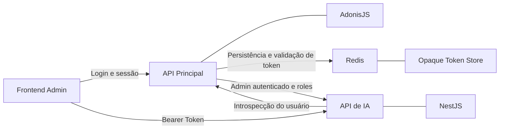
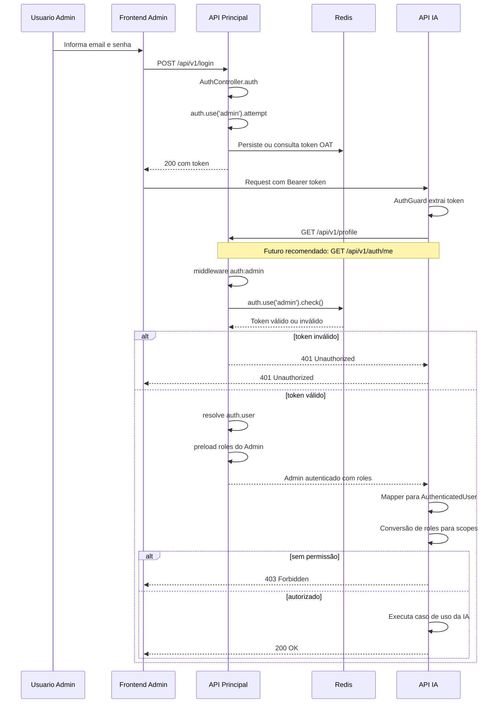
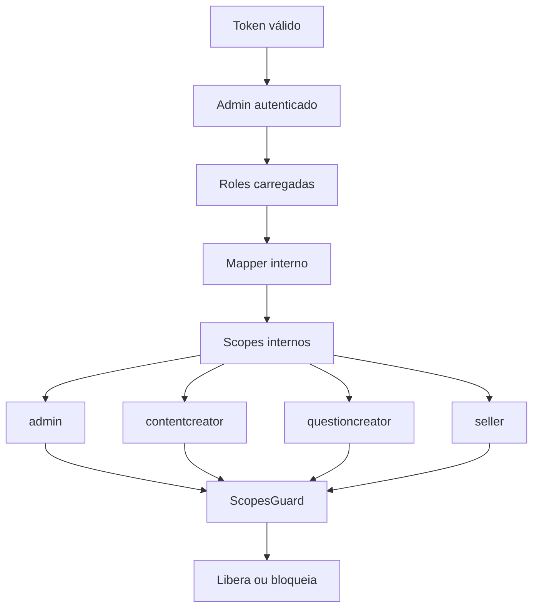
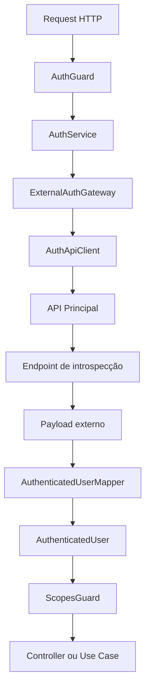
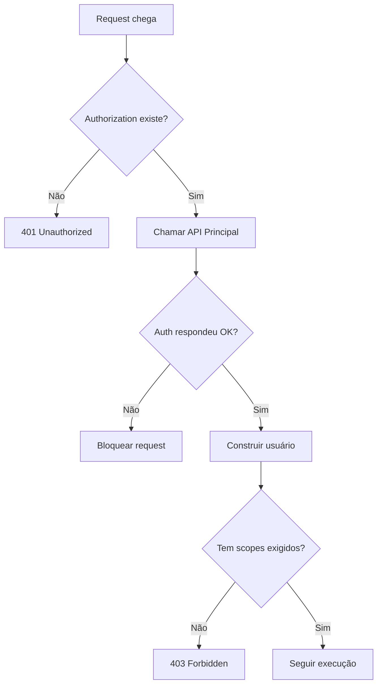

# 🔐 Arquitetura de Autenticação Delegada
## Reaproveitamento do Auth da API Principal (AdonisJS) na API de IA de Questions (NestJS)

> Documento técnico de arquitetura voltado à explicação do desenho da solução de autenticação delegada entre a API principal e a API de IA de Questions.

---


---

# 📚 Sumário

- [1. Visão Geral](#1--visão-geral)
- [2. Contexto Técnico Validado](#2--contexto-técnico-validado)
- [3. Problema Arquitetural](#3--problema-arquitetural)
- [4. Decisão de Arquitetura](#4--decisão-de-arquitetura)
- [5. Solução Proposta](#5--solução-proposta)
- [6. Fluxo de Autenticação](#6--fluxo-de-autenticação)
- [7. Fluxo de Autorização](#7--fluxo-de-autorização)
- [8. Contratos de Integração](#8--contratos-de-integração)
- [9. Endpoint de Introspecção](#9--endpoint-de-introspecção)
- [10. Arquitetura do Módulo Auth da IA](#10--arquitetura-do-módulo-auth-da-ia)
- [11. Estrutura de Arquivos do Módulo Auth](#11--estrutura-de-arquivos-do-módulo-auth)
- [12. Requisitos de Segurança](#12--requisitos-de-segurança)
- [13. Observabilidade e Auditoria](#13--observabilidade-e-auditoria)
- [14. Estratégia de Cache](#14--estratégia-de-cache)
- [15. Anti-padrões](#15--anti-padrões)
- [16. Decisão Final da Fase 1](#16--decisão-final-da-fase-1)
- [17. Próximos Passos](#17--próximos-passos)
- [18. Conclusão Executiva](#18--conclusão-executiva)

---

# 1. 🎯 Visão Geral

Este documento descreve o desenho arquitetural da solução de **autenticação delegada** entre a **API principal** e a **API de IA de Questions**.

O objetivo é estabelecer, de forma clara e técnica, como o contexto autenticado de um usuário administrativo deve ser reaproveitado entre serviços distintos, preservando:

- centralização da identidade;
- consistência de autorização;
- segurança de acesso;
- isolamento de responsabilidades;
- escalabilidade arquitetural.

A proposta descrita neste material não trata de autenticação como funcionalidade isolada, mas como **parte estrutural do boundary entre serviços**.

## Princípio central

A API de IA não realiza autenticação própria.
A autenticação é responsabilidade exclusiva da API principal, sendo a IA consumidora de contexto autenticado validado externamente.

---

# 2. 🧩 Contexto Técnico Validado

## 2.1 Stack de autenticação atual

- **Framework:** AdonisJS
- **Guard padrão:** `admin`
- **Driver:** `oat` (**Opaque Access Token**)
- **Persistência do token:** **Redis**
- **Provider de identidade:** `Admin`
- **Autorização atual:** baseada em `roles`
- **Rotas administrativas:** protegidas por `auth:admin` + `role:*`

## 2.2 Guard administrativo validado

```ts
admin: {
  driver: 'oat',
  tokenProvider: {
    type: 'api',
    driver: 'redis',
    redisConnection: 'local',
    foreignKey: 'admin_id',
  },
  provider: {
    driver: 'lucid',
    identifierKey: 'id',
    uids: ['email'],
    model: () => import('App/Models/Admin'),
  },
}
```

## 2.3 Conclusão prática

A **API de IA deve reaproveitar o contexto `admin`**, porque o acesso operacional da camada de IA pertence ao mesmo contexto administrativo já existente.

```text
auth:admin
```

---

# 3. 🧠 Problema Arquitetural

Se a API de IA tentar criar um auth próprio, surgem problemas imediatos:

- duplicação de identidade;
- inconsistência entre permissões e sessões;
- risco de autorização divergente;
- necessidade de manter login e expiração em dois sistemas;
- acoplamento incorreto entre domínio de IA e identidade.

## O problema real

A API de IA precisa saber:

- quem é o usuário autenticado;
- se o token dele é válido;
- quais roles ele possui;
- se ele pode executar determinada operação da IA.

Mas ela **não deve** assumir a responsabilidade de autenticar por conta própria.

---

# 4. 🏛️ Decisão de Arquitetura

## 4.1 Decisão oficial

A arquitetura adotada será de:

## **Autenticação delegada com introspecção controlada**

## 4.2 Papéis de cada sistema

| Sistema | Responsabilidade |
|---|---|
| **API Principal (AdonisJS)** | Autoridade de autenticação e resolução de identidade |
| **API de IA (NestJS)** | Consumidora de contexto autenticado e executora de autorização interna |

## 4.3 Resumo arquitetural

A API principal é responsável pela autenticação.
A API de IA é responsável pela autorização baseada no contexto recebido.

---

# 5. 🛰️ Solução Proposta

## 5.1 Objetivo da solução

A API de IA de Questions atua como serviço especializado para:

- ingestão de documentos;
- processamento e extração;
- geração assistida por IA;
- revisão e pipeline de questões;
- operações internas do fluxo de construção de banco de questões.

Não possui mecanismo próprio de autenticação.
Depende integralmente do token administrativo emitido pela API principal.

## 5.2 Resultado arquitetural desejado

```text
A mesma identidade administrativa da app principal controla o acesso à API de IA.
```

## 5.3 Diagrama executivo de alto nível



---

# 6. 🔄 Fluxo de Autenticação

## 6.1 Visão funcional ponta a ponta


## 6.2 Fluxo por sequência técnica



---

# 7. 🛂 Fluxo de Autorização

A autenticação resolve **quem é o usuário**.  
A autorização resolve **o que ele pode fazer**.

Na API principal, a autorização atual está acoplada a `roles`.  
Na API de IA, a recomendação é usar **scopes internos**, derivados dessas roles.

## 7.1 Fluxo de autorização interno



## 7.2 Separação correta de responsabilidades

| Camada | Responsabilidade |
|---|---|
| **API Principal** | Validar token e resolver identidade |
| **API Principal** | Carregar roles do admin |
| **API de IA** | Converter roles legadas em scopes internos |
| **API de IA** | Decidir autorização por endpoint e caso de uso |

---

# 8. 📦 Contratos de Integração

## 8.1 Estado atual validado

Hoje, com base no `AuthController.show`, o comportamento validado é:

```ts
const user = auth.user as Admin
return response.ok(
  await Admin.query().preload('roles').where('id', user.id).first()
)
```

Ou seja, **a API principal hoje devolve o `Admin` carregado com `roles`**.

## 8.2 Exemplo completo de payload atual

```json
{
  "id": 10,
  "name": "Matheus Diamantino",
  "email": "admin@empresa.com",
  "roles": [
    {
      "id": 1,
      "name": "admin",
      "slug": "admin"
    },
    {
      "id": 3,
      "name": "questioncreator",
      "slug": "questioncreator"
    }
  ],
  "created_at": "2026-01-10T10:00:00.000Z",
  "updated_at": "2026-02-10T10:00:00.000Z"
}
```

## 8.3 Payload ideal recomendado

```json
{
  "id": 10,
  "name": "Matheus Diamantino",
  "email": "admin@empresa.com",
  "roles": ["admin", "questioncreator"],
  "active": true,
  "status": "active"
}
```

## 8.4 Contrato interno canônico da IA

```ts
export interface AuthenticatedUser {
  id: number
  name: string
  email: string
  roles: string[]
  scopes: string[]
  isActive: boolean
  status?: string
}
```

## 8.5 Contrato externo esperado

```ts
export interface ExternalAdminProfile {
  id: number
  name: string
  email: string
  active?: boolean
  status?: string
  roles: Array<
    | string
    | {
        id?: number
        name?: string
        slug?: string
      }
  >
}
```

## 8.6 Role -> Scope Mapping

```ts
export const ROLE_SCOPE_MAP: Record<string, string[]> = {
  admin: ['*'],
  contentcreator: [
    'content.read',
    'content.write',
    'documents.read'
  ],
  questioncreator: [
    'documents.read',
    'documents.upload',
    'processing.read',
    'processing.retry',
    'questions.generate',
    'questions.review'
  ],
  seller: [
    'dashboard.read'
  ],
}
```

---

# 9. 🌐 Endpoint de Introspecção

## 9.1 Estado atual utilizável

```http
GET /api/v1/profile
```

## 9.2 Estado recomendado

```ts
Route.get('/auth/me', 'AuthController.me').middleware(['auth:admin'])
```

## 9.3 Controller recomendado

```ts
public async me({ response, auth }: HttpContextContract) {
  const user = auth.user as Admin

  const admin = await Admin.query()
    .preload('roles')
    .where('id', user.id)
    .first()

  return response.ok(admin)
}
```

## 9.4 Requisitos do endpoint

- retornar payload estável e canônico;
- não depender de regras de tela ou perfil;
- ser protegido apenas por `auth:admin`;
- responder exclusivamente contexto autenticado.

---

# 10. 🧱 Arquitetura do Módulo Auth da IA

## 10.1 Princípio de implementação

O módulo `auth` da IA deve ser responsável apenas por:

- receber o token;
- validar esse token contra a app principal;
- construir um `AuthenticatedUser` interno;
- aplicar autorização por scopes.

Ele **não deve**:

- emitir token;
- persistir sessão administrativa;
- manter login próprio;
- reimplementar o guard do Adonis.

## 10.2 Diagrama da arquitetura do módulo



## 10.3 Responsabilidade dos componentes

### `AuthGuard`
- extrair Bearer Token;
- negar acesso se ausente;
- chamar `AuthService`;
- anexar `request.user`.

### `AuthService`
- orquestrar autenticação delegada;
- chamar gateway externo;
- receber payload autenticado.

### `ExternalAuthGateway`
- encapsular integração com a API principal.

### `AuthApiClient`
- executar chamada HTTP;
- tratar timeout e status codes.

### `AuthenticatedUserMapper`
- converter payload externo em contrato interno;
- normalizar roles;
- gerar scopes internos.

### `ScopesGuard`
- validar autorização por endpoint.

---

# 11. 🌳 Estrutura de Arquivos do Módulo Auth

```text
src/modules/auth/
├── auth.module.ts
│
├── infra/
│   ├── clients/
│   │   └── auth-api.client.ts
│   │
│   ├── gateways/
│   │   └── external-auth.gateway.ts
│   │
│   ├── services/
│   │   └── auth.service.ts
│   │
│   ├── guards/
│   │   ├── auth.guard.ts
│   │   └── scopes.guard.ts
│   │
│   └── decorators/
│       ├── current-user.decorator.ts
│       └── required-scopes.decorator.ts
│
├── model/
│   ├── dto/
│   │   └── authenticated-user.dto.ts
│   │
│   ├── interfaces/
│   │   ├── external-admin-profile.interface.ts
│   │   ├── authenticated-user.interface.ts
│   │   └── role-scope-map.interface.ts
│   │
│   ├── enums/
│   │   └── internal-scope.enum.ts
│   │
│   └── constants/
│       └── role-scope-map.constant.ts
│
└── lib/
    ├── mappers/
    │   └── authenticated-user.mapper.ts
│   
    ├── helpers/
    │   ├── extract-bearer-token.helper.ts
    │   └── normalize-role.helper.ts
│   
    └── normalizers/
        └── external-auth-response.normalizer.ts
```

---

# 12. 🔐 Requisitos de Segurança

## 12.1 Requisitos obrigatórios

### Transporte
- TLS obrigatório;
- nunca trafegar token em query string;
- aceitar apenas `Authorization: Bearer`.

### Validação
- negar acesso por padrão;
- falha de introspecção deve bloquear;
- nunca considerar token “provavelmente válido”.

### Logs
- nunca logar token puro;
- mascarar headers sensíveis;
- não persistir credenciais em logs.

### Resiliência
- timeout curto (1s–2s);
- retry somente para falhas transitórias;
- não aplicar retry para `401` e `403`.

### Boundary Security
- a IA não deve acessar diretamente o Redis do Adonis;
- a IA não deve compartilhar segredos internos do auth principal;
- a IA não deve emitir token próprio para o mesmo contexto administrativo.

## 12.2 Fluxo de falhas de segurança



---

# 13. 📊 Observabilidade e Auditoria

## 13.1 Logs mínimos obrigatórios

- `request_id`
- `correlation_id`
- `user_id`
- `user_roles`
- `auth_provider_status_code`
- `auth_provider_latency_ms`
- `endpoint`
- `method`
- `decision`

## 13.2 Métricas recomendadas

### Counters
- `auth_requests_total`
- `auth_success_total`
- `auth_failures_total`
- `auth_forbidden_total`
- `auth_provider_timeout_total`

### Histograms
- `auth_provider_latency_ms`
- `auth_guard_execution_ms`

## 13.3 Auditoria

A API de IA deve ser capaz de auditar:

- qual admin executou a operação;
- em qual endpoint;
- com quais roles e scopes;
- em qual horário;
- com qual correlação de request.

---

# 14. ⚡ Estratégia de Cache

## 14.1 Regras recomendadas

### Permitido
- cache curto de payload autenticado;
- TTL pequeno (30s a 120s);
- cache apenas como otimização.

### Proibido
- cache longo de autorização;
- usar cache como fonte primária de verdade;
- ignorar revogação por causa de cache.

## 14.2 Recomendação para Fase 1

> **Não usar cache de auth inicialmente**.

---

# 15. 🚫 Anti-padrões

## 15.1 Não criar login próprio na API de IA
Fragmenta identidade.

## 15.2 Não validar token manualmente dentro da IA
O fluxo real usa **Adonis OAT + Redis**, não JWT puro.

## 15.3 Não acessar diretamente o Redis do Adonis
Acopla a IA à implementação interna do legado.

## 15.4 Não copiar o middleware `role` do legado para dentro da IA
A IA deve trabalhar com **scopes internos**.

## 15.5 Não espalhar payload cru da API principal pelo sistema
Contamina o domínio interno da API de IA.

---

# 16. ✅ Decisão Final da Fase 1

## 16.1 Veredito arquitetural

O reaproveitamento da autenticação da API principal para a API de IA está corretamente modelado para o contexto do sistema.

## 16.2 O que está oficialmente decidido

- **Login continua na API principal**;
- **Token continua sendo emitido pela API principal**;
- **API de IA consome o mesmo token**;
- **API principal valida e resolve identidade**;
- **API de IA converte roles em scopes internos**;
- **API de IA decide autorização localmente**.

## 16.3 Resumo em uma linha

```text
Frontend → API IA → API Principal → Redis → Contexto Autenticado → IA
```

---

# 17. 🚀 Próximos Passos

## 17.1 Objetivo real da Fase 1

O objetivo é **habilitar o acesso administrativo seguro à API de IA**, reaproveitando corretamente a autenticação da app principal.

## 17.2 Na API Principal
- manter o login administrativo existente;
- usar `GET /api/v1/profile` como base inicial;
- criar `GET /api/v1/auth/me` como evolução correta;
- padronizar payload;
- garantir preload consistente de roles.

## 17.3 Na API de IA
- criar o módulo `auth` completo;
- implementar `AuthGuard`;
- implementar `ScopesGuard`;
- criar `AuthenticatedUserMapper`;
- criar `ROLE_SCOPE_MAP`;
- proteger endpoints críticos da IA;
- escrever testes de integração ponta a ponta.

## 17.4 Evolução futura
- adicionar cache curto de introspecção;
- adicionar métricas detalhadas;
- endurecer auditoria;
- evoluir autorização por escopos finos.

---

# 18. 🧾 Conclusão Executiva

O desenho atual está **coerente com o código real mapeado** e **faz sentido para o que está sendo construído**.

A integração entre a app principal e a API de IA de Questions deve seguir o modelo de **autenticação delegada com introspecção**, usando a app principal como autoridade de identidade e a IA como consumidora de contexto autenticado.

## 18.1 O que isso garante na prática

- a IA não duplica login;
- a IA não duplica identidade;
- a IA não duplica emissão de token;
- a IA continua subordinada ao mesmo perímetro administrativo da plataforma principal;
- a autorização da IA evolui de forma própria e sustentável.

## 18.2 Síntese final

A API de IA de Questions deve operar como serviço administrativo especializado, reutilizando a autenticação existente da API principal.

Não deve haver duplicação de identidade, emissão de tokens paralelos ou lógica de autentação independente.

A consistência do sistema é garantida por:

- centralização da autenticação;
- desacoplamento da autorização;
- isolamento de responsabilidades;
- evolução controlada da arquitetura.

