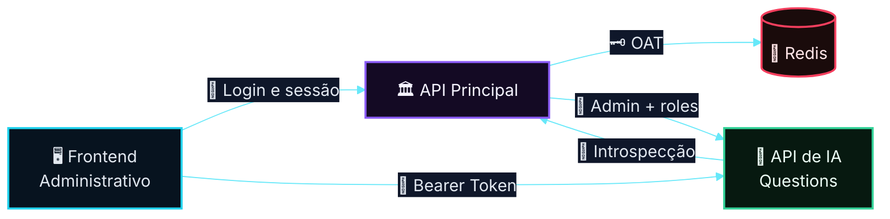
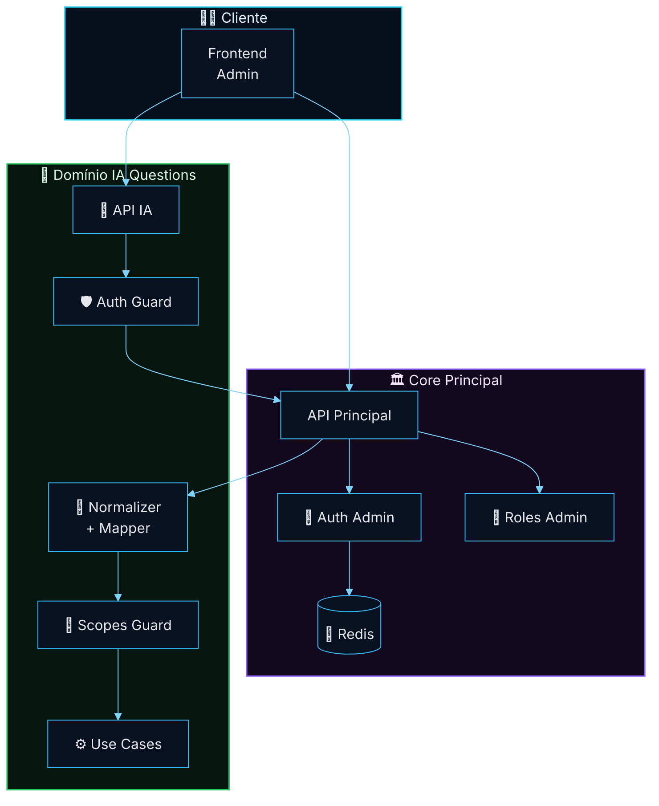
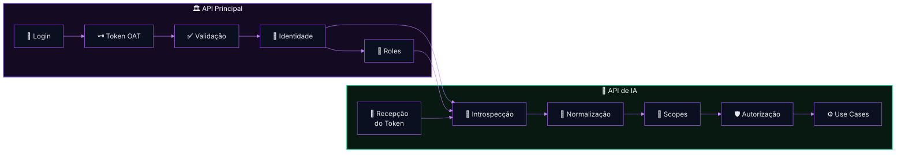
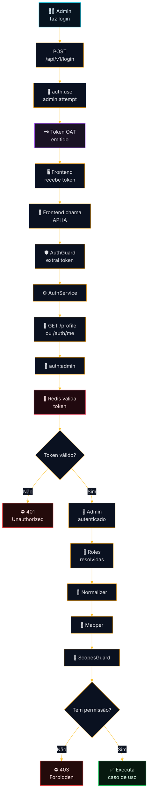
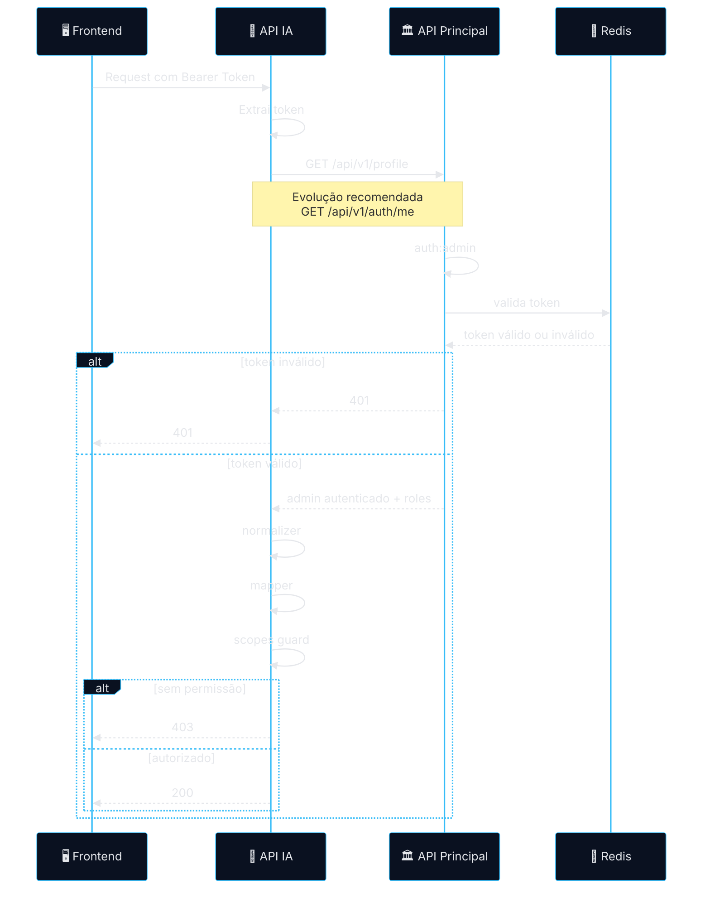
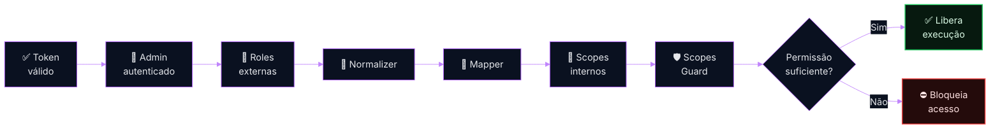
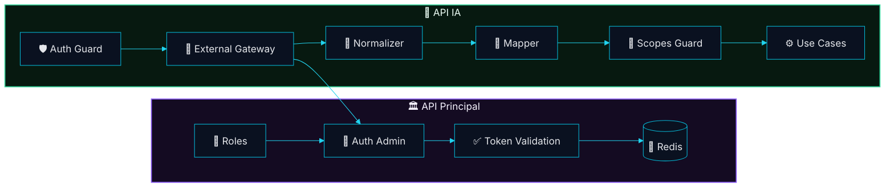
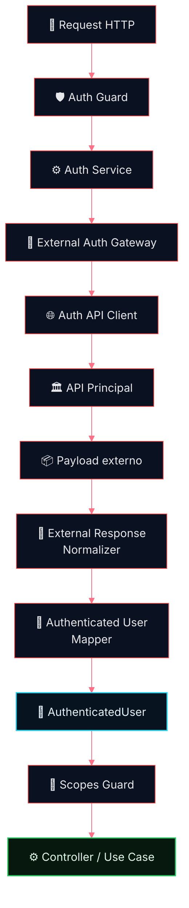
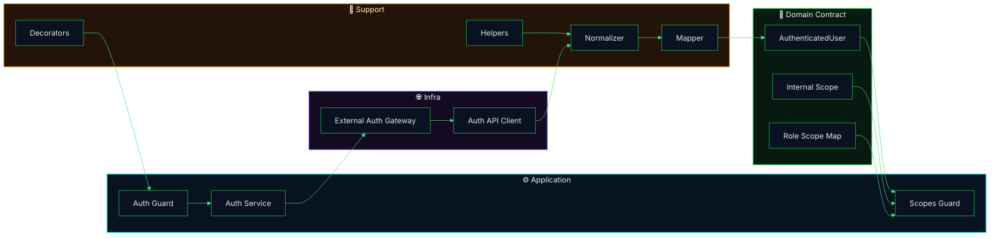

# 🔐 Arquitetura de Autenticação Delegada
## Reaproveitamento do Auth da API Principal (AdonisJS) na API de IA de Questions (NestJS)
### Recorte Arquitetural da Fase 1 — Auth, Identidade e Autorização Delegada

---

<div align="center">


</div>

---

> [!IMPORTANT]
> Este documento descreve o recorte arquitetural do módulo de autenticação e autorização delegada da Fase 1.
>
> O foco aqui não é a plataforma inteira de Questions, mas a base de segurança e acesso que permite a evolução segura do domínio.

> [!NOTE]
> O material foi estruturado como artefato técnico final, adequado para revisão arquitetural, PR técnica, alinhamento entre squads backend, implementação incremental e posterior hardening de segurança.

---

# Sumário

- [1. Resumo Executivo](#1-resumo-executivo)
- [2. Escopo do Documento](#2-escopo-do-documento)
- [3. Problema Arquitetural](#3-problema-arquitetural)
- [4. Decisão de Arquitetura](#4-decisão-de-arquitetura)
- [5. Contexto Técnico Validado](#5-contexto-técnico-validado)
- [6. Objetivos do Slice](#6-objetivos-do-slice)
- [7. Princípios Arquiteturais](#7-princípios-arquiteturais)
- [8. Arquitetura de Alto Nível](#8-arquitetura-de-alto-nível)
- [9. Fluxos Principais](#9-fluxos-principais)
- [10. Boundary e Responsabilidades](#10-boundary-e-responsabilidades)
- [11. Contrato de Integração](#11-contrato-de-integração)
- [12. Endpoint de Introspecção](#12-endpoint-de-introspecção)
- [13. Arquitetura Interna do Auth Module](#13-arquitetura-interna-do-auth-module)
- [14. Estratégia de Roles, Scopes e Enforcement](#14-estratégia-de-roles-scopes-e-enforcement)
- [15. Estrutura Técnica Recomendada](#15-estrutura-técnica-recomendada)
- [16. Segurança, Resiliência e Observabilidade](#16-segurança-resiliência-e-observabilidade)
- [17. ADR — Registro da Decisão](#17-adr--registro-da-decisão)
- [18. Plano de Implementação](#18-plano-de-implementação)
- [19. Critérios de Aceite Técnico](#19-critérios-de-aceite-técnico)
- [20. Próximos Passos](#20-próximos-passos)
- [21. Conclusão Executiva](#21-conclusão-executiva)

---

# 1. Resumo Executivo

A proposta estabelece um modelo de **autenticação delegada com introspecção controlada**, no qual a **API Principal (AdonisJS)** permanece como **fonte única de verdade da identidade administrativa**, enquanto a **API de IA de Questions (NestJS)** recebe esse contexto autenticado para aplicar **autorização local por domínio**.

Em termos práticos, isso evita que a API de IA precise manter login, estado de sessão ou emissão própria de token para o mesmo perímetro administrativo já coberto pela plataforma principal. A IA passa a trabalhar sobre uma identidade confiável, resolvida externamente, e transforma esse contexto em uma semântica de permissão própria do domínio de Questions.

## Decisão central

```text
A API Principal autentica.
A API de IA consome identidade autenticada.
A API de IA autoriza localmente.
```

## Resultado esperado

- identidade única;
- sessão lógica única;
- ausência de duplicação de login e token;
- autorização desacoplada por domínio;
- integração segura, auditável e evolutiva.

> [!TIP]
> Esta abordagem reduz o acoplamento com o legado de autenticação, preserva o boundary entre serviços e permite que o domínio de Questions evolua sem carregar a responsabilidade de identidade da plataforma principal.

---

# 2. Escopo do Documento

## Em escopo

- reaproveitamento do auth administrativo existente;
- introspecção do token administrativo;
- resolução do contexto autenticado do `admin`;
- normalização do payload autenticado;
- mapeamento de `roles` externas para `scopes` internos;
- enforcement de autorização na API de IA;
- requisitos de segurança, resiliência e observabilidade;
- desenho técnico do `AuthModule` da IA.

## Fora de escopo

- login de frontend;
- UX ou UI de autenticação;
- pipeline completo de IA;
- OCR, embeddings e orquestração de LLM;
- geração ponta a ponta de questões;
- redesign do auth legado;
- migração para JWT;
- SSO externo ou federação multi-tenant.

> [!NOTE]
> O objetivo deste documento é recortar o slice estrutural de autenticação e autorização delegada. Outros módulos da Fase 1 dependem desse alicerce, mas não são detalhados aqui.

---

# 3. Problema Arquitetural

Se a API de IA implementar autenticação própria para esse mesmo acesso administrativo, o ecossistema passa a conviver com duplicidade de identidade, divergência de sessão e aumento de superfície de risco sem ganho real de domínio.

## Riscos de um auth duplicado

- duplicação de identidade;
- divergência de sessão entre sistemas;
- revogação distribuída e mais difícil de governar;
- inconsistência de permissão;
- maior superfície de ataque;
- acoplamento indevido entre IA e identidade;
- troubleshooting operacional mais difícil.

## O problema real

A API de IA não precisa autenticar um usuário do zero.

O que ela realmente precisa responder, de forma segura e consistente, é:

- quem é o usuário autenticado;
- se o token continua válido;
- quais roles esse usuário possui no perímetro administrativo;
- o que esse usuário pode executar dentro do domínio de Questions.

> [!IMPORTANT]
> O problema arquitetural correto não é “como fazer login na IA”.
>
> O problema correto é: **como confiar, de forma controlada, na identidade já autenticada pela plataforma principal**.

---

# 4. Decisão de Arquitetura

## Decisão oficial

# **Autenticação Delegada com Introspecção Controlada**

## Papel de cada sistema

| Sistema | Papel arquitetural |
|---|---|
| **API Principal (AdonisJS)** | Autoridade de autenticação, validação de token e resolução de identidade |
| **API de IA (NestJS)** | Consumidora de contexto autenticado e executora de autorização local |

## Regra de ouro

> [!IMPORTANT]
> **A API de IA não autentica usuários.**
>
> Ela apenas **confia de forma controlada** na identidade resolvida pela API principal, por meio de um contrato de introspecção estável e seguro.

## Decisão operacional

```text
Auth centralizado.
Autorização distribuída.
Boundary preservado.
```

Esse desenho separa claramente duas responsabilidades que precisam continuar independentes ao longo do tempo:

- a identidade continua centralizada no core principal;
- a semântica de acesso do domínio de Questions permanece local à API de IA.

---

# 5. Contexto Técnico Validado

## Stack atual

- **Framework principal:** AdonisJS
- **Framework da API de IA:** NestJS
- **Guard administrativo:** `admin`
- **Driver:** `oat` (Opaque Access Token)
- **Persistência do token:** Redis
- **Provider de identidade:** `Admin`
- **Autorização legada:** baseada em `roles`
- **Proteção atual de rotas:** `auth:admin` + `role:*`

## Guard administrativo validado

```ts
admin: {
  driver: 'oat',
  tokenProvider: {
    type: 'api',
    driver: 'redis',
    redisConnection: 'local',
    foreignKey: 'admin_id',
  },
  provider: {
    driver: 'lucid',
    identifierKey: 'id',
    uids: ['email'],
    model: () => import('App/Models/Admin'),
  },
}
```

## Conclusão prática

A identidade correta a ser reaproveitada pela API de IA é a identidade do perímetro administrativo já estabelecido na aplicação principal.

```text
auth:admin
```

Isso significa que o slice de Questions deve nascer compatível com a autenticação administrativa já existente, e não criar um canal paralelo de autenticação para resolver o mesmo problema.

---

# 6. Objetivos do Slice

Este slice existe para permitir que a API de IA aceite requests administrativas **sem implementar login próprio, sessão própria ou emissão de token própria**.

## Objetivos técnicos

1. receber o mesmo Bearer Token emitido pela app principal;
2. validar esse contexto contra a autoridade correta;
3. resolver o perfil autenticado com suas roles;
4. traduzir essas roles em scopes internos;
5. autorizar a operação localmente.

## Resultado arquitetural desejado

```text
Mesma identidade.
Mesma sessão lógica.
Sem duplicação de auth.
Com autorização isolada por domínio.
```

> [!TIP]
> O sucesso deste slice não está apenas em “funcionar”, mas em permitir que a API de IA cresça sem herdar dependências internas do mecanismo de auth do Adonis.

---

# 7. Princípios Arquiteturais

## Princípios norteadores

### 7.1 Single Source of Truth
A identidade administrativa deve existir em apenas um ponto confiável e governado.

### 7.2 Security by Default
Qualquer incerteza sobre autenticação, integridade do payload ou disponibilidade do provider deve resultar em bloqueio, nunca em permissão.

### 7.3 Boundary First
A API de IA não deve conhecer detalhes internos do provider, do driver do token nem da mecânica interna do guard do Adonis.

### 7.4 Stable Internal Contract
Mesmo que o payload externo evolua, o domínio da IA deve operar sobre um contrato autenticado interno estável e previsível.

### 7.5 Local Authorization
A semântica de acesso do domínio de Questions deve ser definida localmente por scopes internos, e não acoplada diretamente ao modelo de roles legado.

> [!NOTE]
> Esses princípios evitam que a autenticação delegada vire um atalho estrutural que mistura identidade, infraestrutura e regra de domínio dentro da IA.

---

# 8. Arquitetura de Alto Nível

## 8.1 Diretriz visual para diagramas

> [!TIP]
> Os diagramas abaixo foram desenhados em alto nível, com foco em leitura executiva, clareza de ownership e comunicação arquitetural.
>
> O padrão visual recomendado para este conjunto é:
>
> - fundo integralmente escuro;
> - alto contraste entre blocos e bordas;
> - cores neon equilibradas;
> - rótulos curtos e sem poluição visual;
> - bom espaçamento entre elementos;
> - ícones semânticos para leitura mais rápida.

## 8.2 Visão executiva



## 8.3 Diagrama de contexto



## 8.4 Diagrama de ownership



A leitura desses três diagramas deixa claro o recorte do problema: a plataforma principal continua dona de autenticação e identidade; a API de IA atua a partir dessa identidade, sem invadir o mecanismo interno do auth do core.

---

# 9. Fluxos Principais

## 9.1 Fluxo funcional ponta a ponta



## 9.2 Sequência técnica de request



## 9.3 Fluxo de decisão de autorização



## Nota de decisão

> [!IMPORTANT]
> A separação entre autenticação e autorização é proposital e obrigatória:
>
> - autenticação responde **quem é**;
> - autorização responde **o que pode fazer**.

Essa separação é o que permite reaproveitar o auth da plataforma principal sem engessar a semântica de acesso do domínio de Questions.

---

# 10. Boundary e Responsabilidades

## 10.1 O que cruza a fronteira entre sistemas

- token Bearer recebido na request;
- chamada de introspecção;
- payload autenticado do admin;
- roles administrativas necessárias;
- status mínimo da conta, quando aplicável.

## 10.2 O que não deve cruzar a fronteira

- acesso direto ao Redis;
- detalhes internos do provider do Adonis;
- segredos internos do auth principal;
- middleware legado reutilizado de forma acoplada;
- payload cru espalhado pela IA.

## 10.3 Boundary model



## 10.4 Matriz de ownership

| Tema | API Principal | API de IA |
|---|---|---|
| Login | ✅ | ❌ |
| Emissão de token | ✅ | ❌ |
| Revogação | ✅ | ❌ |
| Introspecção | ✅ | Consome |
| Normalização de payload | ❌ | ✅ |
| Mapeamento para scopes | ❌ | ✅ |
| Autorização de domínio | ❌ | ✅ |
| Enforcement por endpoint | ❌ | ✅ |

O boundary correto impede que a IA se torne dependente de detalhes internos da autenticação do core e mantém a integração sustentável ao longo do tempo.

---

# 11. Contrato de Integração

## 11.1 Estado atual utilizável

Hoje, com base no comportamento atual do `AuthController.show`, o contrato efetivamente disponível é equivalente a:

```ts
const user = auth.user as Admin

return response.ok(
  await Admin.query().preload('roles').where('id', user.id).first()
)
```

## 11.2 Exemplo de payload atual

```json
{
  "id": 10,
  "name": "Matheus Diamantino",
  "email": "admin@empresa.com",
  "roles": [
    {
      "id": 1,
      "name": "admin",
      "slug": "admin"
    },
    {
      "id": 3,
      "name": "questioncreator",
      "slug": "questioncreator"
    }
  ],
  "created_at": "2026-01-10T10:00:00.000Z",
  "updated_at": "2026-02-10T10:00:00.000Z"
}
```

## 11.3 Payload recomendado para estabilização futura

```json
{
  "id": 10,
  "name": "Matheus Diamantino",
  "email": "admin@empresa.com",
  "roles": ["admin", "questioncreator"],
  "active": true,
  "status": "active"
}
```

## 11.4 Contrato interno canônico da IA

```ts
export interface AuthenticatedUser {
  id: number
  name: string
  email: string
  roles: string[]
  scopes: string[]
  isActive: boolean
  status?: string
}
```

## 11.5 Regra de robustez

A IA pode ser tolerante a pequenas variações do payload externo, mas essa tolerância deve existir apenas na camada de normalização.

O domínio interno deve trabalhar sempre com um contrato estável, simples e previsível.

> [!TIP]
> Regra prática: **tolerância fora, rigidez dentro**.

---

# 12. Endpoint de Introspecção

## Estado atual utilizável

```http
GET /api/v1/profile
```

## Evolução recomendada

```ts
Route.get('/auth/me', 'AuthController.me').middleware(['auth:admin'])
```

## Controller recomendado

```ts
public async me({ response, auth }: HttpContextContract) {
  const user = auth.user as Admin

  const admin = await Admin.query()
    .preload('roles')
    .where('id', user.id)
    .first()

  return response.ok(admin)
}
```

## Requisitos do endpoint

- payload estável e canônico;
- ausência de dependência de UI;
- ausência de lógica incidental de tela;
- proteção apenas por `auth:admin`;
- contrato previsível para integração entre serviços.

## Recomendação enterprise adicional

### Headers internos sugeridos entre serviços

```http
X-Internal-Client: questions-ai-api
X-Correlation-Id: <uuid>
X-Request-Id: <uuid>
```

### Controles recomendados

- allowlist de origem interna por ambiente;
- rate limit técnico para introspecção;
- logs estruturados por request;
- versionamento de contrato quando necessário.

> [!IMPORTANT]
> O endpoint de introspecção deve representar um contrato de plataforma, e não um reaproveitamento incidental de um endpoint pensado para consumo de tela.

---

# 13. Arquitetura Interna do Auth Module

## 13.1 Princípio de implementação

O `AuthModule` da IA deve ser responsável por:

- receber o token;
- validar esse token contra a API principal;
- construir um `AuthenticatedUser` interno;
- aplicar autorização por scopes.

Ele não deve:

- emitir token;
- persistir sessão administrativa;
- manter login próprio;
- reimplementar o guard do Adonis;
- acoplar a IA ao payload cru da API principal.

## 13.2 Diagrama interno do módulo



## 13.3 Composição interna



## 13.4 Sequência interna de responsabilidades

| Camada | Responsabilidade |
|---|---|
| **Client** | comunicação HTTP com provider externo |
| **Gateway** | boundary técnico com a API principal |
| **Service** | orquestração do processo de autenticação delegada |
| **Normalizer** | tolerância a payloads externos variáveis |
| **Mapper** | construção do contrato canônico interno |
| **Guards** | enforcement técnico de acesso |

Essa composição reduz acoplamento, mantém cada responsabilidade em uma camada previsível e ajuda tanto na implementação quanto na testabilidade do módulo.

---

# 14. Estratégia de Roles, Scopes e Enforcement

## Regra central

```text
Role externa → Scope interno → Decisão de autorização
```

A API principal continua emitindo o contexto de identidade e roles administrativas. A API de IA, por sua vez, transforma isso em scopes internos mais aderentes ao seu domínio.

## Mapeamento inicial recomendado

```ts
export const ROLE_SCOPE_MAP: Record<string, string[]> = {
  admin: ['*'],
  contentcreator: [
    'content.read',
    'content.write',
    'documents.read'
  ],
  questioncreator: [
    'documents.read',
    'documents.upload',
    'processing.read',
    'processing.retry',
    'questions.generate',
    'questions.review'
  ],
  seller: [
    'dashboard.read'
  ],
}
```

## Estratégia de enforcement

A autorização deve ocorrer em camadas complementares:

- **AuthGuard** → valida identidade;
- **ScopesGuard** → valida permissão técnica do endpoint;
- **Application Layer / Use Case** → valida regra de negócio.

## Exemplo de uso no NestJS

```ts
@UseGuards(AuthGuard, ScopesGuard)
@RequiredScopes('questions.generate')
@Post('/questions/generate')
async generate(@CurrentUser() user: AuthenticatedUser) {
  return this.generateQuestionsUseCase.execute({
    actorId: user.id,
  })
}
```

## Nota arquitetural

> [!IMPORTANT]
> Essa separação evita que a semântica de acesso da IA fique refém da modelagem de roles do legado.

A role é útil como entrada de contexto. O scope interno é o que realmente traduz intenção de acesso dentro do domínio de Questions.

---

# 15. Estrutura Técnica Recomendada

## 15.1 Tree view técnica do módulo

```text
src/
└── modules/
    └── auth/
        ├── 📦 auth.module.ts
        │
        ├── 🌐 infra/
        │   ├── 🌍 clients/
        │   │   └── 🔹 auth-api.client.ts
        │   ├── 🔌 gateways/
        │   │   └── 🔹 external-auth.gateway.ts
        │   ├── ⚙️ services/
        │   │   └── 🔹 auth.service.ts
        │   ├── 🛡️ guards/
        │   │   ├── 🔹 auth.guard.ts
        │   │   └── 🔹 scopes.guard.ts
        │   └── 🧩 decorators/
        │       ├── 🔹 current-user.decorator.ts
        │       └── 🔹 required-scopes.decorator.ts
        │
        ├── 🧠 model/
        │   ├── 🧾 dto/
        │   │   └── 🔹 authenticated-user.dto.ts
        │   ├── 📘 interfaces/
        │   │   ├── 🔹 external-admin-profile.interface.ts
        │   │   ├── 🔹 authenticated-user.interface.ts
        │   │   └── 🔹 role-scope-map.interface.ts
        │   ├── 🏷️ enums/
        │   │   └── 🔹 internal-scope.enum.ts
        │   └── 🧱 constants/
        │       └── 🔹 role-scope-map.constant.ts
        │
        └── 🧪 lib/
            ├── 🔄 mappers/
            │   └── 🔹 authenticated-user.mapper.ts
            ├── 🧰 helpers/
            │   ├── 🔹 extract-bearer-token.helper.ts
            │   └── 🔹 normalize-role.helper.ts
            └── 🧼 normalizers/
                └── 🔹 external-auth-response.normalizer.ts
```

## 15.2 Tree view visual de alto nível

```mermaid
%%{init: {'theme':'base','themeVariables': {
  'background':'#020617',
  'primaryColor':'#081120',
  'primaryTextColor':'#e5e7eb',
  'primaryBorderColor':'#22d3ee',
  'lineColor':'#67e8f9',
  'secondaryColor':'#0b1220',
  'tertiaryColor':'#111827',
  'clusterBkg':'#040816',
  'clusterBorder':'#8b5cf6',
  'fontFamily':'Inter, Segoe UI, Arial'
}}}%%
flowchart TD
    ROOT["📦 src/modules/auth"]

    ROOT --> M1["🌐 infra"]
    ROOT --> M2["🧠 model"]
    ROOT --> M3["🧪 lib"]
    ROOT --> M4["📦 auth.module.ts"]

    M1 --> I1["🌍 clients"]
    M1 --> I2["🔌 gateways"]
    M1 --> I3["⚙️ services"]
    M1 --> I4["🛡️ guards"]
    M1 --> I5["🧩 decorators"]

    M2 --> D1["🧾 dto"]
    M2 --> D2["📘 interfaces"]
    M2 --> D3["🏷️ enums"]
    M2 --> D4["🧱 constants"]

    M3 --> L1["🔄 mappers"]
    M3 --> L2["🧰 helpers"]
    M3 --> L3["🧼 normalizers"]

    I1 --> F1["auth-api.client.ts"]
    I2 --> F2["external-auth.gateway.ts"]
    I3 --> F3["auth.service.ts"]
    I4 --> F4["auth.guard.ts<br/>scopes.guard.ts"]
    I5 --> F5["current-user.decorator.ts<br/>required-scopes.decorator.ts"]

    D1 --> F6["authenticated-user.dto.ts"]
    D2 --> F7["external-admin-profile.interface.ts<br/>authenticated-user.interface.ts<br/>role-scope-map.interface.ts"]
    D3 --> F8["internal-scope.enum.ts"]
    D4 --> F9["role-scope-map.constant.ts"]

    L1 --> F10["authenticated-user.mapper.ts"]
    L2 --> F11["extract-bearer-token.helper.ts<br/>normalize-role.helper.ts"]
    L3 --> F12["external-auth-response.normalizer.ts"]

    style ROOT fill:#140b22,stroke:#8b5cf6,stroke-width:2px,color:#f5f3ff
    style M1 fill:#07131f,stroke:#22d3ee,stroke-width:1.8px,color:#e0f2fe
    style M2 fill:#071910,stroke:#22c55e,stroke-width:1.8px,color:#dcfce7
    style M3 fill:#221408,stroke:#f59e0b,stroke-width:1.8px,color:#fef3c7
    style M4 fill:#1a0b0b,stroke:#fb7185,stroke-width:1.8px,color:#ffe4e6
```



## 15.3 Leitura arquitetural da estrutura

Essa organização foi pensada para comunicar intenção estrutural logo no primeiro contato com o módulo:

- `infra` concentra integração externa, serviços e enforcement técnico;
- `model` concentra contratos, semântica interna e componentes estáveis de domínio;
- `lib` concentra transformação, suporte e adaptação do payload externo;
- `auth.module.ts` funciona como ponto de composição do slice.

> [!TIP]
> Uma boa tree view não serve apenas para “mostrar pastas”. Ela ajuda a deixar explícito o boundary entre integração, contrato interno e enforcement.

---

# 16. Segurança, Resiliência e Observabilidade

## 16.1 Segurança por padrão

### Obrigatório

- TLS obrigatório;
- aceitar apenas `Authorization: Bearer`;
- nunca trafegar token em query string;
- negar acesso por padrão;
- falha de introspecção deve bloquear;
- nunca persistir token puro;
- nunca acessar Redis diretamente da IA.

## 16.2 Resiliência

### Regras recomendadas

- timeout entre **1000ms e 2000ms**;
- retry apenas para falhas transitórias;
- no máximo **1 retry curto**;
- nunca retry para `401`, `403` e `404`;
- preferir falha rápida a degradação silenciosa.

### Regra crítica

> [!IMPORTANT]
> **Falha de autenticação remota deve degradar para bloqueio, nunca para permissão.**

## 16.3 Observabilidade

### Logs mínimos

- `request_id`
- `correlation_id`
- `user_id`
- `user_roles`
- `auth_provider_status_code`
- `auth_provider_latency_ms`
- `endpoint`
- `method`
- `decision`

### Métricas recomendadas

- `auth_requests_total`
- `auth_success_total`
- `auth_failures_total`
- `auth_forbidden_total`
- `auth_provider_timeout_total`
- `auth_provider_latency_ms`
- `auth_guard_execution_ms`

## 16.4 Matriz de falha esperada

| Situação | Resultado esperado |
|---|---|
| Token ausente | `401 Unauthorized` |
| Token inválido | `401 Unauthorized` |
| Token revogado | `401 Unauthorized` |
| Usuário sem scope | `403 Forbidden` |
| Timeout da API principal | `503` ou bloqueio controlado |
| Payload inválido do provider | `401` ou `502`, conforme política adotada |

## 16.5 Hardening adicional recomendado

### Segurança de integração interna

- autenticação mTLS entre serviços em ambientes críticos;
- allowlist por rede privada ou service mesh;
- assinatura opcional de requests internos para rotas sensíveis;
- versionamento explícito do endpoint de introspecção.

### Proteção operacional

- circuit breaker na camada cliente;
- budget de timeout controlado;
- dashboards dedicados de auth delegada;
- alarmes por aumento de `401`, `403` e timeout.

> [!NOTE]
> O ponto mais importante aqui é que disponibilidade parcial do provider de auth não pode ser interpretada como confiança implícita. Em integração de identidade, incerteza operacional precisa ser tratada como negação.

---

# 17. ADR — Registro da Decisão

## ADR-001 — Modelo de autenticação entre API Principal e API de IA

### Status
**Aceito**

### Contexto
A API de IA precisa receber requests autenticadas do mesmo perímetro administrativo da plataforma principal, sem duplicar login, token ou estado de sessão.

### Decisão
Adotar **Autenticação Delegada com Introspecção Controlada**, usando a API Principal como autoridade de autenticação e a API de IA como consumidora de identidade autenticada com autorização local baseada em scopes.

### Consequências positivas

- elimina duplicação de auth;
- reduz risco operacional;
- preserva boundary arquitetural;
- facilita troubleshooting;
- melhora governança de identidade.

### Trade-offs assumidos

- dependência controlada da disponibilidade da API Principal;
- necessidade de normalização do payload externo;
- necessidade de observabilidade forte na integração.

---

# 18. Plano de Implementação

## API Principal

- [ ] manter `auth:admin` como fonte de verdade
- [ ] expor endpoint estável de introspecção
- [ ] garantir preload consistente de `roles`
- [ ] padronizar payload retornado
- [ ] validar `401` para token inválido
- [ ] estabilizar contrato de integração

## API de IA

- [ ] criar `AuthModule`
- [ ] implementar `AuthGuard`
- [ ] implementar `ScopesGuard`
- [ ] implementar `AuthService`
- [ ] implementar `ExternalAuthGateway`
- [ ] implementar `AuthApiClient`
- [ ] implementar `AuthenticatedUserMapper`
- [ ] implementar normalizer do payload externo
- [ ] implementar `ROLE_SCOPE_MAP`
- [ ] proteger endpoints críticos
- [ ] instrumentar logs e métricas

## Testes obrigatórios

- [ ] token ausente
- [ ] token inválido
- [ ] token expirado ou revogado
- [ ] token válido
- [ ] autorização por scope
- [ ] falha da API principal
- [ ] teste ponta a ponta entre APIs
- [ ] payload externo inconsistente

## Ordem de execução recomendada

1. estabilizar contrato de introspecção na API principal;
2. construir contrato interno canônico na IA;
3. implementar guard de autenticação;
4. implementar guard de scopes;
5. proteger endpoints críticos;
6. instrumentar observabilidade;
7. validar com testes integrados.

Essa ordem reduz retrabalho e ajuda a evitar que a implementação comece por detalhes de guard antes de existir um contrato estável entre os serviços.

---

# 19. Critérios de Aceite Técnico

## Critérios funcionais

- a API de IA aceita Bearer Token emitido pela API principal;
- a API de IA rejeita token inválido ou revogado;
- a API de IA constrói corretamente o `AuthenticatedUser` interno;
- a autorização por scope protege endpoints críticos;
- requests autorizados executam normalmente.

## Critérios não funcionais

- logs e métricas suficientes para troubleshooting;
- comportamento previsível em timeout ou falha remota;
- ausência de dependência direta com Redis;
- ausência de emissão de token na IA;
- boundary preservado entre identidade e domínio de Questions.

## Critério arquitetural principal

> [!IMPORTANT]
> O módulo estará correto quando a API de IA puder confiar na identidade administrativa da API principal **sem se tornar dependente da implementação interna do auth do Adonis**.

---

# 20. Próximos Passos

## Na API Principal

- manter o login administrativo existente;
- usar `GET /api/v1/profile` como base inicial;
- criar `GET /api/v1/auth/me` como evolução correta;
- padronizar payload;
- garantir preload consistente de roles.

## Na API de IA

- criar o módulo `auth` completo;
- implementar `AuthGuard`;
- implementar `ScopesGuard`;
- criar `AuthenticatedUserMapper`;
- criar `ROLE_SCOPE_MAP`;
- proteger endpoints críticos da IA;
- escrever testes de integração ponta a ponta.

## Evolução futura sugerida

### Fase 2

- cache técnico controlado de introspecção;
- circuit breaker mais maduro;
- scopes mais granulares por caso de uso;
- segregação por capability do domínio.

### Fase 3

- políticas centralizadas por policy engine, se necessário;
- trilha de auditoria ampliada;
- readiness para expansão multi-serviço.

---

# 21. Conclusão Executiva

O desenho arquitetural proposto está coerente com o stack validado, compatível com o modelo técnico atual e adequado para implementação segura neste estágio da plataforma.

Ele preserva o que precisa permanecer centralizado no core principal, ao mesmo tempo em que garante independência suficiente para a API de IA crescer com semântica própria de autorização.

## Síntese final

A API principal autentica.  
A API de IA confia.  
A API de IA normaliza.  
A API de IA traduz.  
A API de IA autoriza.  
A API de IA executa.

---

# Status do Documento

- **Tipo:** Documento arquitetural técnico final
- **Uso pretendido:** Entrega técnica / PR arquitetural / implementação
- **Escopo:** Slice de autenticação e autorização delegada da Fase 1
- **Status:** Pronto para revisão e implementação
- **Formato:** Markdown enterprise pronto para evolução incremental
