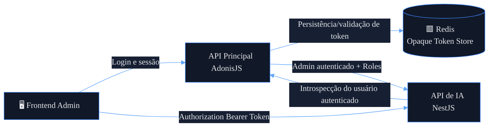
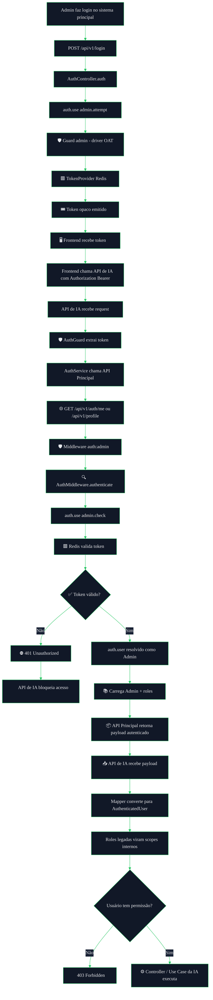
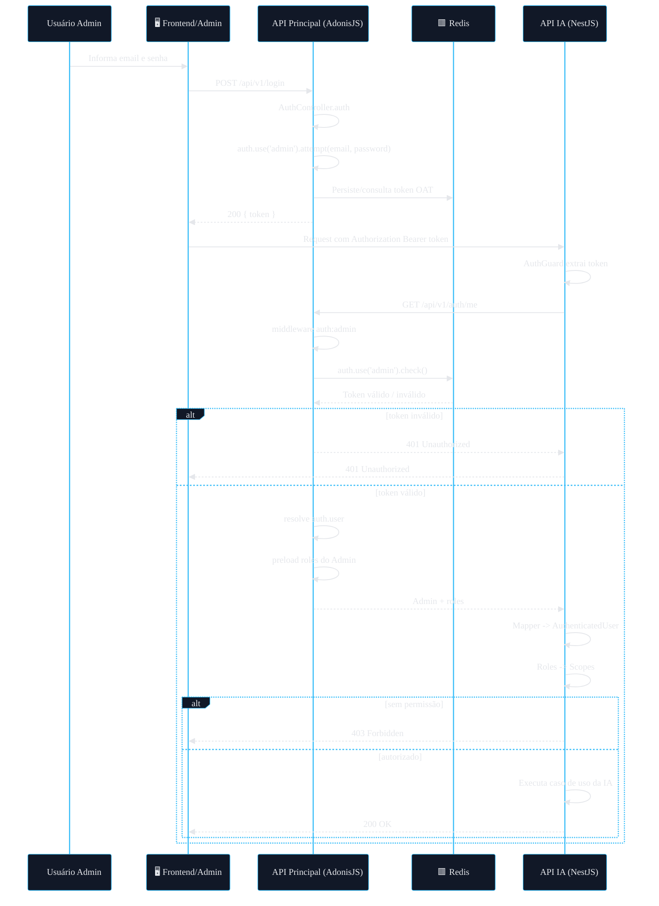
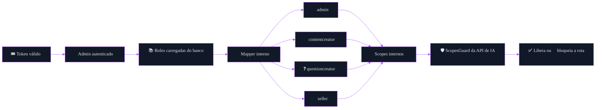
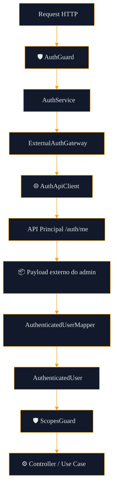
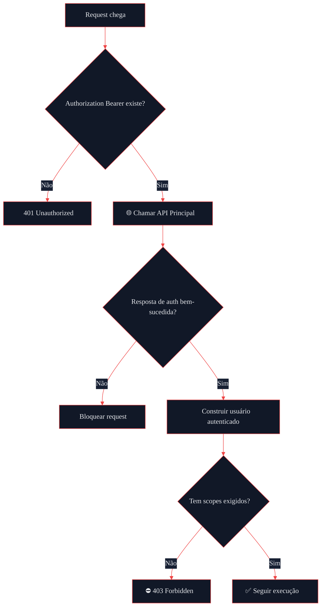

# 🔐 Arquitetura de Federação de Autenticação
## Reaproveitamento do Auth da API Principal (AdonisJS) na API de IA (NestJS)

---


---

# 📚 Sumário

- [1. Objetivo](#1--objetivo)
- [2. Contexto validado](#2--contexto-validado)
- [3. Problema arquitetural](#3--problema-arquitetural)
- [4. Decisão arquitetural](#4--decisão-arquitetural)
- [5. Visão executiva da solução](#5--visão-executiva-da-solução)
- [6. Fluxo completo de autenticação](#6--fluxo-completo-de-autenticação)
- [7. Fluxo de autorização](#7--fluxo-de-autorização)
- [8. Contratos de payload](#8--contratos-de-payload)
- [9. Endpoint de introspecção recomendado](#9--endpoint-de-introspecção-recomendado)
- [10. Arquitetura do módulo auth da API de IA](#10--arquitetura-do-módulo-auth-da-api-de-ia)
- [11. Tree view completa do módulo auth da IA](#11--tree-view-completa-do-módulo-auth-da-ia)
- [12. Regras de segurança](#12--regras-de-segurança)
- [13. Observabilidade e auditoria](#13--observabilidade-e-auditoria)
- [14. Estratégia de cache](#14--estratégia-de-cache)
- [15. Anti-padrões a evitar](#15--anti-padrões-a-evitar)
- [16. Decisão final](#16--decisão-final)
- [17. Próximos passos](#17--próximos-passos)

---

# 1. 🎯 Objetivo

Este documento define a arquitetura oficial para **reaproveitamento da autenticação da API principal** na nova **API de IA**, garantindo:

- consistência de identidade;
- segurança por padrão;
- baixo acoplamento;
- governança centralizada;
- autorização desacoplada do legado;
- evolução sustentável da plataforma.

## Princípio central

> A API de IA **não deve autenticar usuários por conta própria**.  
> Ela deve **confiar de forma segura** na autenticação já realizada pela API principal.

---

# 2. 🧩 Contexto validado

Com base nos arquivos da aplicação principal, o cenário atual já foi validado.

## Stack de autenticação atual

- **Framework:** AdonisJS
- **Guard padrão:** `admin`
- **Driver:** `oat` (**Opaque Access Token**)
- **Persistência do token:** **Redis**
- **Provider de identidade:** `Admin`
- **Autorização atual:** baseada em `roles`
- **Rotas administrativas:** protegidas por `auth:admin` + `role:*`

## Guards existentes

### Guard administrativo

```ts
admin: {
  driver: 'oat',
  tokenProvider: {
    type: 'api',
    driver: 'redis',
    redisConnection: 'local',
    foreignKey: 'admin_id',
  },
  provider: {
    driver: 'lucid',
    identifierKey: 'id',
    uids: ['email'],
    model: () => import('App/Models/Admin'),
  },
}
```

### Guard de cliente

```ts
api: {
  driver: 'oat',
  tokenProvider: {
    type: 'api',
    driver: 'redis',
    redisConnection: 'local',
    foreignKey: 'client_id',
  },
  provider: {
    driver: 'lucid',
    identifierKey: 'id',
    uids: ['email'],
    model: () => import('App/Models/Client'),
    connection: 'clientsPriority',
  },
}
```

## Conclusão importante

A **API de IA deve reaproveitar o contexto `admin`**, e não o `api`, porque o fluxo operacional interno e administrativo do sistema está claramente vinculado ao guard:

```text
auth:admin
```

---

# 3. 🧠 Problema arquitetural

Se a API de IA tentar criar um auth próprio, os seguintes problemas surgem imediatamente:

- duplicação de identidade;
- inconsistência entre permissões e sessões;
- risco de autorização divergente;
- necessidade de manter login e expiração em dois sistemas;
- acoplamento incorreto entre domínio de IA e identidade.

## Problema real

A API de IA precisa saber:

- **quem é o usuário autenticado**;
- **se o token dele é válido**;
- **quais papéis/perfis ele possui**;
- **se ele pode executar determinada operação da IA**.

Mas ela **não deve** assumir a responsabilidade de autenticar por conta própria.

---

# 4. 🏛️ Decisão arquitetural

## Decisão oficial

A arquitetura adotada será de:

## **Federação de autenticação com introspecção controlada**

### Papéis de cada sistema

| Sistema | Responsabilidade |
|---|---|
| **API Principal (AdonisJS)** | Autoridade de autenticação e resolução de identidade |
| **API de IA (NestJS)** | Consumidora de contexto autenticado e executora de autorização interna |

## Em uma frase

> A API principal autentica. A API de IA autoriza.

---

# 5. 🛰️ Visão executiva da solução



---

# 6. 🔄 Fluxo completo de autenticação

## 6.1 Visão funcional ponta a ponta



---

## 6.2 Fluxo por sequência técnica



---

# 7. 🛂 Fluxo de autorização

A autenticação resolve **quem é o usuário**.  
A autorização resolve **o que ele pode fazer**.

Na API principal, a autorização atual está acoplada a `roles`.  
Na API de IA, a recomendação é usar **scopes internos**, derivados dessas roles.

## 7.1 Fluxo de autorização interno



## 7.2 Separação correta de responsabilidades

| Camada | Responsabilidade |
|---|---|
| **API Principal** | Validar token e resolver identidade |
| **API Principal** | Carregar roles do admin |
| **API de IA** | Converter roles legadas em scopes internos |
| **API de IA** | Decidir autorização por endpoint/caso de uso |

---

# 8. 📦 Contratos de payload

A integração correta depende de contratos claros.

---

## 8.1 Payload real esperado da API principal

### Exemplo completo de resposta da introspecção

```json
{
  "id": 10,
  "name": "Matheus Diamantino",
  "email": "admin@empresa.com",
  "roles": [
    {
      "id": 1,
      "name": "admin",
      "slug": "admin"
    },
    {
      "id": 3,
      "name": "questioncreator",
      "slug": "questioncreator"
    }
  ],
  "created_at": "2026-01-10T10:00:00.000Z",
  "updated_at": "2026-02-10T10:00:00.000Z"
}
```

---

## 8.2 Payload ideal recomendado para exposição externa

O ideal é que a API principal normalize o payload e exponha algo mais estável para a API de IA.

```json
{
  "id": 10,
  "name": "Matheus Diamantino",
  "email": "admin@empresa.com",
  "roles": ["admin", "questioncreator"],
  "active": true,
  "status": "active"
}
```

### Vantagens desse formato

- reduz acoplamento ao modelo relacional interno;
- evita expor estrutura de banco;
- facilita parsing na API de IA;
- torna o contrato mais estável ao longo do tempo.

---

## 8.3 Contrato interno canônico da API de IA

A API de IA nunca deve espalhar o payload cru da API principal pelo sistema.

### Interface recomendada

```ts
export interface AuthenticatedUser {
  id: number
  name: string
  email: string
  roles: string[]
  scopes: string[]
  isActive: boolean
  status?: string
}
```

---

## 8.4 Contrato externo esperado na API de IA

```ts
export interface ExternalAdminProfile {
  id: number
  name: string
  email: string
  active?: boolean
  status?: string
  roles: Array<
    | string
    | {
        id?: number
        name?: string
        slug?: string
      }
  >
}
```

---

# 9. 🌐 Endpoint de introspecção recomendado

Hoje, o endpoint `GET /api/v1/profile` já pode servir como base de introspecção.  
Porém, arquiteturalmente, o ideal é criar um endpoint dedicado.

## 9.1 Rota recomendada

```ts
Route.get('/auth/me', 'AuthController.me').middleware(['auth:admin'])
```

---

## 9.2 Controller recomendado

```ts
public async me({ response, auth }: HttpContextContract) {
  const user = auth.user as Admin

  const admin = await Admin.query()
    .preload('roles')
    .where('id', user.id)
    .first()

  return response.ok(admin)
}
```

---

## 9.3 Melhorias recomendadas nesse endpoint

### Idealmente, ele deve:

- retornar payload estável e canônico;
- não depender de regras de tela/perfil;
- não estar acoplado a controller de UI administrativa;
- ser protegido apenas por `auth:admin`;
- responder exclusivamente contexto autenticado.

---

# 10. 🧱 Arquitetura do módulo auth da API de IA

A API de IA precisa de um módulo de auth **federado**, e não de um sistema de identidade novo.

## 10.1 Diagrama da arquitetura do módulo



---

## 10.2 Responsabilidade de cada componente

### `AuthGuard`
Responsável por:

- extrair o Bearer Token;
- negar acesso se o token estiver ausente;
- chamar o `AuthService`;
- anexar `request.user`.

### `AuthService`
Responsável por:

- orquestrar a autenticação federada;
- chamar o gateway externo;
- receber o payload autenticado.

### `ExternalAuthGateway`
Responsável por:

- encapsular a integração com a API principal;
- evitar espalhar detalhes de transporte pelo módulo.

### `AuthApiClient`
Responsável por:

- executar a chamada HTTP para a API principal;
- tratar timeout, status codes e erros de integração.

### `AuthenticatedUserMapper`
Responsável por:

- converter payload externo em contrato interno;
- normalizar roles;
- gerar scopes internos.

### `ScopesGuard`
Responsável por:

- validar autorização por endpoint;
- negar acesso se o usuário não tiver os scopes necessários.

---

# 11. 🌳 Tree view completa do módulo auth da IA

Abaixo está a estrutura recomendada para o módulo `auth` da API de IA, já no padrão modular enterprise.

```text
src/modules/auth/
├── auth.module.ts
│
├── infra/
│   ├── clients/
│   │   └── auth-api.client.ts
│   │
│   ├── gateways/
│   │   └── external-auth.gateway.ts
│   │
│   ├── services/
│   │   └── auth.service.ts
│   │
│   ├── guards/
│   │   ├── auth.guard.ts
│   │   └── scopes.guard.ts
│   │
│   └── decorators/
│       ├── current-user.decorator.ts
│       └── required-scopes.decorator.ts
│
├── model/
│   ├── dto/
│   │   └── authenticated-user.dto.ts
│   │
│   ├── interfaces/
│   │   ├── external-admin-profile.interface.ts
│   │   ├── authenticated-user.interface.ts
│   │   └── role-scope-map.interface.ts
│   │
│   ├── enums/
│   │   └── internal-scope.enum.ts
│   │
│   └── constants/
│       └── role-scope-map.constant.ts
│
└── lib/
    ├── mappers/
    │   └── authenticated-user.mapper.ts
    │
    ├── helpers/
    │   ├── extract-bearer-token.helper.ts
    │   └── normalize-role.helper.ts
    │
    └── normalizers/
        └── external-auth-response.normalizer.ts
```

---

## 11.1 Responsabilidade de cada arquivo

### `auth.module.ts`
Registra providers, guards, gateways, mappers e dependências do módulo.

### `auth-api.client.ts`
Cliente HTTP responsável por chamar a API principal.

### `external-auth.gateway.ts`
Abstração de integração externa com a autoridade de autenticação.

### `auth.service.ts`
Serviço principal de autenticação federada.

### `auth.guard.ts`
Guard de autenticação para proteger rotas da API de IA.

### `scopes.guard.ts`
Guard de autorização por escopo.

### `current-user.decorator.ts`
Decorator para recuperar `request.user` de forma limpa.

### `required-scopes.decorator.ts`
Decorator para declarar os scopes exigidos por rota.

### `authenticated-user.dto.ts`
DTO exposto internamente para transporte seguro do contexto autenticado.

### `external-admin-profile.interface.ts`
Contrato do payload vindo da API principal.

### `authenticated-user.interface.ts`
Contrato interno canônico da API de IA.

### `role-scope-map.constant.ts`
Mapa oficial de conversão de roles legadas para scopes internos.

### `authenticated-user.mapper.ts`
Converte payload externo em `AuthenticatedUser`.

### `extract-bearer-token.helper.ts`
Responsável por extrair e validar o header Authorization.

### `normalize-role.helper.ts`
Normaliza nomes/slugs de role.

### `external-auth-response.normalizer.ts`
Padroniza formatos diferentes de resposta da API principal.

---

# 12. 🔐 Regras de segurança

A integração de auth entre sistemas é uma superfície crítica.  
Portanto, o desenho precisa seguir regras explícitas de segurança.

## 12.1 Requisitos obrigatórios

### Transporte
- TLS obrigatório entre frontend, API principal e API de IA;
- nunca trafegar token em query string;
- aceitar apenas header `Authorization: Bearer`.

### Validação
- negar acesso por padrão;
- falha de introspecção deve resultar em bloqueio;
- nunca considerar token “provavelmente válido”.

### Logs
- nunca logar token em texto puro;
- mascarar headers sensíveis;
- não persistir credenciais em logs de erro.

### Resiliência
- timeout curto para chamada de auth externa (ideal: 1s–2s);
- retry **somente** para falhas transitórias (`5xx`, timeout, DNS, conexão);
- **não** aplicar retry para `401` e `403`.

### Boundary Security
- a API de IA não deve acessar diretamente o Redis de auth do Adonis;
- a API de IA não deve compartilhar segredos internos do auth da API principal;
- a API de IA não deve emitir token próprio para o mesmo contexto administrativo.

---

## 12.2 Fluxo de falhas de segurança



---

# 13. 📊 Observabilidade e auditoria

A camada de autenticação federada precisa ser completamente observável.

## 13.1 Logs mínimos obrigatórios

### Campos recomendados

- `request_id`
- `correlation_id`
- `user_id`
- `user_roles`
- `auth_provider_status_code`
- `auth_provider_latency_ms`
- `endpoint`
- `method`
- `decision` (`authorized` / `unauthorized` / `forbidden`)

---

## 13.2 Métricas recomendadas

### Counters
- `auth_requests_total`
- `auth_success_total`
- `auth_failures_total`
- `auth_forbidden_total`
- `auth_provider_timeout_total`

### Histograms
- `auth_provider_latency_ms`
- `auth_guard_execution_ms`

### Error Ratios
- taxa de `401` por minuto
- taxa de `403` por minuto
- taxa de timeout da introspecção

---

## 13.3 Auditoria

A API de IA deve ser capaz de auditar:

- qual admin executou a operação;
- em qual endpoint;
- com quais roles/scopes;
- em qual horário;
- com qual correlação de request.

Isso é especialmente importante para:

- geração de questões;
- reprocessamento;
- aprovação/revisão;
- publicação;
- ações sensíveis do pipeline.

---

# 14. ⚡ Estratégia de cache

A introspecção pode, opcionalmente, ser otimizada com cache curto.

## 14.1 Regras recomendadas

### Permitido
- cache curto de payload autenticado;
- TTL pequeno (ex.: 30s a 120s);
- cache apenas como otimização.

### Proibido
- cache longo de autorização;
- usar cache como fonte primária de verdade;
- ignorar revogação por causa de cache.

---

## 14.2 Recomendação para Fase 1

Na Fase 1, a recomendação mais segura é:

> **não usar cache de auth inicialmente**

Isso reduz complexidade e evita mascarar problemas de integração logo no início.

---

# 15. 🚫 Anti-padrões a evitar

## 15.1 Não criar login próprio na API de IA

Errado porque fragmenta identidade.

## 15.2 Não validar token manualmente dentro da IA

Errado porque o fluxo real usa **Adonis OAT + Redis**, não JWT puro.

## 15.3 Não acessar diretamente o Redis do Adonis

Errado porque acopla a IA à implementação interna do legado.

## 15.4 Não copiar o middleware `role` do legado para dentro da IA

Errado porque a IA deve trabalhar com **scopes internos**, não com autorização acoplada ao legado.

## 15.5 Não espalhar payload cru da API principal pelo sistema

Errado porque contamina o domínio interno da API de IA.

---

# 16. ✅ Decisão final

## Arquitetura final aprovada

- **Login continua na API principal**;
- **Token continua sendo emitido pela API principal**;
- **API de IA consome o mesmo token**;
- **API principal valida e resolve identidade**;
- **API de IA converte roles em scopes internos**;
- **API de IA decide autorização localmente**.

## Resumo em uma linha

```text
Frontend → API IA → API Principal → Redis → Contexto Autenticado → IA
```

---

# 17. 🚀 Próximos passos

Após aprovar este desenho, a sequência recomendada é:

## Na API Principal
- criar endpoint `GET /api/v1/auth/me`;
- padronizar o payload de resposta;
- garantir preload consistente de roles.

## Na API de IA
- criar módulo `auth` completo;
- implementar `AuthGuard`;
- implementar `ScopesGuard`;
- criar `AuthenticatedUserMapper`;
- criar `ROLE_SCOPE_MAP`;
- escrever testes de integração ponta a ponta.

---

# 🧾 Conclusão executiva

A arquitetura correta para reaproveitamento de autenticação entre a API principal e a API de IA é uma arquitetura de **federação de autenticação com introspecção controlada**.

Essa abordagem garante:

- segurança;
- consistência de identidade;
- menor acoplamento;
- governança centralizada;
- autorização mais madura e extensível na API de IA.

## Em uma frase final

> A API de IA deve operar como um sistema federado de autenticação, **confiando exclusivamente na API principal como fonte de verdade da identidade administrativa**.

