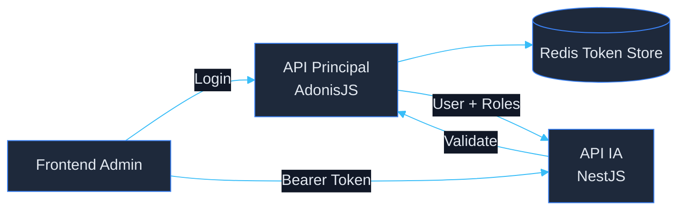
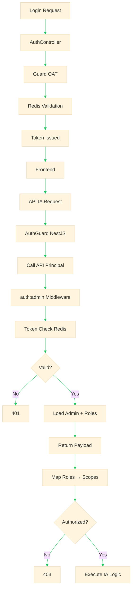
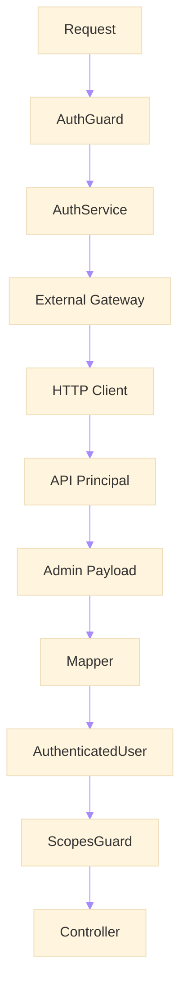

# 🔐 Enterprise Authentication Federation Architecture
## Reaproveitamento de Autenticação entre API Principal (AdonisJS) e API de IA (NestJS)

---


---

# 1. 📌 Overview

Este documento define a arquitetura oficial de **federation de autenticação** entre:

- **API Principal (AdonisJS)** → autoridade de identidade
- **API de IA (NestJS)** → consumidora de contexto autenticado

## Princípio central

> A API de IA NÃO autentica usuários. Ela CONFIA na autenticação da API principal.

---

# 2. 🧠 Architectural Decision

## Decisão

A autenticação será:

- Centralizada
- Delegada
- Validada via introspecção

## Modelo adotado

```text
Auth Authority → API Principal
Auth Consumer → API IA
```

---

# 3. 🏗️ High-Level Architecture



---

# 4. 🔄 Authentication Flow



---

# 5. 📦 Payload Contracts

## Payload externo (API Principal)

```json
{
  "id": 10,
  "name": "Matheus Diamantino",
  "email": "admin@empresa.com",
  "roles": [
    {
      "id": 1,
      "name": "admin"
    },
    {
      "id": 3,
      "name": "questioncreator"
    }
  ],
  "created_at": "2026-01-10T10:00:00Z",
  "updated_at": "2026-02-10T10:00:00Z"
}
```

---

## Payload interno (API IA)

```ts
export interface AuthenticatedUser {
  id: number
  name: string
  email: string
  roles: string[]
  scopes: string[]
  isActive: boolean
}
```

---

# 6. 🔐 Role → Scope Mapping

```ts
const ROLE_SCOPE_MAP = {
  admin: ['*'],
  contentcreator: ['content.read', 'content.write'],
  questioncreator: ['question.create', 'question.review'],
  seller: ['dashboard.read']
}
```

---

# 7. 🧱 IA Auth Module Architecture



---

# 8. 🛡️ Security Requirements

- TLS obrigatório
- Timeout curto (< 2s)
- Retry apenas para 5xx
- Nunca logar token
- Sanitizar headers
- Validar origem interna
- Rate limit na API principal

---

# 9. 📊 Observability

### Métricas

- auth_latency_ms
- auth_failures_total
- auth_success_total
- auth_timeout_total

### Logs

- request_id
- user_id
- roles
- endpoint

---

# 10. ⚠️ Anti-patterns

❌ Criar auth separado na IA  
❌ Validar token manualmente  
❌ Acessar Redis do Adonis diretamente  
❌ Copiar middleware de roles  

---

# 11. 🚀 Final Architecture

```text
Frontend → API IA → API Principal → Redis → User Context → IA
```

---

# 12. ✅ Final Statement

> A API de IA deve operar como um sistema federado de autenticação, confiando exclusivamente na API principal como fonte de verdade.

---

# 13. 📌 Next Steps

- Criar endpoint `/auth/me`
- Implementar AuthGuard
- Implementar ScopesGuard
- Criar Mapper
- Testes E2E

---

**Documento pronto para uso em produção enterprise.**

