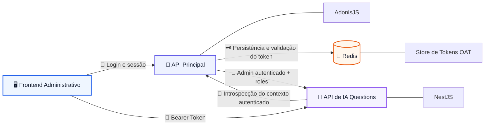
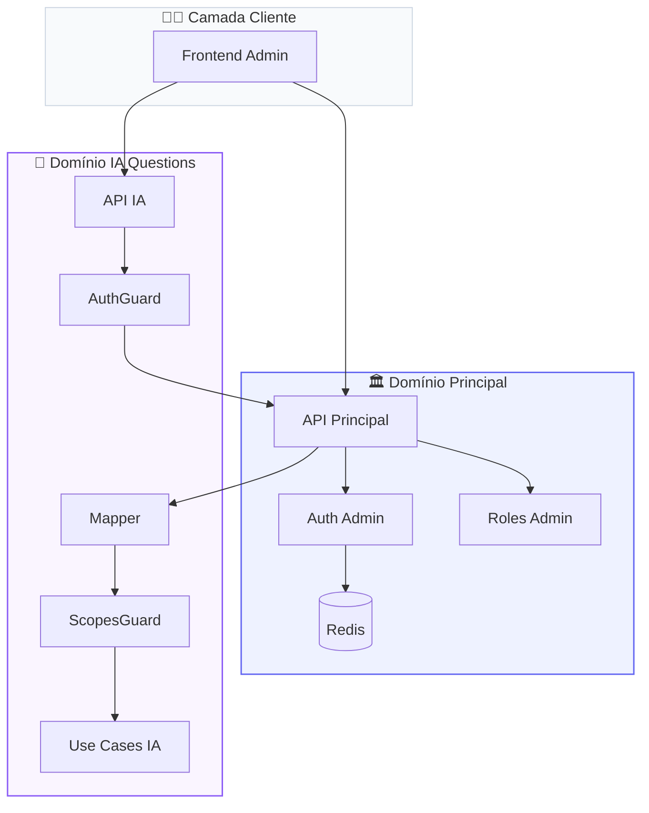
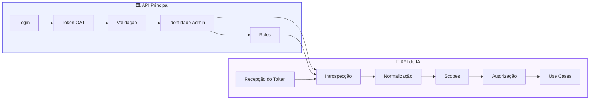
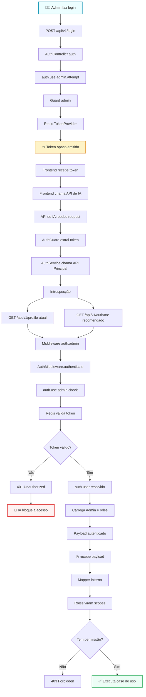
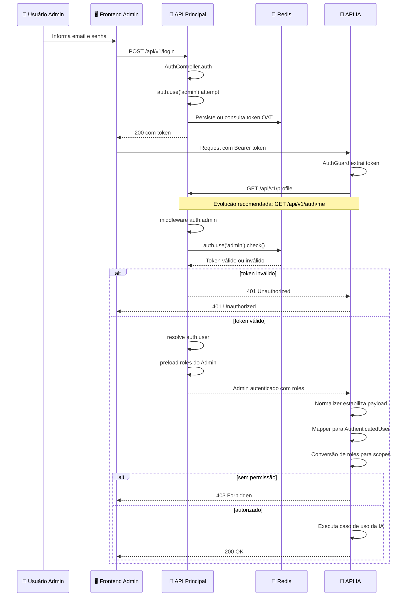
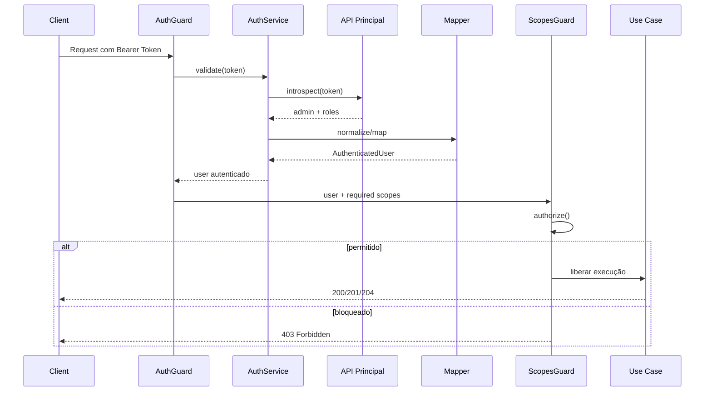
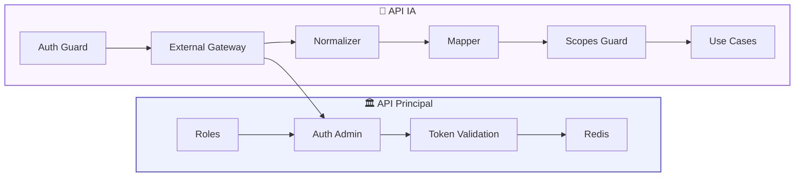
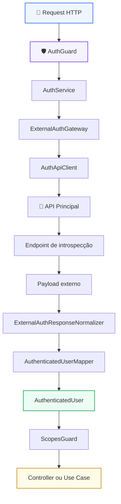
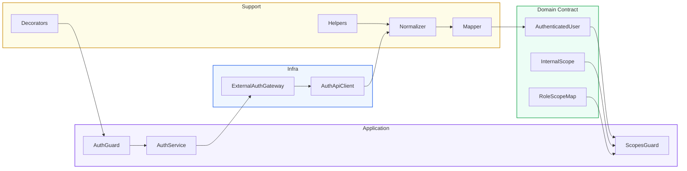
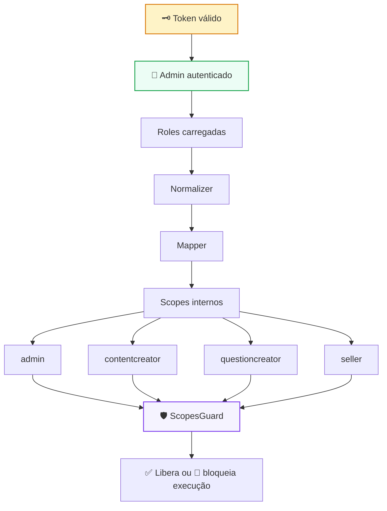

# 🔐 Arquitetura de Autenticação Delegada
## Reaproveitamento do Auth da API Principal (AdonisJS) na API de IA de Questions (NestJS)
### **Recorte Arquitetural da Fase 1 — Módulo de Autenticação, Identidade e Autorização Delegada**

---


-111827?style=for-the-badge)

---

> [!IMPORTANT]
> Este documento **não representa a Fase 1 completa da plataforma**.
>
> Ele representa **o recorte arquitetural da Fase 1 responsável exclusivamente pelo módulo de autenticação, identidade, introspecção e autorização delegada** entre a **API Principal** e a **API de IA de Questions**.
>
> Em outras palavras: a Fase 1 do produto é maior que este documento. Aqui está documentado **o slice de autenticação e segurança de acesso** que viabiliza o restante da evolução da plataforma.

> [!NOTE]
> Este material foi reestruturado para funcionar como **documento-base de PR arquitetural de alto nível**, mantendo leitura adequada para:
>
> - revisão técnica;
> - arquitetura;
> - backend;
> - liderança de engenharia;
> - validação de decisão;
> - implementação segura.

---

# 📚 Sumário

- [1. Resumo Executivo](#1-resumo-executivo)
- [2. Posicionamento Correto Dentro da Fase 1](#2-posicionamento-correto-dentro-da-fase-1)
- [3. Problema de Arquitetura](#3-problema-de-arquitetura)
- [4. Decisão Arquitetural](#4-decisão-arquitetural)
- [5. Objetivos Técnicos do Slice](#5-objetivos-técnicos-do-slice)
- [6. Escopo e Não Escopo](#6-escopo-e-não-escopo)
- [7. Contexto Técnico Validado](#7-contexto-técnico-validado)
- [8. Princípios Arquiteturais](#8-princípios-arquiteturais)
- [9. Arquitetura de Alto Nível](#9-arquitetura-de-alto-nível)
- [10. Fluxo Executivo da Autenticação Delegada](#10-fluxo-executivo-da-autenticação-delegada)
- [11. Fluxo Técnico Detalhado](#11-fluxo-técnico-detalhado)
- [12. Boundary Entre Sistemas](#12-boundary-entre-sistemas)
- [13. Modelo de Responsabilidades](#13-modelo-de-responsabilidades)
- [14. Contrato de Integração](#14-contrato-de-integração)
- [15. Endpoint de Introspecção](#15-endpoint-de-introspecção)
- [16. Arquitetura Interna do Auth Module da IA](#16-arquitetura-interna-do-auth-module-da-ia)
- [17. Estratégia de Roles, Scopes e Enforcement](#17-estratégia-de-roles-scopes-e-enforcement)
- [18. Estrutura de Pastas Recomendada](#18-estrutura-de-pastas-recomendada)
- [19. Segurança por Padrão](#19-segurança-por-padrão)
- [20. Observabilidade, Logs e Auditoria](#20-observabilidade-logs-e-auditoria)
- [21. Resiliência e Comportamento em Falha](#21-resiliência-e-comportamento-em-falha)
- [22. Estratégia de Cache](#22-estratégia-de-cache)
- [23. Anti-padrões Arquiteturais](#23-anti-padrões-arquiteturais)
- [24. Plano de Implementação](#24-plano-de-implementação)
- [25. Critérios de Aceite Técnico](#25-critérios-de-aceite-técnico)
- [26. Próximos Passos Arquiteturais](#26-próximos-passos-arquiteturais)
- [27. Conclusão Executiva](#27-conclusão-executiva)

---

# 1. Resumo Executivo

Este documento formaliza a arquitetura de **autenticação delegada** adotada para permitir que a **API de IA de Questions (NestJS)** reutilize, de forma segura, a identidade administrativa já autenticada na **API Principal (AdonisJS)**.

O objetivo central desta proposta não é criar um novo mecanismo de autenticação na API de IA, mas preservar uma decisão arquitetural correta e sustentável:

> **não duplicar autenticação, identidade, sessão nem autoridade de acesso.**

A decisão foi desenhada para atender requisitos reais de produção:

- segurança por padrão;
- baixo acoplamento entre serviços;
- boundary explícito entre identidade e domínio de IA;
- autorização local por semântica própria;
- rastreabilidade operacional;
- evolução incremental sem refatoração destrutiva do legado.

## Síntese arquitetural

```text
A API Principal autentica.
A API de IA consome identidade autenticada.
A API de IA autoriza localmente.
```

## Decisão resumida

A API de IA **não terá login próprio**, **não emitirá token próprio** e **não manterá sessão administrativa própria**.

Ela receberá o mesmo Bearer Token emitido pela API principal, validará esse contexto via introspecção controlada e transformará o contexto externo autenticado em um contrato interno canônico para autorização local.

---

# 2. Posicionamento Correto Dentro da Fase 1

A Fase 1 da plataforma é maior do que o escopo deste documento.

Este material cobre exclusivamente o **slice arquitetural de autenticação, identidade, introspecção e autorização delegada** necessário para permitir acesso seguro à API de IA de Questions.

## Este documento cobre

- reaproveitamento da identidade administrativa existente;
- validação remota do token emitido pela app principal;
- resolução do contexto autenticado do `admin`;
- normalização do payload autenticado;
- tradução de `roles` externas para `scopes` internos;
- enforcement de autorização na API de IA.

## Este documento não cobre

- a totalidade da Fase 1;
- toda a arquitetura funcional do domínio de Questions;
- pipeline completo de IA;
- ingestão, OCR, embeddings, LLM orchestration ou geração ponta a ponta.

## Leitura correta

> Este é um **documento arquitetural de segurança e acesso da Fase 1**, e não o documento total da Fase 1.

---

# 3. Problema de Arquitetura

Se a API de IA implementar autenticação própria para resolver esse problema, a plataforma passa imediatamente a carregar dívida arquitetural desnecessária.

## Consequências diretas de um auth duplicado

- duplicação de identidade;
- divergência de sessão entre sistemas;
- risco de permissão inconsistente;
- revogação distribuída em dois pontos;
- aumento de superfície de ataque;
- mistura entre domínio de IA e domínio de identidade;
- dificuldade de auditoria, suporte e troubleshooting.

## O problema real a resolver

A API de IA não precisa autenticar o usuário “do zero”.

Ela precisa responder, com segurança, às perguntas corretas:

- quem é o usuário autenticado?
- o token ainda é válido?
- quais roles esse usuário possui?
- quais operações da IA ele pode executar?

Essa distinção é o ponto central da arquitetura correta.

---

# 4. Decisão Arquitetural

## Decisão oficial

A arquitetura adotada para este recorte da Fase 1 será:

# **Autenticação Delegada com Introspecção Controlada**

## Papel de cada sistema

| Sistema | Papel arquitetural |
|---|---|
| **API Principal (AdonisJS)** | Autoridade de autenticação, validação de token e resolução de identidade |
| **API de IA (NestJS)** | Consumidora de contexto autenticado e executora de autorização local |

## Regra de ouro

> **A API de IA não autentica usuários.**
>
> Ela **confia de forma controlada** na identidade resolvida pela API principal.

## Consequência prática da decisão

Toda regra de autenticação permanece centralizada no sistema correto, enquanto a API de IA se mantém responsável apenas pelo que lhe pertence:

- consumir identidade autenticada;
- converter semântica externa em contrato interno;
- decidir autorização no domínio de Questions.

---

# 5. Objetivos Técnicos do Slice

Este slice existe para permitir que a API de IA aceite requests administrativos **sem implementar login próprio, sessão própria ou emissão de token própria**.

## O que precisa acontecer

Quando um administrador autenticado no ecossistema principal chamar a API de IA:

1. a IA deve receber o mesmo Bearer Token já emitido pela app principal;
2. a IA deve validar esse contexto contra a autoridade correta;
3. a IA deve receber o perfil autenticado com suas roles;
4. a IA deve traduzir essas roles em scopes internos;
5. a IA deve decidir se aquela operação é permitida.

## Resultado desejado

```text
Mesma identidade.
Mesma sessão lógica.
Sem duplicação de auth.
Com autorização isolada por domínio.
```

---

# 6. Escopo e Não Escopo

## 6.1 Em escopo neste documento

- autenticação delegada entre APIs;
- introspecção do token administrativo;
- reaproveitamento do contexto `admin`;
- modelagem do boundary entre AdonisJS e NestJS;
- padronização de payload autenticado;
- normalização de roles;
- conversão de roles para scopes internos;
- proteção dos endpoints críticos da IA;
- requisitos de segurança e observabilidade;
- estrutura de implementação do módulo `auth`.

## 6.2 Fora de escopo neste documento

- login do frontend;
- UI de autenticação;
- fluxo funcional completo da Fase 1;
- orquestração completa do pipeline de IA;
- ingestão documental fim a fim;
- geração de questões fim a fim;
- OCR, embeddings ou LLM orchestration;
- substituição do OAT atual por JWT;
- federação multi-tenant;
- SSO corporativo externo.

---

# 7. Contexto Técnico Validado

## 7.1 Stack de autenticação atualmente existente

- **Framework principal:** AdonisJS
- **Framework da API de IA:** NestJS
- **Guard administrativo padrão:** `admin`
- **Driver:** `oat` (**Opaque Access Token**)
- **Persistência do token:** **Redis**
- **Provider de identidade:** `Admin`
- **Autorização legada:** baseada em `roles`
- **Rotas administrativas atuais:** `auth:admin` + `role:*`

## 7.2 Guard administrativo validado

```ts
admin: {
  driver: 'oat',
  tokenProvider: {
    type: 'api',
    driver: 'redis',
    redisConnection: 'local',
    foreignKey: 'admin_id',
  },
  provider: {
    driver: 'lucid',
    identifierKey: 'id',
    uids: ['email'],
    model: () => import('App/Models/Admin'),
  },
}
```

## 7.3 Conclusão prática

A identidade correta a ser reaproveitada pela API de IA é a identidade do **perímetro administrativo**.

Portanto, a integração correta parte de:

```text
auth:admin
```

E não de um novo provider, novo login ou novo modelo de sessão.

---

# 8. Princípios Arquiteturais

## 8.1 Source of Truth único

A identidade administrativa deve existir em **um único sistema de verdade**: a API principal.

## 8.2 Boundary explícito

A API de IA deve receber apenas o necessário para decidir suas regras internas.

## 8.3 Autorização desacoplada

A IA não deve importar o middleware legado de `role`; ela deve trabalhar com **scopes internos próprios**.

## 8.4 Evolução incremental

A solução deve ser implementável agora, sem bloquear evolução futura para contratos mais canônicos.

## 8.5 Falha segura

Qualquer falha de resolução remota de identidade deve resultar em **negação de acesso**.

## 8.6 Produção primeiro

A arquitetura deve priorizar:

- previsibilidade operacional;
- auditabilidade;
- clareza de ownership;
- simplicidade de manutenção.

---

# 9. Arquitetura de Alto Nível

## 9.1 Resultado arquitetural desejado

```text
A mesma identidade administrativa da app principal controla o acesso à API de IA.
```

## 9.2 Diagrama executivo de alto nível



## 9.3 Diagrama de contexto arquitetural



## 9.4 Diagrama de ownership e decisão



---

# 10. Fluxo Executivo da Autenticação Delegada

## 10.1 Visão funcional ponta a ponta



## 10.2 Resumo executivo em uma linha

```text
Frontend → API IA → API Principal → Redis → Contexto autenticado → Autorização local na IA
```

---

# 11. Fluxo Técnico Detalhado

## 11.1 Fluxo por sequência técnica



## 11.2 Ciclo técnico do request dentro da IA


## 11.3 Sequência de decisão de autorização



---

# 12. Boundary Entre Sistemas

## 12.1 O que cruza a fronteira entre APIs

Apenas o necessário para autenticação e autorização:

- token Bearer recebido na request;
- chamada de introspecção;
- payload autenticado do admin;
- roles administrativas necessárias;
- status mínimo de conta quando aplicável.

## 12.2 O que **não** deve cruzar a fronteira

- acesso direto ao Redis;
- detalhes internos do provider do Adonis;
- segredos internos do auth principal;
- middleware legado reaproveitado de forma acoplada;
- payload cru espalhado pelo domínio da IA.

## 12.3 Boundary model



## 12.4 Regra arquitetural de boundary

> Se a API de IA precisar conhecer detalhes internos de como o Adonis autentica usuários, o boundary foi quebrado.

---

# 13. Modelo de Responsabilidades

## 13.1 Separação correta de ownership

| Camada | Responsabilidade |
|---|---|
| **API Principal** | Validar token |
| **API Principal** | Resolver identidade |
| **API Principal** | Carregar roles do admin |
| **API de IA** | Normalizar payload externo |
| **API de IA** | Construir contrato interno autenticado |
| **API de IA** | Converter roles legadas em scopes |
| **API de IA** | Decidir autorização por endpoint/caso de uso |

## 13.2 Regra arquitetural central

> **Role é contrato externo legado. Scope é contrato interno da IA.**

Essa separação é importante porque evita acoplamento semântico entre o modelo de autorização da aplicação principal e a semântica operacional específica do domínio de Questions.

## 13.3 Matriz de ownership operacional

| Tema | API Principal | API de IA |
|---|---|---|
| Login | ✅ | ❌ |
| Emissão de token | ✅ | ❌ |
| Revogação | ✅ | ❌ |
| Introspecção | ✅ | Consome |
| Normalização de payload | ❌ | ✅ |
| Mapeamento para scopes | ❌ | ✅ |
| Autorização de domínio | ❌ | ✅ |
| Enforcement por endpoint | ❌ | ✅ |

---

# 14. Contrato de Integração

## 14.1 Estado atual validado

Hoje, com base no comportamento atual do `AuthController.show`, o contrato efetivamente disponível é equivalente a:

```ts
const user = auth.user as Admin

return response.ok(
  await Admin.query().preload('roles').where('id', user.id).first()
)
```

## 14.2 Exemplo de payload atual

```json
{
  "id": 10,
  "name": "Matheus Diamantino",
  "email": "admin@empresa.com",
  "roles": [
    {
      "id": 1,
      "name": "admin",
      "slug": "admin"
    },
    {
      "id": 3,
      "name": "questioncreator",
      "slug": "questioncreator"
    }
  ],
  "created_at": "2026-01-10T10:00:00.000Z",
  "updated_at": "2026-02-10T10:00:00.000Z"
}
```

## 14.3 Payload recomendado para estabilização futura

```json
{
  "id": 10,
  "name": "Matheus Diamantino",
  "email": "admin@empresa.com",
  "roles": ["admin", "questioncreator"],
  "active": true,
  "status": "active"
}
```

## 14.4 Contrato interno canônico da IA

```ts
export interface AuthenticatedUser {
  id: number
  name: string
  email: string
  roles: string[]
  scopes: string[]
  isActive: boolean
  status?: string
}
```

## 14.5 Contrato externo esperado pela IA

```ts
export interface ExternalAdminProfile {
  id: number
  name: string
  email: string
  active?: boolean
  status?: string
  roles: Array<
    | string
    | {
        id?: number
        name?: string
        slug?: string
      }
  >
}
```

## 14.6 Requisito importante de robustez

A IA deve ser tolerante a pequenas variações do contrato externo, desde que continue sendo capaz de:

- extrair identidade;
- extrair roles;
- inferir estado mínimo da conta.

Mas essa tolerância deve ficar confinada à camada de **normalização**, e nunca espalhada pelo domínio.

---

# 15. Endpoint de Introspecção

## 15.1 Estado atual utilizável

```http
GET /api/v1/profile
```

Esse endpoint é funcional para iniciar a integração, mas semanticamente ele não é o contrato mais limpo para uma integração inter-serviços.

## 15.2 Estado recomendado

```ts
Route.get('/auth/me', 'AuthController.me').middleware(['auth:admin'])
```

## 15.3 Controller recomendado

```ts
public async me({ response, auth }: HttpContextContract) {
  const user = auth.user as Admin

  const admin = await Admin.query()
    .preload('roles')
    .where('id', user.id)
    .first()

  return response.ok(admin)
}
```

## 15.4 Requisitos obrigatórios do endpoint

- retornar payload estável e canônico;
- não depender de contexto de tela;
- não embutir regras de perfil da UI;
- ser protegido apenas por `auth:admin`;
- responder exclusivamente o contexto autenticado;
- manter contrato previsível para integração entre serviços.

## 15.5 Recomendação adicional de endurecimento

Para uso inter-serviços em produção, este endpoint deve ser tratado como **contrato de integração** e não como endpoint de conveniência.

Isso implica:

- versionamento controlado quando necessário;
- política clara de backward compatibility;
- validação de resposta previsível;
- ausência de dependência incidental de frontend.

---

# 16. Arquitetura Interna do Auth Module da IA

## 16.1 Princípio de implementação

O módulo `auth` da IA deve ser responsável apenas por:

- receber o token;
- validar esse token contra a app principal;
- construir um `AuthenticatedUser` interno;
- aplicar autorização por scopes.

Ele **não deve**:

- emitir token;
- persistir sessão administrativa;
- manter login próprio;
- reimplementar o guard do Adonis;
- acoplar a IA ao formato cru da API principal.

## 16.2 Diagrama da arquitetura interna do módulo



## 16.3 Responsabilidades por componente

| Componente | Responsabilidade |
|---|---|
| `AuthGuard` | Extrair token e iniciar autenticação |
| `AuthService` | Orquestrar validação do usuário autenticado |
| `ExternalAuthGateway` | Boundary de integração com auth externo |
| `AuthApiClient` | Cliente HTTP da API principal |
| `Normalizer` | Higienizar/estabilizar payload externo |
| `AuthenticatedUserMapper` | Converter payload em contrato interno |
| `ScopesGuard` | Aplicar autorização por operação |

## 16.4 Diagrama de composição interna



---

# 17. Estratégia de Roles, Scopes e Enforcement

## 17.1 Motivação

A API principal já trabalha com `roles`. Isso é válido para o contexto atual, mas a IA não deve acoplar sua semântica operacional diretamente ao modelo legado.

Por isso, a estratégia correta é:

```text
Role externa → Scope interno → Decisão de autorização
```

## 17.2 Mapeamento inicial recomendado

```ts
export const ROLE_SCOPE_MAP: Record<string, string[]> = {
  admin: ['*'],
  contentcreator: [
    'content.read',
    'content.write',
    'documents.read'
  ],
  questioncreator: [
    'documents.read',
    'documents.upload',
    'processing.read',
    'processing.retry',
    'questions.generate',
    'questions.review'
  ],
  seller: [
    'dashboard.read'
  ],
}
```

## 17.3 Fluxo de autorização interno



## 17.4 Regra operacional importante

A autenticação responde **quem é o usuário**.

A autorização responde **o que ele pode fazer dentro do domínio de Questions**.

Essa separação deve ser mantida com rigor no código.

## 17.5 Estratégia de enforcement recomendada

A autorização deve ocorrer em camadas complementares:

- **AuthGuard**: garante identidade válida;
- **ScopesGuard**: garante permissão técnica para o endpoint;
- **Use Case / Application Layer**: garante invariantes e restrições de negócio.

Essa composição evita que regras sensíveis fiquem presas apenas em decorators ou apenas em controllers.

---

# 18. Estrutura de Pastas Recomendada

```text
src/modules/auth/
├── auth.module.ts
├── infra/
│   ├── clients/
│   │   └── auth-api.client.ts
│   ├── gateways/
│   │   └── external-auth.gateway.ts
│   ├── services/
│   │   └── auth.service.ts
│   ├── guards/
│   │   ├── auth.guard.ts
│   │   └── scopes.guard.ts
│   └── decorators/
│       ├── current-user.decorator.ts
│       └── required-scopes.decorator.ts
├── model/
│   ├── dto/
│   │   └── authenticated-user.dto.ts
│   ├── interfaces/
│   │   ├── external-admin-profile.interface.ts
│   │   ├── authenticated-user.interface.ts
│   │   └── role-scope-map.interface.ts
│   ├── enums/
│   │   └── internal-scope.enum.ts
│   └── constants/
│       └── role-scope-map.constant.ts
└── lib/
    ├── mappers/
    │   └── authenticated-user.mapper.ts
    ├── helpers/
    │   ├── extract-bearer-token.helper.ts
    │   └── normalize-role.helper.ts
    └── normalizers/
        └── external-auth-response.normalizer.ts
```

## 18.1 Observação arquitetural importante

Essa estrutura separa adequadamente:

- boundary externo;
- regra interna;
- contrato de domínio;
- componentes de enforcement.

Isso reduz acoplamento e melhora a testabilidade do módulo.

---

# 19. Segurança por Padrão

## 19.1 Requisitos obrigatórios

### Transporte

- TLS obrigatório;
- nunca trafegar token em query string;
- aceitar apenas `Authorization: Bearer`.

### Validação

- negar acesso por padrão;
- falha de introspecção deve bloquear;
- nunca considerar token “provavelmente válido”;
- ausência de token deve falhar imediatamente.

### Boundary Security

- a IA não deve acessar diretamente o Redis do Adonis;
- a IA não deve compartilhar segredos internos do auth principal;
- a IA não deve emitir token próprio para o mesmo contexto administrativo;
- a IA não deve confiar em headers “de usuário autenticado” enviados pelo cliente.

### Sanitização e propagação segura

- mascarar headers sensíveis em logs;
- nunca persistir token puro;
- não propagar payload externo cru além da camada de auth;
- não expor roles internas desnecessárias para fora da IA.

### Resiliência segura

- timeout curto (1s–2s);
- retry somente para falhas transitórias;
- nunca retry para `401` e `403`.

## 19.2 Controles adicionais recomendados

- allowlist de origem entre serviços quando aplicável;
- mTLS em ambientes com exigência mais alta de confiança entre serviços;
- circuit breaker na integração com o provider de introspecção;
- rate limiting defensivo no endpoint de introspecção;
- headers de correlação obrigatórios entre serviços.

---

# 20. Observabilidade, Logs e Auditoria

## 20.1 Logs mínimos obrigatórios

- `request_id`
- `correlation_id`
- `user_id`
- `user_roles`
- `auth_provider_status_code`
- `auth_provider_latency_ms`
- `endpoint`
- `method`
- `decision`

## 20.2 Métricas recomendadas

### Counters

- `auth_requests_total`
- `auth_success_total`
- `auth_failures_total`
- `auth_forbidden_total`
- `auth_provider_timeout_total`

### Histograms

- `auth_provider_latency_ms`
- `auth_guard_execution_ms`

## 20.3 Regra operacional importante

A observabilidade deste módulo precisa responder com clareza:

1. **o usuário chegou autenticado?**
2. **a API principal respondeu?**
3. **a autorização local liberou ou bloqueou?**
4. **o problema foi de identidade, integração ou permissão?**

Se a stack de logs não responde isso em poucos minutos, o módulo ainda não está operacionalmente maduro.

## 20.4 Eventos de auditoria recomendados

- autenticação delegada bem-sucedida;
- autenticação delegada negada;
- falha de introspecção;
- autorização negada por scope;
- acesso a endpoint sensível;
- uso de escopo privilegiado.

---

# 21. Resiliência e Comportamento em Falha

## 21.1 Regras recomendadas

- timeout entre **1000ms e 2000ms**;
- retry apenas para falhas transitórias;
- no máximo **1 retry curto**;
- nunca aplicar retry para `401`, `403` e `404`;
- preferir falha rápida a degradação silenciosa.

## 21.2 Regra de segurança operacional

> **Falha de autenticação remota deve degradar para bloqueio, nunca para permissão.**

## 21.3 Leitura correta

Se a API principal estiver indisponível, a API de IA deve considerar o request **não autenticável**, e não “temporariamente aceitável”.

## 21.4 Matriz de falha esperada

| Situação | Resultado esperado |
|---|---|
| Token ausente | `401 Unauthorized` |
| Token inválido | `401 Unauthorized` |
| Token revogado | `401 Unauthorized` |
| Usuário sem scope | `403 Forbidden` |
| Timeout da API principal | `503` ou bloqueio controlado |
| Payload inválido do provider | `401` ou `502`, conforme política adotada |

---

# 22. Estratégia de Cache

## 22.1 Regras arquiteturais

### Permitido

- cache curto de payload autenticado;
- TTL pequeno (30s a 120s);
- cache apenas como otimização de latência.

### Proibido

- cache longo de autorização;
- cache como fonte primária de verdade;
- autorização baseada em contexto potencialmente revogado;
- ignorar revogação por causa de cache.

## 22.2 Recomendação oficial para este recorte da Fase 1

> **Não usar cache de auth inicialmente.**

A decisão correta aqui é priorizar previsibilidade e segurança antes de otimizações.

## 22.3 Ordem de maturidade correta

1. primeiro: contrato estável;
2. depois: segurança e observabilidade;
3. depois: resiliência;
4. por último: otimização via cache.

---

# 23. Anti-padrões Arquiteturais

## Não fazer

- não criar login próprio na API de IA;
- não validar token “na mão” dentro da IA;
- não acessar diretamente o Redis do Adonis;
- não copiar o middleware `role` do legado para dentro da IA;
- não espalhar payload cru da API principal pelo sistema;
- não transformar a IA em extensão acoplada do auth da app principal;
- não deixar autorização de negócio dependente de string role hardcoded em controller.

## Regra prática

> Se a API de IA precisar “entender internamente como o Adonis autentica”, o boundary foi quebrado.

## Sinal de arquitetura saudável

A API de IA deve conseguir evoluir seu modelo de autorização sem precisar alterar a semântica interna do auth da API principal.

---

# 24. Plano de Implementação

## 24.1 API Principal

- [ ] manter `auth:admin` como fonte de verdade
- [ ] expor endpoint estável de introspecção
- [ ] garantir preload consistente de `roles`
- [ ] padronizar payload retornado
- [ ] validar `401` para token inválido
- [ ] evitar dependências de UI no endpoint de introspecção
- [ ] estabilizar contrato de integração

## 24.2 API de IA

- [ ] criar `AuthModule`
- [ ] implementar `AuthGuard`
- [ ] implementar `ScopesGuard`
- [ ] implementar `AuthService`
- [ ] implementar `ExternalAuthGateway`
- [ ] implementar `AuthApiClient`
- [ ] implementar `AuthenticatedUserMapper`
- [ ] implementar normalizer do payload externo
- [ ] implementar `ROLE_SCOPE_MAP`
- [ ] proteger endpoints críticos
- [ ] instrumentar logs e métricas

## 24.3 Testes obrigatórios

- [ ] teste de token ausente
- [ ] teste de token inválido
- [ ] teste de token expirado/revogado
- [ ] teste de token válido
- [ ] teste de autorização por scope
- [ ] teste de falha da API principal
- [ ] teste ponta a ponta entre APIs
- [ ] teste de payload externo inconsistente

---

# 25. Critérios de Aceite Técnico

Este slice deve ser considerado pronto apenas quando os critérios abaixo estiverem atendidos.

## 25.1 Critérios funcionais

- a API de IA aceita Bearer Token emitido pela API principal;
- a API de IA rejeita token inválido ou revogado;
- a API de IA constrói corretamente o `AuthenticatedUser` interno;
- a autorização por scope protege endpoints críticos;
- requests autorizados executam normalmente.

## 25.2 Critérios não funcionais

- logs e métricas suficientes para troubleshooting;
- comportamento previsível em timeout/falha remota;
- ausência de dependência direta com Redis;
- ausência de emissão de token na IA;
- boundary preservado entre identidade e domínio de Questions.

## 25.3 Critério arquitetural principal

> O módulo estará correto quando a API de IA puder confiar na identidade administrativa da API principal **sem se tornar dependente da implementação interna do auth do Adonis**.

---

# 26. Próximos Passos Arquiteturais

## Na API Principal

- manter o login administrativo existente;
- usar `GET /api/v1/profile` como base inicial;
- criar `GET /api/v1/auth/me` como evolução correta;
- padronizar payload;
- garantir preload consistente de roles.

## Na API de IA

- criar o módulo `auth` completo;
- implementar `AuthGuard`;
- implementar `ScopesGuard`;
- criar `AuthenticatedUserMapper`;
- criar `ROLE_SCOPE_MAP`;
- proteger endpoints críticos da IA;
- escrever testes de integração ponta a ponta.

## Após este recorte

Quando este slice estiver estável, a plataforma poderá evoluir com segurança para os demais componentes da Fase 1, incluindo os fluxos de domínio de Questions que dependem de controle de acesso consistente.

---

# 27. Conclusão Executiva

O desenho arquitetural está **coerente com o stack validado**, **compatível com o código real mapeado** e **adequado para implementação segura neste estágio da plataforma**.

O ponto mais importante desta documentação é manter explícito que:

> **este documento não descreve toda a Fase 1**,  
> e sim **o recorte arquitetural do módulo de autenticação, identidade e autorização delegada que sustenta a Fase 1**.

## Síntese final

A API principal autentica.  
A API de IA confia.  
A API de IA normaliza.  
A API de IA traduz.  
A API de IA autoriza.  
A API de IA executa.

---

# 📌 Status deste Documento

- **Tipo:** Documento arquitetural técnico
- **Uso pretendido:** Documento-base de PR arquitetural
- **Escopo:** Recorte de autenticação/autorização da Fase 1
- **Status:** Base recomendada para implementação
- **Objetivo:** Direcionar arquitetura, implementação, revisão técnica e aprovação de engenharia

