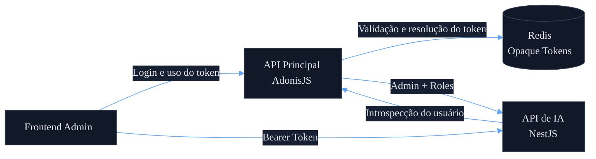
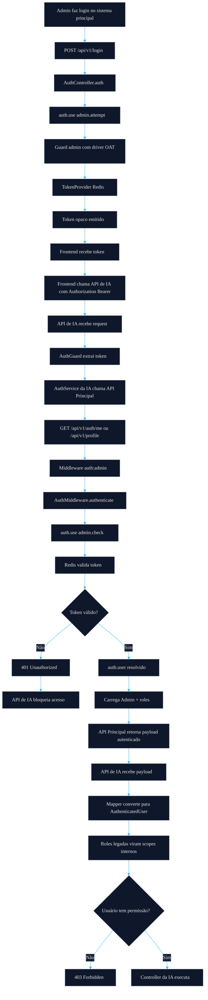
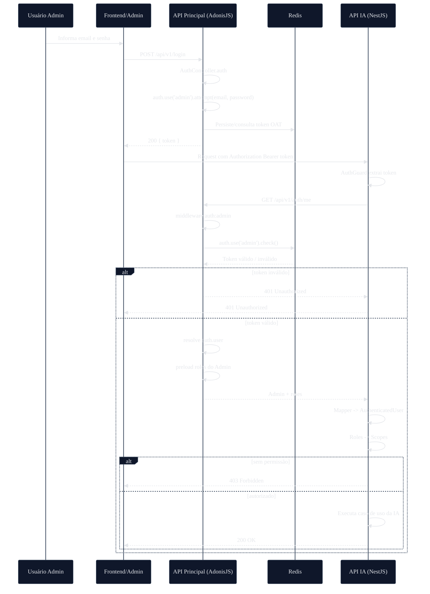
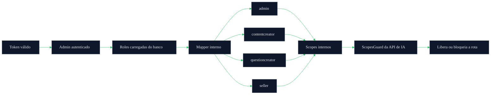
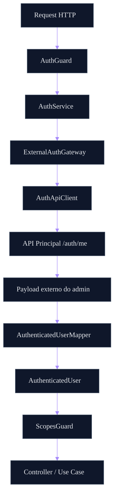
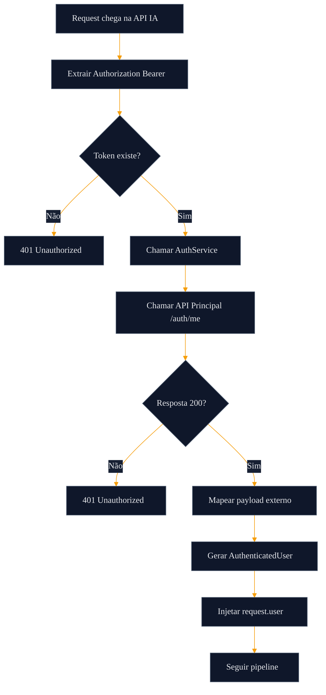

# Reaproveitamento da Autenticação da API Principal na API de IA

> Documento técnico de arquitetura para integração segura de autenticação entre a **API Principal (AdonisJS)** e a **API de IA (NestJS)**.

---

## 1. Objetivo

Este documento descreve **como a API de IA deve reaproveitar a autenticação já existente da API principal**, evitando duplicação de identidade, reduzindo acoplamento indevido e preservando segurança, rastreabilidade e governança de acesso.

A estratégia correta **não é criar um auth novo na API de IA**. Em vez disso, a API de IA deve tratar a API principal como **fonte de verdade da autenticação**.

---

## 2. Contexto atual validado

A API principal utiliza **AdonisJS Auth** com os seguintes elementos já confirmados:

- Guard padrão: `admin`
- Driver de autenticação: `oat` (**Opaque Access Token**)
- Token provider: **Redis**
- Usuário administrativo: `Admin`
- Autorização por papéis (`roles`)
- Endpoints administrativos protegidos por:
  - `auth:admin`
  - `role:admin,...`

### Trechos validados

#### Configuração de auth

```ts
admin: {
  driver: 'oat',
  tokenProvider: {
    type: 'api',
    driver: 'redis',
    redisConnection: 'local',
    foreignKey: 'admin_id',
  },
  provider: {
    driver: 'lucid',
    identifierKey: 'id',
    uids: ['email'],
    model: () => import('App/Models/Admin'),
  },
}
```

#### Login do admin

```ts
const token = (await auth.use('admin').attempt(email, password)).token
return response.ok({ token })
```

#### Resolução do usuário autenticado

```ts
const user = auth.user as Admin
return response.ok(
  await Admin.query().preload('roles').where('id', user.id).first()
)
```

#### Middleware de role

```ts
const roles = await user?.related('roles').query()
```

---

## 3. Princípio arquitetural

A **API de IA não autentica usuários diretamente**.

Ela deve apenas:

1. receber o **Bearer Token** já emitido pela API principal;
2. validar esse token **indiretamente**, chamando a API principal;
3. receber o **admin autenticado + roles**;
4. converter isso para um **contexto interno canônico**;
5. aplicar **autorização própria por scopes internos**.

---

## 4. Decisão arquitetural

## Decisão adotada

A **API Principal (AdonisJS)** será a **Autoridade de Autenticação**.

A **API de IA (NestJS)** será apenas uma **Consumidora de Contexto Autenticado**.

---

## 5. Por que essa abordagem é a correta

### Benefícios

- evita duplicação de sistema de login;
- evita replicar internamente a lógica do guard `oat` do Adonis;
- respeita expiração e revogação de token já existentes;
- centraliza identidade em um único sistema;
- reduz risco de inconsistência de acesso;
- simplifica governança de usuários administrativos.

### Problemas evitados

- criar JWT paralelo na API de IA;
- tentar validar token opaco fora do Adonis;
- compartilhar diretamente implementação interna do Redis de auth;
- espalhar regras de `role` legadas dentro da IA.

---

## 6. Visão de alto nível



---

## 7. Fluxo completo de autenticação



---

## 8. Fluxo por sequência



---

## 9. Fluxo de autorização

A autenticação diz **quem é o usuário**.  
A autorização diz **o que ele pode fazer**.

Na API principal, a autorização atual é baseada em `roles`.  
Na API de IA, a recomendação é converter essas roles em **scopes internos**.



---

## 10. Endpoint recomendado para introspecção

Embora `GET /api/v1/profile` já funcione, a recomendação arquitetural é criar um endpoint **dedicado para introspecção**.

## Rota recomendada

```ts
Route.get('/auth/me', 'AuthController.me').middleware(['auth:admin'])
```

## Controller recomendado

```ts
public async me({ response, auth }: HttpContextContract) {
  const user = auth.user as Admin

  const admin = await Admin.query()
    .preload('roles')
    .where('id', user.id)
    .first()

  return response.ok(admin)
}
```

## Por que criar esse endpoint

- evita acoplamento ao endpoint de profile legado;
- separa autenticação de comportamento de tela;
- cria um contrato estável para a API de IA;
- melhora a clareza de integração entre sistemas.

---

## 11. Contrato esperado da API principal

A API de IA precisa de um contrato estável e mínimo.

## Resposta ideal

```json
{
  "id": 1,
  "name": "Admin Example",
  "email": "admin@empresa.com",
  "roles": [
    { "id": 1, "name": "admin" },
    { "id": 3, "name": "questioncreator" }
  ]
}
```

## Contrato ainda melhor (recomendado)

```json
{
  "id": 1,
  "name": "Admin Example",
  "email": "admin@empresa.com",
  "roles": ["admin", "questioncreator"]
}
```

Esse formato é melhor para consumo externo, porque evita acoplamento ao modelo relacional interno da app principal.

---

## 12. Contrato interno da API de IA

A API de IA nunca deve espalhar o payload cru da API principal pelo sistema.

Ela deve convertê-lo para um formato interno canônico.

```ts
export interface AuthenticatedUser {
  id: number
  name: string
  email: string
  roles: string[]
  scopes: string[]
  isActive: boolean
}
```

---

## 13. Mapeamento de roles para scopes

A autorização da API de IA deve ser própria.

## Exemplo recomendado

```ts
export const ROLE_SCOPE_MAP: Record<string, string[]> = {
  admin: ['*'],
  contentcreator: [
    'content.read',
    'content.write',
    'documents.read'
  ],
  questioncreator: [
    'documents.read',
    'documents.upload',
    'processing.read',
    'processing.retry',
    'questions.generate',
    'questions.review'
  ],
  seller: [
    'dashboard.read'
  ],
}
```

### Observação

Mesmo que a API principal use `roles`, a API de IA deve operar por **scopes**, porque isso oferece:

- granularidade;
- extensibilidade;
- melhor governança;
- menor acoplamento ao legado.

---

## 14. Arquitetura do módulo auth na API de IA



---

## 15. Estrutura recomendada de arquivos na API de IA

```text
src/modules/auth/
├── auth.module.ts
├── infra/
│   ├── clients/
│   │   └── auth-api.client.ts
│   ├── gateways/
│   │   └── external-auth.gateway.ts
│   └── services/
│       └── auth.service.ts
├── model/
│   ├── dto/
│   │   └── authenticated-user.dto.ts
│   └── interfaces/
│       ├── external-admin-profile.interface.ts
│       └── authenticated-user.interface.ts
└── lib/
    └── mappers/
        └── authenticated-user.mapper.ts
```

---

## 16. Fluxo interno do AuthGuard da API de IA

### Responsabilidades

O `AuthGuard` da API de IA deve:

1. extrair o bearer token;
2. negar se o token não existir;
3. chamar o `AuthService`;
4. o `AuthService` chama a API principal;
5. receber o admin autenticado;
6. converter para `AuthenticatedUser`;
7. anexar em `request.user`.

## Fluxograma



---

## 17. Segurança obrigatória

A integração deve seguir regras mínimas de hardening.

## Requisitos

- timeout curto na chamada à API principal;
- nunca logar o token em texto puro;
- mascarar `Authorization` em logs;
- não aplicar retry para `401` e `403`;
- aplicar retry apenas para falhas transitórias (`5xx`, timeout, conexão);
- negar acesso por padrão;
- usar TLS obrigatório entre serviços;
- registrar correlação por request.

---

## 18. Observabilidade obrigatória

## Logs e métricas recomendadas

- `request_id`
- `correlation_id`
- `auth_provider_latency_ms`
- `auth_provider_status_code`
- `auth_failures_total`
- `auth_forbidden_total`
- `auth_provider_timeout_total`

## Eventos importantes

- token ausente;
- token inválido;
- falha de comunicação com API principal;
- usuário autenticado sem role compatível;
- acesso autorizado.

---

## 19. Estratégia de cache (opcional e controlada)

A API de IA **pode** usar cache curto para o payload autenticado retornado pela API principal.

## Regras

- TTL curto (ex.: 30s a 120s);
- nunca usar cache longo para autorização crítica;
- cache deve ser apenas otimização, nunca fonte de verdade;
- invalidação deve respeitar revogação e mudanças de perfil o máximo possível.

## Recomendação

No início da Fase 1, é aceitável **não usar cache** para simplificar e garantir previsibilidade.

---

## 20. Anti-padrões que devem ser evitados

## Não fazer

### 1. Criar login próprio na API de IA
Errado, porque fragmenta identidade.

### 2. Gerar JWT paralelo na API de IA
Errado, porque cria dupla autoridade de autenticação.

### 3. Compartilhar implementação interna do Redis do Adonis
Errado, porque acopla a IA à infraestrutura interna do legado.

### 4. Copiar middleware `role` legado para dentro da IA
Errado, porque a IA deve operar com `scopes` internos.

### 5. Espalhar payload cru da API principal pelo sistema
Errado, porque contamina o domínio interno.

---

## 21. Decisão final recomendada

## Arquitetura final

- **Login continua na API principal**;
- **Token continua sendo emitido pela API principal**;
- **API de IA consome o mesmo token**;
- **API principal valida e resolve identidade**;
- **API de IA transforma roles em scopes internos**;
- **API de IA controla autorização localmente**.

---

## 22. Resumo executivo

A integração correta entre a API principal e a API de IA deve seguir o modelo de **auth delegada com introspecção**.

### Em uma frase:

> A API de IA **não autentica**, ela **confia de forma segura** na autenticação já realizada pela API principal.

Isso garante:

- consistência;
- segurança;
- menor acoplamento;
- governança centralizada;
- evolução sustentável da arquitetura.

---

## 23. Próximo passo recomendado

Após aprovar este desenho, o próximo passo ideal é implementar:

1. endpoint `GET /api/v1/auth/me` na API principal;
2. módulo `auth` da API de IA;
3. `AuthGuard` + `ScopesGuard`;
4. mapper de `roles -> scopes`;
5. testes de integração ponta a ponta.

