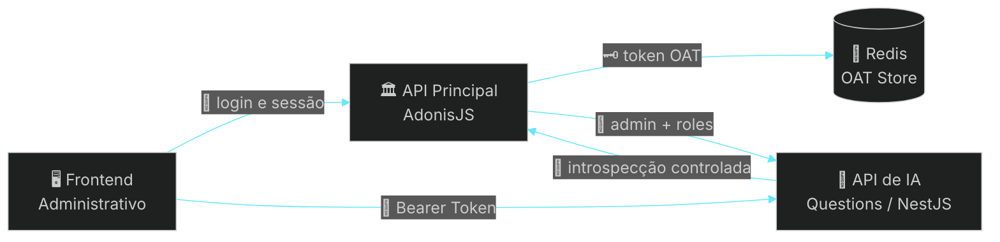
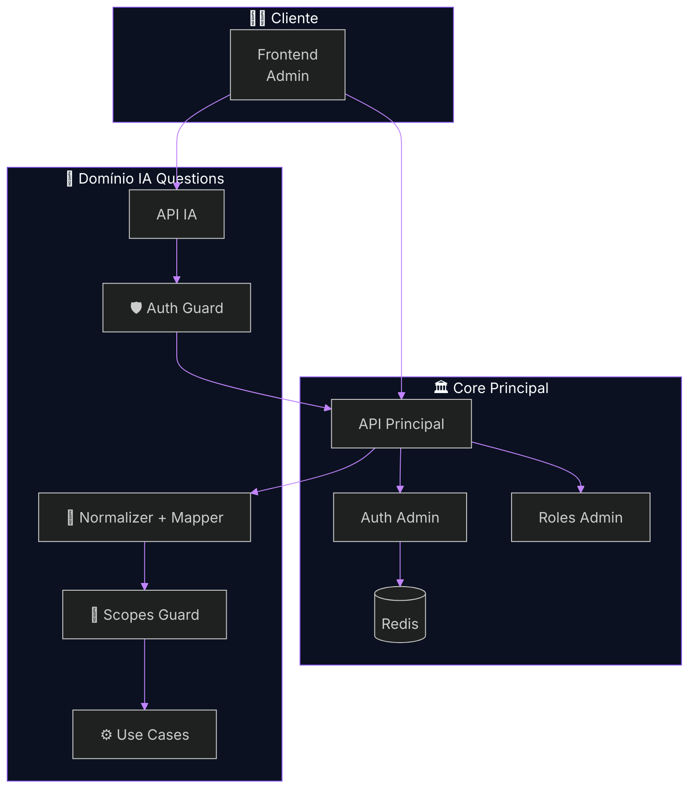
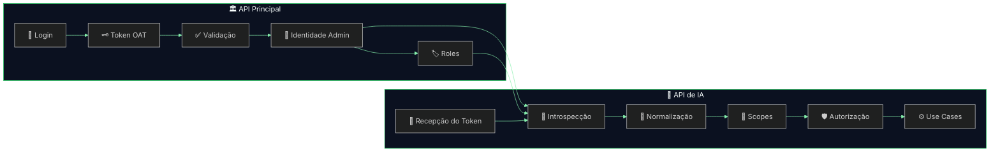
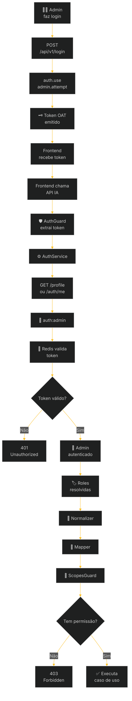
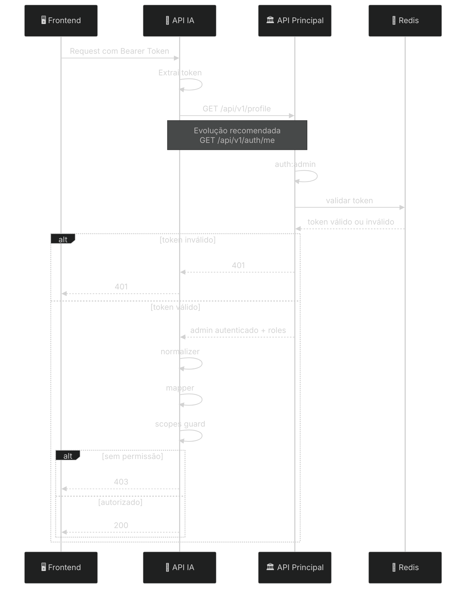
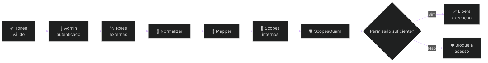
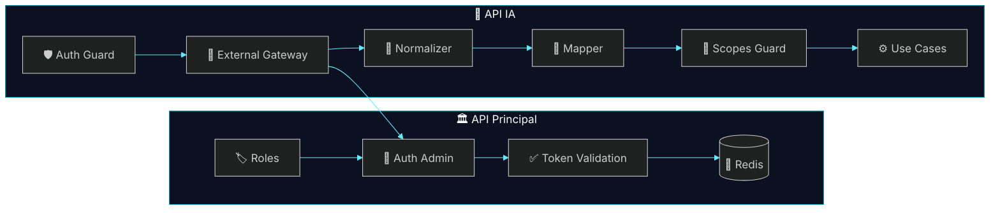
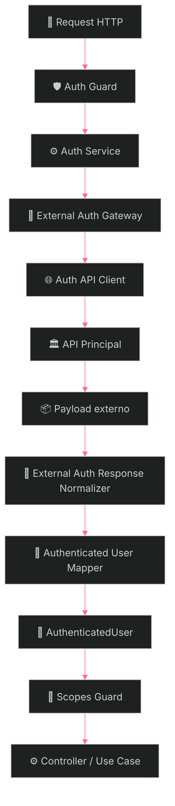
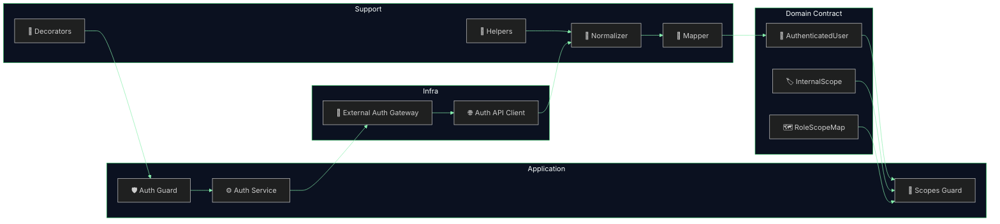

# 🔐 Arquitetura de Autenticação Delegada
## Reaproveitamento do Auth da API Principal (AdonisJS) na API de IA de Questions (NestJS)
### Recorte Arquitetural da Fase 1 — Auth, Identidade e Autorização Delegada

---

<div align="center">


</div>

---

> [!IMPORTANT]
> Este documento descreve exclusivamente o **slice arquitetural de autenticação, identidade e autorização delegada da Fase 1**.
>
> Ele não cobre toda a plataforma de Questions, nem o pipeline completo de IA. O foco aqui é a base de segurança e acesso necessária para habilitar a evolução segura do domínio.

> [!NOTE]
> O material foi estruturado como **artefato final de entrega técnica**, adequado para:
>
> - revisão arquitetural;
> - PR técnica;
> - alinhamento entre squads backend;
> - implementação incremental;
> - hardening de segurança;
> - referência evolutiva para fases futuras.

---

# Sumário

- [1. Resumo Executivo](#1-resumo-executivo)
- [2. Escopo do Documento](#2-escopo-do-documento)
- [3. Problema Arquitetural](#3-problema-arquitetural)
- [4. Decisão de Arquitetura](#4-decisão-de-arquitetura)
- [5. Contexto Técnico Validado](#5-contexto-técnico-validado)
- [6. Objetivos do Slice](#6-objetivos-do-slice)
- [7. Princípios Arquiteturais](#7-princípios-arquiteturais)
- [8. Arquitetura de Alto Nível](#8-arquitetura-de-alto-nível)
- [9. Fluxos Principais](#9-fluxos-principais)
- [10. Boundary e Responsabilidades](#10-boundary-e-responsabilidades)
- [11. Contrato de Integração](#11-contrato-de-integração)
- [12. Endpoint de Introspecção](#12-endpoint-de-introspecção)
- [13. Arquitetura Interna do Auth Module](#13-arquitetura-interna-do-auth-module)
- [14. Estratégia de Roles, Scopes e Enforcement](#14-estratégia-de-roles-scopes-e-enforcement)
- [15. Estrutura Técnica Recomendada](#15-estrutura-técnica-recomendada)
- [16. Segurança, Resiliência e Observabilidade](#16-segurança-resiliência-e-observabilidade)
- [17. ADR — Registro da Decisão](#17-adr--registro-da-decisão)
- [18. Plano de Implementação](#18-plano-de-implementação)
- [19. Critérios de Aceite Técnico](#19-critérios-de-aceite-técnico)
- [20. Próximos Passos](#20-próximos-passos)
- [21. Conclusão Executiva](#21-conclusão-executiva)

---

# 1. Resumo Executivo

A arquitetura proposta estabelece um modelo de **autenticação delegada com introspecção controlada**, no qual a **API Principal (AdonisJS)** permanece como **fonte única de verdade da identidade administrativa**, enquanto a **API de IA de Questions (NestJS)** consome esse contexto autenticado para executar **autorização local por domínio**.

## Decisão central

```text
A API Principal autentica.
A API de IA consome identidade autenticada.
A API de IA autoriza localmente.
```

## Resultado esperado

- identidade única no perímetro administrativo;
- sessão lógica única entre frontend, API Principal e API de IA;
- ausência de duplicação de login, emissão de token ou estado de sessão;
- autorização desacoplada por domínio;
- integração segura, auditável e evolutiva.

> [!TIP]
> A proposta reduz acoplamento com o legado de autenticação sem bloquear a autonomia evolutiva do domínio de Questions.

---

# 2. Escopo do Documento

## Em escopo

- reaproveitamento do auth administrativo já existente;
- introspecção do token administrativo emitido pela API Principal;
- resolução do contexto autenticado do `admin`;
- normalização do payload externo autenticado;
- mapeamento de `roles` externas para `scopes` internos;
- enforcement de autorização na API de IA;
- requisitos de segurança, resiliência e observabilidade;
- desenho técnico do `AuthModule` na API de IA;
- contrato de integração entre AdonisJS e NestJS.

## Fora de escopo

- login do frontend;
- UX ou UI de autenticação;
- pipeline completo de IA;
- OCR, embeddings e orquestração de LLM;
- geração ponta a ponta de questões;
- redesign do auth legado;
- migração para JWT;
- SSO externo;
- federação multi-tenant;
- policy engine centralizado em fase inicial.

> [!NOTE]
> O objetivo não é redesenhar o auth da plataforma inteira, e sim **estabelecer o recorte correto de reaproveitamento e isolamento** para o domínio de Questions.

---

# 3. Problema Arquitetural

Se a API de IA implementar autenticação própria para resolver esse acesso, o sistema passa a carregar redundância estrutural, maior superfície de ataque e inconsistência operacional.

## Riscos de um auth duplicado

- duplicação de identidade;
- divergência de sessão entre sistemas;
- revogação distribuída;
- inconsistência de permissão;
- troubleshooting mais difícil em produção;
- maior superfície de ataque;
- acoplamento indevido entre o domínio de IA e o domínio de identidade;
- governança de segurança mais cara ao longo do tempo.

## O problema real

A API de IA **não precisa autenticar o usuário novamente**.

Ela precisa responder com segurança:

- quem é o usuário autenticado;
- se o token ainda é válido;
- quais `roles` o usuário possui no perímetro administrativo;
- o que esse usuário pode fazer dentro do domínio de Questions.

> [!IMPORTANT]
> O problema não é “como a IA faz login”.
>
> O problema correto é: **como a IA confia, de forma controlada, na identidade já autenticada pela plataforma principal**.

---

# 4. Decisão de Arquitetura

## Decisão oficial

# **Autenticação Delegada com Introspecção Controlada**

## Papel de cada sistema

| Sistema | Papel arquitetural |
|---|---|
| **API Principal (AdonisJS)** | autoridade de autenticação, validação de token, resolução de identidade e carga de roles administrativas |
| **API de IA (NestJS)** | consumidora de identidade autenticada e executora de autorização local por scopes |

## Regra de ouro

> [!IMPORTANT]
> **A API de IA não autentica usuários.**
>
> Ela **confia de forma controlada** na identidade resolvida pela API Principal.

## Decisão operacional

```text
Auth centralizado.
Autorização distribuída.
Boundary preservado.
```

## Consequência prática

A API de IA deve trabalhar com:

1. token recebido do cliente;
2. introspecção remota controlada;
3. normalização do retorno;
4. mapeamento para contrato canônico interno;
5. aplicação local de autorização por scopes.

---

# 5. Contexto Técnico Validado

## Stack atual

- **Framework principal:** AdonisJS
- **Framework da API de IA:** NestJS
- **Guard administrativo:** `admin`
- **Driver de autenticação:** `oat` (Opaque Access Token)
- **Persistência do token:** Redis
- **Provider de identidade:** `Admin`
- **Autorização legada:** baseada em `roles`
- **Proteção atual de rotas:** `auth:admin` + `role:*`

## Guard administrativo validado

```ts
admin: {
  driver: 'oat',
  tokenProvider: {
    type: 'api',
    driver: 'redis',
    redisConnection: 'local',
    foreignKey: 'admin_id',
  },
  provider: {
    driver: 'lucid',
    identifierKey: 'id',
    uids: ['email'],
    model: () => import('App/Models/Admin'),
  },
}
```

## Conclusão prática

A identidade correta a ser reaproveitada pela API de IA é a identidade do **perímetro administrativo autenticado pelo guard `admin`**.

```text
auth:admin
```

> [!TIP]
> Esse recorte evita que a API de IA invente um segundo perímetro de confiança para o mesmo usuário administrativo.

---

# 6. Objetivos do Slice

Este slice existe para permitir que a API de IA aceite requests administrativas **sem implementar login próprio, sessão própria ou emissão própria de token**.

## Objetivos técnicos

1. receber o mesmo Bearer Token emitido pela app principal;
2. validar o contexto contra a autoridade correta;
3. resolver o perfil autenticado com suas roles;
4. traduzir essas roles em scopes internos;
5. autorizar a operação localmente;
6. falhar com bloqueio seguro em qualquer incerteza.

## Resultado arquitetural desejado

```text
Mesma identidade.
Mesma sessão lógica.
Sem duplicação de auth.
Com autorização isolada por domínio.
```

---

# 7. Princípios Arquiteturais

## 7.1 Single Source of Truth

A identidade administrativa deve existir em apenas um lugar confiável.

## 7.2 Security by Default

Qualquer incerteza de autenticação deve resultar em bloqueio, nunca em permissão.

## 7.3 Boundary First

A API de IA não deve conhecer detalhes internos do mecanismo de autenticação do Adonis.

## 7.4 Stable Internal Contract

O domínio de IA deve operar sobre um contrato autenticado interno estável, mesmo que o payload externo evolua.

## 7.5 Local Authorization

A semântica de acesso do domínio de Questions deve ser controlada localmente por scopes internos.

## 7.6 Tolerance Outside, Rigidity Inside

Variações do provider externo devem ser absorvidas na borda de integração, nunca espalhadas no domínio.

> [!NOTE]
> Esses princípios evitam que o auth se torne um vazamento estrutural do core principal para dentro da API de IA.

---

# 8. Arquitetura de Alto Nível

## 8.1 Diretriz visual para diagramas

> [!TIP]
> Os diagramas abaixo foram organizados em **alto nível**, com foco em clareza executiva, separação de ownership e leitura arquitetural rápida.
>
> O padrão adotado foi:
>
> - fundo escuro;
> - contraste alto;
> - cores mais neon;
> - textos curtos;
> - ícones semânticos;
> - bom espaçamento;
> - baixa densidade de cruzamento visual.

## 8.2 Visão executiva



## 8.3 Diagrama de contexto



## 8.4 Diagrama de ownership



---

# 9. Fluxos Principais

## 9.1 Fluxo funcional ponta a ponta



## 9.2 Sequência técnica de request



## 9.3 Fluxo de decisão de autorização



> [!IMPORTANT]
> A separação entre **autenticação** e **autorização** é deliberada:
>
> - autenticação responde **quem é**;
> - autorização responde **o que pode fazer**.

---

# 10. Boundary e Responsabilidades

## 10.1 O que cruza a fronteira entre sistemas

- token Bearer recebido na request;
- chamada de introspecção;
- payload autenticado do admin;
- roles administrativas necessárias;
- status mínimo de conta, quando aplicável.

## 10.2 O que não deve cruzar a fronteira

- acesso direto ao Redis pela API de IA;
- detalhes internos do token provider do Adonis;
- segredos internos do auth principal;
- middleware legado reaproveitado de forma acoplada;
- payload cru espalhado pelo domínio de IA;
- semântica interna do domínio de Questions para dentro da API Principal.

## 10.3 Boundary model



## 10.4 Matriz de ownership

| Tema | API Principal | API de IA |
|---|---|---|
| Login | ✅ | ❌ |
| Emissão de token | ✅ | ❌ |
| Revogação | ✅ | ❌ |
| Introspecção | ✅ | consome |
| Normalização de payload | ❌ | ✅ |
| Mapeamento para scopes | ❌ | ✅ |
| Autorização de domínio | ❌ | ✅ |
| Enforcement por endpoint | ❌ | ✅ |

> [!TIP]
> Ownership bem definido reduz atrito entre squads e simplifica incident response.

---

# 11. Contrato de Integração

## 11.1 Estado atual utilizável

Hoje, com base no comportamento atual do `AuthController.show`, o contrato disponível é equivalente a:

```ts
const user = auth.user as Admin

return response.ok(
  await Admin.query().preload('roles').where('id', user.id).first()
)
```

## 11.2 Exemplo de payload atual

```json
{
  "id": 10,
  "name": "Matheus Diamantino",
  "email": "admin@empresa.com",
  "roles": [
    {
      "id": 1,
      "name": "admin",
      "slug": "admin"
    },
    {
      "id": 3,
      "name": "questioncreator",
      "slug": "questioncreator"
    }
  ],
  "created_at": "2026-01-10T10:00:00.000Z",
  "updated_at": "2026-02-10T10:00:00.000Z"
}
```

## 11.3 Payload recomendado para estabilização futura

```json
{
  "id": 10,
  "name": "Matheus Diamantino",
  "email": "admin@empresa.com",
  "roles": ["admin", "questioncreator"],
  "active": true,
  "status": "active"
}
```

## 11.4 Contrato interno canônico da IA

```ts
export interface AuthenticatedUser {
  id: number
  name: string
  email: string
  roles: string[]
  scopes: string[]
  isActive: boolean
  status?: string
}
```

## 11.5 Regra de robustez

A IA pode ser tolerante a pequenas variações do payload externo, mas essa tolerância deve existir **somente na camada de normalização**.

O domínio interno deve trabalhar sempre com um contrato estável.

> [!TIP]
> Regra prática: **tolerância fora, rigidez dentro**.

## 11.6 Requisitos mínimos do contrato externo

O provider de introspecção deve garantir, no mínimo:

- identificador estável do admin;
- lista de roles resolvidas;
- status de atividade, quando aplicável;
- semântica consistente de erro para token inválido;
- payload previsível entre ambientes.

---

# 12. Endpoint de Introspecção

## 12.1 Estado atual utilizável

```http
GET /api/v1/profile
```

## 12.2 Evolução recomendada

```ts
Route.get('/auth/me', 'AuthController.me').middleware(['auth:admin'])
```

## 12.3 Controller recomendado

```ts
public async me({ response, auth }: HttpContextContract) {
  const user = auth.user as Admin

  const admin = await Admin.query()
    .preload('roles')
    .where('id', user.id)
    .first()

  return response.ok(admin)
}
```

## 12.4 Requisitos do endpoint

- payload estável e canônico;
- sem dependência de UI;
- sem lógica incidental de tela;
- protegido apenas por `auth:admin`;
- contrato previsível para integração entre serviços;
- preload consistente de roles;
- sem side effects.

## 12.5 Headers internos sugeridos

```http
X-Internal-Client: questions-ai-api
X-Correlation-Id: <uuid>
X-Request-Id: <uuid>
```

## 12.6 Controles recomendados

- allowlist por origem interna, por ambiente;
- rate limit técnico para introspecção;
- logs estruturados por request;
- versionamento explícito do contrato quando necessário;
- rastreabilidade ponta a ponta por `correlation_id`.

> [!IMPORTANT]
> O endpoint de introspecção não deve ser tratado como endpoint de tela. Ele é um **contrato entre serviços**.

---

# 13. Arquitetura Interna do Auth Module

## 13.1 Princípio de implementação

O `AuthModule` da API de IA deve ser responsável apenas por:

- receber o token;
- validar esse token contra a API principal;
- construir um `AuthenticatedUser` interno;
- aplicar autorização por scopes.

Ele **não deve**:

- emitir token;
- persistir sessão administrativa;
- manter login próprio;
- reimplementar o guard do Adonis;
- acoplar a IA ao payload cru da API principal.

## 13.2 Diagrama interno do módulo



## 13.3 Composição interna



## 13.4 Sequência interna de responsabilidades

| Camada | Responsabilidade |
|---|---|
| **Client** | comunicação HTTP com o provider externo |
| **Gateway** | boundary técnico com a API principal |
| **Service** | orquestração da autenticação delegada |
| **Normalizer** | tolerância a payloads externos variáveis |
| **Mapper** | construção do contrato canônico interno |
| **Guards** | enforcement técnico de acesso |
| **Decorators** | ergonomia e consistência no uso do contexto autenticado |

## 13.5 Contrato sugerido do gateway

```ts
export interface ExternalAuthGateway {
  introspect(token: string): Promise<AuthenticatedUser>
}
```

## 13.6 Responsabilidade do serviço

O `AuthService` deve:

- extrair e validar a presença do token;
- acionar a camada de gateway;
- traduzir erros técnicos em erros de domínio HTTP adequados;
- anexar o `AuthenticatedUser` ao contexto da request;
- manter telemetria da chamada remota.

---

# 14. Estratégia de Roles, Scopes e Enforcement

## Regra central

```text
Role externa → Scope interno → Decisão de autorização
```

## Mapeamento inicial recomendado

```ts
export const ROLE_SCOPE_MAP: Record<string, string[]> = {
  admin: ['*'],
  contentcreator: [
    'content.read',
    'content.write',
    'documents.read'
  ],
  questioncreator: [
    'documents.read',
    'documents.upload',
    'processing.read',
    'processing.retry',
    'questions.generate',
    'questions.review'
  ],
  seller: [
    'dashboard.read'
  ],
}
```

## Estratégia de enforcement

A autorização deve ocorrer em camadas complementares:

- **AuthGuard** → valida identidade;
- **ScopesGuard** → valida permissão técnica do endpoint;
- **Application Layer / Use Case** → valida regra de negócio.

## Exemplo de uso no NestJS

```ts
@UseGuards(AuthGuard, ScopesGuard)
@RequiredScopes('questions.generate')
@Post('/questions/generate')
async generate(@CurrentUser() user: AuthenticatedUser) {
  return this.generateQuestionsUseCase.execute({
    actorId: user.id,
  })
}
```

## Regras de mapeamento recomendadas

- `admin` pode ser tratado como wildcard controlado (`*`);
- roles desconhecidas não geram scopes implícitos;
- ausência de role válida implica ausência de permissão;
- normalização de slug deve ser case-insensitive;
- duplicidade de roles ou scopes deve ser deduplicada;
- o mapper deve gerar scopes determinísticos.

## Exemplo de enum interno

```ts
export enum InternalScope {
  DOCUMENTS_READ = 'documents.read',
  DOCUMENTS_UPLOAD = 'documents.upload',
  PROCESSING_READ = 'processing.read',
  PROCESSING_RETRY = 'processing.retry',
  QUESTIONS_GENERATE = 'questions.generate',
  QUESTIONS_REVIEW = 'questions.review',
  CONTENT_READ = 'content.read',
  CONTENT_WRITE = 'content.write',
  DASHBOARD_READ = 'dashboard.read',
}
```

> [!IMPORTANT]
> A API de IA não deve ficar semanticamente refém da modelagem de roles do legado. O legado informa identidade e papel. A IA decide acesso pelo seu próprio contrato.

---

# 15. Estrutura Técnica Recomendada

## Tree view do módulo

```text
src/
└── modules/
    └── auth/
        ├── auth.module.ts
        ├── infra/
        │   ├── clients/
        │   │   └── auth-api.client.ts
        │   ├── gateways/
        │   │   └── external-auth.gateway.ts
        │   ├── services/
        │   │   └── auth.service.ts
        │   ├── guards/
        │   │   ├── auth.guard.ts
        │   │   └── scopes.guard.ts
        │   └── decorators/
        │       ├── current-user.decorator.ts
        │       └── required-scopes.decorator.ts
        ├── model/
        │   ├── dto/
        │   │   └── authenticated-user.dto.ts
        │   ├── interfaces/
        │   │   ├── external-admin-profile.interface.ts
        │   │   ├── authenticated-user.interface.ts
        │   │   └── role-scope-map.interface.ts
        │   ├── enums/
        │   │   └── internal-scope.enum.ts
        │   └── constants/
        │       └── role-scope-map.constant.ts
        └── lib/
            ├── mappers/
            │   └── authenticated-user.mapper.ts
            ├── helpers/
            │   ├── extract-bearer-token.helper.ts
            │   ├── normalize-role.helper.ts
            │   └── dedupe-scopes.helper.ts
            └── normalizers/
                └── external-auth-response.normalizer.ts
```

## Leitura por responsabilidade

- **clients** → comunicação HTTP externa;
- **gateways** → boundary técnico com provider externo;
- **services** → orquestração;
- **guards** → enforcement técnico;
- **decorators** → ergonomia do controller;
- **model** → contratos do domínio;
- **helpers / mappers / normalizers** → transformação e estabilização do payload.

## Recomendação de organização adicional

Separar nitidamente:

- integração externa;
- contrato de domínio;
- transformação de payload;
- enforcement de autorização.

Essa divisão facilita:

- testes unitários;
- substituição futura do provider;
- introdução de cache técnico;
- evolução para circuit breaker sem reescrever o domínio.

---

# 16. Segurança, Resiliência e Observabilidade

## 16.1 Segurança por padrão

### Obrigatório

- TLS obrigatório;
- aceitar apenas `Authorization: Bearer`;
- nunca trafegar token em query string;
- negar acesso por padrão;
- falha de introspecção deve bloquear;
- nunca persistir token puro;
- nunca acessar Redis diretamente da API de IA;
- nunca confiar em payload vindo diretamente do frontend como identidade resolvida.

### Regras adicionais

- validar formato mínimo do Bearer Token antes da chamada remota;
- sanitizar logs para não expor segredos;
- separar erros de autenticação de erros internos do provider;
- manter contrato de erro previsível para clientes consumidores.

## 16.2 Resiliência

### Regras recomendadas

- timeout entre **1000ms e 2000ms**;
- retry apenas para falhas transitórias;
- no máximo **1 retry curto**;
- nunca retry para `401`, `403` e `404`;
- preferir falha rápida a degradação silenciosa;
- aplicar budget de latência para a chamada de introspecção.

### Regra crítica

> [!IMPORTANT]
> **Falha de autenticação remota deve degradar para bloqueio, nunca para permissão.**

## 16.3 Observabilidade

### Logs mínimos

- `request_id`
- `correlation_id`
- `user_id`
- `user_roles`
- `auth_provider_status_code`
- `auth_provider_latency_ms`
- `endpoint`
- `method`
- `decision`

### Métricas recomendadas

- `auth_requests_total`
- `auth_success_total`
- `auth_failures_total`
- `auth_forbidden_total`
- `auth_provider_timeout_total`
- `auth_provider_latency_ms`
- `auth_guard_execution_ms`

### Traces recomendados

- span da request recebida;
- span da chamada ao provider de introspecção;
- marcação de decisão final (`authorized` / `forbidden` / `unauthorized`);
- propagação de `correlation_id`.

## 16.4 Matriz de falha esperada

| Situação | Resultado esperado |
|---|---|
| Token ausente | `401 Unauthorized` |
| Token inválido | `401 Unauthorized` |
| Token revogado | `401 Unauthorized` |
| Usuário sem scope | `403 Forbidden` |
| Timeout da API principal | `503` ou bloqueio controlado |
| Payload inválido do provider | `401` ou `502`, conforme política adotada |

## 16.5 Hardening adicional recomendado

### Segurança de integração interna

- autenticação mTLS entre serviços em ambientes críticos;
- allowlist por rede privada ou service mesh;
- assinatura opcional de requests internas para rotas sensíveis;
- versionamento explícito do endpoint de introspecção.

### Proteção operacional

- circuit breaker na camada cliente;
- budget de timeout controlado;
- dashboards dedicados de auth delegada;
- alarmes por aumento de `401`, `403` e timeout;
- monitoramento de payload inválido do provider.

> [!TIP]
> Segurança forte aqui não significa apenas impedir acesso indevido, mas também garantir que o sistema falhe de forma previsível, rastreável e auditável.

---

# 17. ADR — Registro da Decisão

## ADR-001 — Modelo de autenticação entre API Principal e API de IA

### Status

**Aceito**

### Contexto

A API de IA precisa receber requests autenticadas do mesmo perímetro administrativo da plataforma principal, sem duplicar login, token ou estado de sessão.

### Decisão

Adotar **Autenticação Delegada com Introspecção Controlada**, usando a API Principal como autoridade de autenticação e a API de IA como consumidora de identidade autenticada, com autorização local baseada em scopes.

### Consequências positivas

- elimina duplicação de auth;
- reduz risco operacional;
- preserva boundary arquitetural;
- simplifica troubleshooting;
- melhora governança de identidade;
- permite evolução independente do domínio de Questions.

### Trade-offs assumidos

- dependência controlada da disponibilidade da API Principal;
- necessidade de normalização de payload externo;
- necessidade de observabilidade forte na integração;
- custo adicional de latência por introspecção remota.

### Mitigações

- timeout curto;
- retry controlado;
- circuit breaker futuro;
- contrato estável de introspecção;
- telemetria forte da integração.

---

# 18. Plano de Implementação

## 18.1 API Principal

- [ ] manter `auth:admin` como fonte de verdade;
- [ ] expor endpoint estável de introspecção;
- [ ] garantir preload consistente de `roles`;
- [ ] padronizar payload retornado;
- [ ] garantir `401` para token inválido ou revogado;
- [ ] estabilizar contrato de integração;
- [ ] adicionar headers e rastreabilidade para consumo interno.

## 18.2 API de IA

- [ ] criar `AuthModule`;
- [ ] implementar `AuthGuard`;
- [ ] implementar `ScopesGuard`;
- [ ] implementar `AuthService`;
- [ ] implementar `ExternalAuthGateway`;
- [ ] implementar `AuthApiClient`;
- [ ] implementar `AuthenticatedUserMapper`;
- [ ] implementar normalizer do payload externo;
- [ ] implementar `ROLE_SCOPE_MAP`;
- [ ] proteger endpoints críticos;
- [ ] instrumentar logs, métricas e traces;
- [ ] padronizar erro HTTP de autenticação e autorização.

## 18.3 Testes obrigatórios

- [ ] token ausente;
- [ ] token inválido;
- [ ] token expirado ou revogado;
- [ ] token válido;
- [ ] autorização por scope;
- [ ] role desconhecida;
- [ ] payload externo inconsistente;
- [ ] falha da API principal;
- [ ] timeout do provider;
- [ ] teste ponta a ponta entre APIs.

## 18.4 Ordem de execução recomendada

1. estabilizar contrato de introspecção na API Principal;
2. construir contrato interno canônico na API de IA;
3. implementar guard de autenticação;
4. implementar normalizer e mapper;
5. implementar guard de scopes;
6. proteger endpoints críticos;
7. instrumentar observabilidade;
8. validar com testes integrados;
9. preparar hardening operacional.

> [!NOTE]
> A ordem acima reduz retrabalho, porque primeiro estabiliza a borda de integração e só depois expande enforcement interno.

---

# 19. Critérios de Aceite Técnico

## 19.1 Critérios funcionais

- a API de IA aceita Bearer Token emitido pela API Principal;
- a API de IA rejeita token inválido ou revogado;
- a API de IA constrói corretamente o `AuthenticatedUser` interno;
- a autorização por scope protege endpoints críticos;
- requests autorizados executam normalmente;
- requests autenticadas sem permissão retornam `403`.

## 19.2 Critérios não funcionais

- logs e métricas suficientes para troubleshooting;
- comportamento previsível em timeout ou falha remota;
- ausência de dependência direta com Redis;
- ausência de emissão de token na IA;
- boundary preservado entre identidade e domínio de Questions;
- baixa acoplagem com o formato bruto do provider externo.

## 19.3 Critério arquitetural principal

> [!IMPORTANT]
> O módulo estará correto quando a API de IA puder confiar na identidade administrativa da API Principal **sem se tornar dependente da implementação interna do auth do Adonis**.

---

# 20. Próximos Passos

## 20.1 Na API Principal

- manter o login administrativo existente;
- usar `GET /api/v1/profile` como base inicial;
- criar `GET /api/v1/auth/me` como evolução correta;
- padronizar payload;
- garantir preload consistente de roles;
- formalizar contrato de introspecção.

## 20.2 Na API de IA

- criar o módulo `auth` completo;
- implementar `AuthGuard`;
- implementar `ScopesGuard`;
- criar `AuthenticatedUserMapper`;
- criar `ROLE_SCOPE_MAP`;
- proteger endpoints críticos da IA;
- escrever testes de integração ponta a ponta;
- preparar observabilidade desde a primeira versão operacional.

## 20.3 Evolução futura sugerida

### Fase 2

- cache técnico controlado de introspecção;
- circuit breaker maduro;
- scopes mais granulares por caso de uso;
- segregação por capability do domínio.

### Fase 3

- políticas centralizadas por policy engine, se necessário;
- trilha de auditoria ampliada;
- readiness para expansão multi-serviço;
- consolidação de padrões de autorização cross-domain.

---

# 21. Conclusão Executiva

O desenho arquitetural está **coerente com o stack validado**, **compatível com o modelo técnico atual** e **adequado para implementação segura neste estágio da plataforma**.

## Síntese final

A API Principal autentica.  
A API de IA confia.  
A API de IA normaliza.  
A API de IA traduz.  
A API de IA autoriza.  
A API de IA executa.

## Fechamento arquitetural

A proposta atende ao recorte correto da Fase 1 porque:

- preserva a autoridade central de identidade;
- evita duplicação estrutural de auth;
- protege o domínio de Questions com autorização própria;
- cria uma borda limpa entre AdonisJS e NestJS;
- prepara o terreno para evolução incremental com menor risco.

> [!TIP]
> O sucesso desse slice não depende de sofisticar o auth agora. Depende de **centralizar a confiança onde ela já existe** e **isolar a autorização onde ela deve evoluir**.

---

# Status do Documento

- **Tipo:** documento arquitetural técnico final
- **Uso pretendido:** entrega técnica / PR arquitetural / implementação
- **Escopo:** slice de autenticação e autorização delegada da Fase 1
- **Status:** pronto para revisão e implementação
- **Formato:** Markdown enterprise pronto para evolução incremental
