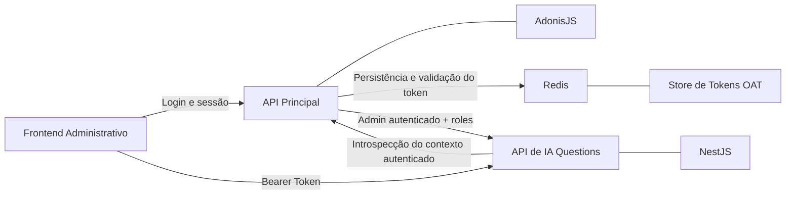
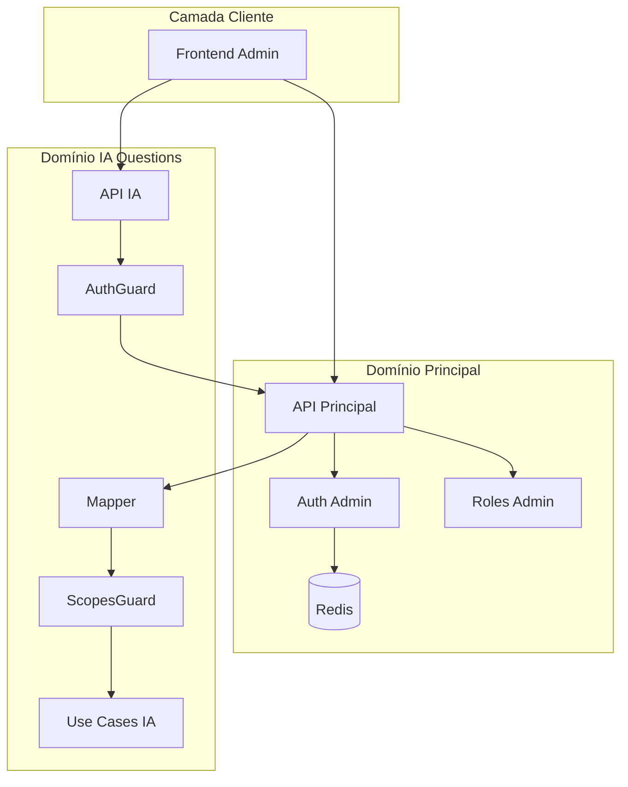
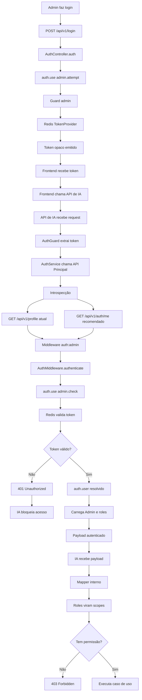
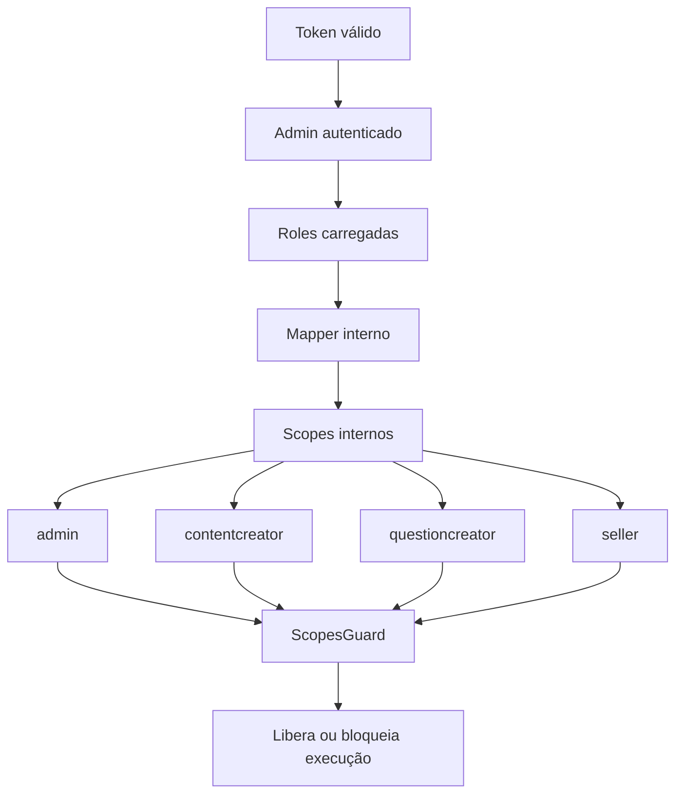
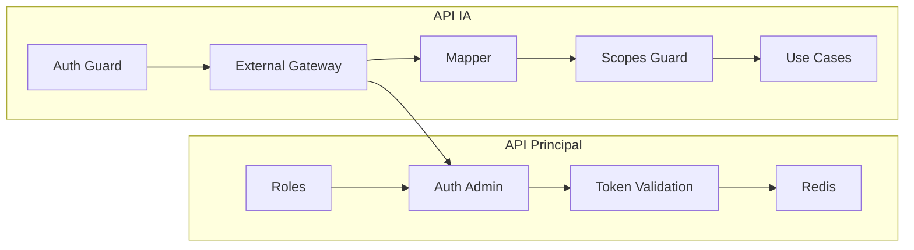
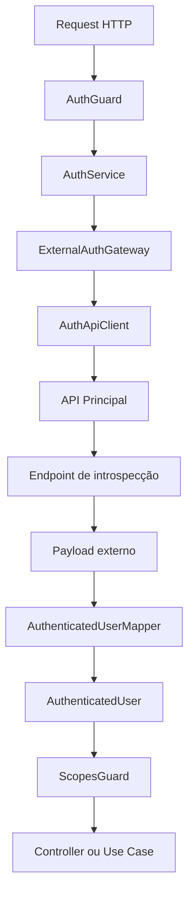

# 🔐 Arquitetura de Autenticação Delegada
## Reaproveitamento do Auth da API Principal (AdonisJS) na API de IA de Questions (NestJS)

> Documento técnico de arquitetura da **Fase 1**, estruturado para uso como **README técnico**, **documentação arquitetural** e **base de Pull Request (PR)**.

---


---

# 📚 Sumário

- [1. Visão Geral](#1--visão-geral)
- [2. Objetivo da Fase 1](#2--objetivo-da-fase-1)
- [3. Escopo Arquitetural](#3--escopo-arquitetural)
- [4. Contexto Técnico Validado](#4--contexto-técnico-validado)
- [5. Problema Arquitetural](#5--problema-arquitetural)
- [6. Decisão de Arquitetura](#6--decisão-de-arquitetura)
- [7. Princípios Arquiteturais](#7--princípios-arquiteturais)
- [8. Desenho da Solução](#8--desenho-da-solução)
- [9. Fluxo Executivo de Autenticação Delegada](#9--fluxo-executivo-de-autenticação-delegada)
- [10. Fluxo Técnico Detalhado](#10--fluxo-técnico-detalhado)
- [11. Fluxo de Autorização Interna](#11--fluxo-de-autorização-interna)
- [12. Boundary entre Sistemas](#12--boundary-entre-sistemas)
- [13. Contratos de Integração](#13--contratos-de-integração)
- [14. Endpoint de Introspecção](#14--endpoint-de-introspecção)
- [15. Arquitetura do Módulo Auth da IA](#15--arquitetura-do-módulo-auth-da-ia)
- [16. Estrutura de Pastas Sugerida](#16--estrutura-de-pastas-sugerida)
- [17. Requisitos de Segurança](#17--requisitos-de-segurança)
- [18. Observabilidade, Logs e Auditoria](#18--observabilidade-logs-e-auditoria)
- [19. Estratégia de Resiliência](#19--estratégia-de-resiliência)
- [20. Estratégia de Cache](#20--estratégia-de-cache)
- [21. Anti-padrões](#21--anti-padrões)
- [22. Decisão Final da Fase 1](#22--decisão-final-da-fase-1)
- [23. Checklist Técnico da PR](#23--checklist-técnico-da-pr)
- [24. Template de Pull Request](#24--template-de-pull-request)
- [25. Próximos Passos](#25--próximos-passos)
- [26. Conclusão Executiva](#26--conclusão-executiva)

---

# 1. 🎯 Visão Geral

Este documento descreve o desenho arquitetural da solução de **autenticação delegada** entre a **API principal** e a **API de IA de Questions**, permitindo que a camada de IA **reaproveite o contexto autenticado administrativo já existente**, sem duplicar identidade, login, sessão, emissão de token ou responsabilidade de autenticação.

A solução foi desenhada para preservar pilares arquiteturais esperados em ambiente de produção:

- **centralização de identidade**;
- **segurança por padrão**;
- **consistência de autorização**;
- **baixo acoplamento entre serviços**;
- **evolução incremental por fases**;
- **clareza operacional para backend, arquitetura e revisão técnica**.

## Princípio central

> A API de IA **não autentica usuários**.
>
> Ela **consome identidade autenticada** da API principal e executa **autorização local** com base no contexto retornado.

---

# 2. 🚀 Objetivo da Fase 1

A **Fase 1** tem como objetivo habilitar, com segurança e baixo risco, o acesso administrativo à API de IA usando a mesma identidade já existente no sistema principal.

## O que a Fase 1 resolve

- reaproveita o `auth:admin` já existente;
- evita duplicação de login e sessão;
- elimina necessidade de mecanismo próprio de autenticação na IA;
- mantém a API principal como **fonte de verdade da identidade**;
- permite que a API de IA evolua sua **autorização interna** com baixo acoplamento.

## O que a Fase 1 ainda não pretende resolver

- federação multi-tenant;
- autorização contextual fina por recurso;
- cache avançado de introspecção;
- SSO corporativo externo;
- token exchange entre domínios;
- política ABAC completa.

> A Fase 1 foi desenhada para ser **segura, incremental, auditável e implementável com o menor risco arquitetural possível**.

---

# 3. 🧭 Escopo Arquitetural

## Em escopo

- autenticação delegada entre APIs;
- introspecção do token administrativo;
- reaproveitamento do contexto `admin`;
- normalização de roles;
- conversão de roles para scopes internos;
- proteção de endpoints críticos da IA;
- padronização de payload autenticado.

## Fora de escopo

- login do frontend;
- UI de autenticação;
- redefinição do modelo de identidade do legado;
- reescrita do auth da API principal;
- substituição do OAT atual por JWT.

---

# 4. 🧩 Contexto Técnico Validado

## 4.1 Stack de autenticação atual

- **Framework principal:** AdonisJS
- **Framework IA:** NestJS
- **Guard padrão administrativo:** `admin`
- **Driver:** `oat` (**Opaque Access Token**)
- **Persistência do token:** **Redis**
- **Provider de identidade:** `Admin`
- **Autorização atual:** baseada em `roles`
- **Rotas administrativas:** protegidas por `auth:admin` + `role:*`

## 4.2 Guard administrativo validado

```ts
admin: {
  driver: 'oat',
  tokenProvider: {
    type: 'api',
    driver: 'redis',
    redisConnection: 'local',
    foreignKey: 'admin_id',
  },
  provider: {
    driver: 'lucid',
    identifierKey: 'id',
    uids: ['email'],
    model: () => import('App/Models/Admin'),
  },
}
```

## 4.3 Conclusão prática

A **API de IA deve reaproveitar o contexto `admin`**, porque o acesso operacional da camada de IA pertence ao mesmo perímetro administrativo já existente.

```text
auth:admin
```

---

# 5. 🧠 Problema Arquitetural

Se a API de IA tentar criar um auth próprio, surgem problemas imediatos:

- duplicação de identidade;
- inconsistência entre permissões e sessões;
- risco de autorização divergente;
- necessidade de manter login e expiração em dois sistemas;
- acoplamento incorreto entre domínio de IA e identidade;
- ampliação desnecessária da superfície de ataque.

## O problema real

A API de IA precisa saber:

- quem é o usuário autenticado;
- se o token dele é válido;
- quais roles ele possui;
- se ele pode executar determinada operação da IA.

Mas ela **não deve** assumir a responsabilidade de autenticar por conta própria.

---

# 6. 🏛️ Decisão de Arquitetura

## 6.1 Decisão oficial

A arquitetura adotada será de:

# **Autenticação Delegada com Introspecção Controlada**

## 6.2 Papéis de cada sistema

| Sistema | Responsabilidade |
|---|---|
| **API Principal (AdonisJS)** | Autoridade de autenticação e resolução de identidade |
| **API de IA (NestJS)** | Consumidora de contexto autenticado e executora de autorização interna |

## 6.3 Resumo arquitetural

A API principal é responsável pela autenticação.
A API de IA é responsável pela autorização baseada no contexto recebido.

---

# 7. 🧱 Princípios Arquiteturais

## 7.1 Source of Truth único

A identidade administrativa deve existir **em um único lugar**: a API principal.

## 7.2 Segurança por boundary

A API de IA consome apenas o necessário para executar suas decisões internas.

## 7.3 Autorização desacoplada

A IA não deve depender do middleware legado de `role`; ela deve trabalhar com **scopes internos próprios**.

## 7.4 Compatibilidade evolutiva

A solução deve funcionar agora com o payload atual e permitir evolução para um contrato mais canônico no futuro.

## 7.5 Falha segura

Qualquer falha na resolução de identidade deve resultar em **negação de acesso**.

---

# 8. 🛰️ Desenho da Solução

## 8.1 Objetivo da solução

A API de IA de Questions atua como serviço especializado para:

- ingestão de documentos;
- processamento e extração;
- geração assistida por IA;
- revisão e pipeline de questões;
- operações internas do fluxo de construção de banco de questões.

Ela **não possui mecanismo próprio de autenticação**.
Depende integralmente do token administrativo emitido pela API principal.

## 8.2 Resultado arquitetural desejado

```text
A mesma identidade administrativa da app principal controla o acesso à API de IA.
```

## 8.3 Diagrama executivo de alto nível



## 8.4 Diagrama de contexto arquitetural



---

# 9. 🔄 Fluxo Executivo de Autenticação Delegada

## 9.1 Visão funcional ponta a ponta



## 9.2 Resumo executivo em uma linha

```text
Frontend → API IA → API Principal → Redis → Contexto autenticado → Autorização local na IA
```

---

# 10. 🧬 Fluxo Técnico Detalhado

## 10.1 Fluxo por sequência técnica


## 10.2 Ciclo técnico do request

```mermaid
flowchart LR
    A[HTTP Request] --> B[AuthGuard]
    B --> C[Extract Bearer Token]
    C --> D[AuthService]
    D --> E[ExternalAuthGateway]
    E --> F[AuthApiClient]
    F --> G[API Principal]
    G --> H[Payload autenticado]
    H --> I[Normalizer]
    I --> J[Mapper]
    J --> K[AuthenticatedUser]
    K --> L[ScopesGuard]
    L --> M[Controller]
    M --> N[Use Case]
```



---

# 11. 🛂 Fluxo de Autorização Interna

A autenticação resolve **quem é o usuário**.  
A autorização resolve **o que ele pode fazer**.

Na API principal, a autorização atual está acoplada a `roles`.  
Na API de IA, a recomendação é usar **scopes internos**, derivados dessas roles.

## 11.1 Fluxo de autorização interno



## 11.2 Separação correta de responsabilidades

| Camada | Responsabilidade |
|---|---|
| **API Principal** | Validar token e resolver identidade |
| **API Principal** | Carregar roles do admin |
| **API de IA** | Converter roles legadas em scopes internos |
| **API de IA** | Decidir autorização por endpoint e caso de uso |

## 11.3 Regra arquitetural recomendada

> **Role é contrato externo legado. Scope é contrato interno de autorização da IA.**

---

# 12. 🧱 Boundary entre Sistemas

## 12.1 O que cruza a fronteira entre APIs

Apenas o necessário para autenticação/autorização:

- token Bearer recebido na requisição;
- chamada de introspecção;
- payload autenticado do admin;
- roles administrativas necessárias.

## 12.2 O que não deve cruzar a fronteira

- acesso direto ao Redis;
- detalhes internos do provider do Adonis;
- segredos internos do auth principal;
- abstrações internas do domínio administrativo;
- payload cru espalhado pelo domínio da IA.

## 12.3 Boundary model



---

# 13. 📦 Contratos de Integração

## 13.1 Estado atual validado

Hoje, com base no `AuthController.show`, o comportamento validado é:

```ts
const user = auth.user as Admin
return response.ok(
  await Admin.query().preload('roles').where('id', user.id).first()
)
```

## 13.2 Exemplo completo de payload atual

```json
{
  "id": 10,
  "name": "Matheus Diamantino",
  "email": "admin@empresa.com",
  "roles": [
    {
      "id": 1,
      "name": "admin",
      "slug": "admin"
    },
    {
      "id": 3,
      "name": "questioncreator",
      "slug": "questioncreator"
    }
  ],
  "created_at": "2026-01-10T10:00:00.000Z",
  "updated_at": "2026-02-10T10:00:00.000Z"
}
```

## 13.3 Payload ideal recomendado

```json
{
  "id": 10,
  "name": "Matheus Diamantino",
  "email": "admin@empresa.com",
  "roles": ["admin", "questioncreator"],
  "active": true,
  "status": "active"
}
```

## 13.4 Contrato interno canônico da IA

```ts
export interface AuthenticatedUser {
  id: number
  name: string
  email: string
  roles: string[]
  scopes: string[]
  isActive: boolean
  status?: string
}
```

## 13.5 Contrato externo esperado

```ts
export interface ExternalAdminProfile {
  id: number
  name: string
  email: string
  active?: boolean
  status?: string
  roles: Array<
    | string
    | {
        id?: number
        name?: string
        slug?: string
      }
  >
}
```

## 13.6 Role -> Scope Mapping

```ts
export const ROLE_SCOPE_MAP: Record<string, string[]> = {
  admin: ['*'],
  contentcreator: [
    'content.read',
    'content.write',
    'documents.read'
  ],
  questioncreator: [
    'documents.read',
    'documents.upload',
    'processing.read',
    'processing.retry',
    'questions.generate',
    'questions.review'
  ],
  seller: [
    'dashboard.read'
  ],
}
```

---

# 14. 🌐 Endpoint de Introspecção

## 14.1 Estado atual utilizável

```http
GET /api/v1/profile
```

## 14.2 Estado recomendado

```ts
Route.get('/auth/me', 'AuthController.me').middleware(['auth:admin'])
```

## 14.3 Controller recomendado

```ts
public async me({ response, auth }: HttpContextContract) {
  const user = auth.user as Admin

  const admin = await Admin.query()
    .preload('roles')
    .where('id', user.id)
    .first()

  return response.ok(admin)
}
```

## 14.4 Requisitos do endpoint

- retornar payload estável e canônico;
- não depender de regras de tela ou perfil;
- ser protegido apenas por `auth:admin`;
- responder exclusivamente contexto autenticado.

---

# 15. 🧱 Arquitetura do Módulo Auth da IA

## 15.1 Princípio de implementação

O módulo `auth` da IA deve ser responsável apenas por:

- receber o token;
- validar esse token contra a app principal;
- construir um `AuthenticatedUser` interno;
- aplicar autorização por scopes.

Ele **não deve**:

- emitir token;
- persistir sessão administrativa;
- manter login próprio;
- reimplementar o guard do Adonis.

## 15.2 Diagrama da arquitetura do módulo



---

# 16. 🌳 Estrutura de Pastas Sugerida

```text
src/modules/auth/
├── auth.module.ts
├── infra/
│   ├── clients/
│   │   └── auth-api.client.ts
│   ├── gateways/
│   │   └── external-auth.gateway.ts
│   ├── services/
│   │   └── auth.service.ts
│   ├── guards/
│   │   ├── auth.guard.ts
│   │   └── scopes.guard.ts
│   └── decorators/
│       ├── current-user.decorator.ts
│       └── required-scopes.decorator.ts
├── model/
│   ├── dto/
│   │   └── authenticated-user.dto.ts
│   ├── interfaces/
│   │   ├── external-admin-profile.interface.ts
│   │   ├── authenticated-user.interface.ts
│   │   └── role-scope-map.interface.ts
│   ├── enums/
│   │   └── internal-scope.enum.ts
│   └── constants/
│       └── role-scope-map.constant.ts
└── lib/
    ├── mappers/
    │   └── authenticated-user.mapper.ts
    ├── helpers/
    │   ├── extract-bearer-token.helper.ts
    │   └── normalize-role.helper.ts
    └── normalizers/
        └── external-auth-response.normalizer.ts
```

---

# 17. 🔐 Requisitos de Segurança

## 17.1 Requisitos obrigatórios

### Transporte
- TLS obrigatório;
- nunca trafegar token em query string;
- aceitar apenas `Authorization: Bearer`.

### Validação
- negar acesso por padrão;
- falha de introspecção deve bloquear;
- nunca considerar token “provavelmente válido”.

### Logs
- nunca logar token puro;
- mascarar headers sensíveis;
- não persistir credenciais em logs.

### Resiliência
- timeout curto (1s–2s);
- retry somente para falhas transitórias;
- não aplicar retry para `401` e `403`.

### Boundary Security
- a IA não deve acessar diretamente o Redis do Adonis;
- a IA não deve compartilhar segredos internos do auth principal;
- a IA não deve emitir token próprio para o mesmo contexto administrativo.

---

# 18. 📊 Observabilidade, Logs e Auditoria

## 18.1 Logs mínimos obrigatórios

- `request_id`
- `correlation_id`
- `user_id`
- `user_roles`
- `auth_provider_status_code`
- `auth_provider_latency_ms`
- `endpoint`
- `method`
- `decision`

## 18.2 Métricas recomendadas

### Counters
- `auth_requests_total`
- `auth_success_total`
- `auth_failures_total`
- `auth_forbidden_total`
- `auth_provider_timeout_total`

### Histograms
- `auth_provider_latency_ms`
- `auth_guard_execution_ms`

---

# 19. 🛡️ Estratégia de Resiliência

- timeout entre **1000ms e 2000ms**;
- retry apenas para falhas transitórias;
- no máximo **1 retry curto**;
- nunca aplicar retry para `401`, `403` e `404`.

> **Falha de autenticação remota deve degradar para bloqueio, nunca para permissão.**

---

# 20. ⚡ Estratégia de Cache

## 20.1 Regras recomendadas

### Permitido
- cache curto de payload autenticado;
- TTL pequeno (30s a 120s);
- cache apenas como otimização.

### Proibido
- cache longo de autorização;
- usar cache como fonte primária de verdade;
- ignorar revogação por causa de cache.

## 20.2 Recomendação para Fase 1

> **Não usar cache de auth inicialmente**.

---

# 21. 🚫 Anti-padrões

- não criar login próprio na API de IA;
- não validar token manualmente dentro da IA;
- não acessar diretamente o Redis do Adonis;
- não copiar o middleware `role` do legado para dentro da IA;
- não espalhar payload cru da API principal pelo sistema.

---

# 22. ✅ Decisão Final da Fase 1

- **Login continua na API principal**;
- **Token continua sendo emitido pela API principal**;
- **API de IA consome o mesmo token**;
- **API principal valida e resolve identidade**;
- **API de IA converte roles em scopes internos**;
- **API de IA decide autorização localmente**.

```text
Frontend → API IA → API Principal → Redis → Contexto Autenticado → IA
```

---

# 23. 📋 Checklist Técnico da PR

## API Principal
- [ ] manter `auth:admin` como fonte de verdade
- [ ] expor endpoint estável de introspecção
- [ ] garantir preload consistente de `roles`
- [ ] padronizar payload retornado
- [ ] validar resposta 401 para token inválido

## API de IA
- [ ] criar `AuthModule`
- [ ] implementar `AuthGuard`
- [ ] implementar `ScopesGuard`
- [ ] implementar `AuthService`
- [ ] implementar `ExternalAuthGateway`
- [ ] implementar `AuthApiClient`
- [ ] implementar `AuthenticatedUserMapper`
- [ ] implementar `ROLE_SCOPE_MAP`
- [ ] proteger endpoints críticos

## Testes
- [ ] teste de token ausente
- [ ] teste de token inválido
- [ ] teste de token válido
- [ ] teste de autorização por scope
- [ ] teste ponta a ponta entre APIs

---

# 24. 🧾 Template de Pull Request

## Título sugerido

```text
feat(auth): implementa autenticação delegada entre API principal e API de IA
```

## Descrição sugerida

```md
## Objetivo

Implementar o desenho de autenticação delegada da API de IA, reaproveitando o contexto autenticado administrativo da API principal.

## O que foi feito

- criação da base do módulo de auth da IA
- integração com endpoint de introspecção da API principal
- construção do contrato interno `AuthenticatedUser`
- normalização de roles externas
- mapeamento de roles para scopes internos
- proteção de endpoints por `AuthGuard` e `ScopesGuard`

## Motivação arquitetural

Evitar duplicação de identidade, login e sessão entre sistemas, mantendo a API principal como autoridade de autenticação e a API de IA como executora de autorização local.

## Como validar

1. autenticar com admin na API principal
2. reutilizar o Bearer Token na API de IA
3. validar 401 para token inválido
4. validar 403 para role sem scope suficiente
5. validar 200 para admin autorizado
```

---

# 25. 🚀 Próximos Passos

## Na API Principal
- manter o login administrativo existente;
- usar `GET /api/v1/profile` como base inicial;
- criar `GET /api/v1/auth/me` como evolução correta;
- padronizar payload;
- garantir preload consistente de roles.

## Na API de IA
- criar o módulo `auth` completo;
- implementar `AuthGuard`;
- implementar `ScopesGuard`;
- criar `AuthenticatedUserMapper`;
- criar `ROLE_SCOPE_MAP`;
- proteger endpoints críticos da IA;
- escrever testes de integração ponta a ponta.

---

# 26. 🧾 Conclusão Executiva

O desenho atual está **coerente com o código real mapeado** e **arquiteturalmente adequado para o que está sendo construído na Fase 1**.

A integração entre a app principal e a API de IA de Questions deve seguir o modelo de **autenticação delegada com introspecção**, usando a app principal como autoridade de identidade e a IA como consumidora de contexto autenticado.

## Síntese final

A API principal autentica.  
A API de IA confia, traduz, autoriza e executa.

