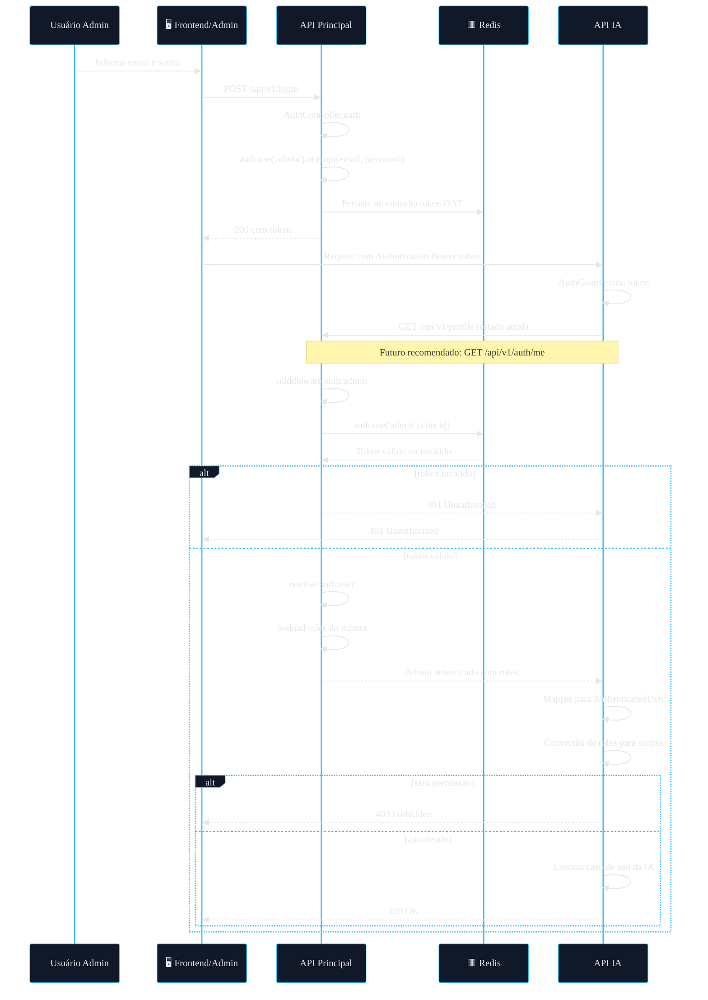

# 🔐 Arquitetura de Autenticação Delegada
## Reaproveitamento do Auth da API Principal (AdonisJS) na API de IA de Questions (NestJS)

> **Status atual:** Documento técnico em evolução para a **Fase 1** do projeto.  
> O desenho abaixo está **alinhado com o código real validado até aqui**, mas ainda pode receber refinamentos conforme avançarmos na implementação.

---


---

# 📚 Sumário

- [1. Visão Geral](#1--visão-geral)
- [2. Contexto Técnico Validado](#2--contexto-técnico-validado)
- [3. Problema Arquitetural](#3--problema-arquitetural)
- [4. Decisão de Arquitetura](#4--decisão-de-arquitetura)
- [5. Solução Proposta](#5--solução-proposta)
- [6. Fluxo de Autenticação](#6--fluxo-de-autenticação)
- [7. Fluxo de Autorização](#7--fluxo-de-autorização)
- [8. Contratos de Integração](#8--contratos-de-integração)
- [9. Endpoint de Introspecção](#9--endpoint-de-introspecção)
- [10. Arquitetura do Módulo Auth da IA](#10--arquitetura-do-módulo-auth-da-ia)
- [11. Estrutura de Arquivos do Módulo Auth](#11--estrutura-de-arquivos-do-módulo-auth)
- [12. Requisitos de Segurança](#12--requisitos-de-segurança)
- [13. Observabilidade e Auditoria](#13--observabilidade-e-auditoria)
- [14. Estratégia de Cache](#14--estratégia-de-cache)
- [15. Anti-padrões](#15--anti-padrões)
- [16. Decisão Final da Fase 1](#16--decisão-final-da-fase-1)
- [17. Próximos Passos](#17--próximos-passos)
- [18. Conclusão Executiva](#18--conclusão-executiva)

---

# 1. 🎯 Visão Geral

Este documento define a arquitetura oficial para **reaproveitamento da autenticação da API principal** na nova **API de IA de Questions**, garantindo:

- consistência de identidade;
- segurança por padrão;
- baixo acoplamento;
- governança centralizada;
- autorização desacoplada do legado;
- evolução sustentável da plataforma.

## Princípio central

> A API de IA **não deve autenticar usuários por conta própria**.  
> Ela deve **confiar de forma segura** na autenticação já realizada pela API principal.

---

# 2. 🧩 Contexto Técnico Validado

Com base nos arquivos da aplicação principal, o cenário atual já foi validado.

## 2.1 Stack de autenticação atual

- **Framework:** AdonisJS
- **Guard padrão:** `admin`
- **Driver:** `oat` (**Opaque Access Token**)
- **Persistência do token:** **Redis**
- **Provider de identidade:** `Admin`
- **Autorização atual:** baseada em `roles`
- **Rotas administrativas:** protegidas por `auth:admin` + `role:*`

## 2.2 Guards existentes

### Guard administrativo

```ts
admin: {
  driver: 'oat',
  tokenProvider: {
    type: 'api',
    driver: 'redis',
    redisConnection: 'local',
    foreignKey: 'admin_id',
  },
  provider: {
    driver: 'lucid',
    identifierKey: 'id',
    uids: ['email'],
    model: () => import('App/Models/Admin'),
  },
}
```

### Guard de cliente

```ts
api: {
  driver: 'oat',
  tokenProvider: {
    type: 'api',
    driver: 'redis',
    redisConnection: 'local',
    foreignKey: 'client_id',
  },
  provider: {
    driver: 'lucid',
    identifierKey: 'id',
    uids: ['email'],
    model: () => import('App/Models/Client'),
    connection: 'clientsPriority',
  },
}
```

## 2.3 Conclusão importante

A **API de IA deve reaproveitar o contexto `admin`**, e não o `api`, porque o fluxo operacional interno e administrativo do sistema está claramente vinculado ao guard:

```text
auth:admin
```

---

# 3. 🧠 Problema arquitetural

Se a API de IA tentar criar um auth próprio, os seguintes problemas surgem imediatamente:

- duplicação de identidade;
- inconsistência entre permissões e sessões;
- risco de autorização divergente;
- necessidade de manter login e expiração em dois sistemas;
- acoplamento incorreto entre domínio de IA e identidade.

## 3.1 Problema real

A API de IA precisa saber:

- **quem é o usuário autenticado**;
- **se o token dele é válido**;
- **quais papéis/perfis ele possui**;
- **se ele pode executar determinada operação da IA**.

Mas ela **não deve** assumir a responsabilidade de autenticar por conta própria.

---

# 4. 🏛️ Decisão de Arquitetura

## 4.1 Decisão oficial

A arquitetura adotada será de:

## **Autenticação delegada com introspecção controlada**

> **Nota técnica:** embora o termo “federação” possa ser usado em sentido amplo, o desenho que estamos implementando é, de forma mais precisa, uma arquitetura de **auth delegada**, na qual a **API principal é a autoridade de autenticação** e a **API de IA consome o contexto autenticado via introspecção**.

## 4.2 Papéis de cada sistema

| Sistema | Responsabilidade |
|---|---|
| **API Principal (AdonisJS)** | Autoridade de autenticação e resolução de identidade |
| **API de IA (NestJS)** | Consumidora de contexto autenticado e executora de autorização interna |

## 4.3 Em uma frase

> A API principal autentica. A API de IA autoriza.

---

# 5. 🛰️ Solução Proposta

## 5.1 Objetivo da solução na prática

A **API de IA de Questions** será um serviço especializado em:

- ingestão de documentos;
- processamento e extração;
- geração assistida por IA;
- revisão e pipeline de questões;
- operações internas do fluxo de construção de banco de questões.

Porém, **ela não terá login próprio**.

Ela dependerá da **sessão/token administrativo já emitido pela app principal**, garantindo que o acesso ao domínio de IA continue subordinado ao mesmo contexto administrativo da plataforma principal.

## 5.2 Resultado arquitetural desejado

```text
A mesma identidade administrativa da app principal controla o acesso à API de IA.
```

## 5.3 Diagrama executivo de alto nível

```mermaid
%%{init: {
  "theme": "base",
  "themeVariables": {
    "background": "#0b1020",
    "primaryColor": "#111827",
    "primaryTextColor": "#e5e7eb",
    "primaryBorderColor": "#3b82f6",
    "lineColor": "#60a5fa",
    "secondaryColor": "#172033",
    "secondaryTextColor": "#e2e8f0",
    "tertiaryColor": "#0f172a",
    "tertiaryTextColor": "#f8fafc",
    "fontFamily": "Inter, ui-sans-serif, system-ui, sans-serif"
  }
}}%%
flowchart LR
    FE[🖥️ Frontend Admin]
    AP[🧩 API Principal]
    AP2[AdonisJS]
    RD[(🟥 Redis)]
    RD2[(Opaque Token Store)]
    IA[🤖 API de IA]
    IA2[NestJS]

    AP --- AP2
    RD --- RD2
    IA --- IA2

    FE -->|Login e sessão| AP
    AP -->|Persistência e validação de token| RD
    FE -->|Bearer Token| IA
    IA -->|Introspecção do usuário| AP
    AP -->|Admin autenticado + roles| IA
```mermaid
%%{init: {
  "theme": "base",
  "themeVariables": {
    "background": "#0b1020",
    "primaryColor": "#111827",
    "primaryTextColor": "#e5e7eb",
    "primaryBorderColor": "#3b82f6",
    "lineColor": "#60a5fa",
    "secondaryColor": "#172033",
    "secondaryTextColor": "#e2e8f0",
    "tertiaryColor": "#0f172a",
    "tertiaryTextColor": "#f8fafc",
    "fontFamily": "Inter, ui-sans-serif, system-ui, sans-serif"
  }
}}%%
flowchart LR
    FE[🖥️ Frontend Admin]
    AP[🧩 API Principal<br/>AdonisJS]
    RD[(🟥 Redis<br/>Opaque Token Store)]
    IA[🤖 API de IA<br/>NestJS]

    FE -->|Login e sessão| AP
    AP -->|Persistência e validação de token| RD
    FE -->|Authorization Bearer Token| IA
    IA -->|Introspecção do usuário autenticado| AP
    AP -->|Admin autenticado e roles| IA
```

---

# 6. 🔄 Fluxo de Autenticação

## 6.1 Visão funcional ponta a ponta

```mermaid
%%{init: {
  "theme": "base",
  "themeVariables": {
    "background": "#0b1020",
    "primaryColor": "#111827",
    "primaryTextColor": "#e5e7eb",
    "primaryBorderColor": "#22c55e",
    "lineColor": "#22c55e",
    "secondaryColor": "#172033",
    "secondaryTextColor": "#e2e8f0",
    "tertiaryColor": "#0f172a",
    "tertiaryTextColor": "#f8fafc",
    "fontFamily": "Inter, ui-sans-serif, system-ui, sans-serif"
  }
}}%%
flowchart TD
    A[👤 Admin faz login] --> B[📨 POST /api/v1/login]
    B --> C[🧠 AuthController.auth]
    C --> D[🔐 auth.use admin.attempt]
    D --> E[🛡️ Guard admin]
    E --> F[🟥 Redis TokenProvider]
    F --> G[🎟️ Token opaco emitido]
    G --> H[🖥️ Frontend recebe token]

    H --> I[📡 Frontend chama API de IA]
    I --> J[🤖 API de IA recebe request]
    J --> K[🛡️ AuthGuard extrai token]
    K --> L[🔄 AuthService chama API Principal]

    L --> M[🌐 Introspecção]
    M --> M1[GET /api/v1/profile hoje]
    M --> M2[GET /api/v1/auth/me futuro]
    M1 --> N[🛡️ Middleware auth:admin]
    M2 --> N
    N --> O[🔍 AuthMiddleware.authenticate]
    O --> P[🧪 auth.use admin.check]
    P --> Q[🟥 Redis valida token]

    Q --> R{✅ Token válido?}
    R -- Não --> S[⛔ 401 Unauthorized]
    S --> T[🚫 IA bloqueia acesso]

    R -- Sim --> U[👤 auth.user resolvido]
    U --> V[📚 Carrega Admin e roles]
    V --> W[📦 Payload autenticado]

    W --> X[📥 IA recebe payload]
    X --> Y[🧭 Mapper interno]
    Y --> Z[🧠 Roles viram scopes]

    Z --> AA{🔐 Tem permissão?}
    AA -- Não --> AB[🚫 403 Forbidden]
    AA -- Sim --> AC[⚙️ Executa caso de uso]
```mermaid
%%{init: {
  "theme": "base",
  "themeVariables": {
    "background": "#0b1020",
    "primaryColor": "#111827",
    "primaryTextColor": "#e5e7eb",
    "primaryBorderColor": "#22c55e",
    "lineColor": "#22c55e",
    "secondaryColor": "#172033",
    "secondaryTextColor": "#e2e8f0",
    "tertiaryColor": "#0f172a",
    "tertiaryTextColor": "#f8fafc",
    "fontFamily": "Inter, ui-sans-serif, system-ui, sans-serif"
  }
}}%%
flowchart TD
    A[👤 Admin faz login<br/>no sistema principal] --> B[📨 POST /api/v1/login]
    B --> C[🧠 AuthController.auth]
    C --> D[🔐 auth.use admin.attempt]
    D --> E[🛡️ Guard admin<br/>driver OAT]
    E --> F[🟥 TokenProvider Redis]
    F --> G[🎟️ Token opaco emitido]
    G --> H[🖥️ Frontend recebe token]

    H --> I[📡 Frontend chama API de IA<br/>com Authorization Bearer]
    I --> J[🤖 API de IA recebe request]
    J --> K[🛡️ AuthGuard extrai token]
    K --> L[🔄 AuthService chama API Principal]

    L --> M[🌐 GET /api/v1/profile hoje<br/>ou GET /api/v1/auth/me recomendado]
    M --> N[🛡️ Middleware auth:admin]
    N --> O[🔍 AuthMiddleware.authenticate]
    O --> P[🧪 auth.use admin.check]
    P --> Q[🟥 Redis valida token]

    Q --> R{✅ Token válido?}
    R -- Não --> S[⛔ 401 Unauthorized]
    S --> T[🚫 API de IA bloqueia acesso]

    R -- Sim --> U[👤 auth.user resolvido<br/>como Admin]
    U --> V[📚 Carrega Admin e roles]
    V --> W[📦 API Principal retorna<br/>payload autenticado]

    W --> X[📥 API de IA recebe payload]
    X --> Y[🧭 Mapper converte<br/>para AuthenticatedUser]
    Y --> Z[🧠 Roles legadas viram<br/>scopes internos]

    Z --> AA{🔐 Usuário tem permissão?}
    AA -- Não --> AB[🚫 403 Forbidden]
    AA -- Sim --> AC[⚙️ Controller ou Use Case<br/>da IA executa]
```

---

## 6.2 Fluxo por sequência técnica



---

# 7. 🛂 Fluxo de autorização

A autenticação resolve **quem é o usuário**.  
A autorização resolve **o que ele pode fazer**.

Na API principal, a autorização atual está acoplada a `roles`.  
Na API de IA, a recomendação é usar **scopes internos**, derivados dessas roles.

## 7.1 Fluxo de autorização interno

```mermaid
%%{init: {
  "theme": "base",
  "themeVariables": {
    "background": "#0b1020",
    "primaryColor": "#111827",
    "primaryTextColor": "#e5e7eb",
    "primaryBorderColor": "#a855f7",
    "lineColor": "#a855f7",
    "secondaryColor": "#172033",
    "secondaryTextColor": "#e2e8f0",
    "tertiaryColor": "#0f172a",
    "tertiaryTextColor": "#f8fafc",
    "fontFamily": "Inter, ui-sans-serif, system-ui, sans-serif"
  }
}}%%
flowchart TD
    A[🎟️ Token válido] --> B[👤 Admin autenticado]
    B --> C[📚 Roles carregadas]
    C --> D[🧭 Mapper interno]
    D --> E[🔐 Scopes internos]
    E --> E1[admin]
    E --> E2[contentcreator]
    E --> E3[questioncreator]
    E --> E4[seller]
    E1 --> F[🛡️ ScopesGuard]
    E2 --> F
    E3 --> F
    E4 --> F
    F --> G[✅ Libera ou 🚫 bloqueia]
```mermaid
%%{init: {
  "theme": "base",
  "themeVariables": {
    "background": "#0b1020",
    "primaryColor": "#111827",
    "primaryTextColor": "#e5e7eb",
    "primaryBorderColor": "#a855f7",
    "lineColor": "#a855f7",
    "secondaryColor": "#172033",
    "secondaryTextColor": "#e2e8f0",
    "tertiaryColor": "#0f172a",
    "tertiaryTextColor": "#f8fafc",
    "fontFamily": "Inter, ui-sans-serif, system-ui, sans-serif"
  }
}}%%
flowchart LR
    A[🎟️ Token válido] --> B[👤 Admin autenticado]
    B --> C[📚 Roles carregadas do banco]
    C --> D[🧭 Mapper interno]

    D --> E[👑 admin]
    D --> F[📝 contentcreator]
    D --> G[❓ questioncreator]
    D --> H[💼 seller]

    E --> I[🔐 Scopes internos]
    F --> I
    G --> I
    H --> I

    I --> J[🛡️ ScopesGuard da API de IA]
    J --> K[✅ Libera ou 🚫 bloqueia a rota]
```

## 7.2 Separação correta de responsabilidades

| Camada | Responsabilidade |
|---|---|
| **API Principal** | Validar token e resolver identidade |
| **API Principal** | Carregar roles do admin |
| **API de IA** | Converter roles legadas em scopes internos |
| **API de IA** | Decidir autorização por endpoint e caso de uso |

---

# 8. 📦 Contratos de Integração

A integração correta depende de contratos claros, estáveis e desacoplados do modelo interno do legado.

## 8.1 Objetivo desta seção

Definir:

- **qual payload existe hoje**;
- **qual payload devemos expor idealmente**;
- **qual payload a API de IA deve usar internamente**.

Isso evita que a IA fique acoplada ao retorno cru do Adonis.

---

## 8.2 Payload real esperado da API principal

### Estado atual validado

Hoje, com base no `AuthController.show`, o comportamento validado é:

```ts
const user = auth.user as Admin
return response.ok(
  await Admin.query().preload('roles').where('id', user.id).first()
)
```

Ou seja, **a API principal hoje devolve o `Admin` carregado com `roles`**.

Esse retorno pode variar dependendo do `Admin.ts`, serialização, colunas visíveis e shape da relação `roles`, mas conceitualmente esse é o contrato atual.

### Exemplo completo de resposta da introspecção

```json
{
  "id": 10,
  "name": "Matheus Diamantino",
  "email": "admin@empresa.com",
  "roles": [
    {
      "id": 1,
      "name": "admin",
      "slug": "admin"
    },
    {
      "id": 3,
      "name": "questioncreator",
      "slug": "questioncreator"
    }
  ],
  "created_at": "2026-01-10T10:00:00.000Z",
  "updated_at": "2026-02-10T10:00:00.000Z"
}
```

---

## 8.3 Payload ideal recomendado para exposição externa

### Recomendação arquitetural

A API de IA **não deve depender do shape cru do model `Admin`**.

O ideal é criar um payload externo mais estável, orientado a integração entre serviços.

```json
{
  "id": 10,
  "name": "Matheus Diamantino",
  "email": "admin@empresa.com",
  "roles": ["admin", "questioncreator"],
  "active": true,
  "status": "active"
}
```

### Vantagens desse formato

- reduz acoplamento ao modelo relacional interno;
- evita expor estrutura de banco;
- facilita parsing na API de IA;
- torna o contrato mais estável ao longo do tempo.

---

## 8.4 Contrato interno canônico da API de IA

A API de IA nunca deve espalhar o payload cru da API principal pelo sistema.

### Interface recomendada

```ts
export interface AuthenticatedUser {
  id: number
  name: string
  email: string
  roles: string[]
  scopes: string[]
  isActive: boolean
  status?: string
}
```

---

## 8.5 Contrato externo esperado na API de IA

```ts
export interface ExternalAdminProfile {
  id: number
  name: string
  email: string
  active?: boolean
  status?: string
  roles: Array<
    | string
    | {
        id?: number
        name?: string
        slug?: string
      }
  >
}
```

---

## 8.6 Mapeamento de roles para scopes

A API de IA deve transformar os papéis legados em autorização própria.

### Exemplo recomendado

```ts
export const ROLE_SCOPE_MAP: Record<string, string[]> = {
  admin: ['*'],
  contentcreator: [
    'content.read',
    'content.write',
    'documents.read'
  ],
  questioncreator: [
    'documents.read',
    'documents.upload',
    'processing.read',
    'processing.retry',
    'questions.generate',
    'questions.review'
  ],
  seller: [
    'dashboard.read'
  ],
}
```

---

# 9. 🌐 Endpoint de Introspecção

Esta é uma das partes mais importantes do desenho.

## 9.1 Estado atual vs estado recomendado

### Estado atual já utilizável
Hoje, o endpoint que já pode servir de base para introspecção é:

```http
GET /api/v1/profile
```

Ele já resolve o usuário autenticado via `auth:admin` e carrega `roles`.

### Estado recomendado para evolução correta
Arquiteturalmente, o ideal é **não acoplar a API de IA ao endpoint de profile administrativo**.

Por isso, a recomendação é criar um endpoint dedicado exclusivamente para introspecção de identidade.

---

## 9.2 Rota recomendada

### Recomendação de rota dedicada

```ts
Route.get('/auth/me', 'AuthController.me').middleware(['auth:admin'])
```

---

## 9.3 Controller recomendado

```ts
public async me({ response, auth }: HttpContextContract) {
  const user = auth.user as Admin

  const admin = await Admin.query()
    .preload('roles')
    .where('id', user.id)
    .first()

  return response.ok(admin)
}
```

---

## 9.4 Melhorias recomendadas nesse endpoint

### Idealmente, ele deve:

- retornar payload estável e canônico;
- não depender de regras de tela ou perfil;
- não estar acoplado a controller de UI administrativa;
- ser protegido apenas por `auth:admin`;
- responder exclusivamente contexto autenticado.

---

# 10. 🧱 Arquitetura do módulo auth da API de IA

A API de IA precisa de um módulo de auth **delegado**, e não de um sistema de identidade novo.

## 10.1 Princípio de implementação

O módulo `auth` da IA deve ser responsável apenas por:

- receber o token;
- validar esse token contra a app principal;
- construir um `AuthenticatedUser` interno;
- aplicar autorização por scopes.

Ele **não deve**:

- emitir token;
- persistir sessão administrativa;
- manter login próprio;
- reimplementar o guard do Adonis.

---

## 10.2 Diagrama da arquitetura do módulo

```mermaid
%%{init: {
  "theme": "base",
  "themeVariables": {
    "background": "#0b1020",
    "primaryColor": "#111827",
    "primaryTextColor": "#e5e7eb",
    "primaryBorderColor": "#f59e0b",
    "lineColor": "#f59e0b",
    "secondaryColor": "#172033",
    "secondaryTextColor": "#e2e8f0",
    "tertiaryColor": "#0f172a",
    "tertiaryTextColor": "#f8fafc",
    "fontFamily": "Inter, ui-sans-serif, system-ui, sans-serif"
  }
}}%%
flowchart TD
    A[📨 Request HTTP] --> B[🛡️ AuthGuard]
    B --> C[🧠 AuthService]
    C --> D[🔌 ExternalAuthGateway]
    D --> E[🌐 AuthApiClient]
    E --> F[🧩 API Principal]
    F --> F1[Endpoint de introspecção]
    F1 --> G[📦 Payload externo]
    G --> H[🧭 AuthenticatedUserMapper]
    H --> I[👤 AuthenticatedUser]
    I --> J[🛡️ ScopesGuard]
    J --> K[⚙️ Controller ou Use Case]
```mermaid
%%{init: {
  "theme": "base",
  "themeVariables": {
    "background": "#0b1020",
    "primaryColor": "#111827",
    "primaryTextColor": "#e5e7eb",
    "primaryBorderColor": "#f59e0b",
    "lineColor": "#f59e0b",
    "secondaryColor": "#172033",
    "secondaryTextColor": "#e2e8f0",
    "tertiaryColor": "#0f172a",
    "tertiaryTextColor": "#f8fafc",
    "fontFamily": "Inter, ui-sans-serif, system-ui, sans-serif"
  }
}}%%
flowchart TD
    A[📨 Request HTTP] --> B[🛡️ AuthGuard]
    B --> C[🧠 AuthService]
    C --> D[🔌 ExternalAuthGateway]
    D --> E[🌐 AuthApiClient]
    E --> F[🧩 API Principal<br/>endpoint de introspecção]
    F --> G[📦 Payload externo do admin]
    G --> H[🧭 AuthenticatedUserMapper]
    H --> I[👤 AuthenticatedUser]
    I --> J[🛡️ ScopesGuard]
    J --> K[⚙️ Controller ou Use Case]
```

---

## 10.3 Responsabilidade de cada componente

### `AuthGuard`
Responsável por:

- extrair o Bearer Token;
- negar acesso se o token estiver ausente;
- chamar o `AuthService`;
- anexar `request.user`.

### `AuthService`
Responsável por:

- orquestrar a autenticação delegada;
- chamar o gateway externo;
- receber o payload autenticado.

### `ExternalAuthGateway`
Responsável por:

- encapsular a integração com a API principal;
- evitar espalhar detalhes de transporte pelo módulo.

### `AuthApiClient`
Responsável por:

- executar a chamada HTTP para a API principal;
- tratar timeout, status codes e erros de integração.

### `AuthenticatedUserMapper`
Responsável por:

- converter payload externo em contrato interno;
- normalizar roles;
- gerar scopes internos.

### `ScopesGuard`
Responsável por:

- validar autorização por endpoint;
- negar acesso se o usuário não tiver os scopes necessários.

---

# 11. 🌳 Estrutura de Arquivos do Módulo Auth

Abaixo está a estrutura recomendada para o módulo `auth` da API de IA, já no padrão modular enterprise.

```text
src/modules/auth/
├── auth.module.ts
│
├── infra/
│   ├── clients/
│   │   └── auth-api.client.ts
│   │
│   ├── gateways/
│   │   └── external-auth.gateway.ts
│   │
│   ├── services/
│   │   └── auth.service.ts
│   │
│   ├── guards/
│   │   ├── auth.guard.ts
│   │   └── scopes.guard.ts
│   │
│   └── decorators/
│       ├── current-user.decorator.ts
│       └── required-scopes.decorator.ts
│
├── model/
│   ├── dto/
│   │   └── authenticated-user.dto.ts
│   │
│   ├── interfaces/
│   │   ├── external-admin-profile.interface.ts
│   │   ├── authenticated-user.interface.ts
│   │   └── role-scope-map.interface.ts
│   │
│   ├── enums/
│   │   └── internal-scope.enum.ts
│   │
│   └── constants/
│       └── role-scope-map.constant.ts
│
└── lib/
    ├── mappers/
    │   └── authenticated-user.mapper.ts
    │
    ├── helpers/
    │   ├── extract-bearer-token.helper.ts
    │   └── normalize-role.helper.ts
    │
    └── normalizers/
        └── external-auth-response.normalizer.ts
```

---

## 11.1 Responsabilidade de cada arquivo

### `auth.module.ts`
Registra providers, guards, gateways, mappers e dependências do módulo.

### `auth-api.client.ts`
Cliente HTTP responsável por chamar a API principal.

### `external-auth.gateway.ts`
Abstração de integração externa com a autoridade de autenticação.

### `auth.service.ts`
Serviço principal de autenticação delegada.

### `auth.guard.ts`
Guard de autenticação para proteger rotas da API de IA.

### `scopes.guard.ts`
Guard de autorização por escopo.

### `current-user.decorator.ts`
Decorator para recuperar `request.user` de forma limpa.

### `required-scopes.decorator.ts`
Decorator para declarar os scopes exigidos por rota.

### `authenticated-user.dto.ts`
DTO exposto internamente para transporte seguro do contexto autenticado.

### `external-admin-profile.interface.ts`
Contrato do payload vindo da API principal.

### `authenticated-user.interface.ts`
Contrato interno canônico da API de IA.

### `role-scope-map.constant.ts`
Mapa oficial de conversão de roles legadas para scopes internos.

### `authenticated-user.mapper.ts`
Converte payload externo em `AuthenticatedUser`.

### `extract-bearer-token.helper.ts`
Responsável por extrair e validar o header Authorization.

### `normalize-role.helper.ts`
Normaliza nomes e slugs de role.

### `external-auth-response.normalizer.ts`
Padroniza formatos diferentes de resposta da API principal.

---

# 12. 🔐 Requisitos de Segurança

A integração entre a API principal e a API de IA lida diretamente com o **perímetro administrativo da plataforma**.

Isso significa que qualquer erro de modelagem aqui pode abrir brechas em:

- geração de conteúdo;
- processamento de documentos;
- revisão e publicação de questões;
- rotas administrativas da camada de IA.

Portanto, esta seção é mandatória.

## 12.1 Requisitos obrigatórios

### Transporte
- TLS obrigatório entre frontend, API principal e API de IA;
- nunca trafegar token em query string;
- aceitar apenas header `Authorization: Bearer`.

### Validação
- negar acesso por padrão;
- falha de introspecção deve resultar em bloqueio;
- nunca considerar token “provavelmente válido”.

### Logs
- nunca logar token em texto puro;
- mascarar headers sensíveis;
- não persistir credenciais em logs de erro.

### Resiliência
- timeout curto para chamada de auth externa (ideal: 1s–2s);
- retry **somente** para falhas transitórias (`5xx`, timeout, DNS, conexão);
- **não** aplicar retry para `401` e `403`.

### Boundary Security
- a API de IA não deve acessar diretamente o Redis de auth do Adonis;
- a API de IA não deve compartilhar segredos internos do auth da API principal;
- a API de IA não deve emitir token próprio para o mesmo contexto administrativo.

---

## 12.2 Fluxo de falhas de segurança

```mermaid
%%{init: {
  "theme": "base",
  "themeVariables": {
    "background": "#0b1020",
    "primaryColor": "#111827",
    "primaryTextColor": "#e5e7eb",
    "primaryBorderColor": "#ef4444",
    "lineColor": "#ef4444",
    "secondaryColor": "#172033",
    "secondaryTextColor": "#e2e8f0",
    "tertiaryColor": "#0f172a",
    "tertiaryTextColor": "#f8fafc",
    "fontFamily": "Inter, ui-sans-serif, system-ui, sans-serif"
  }
}}%%
flowchart TD
    A[📨 Request chega] --> B{Authorization existe?}
    B -- Não --> C[🚫 401 Unauthorized]
    B -- Sim --> D[🌐 Chamar API Principal]
    D --> E{Auth respondeu OK?}
    E -- Não --> F[🚫 Bloquear request]
    E -- Sim --> G[👤 Construir usuário]
    G --> H{Tem scopes exigidos?}
    H -- Não --> I[⛔ 403 Forbidden]
    H -- Sim --> J[✅ Seguir execução]
```mermaid
%%{init: {
  "theme": "base",
  "themeVariables": {
    "background": "#0b1020",
    "primaryColor": "#111827",
    "primaryTextColor": "#e5e7eb",
    "primaryBorderColor": "#ef4444",
    "lineColor": "#ef4444",
    "secondaryColor": "#172033",
    "secondaryTextColor": "#e2e8f0",
    "tertiaryColor": "#0f172a",
    "tertiaryTextColor": "#f8fafc",
    "fontFamily": "Inter, ui-sans-serif, system-ui, sans-serif"
  }
}}%%
flowchart TD
    A[📨 Request chega] --> B{Authorization Bearer existe?}
    B -- Não --> C[🚫 401 Unauthorized]
    B -- Sim --> D[🌐 Chamar API Principal]
    D --> E{Resposta de auth bem-sucedida?}
    E -- Não --> F[🚫 Bloquear request]
    E -- Sim --> G[👤 Construir usuário autenticado]
    G --> H{Tem scopes exigidos?}
    H -- Não --> I[⛔ 403 Forbidden]
    H -- Sim --> J[✅ Seguir execução]
```

---

# 13. 📊 Observabilidade e auditoria

A camada de autenticação delegada precisa ser completamente observável.

## 13.1 Logs mínimos obrigatórios

### Campos recomendados

- `request_id`
- `correlation_id`
- `user_id`
- `user_roles`
- `auth_provider_status_code`
- `auth_provider_latency_ms`
- `endpoint`
- `method`
- `decision` (`authorized`, `unauthorized`, `forbidden`)

---

## 13.2 Métricas recomendadas

### Counters
- `auth_requests_total`
- `auth_success_total`
- `auth_failures_total`
- `auth_forbidden_total`
- `auth_provider_timeout_total`

### Histograms
- `auth_provider_latency_ms`
- `auth_guard_execution_ms`

### Error Ratios
- taxa de `401` por minuto
- taxa de `403` por minuto
- taxa de timeout da introspecção

---

## 13.3 Auditoria

A API de IA deve ser capaz de auditar:

- qual admin executou a operação;
- em qual endpoint;
- com quais roles e scopes;
- em qual horário;
- com qual correlação de request.

Isso é especialmente importante para:

- geração de questões;
- reprocessamento;
- aprovação e revisão;
- publicação;
- ações sensíveis do pipeline.

---

# 14. ⚡ Estratégia de cache

A introspecção pode, opcionalmente, ser otimizada com cache curto.

## 14.1 Regras recomendadas

### Permitido
- cache curto de payload autenticado;
- TTL pequeno (ex.: 30s a 120s);
- cache apenas como otimização.

### Proibido
- cache longo de autorização;
- usar cache como fonte primária de verdade;
- ignorar revogação por causa de cache.

---

## 14.2 Recomendação para Fase 1

Na Fase 1, a recomendação mais segura é:

> **não usar cache de auth inicialmente**

Isso reduz complexidade e evita mascarar problemas de integração logo no início.

---

# 15. 🚫 Anti-padrões

Abaixo estão os principais erros que **não devem acontecer** nesta integração.

## 15.1 Não criar login próprio na API de IA

Errado porque fragmenta identidade.

## 15.2 Não validar token manualmente dentro da IA

Errado porque o fluxo real usa **Adonis OAT + Redis**, não JWT puro.

## 15.3 Não acessar diretamente o Redis do Adonis

Errado porque acopla a IA à implementação interna do legado.

## 15.4 Não copiar o middleware `role` do legado para dentro da IA

Errado porque a IA deve trabalhar com **scopes internos**, não com autorização acoplada ao legado.

## 15.5 Não espalhar payload cru da API principal pelo sistema

Errado porque contamina o domínio interno da API de IA.

---

# 16. ✅ Decisão Final da Fase 1

## 16.1 Veredito arquitetural

Para o cenário da **IA de Questions**, o reaproveitamento do auth da app principal foi desenhado corretamente.

O que estamos construindo faz sentido porque:

- o domínio de IA pertence ao mesmo contexto administrativo;
- o usuário administrativo já existe e já está autenticado;
- o sistema atual já possui identidade, roles e validação de token;
- a IA precisa apenas **consumir esse contexto com segurança**.

## 16.2 Arquitetura final aprovada

### O que está oficialmente decidido para a Fase 1

- **Login continua na API principal**;
- **Token continua sendo emitido pela API principal**;
- **API de IA consome o mesmo token**;
- **API principal valida e resolve identidade**;
- **API de IA converte roles em scopes internos**;
- **API de IA decide autorização localmente**.

## 16.3 Resumo em uma linha

```text
Frontend → API IA → API Principal → Redis → Contexto Autenticado → IA
```

---

# 17. 🚀 Próximos passos

A implementação deve seguir de forma incremental, respeitando o estágio atual da construção.

## 17.1 Fase 1 — objetivo real desta entrega

Nesta fase, o objetivo não é construir um IAM complexo.  
O objetivo é **habilitar o acesso administrativo seguro à API de IA**, reaproveitando corretamente a autenticação da app principal.

## 17.2 Na API Principal
- manter o login administrativo existente como autoridade oficial;
- usar `GET /api/v1/profile` como base inicial de introspecção;
- criar `GET /api/v1/auth/me` como endpoint dedicado recomendado;
- padronizar o payload de resposta;
- garantir preload consistente de roles.

## 17.3 Na API de IA
- criar o módulo `auth` completo;
- implementar `AuthGuard`;
- implementar `ScopesGuard`;
- criar `AuthenticatedUserMapper`;
- criar `ROLE_SCOPE_MAP`;
- proteger endpoints críticos da IA;
- escrever testes de integração ponta a ponta.

## 17.4 Evolução futura recomendada
- adicionar cache curto de introspecção, se necessário;
- adicionar métricas detalhadas de auth provider;
- endurecer auditoria de operações críticas;
- evoluir autorização por escopos finos por caso de uso.

---

# 18. 🧾 Conclusão executiva

O desenho atual está **coerente com o código real que foi mapeado** e **faz sentido para o que estamos construindo**.

A integração entre a app principal e a API de IA de Questions deve seguir o modelo de **autenticação delegada com introspecção**, usando a app principal como autoridade de identidade e a IA como consumidora de contexto autenticado.

## 18.1 O que isso garante na prática

- a IA não duplica login;
- a IA não duplica identidade;
- a IA não duplica emissão de token;
- a IA continua subordinada ao mesmo perímetro administrativo da plataforma principal;
- a autorização da IA evolui de forma própria e sustentável.

## 18.2 Benefícios finais

Essa abordagem garante:

- segurança;
- consistência de identidade;
- menor acoplamento;
- governança centralizada;
- autorização mais madura e extensível na API de IA.

## 18.3 Em uma frase final

> A API de IA de Questions deve operar como um serviço administrativo especializado, **reaproveitando com segurança a autenticação já existente da app principal**, sem duplicar identidade, sem reinventar auth e sem quebrar a coerência arquitetural da plataforma.

