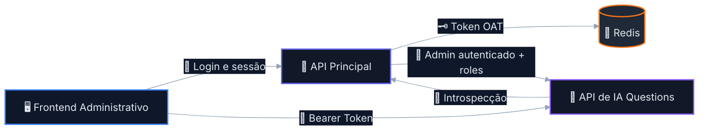
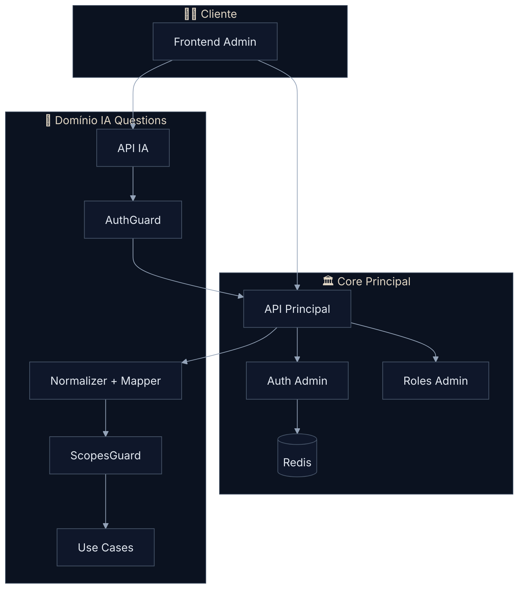
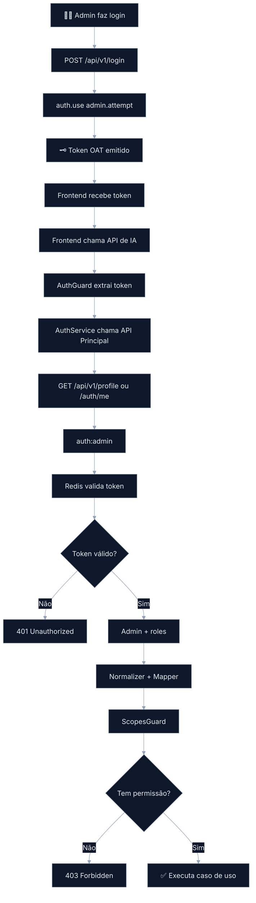
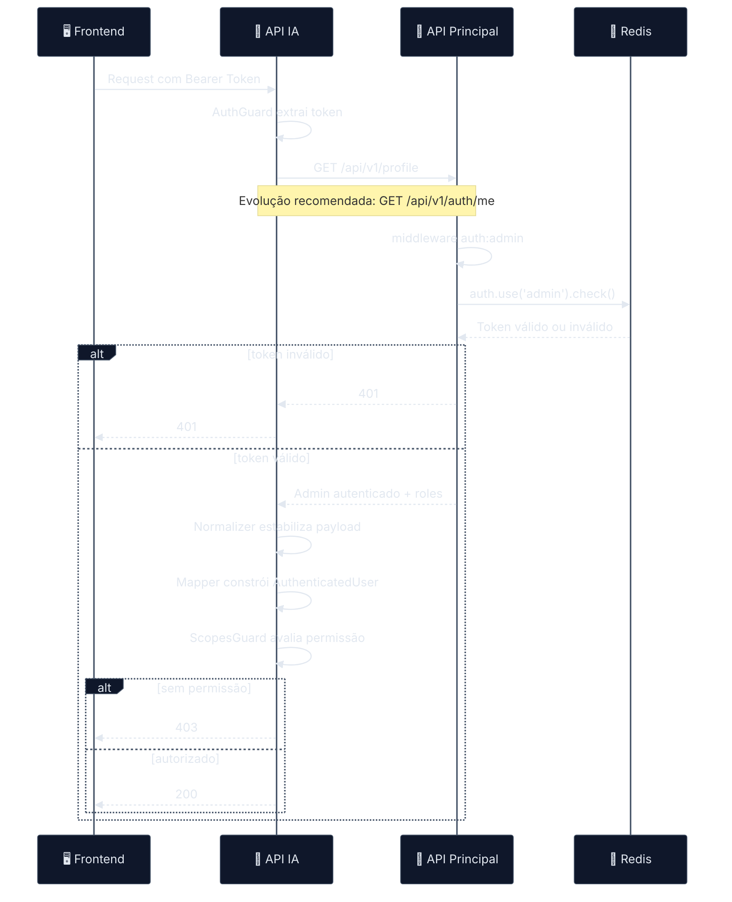
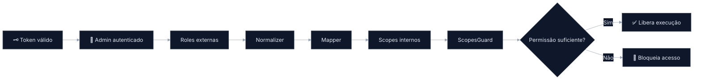
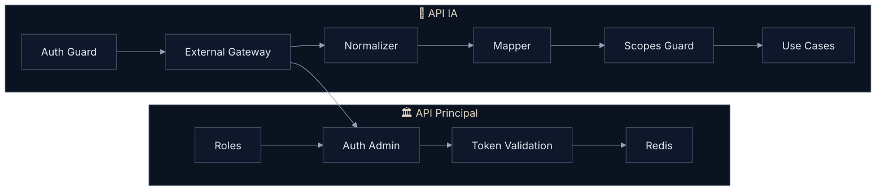
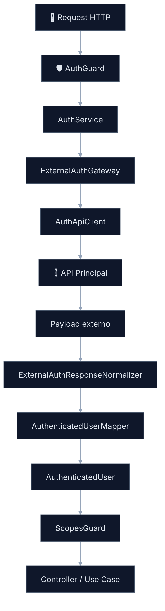
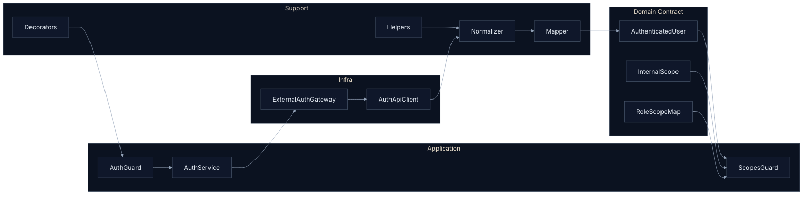

# Arquitetura de Autenticação Delegada
## Reaproveitamento do Auth da API Principal (AdonisJS) na API de IA de Questions (NestJS)
### Recorte Arquitetural da Fase 1 — Auth, Identidade e Autorização Delegada

---

> [!IMPORTANT]
> Este documento representa **o recorte arquitetural do módulo de autenticação e autorização delegada da Fase 1**.
>
> Ele **não descreve toda a Fase 1 da plataforma**, mas sim a fundação de segurança e acesso que habilita a evolução segura do domínio de Questions.

> [!NOTE]
> O documento foi estruturado para funcionar como **artefato final de entrega técnica**, adequado para:
>
> - revisão arquitetural;
> - PR técnica;
> - alinhamento backend;
> - liderança de engenharia;
> - implementação incremental com baixo risco.

---

# Sumário

- [1. Resumo Executivo](#1-resumo-executivo)
- [2. Escopo do Documento](#2-escopo-do-documento)
- [3. Problema Arquitetural](#3-problema-arquitetural)
- [4. Decisão de Arquitetura](#4-decisão-de-arquitetura)
- [5. Contexto Técnico Validado](#5-contexto-técnico-validado)
- [6. Objetivos do Slice](#6-objetivos-do-slice)
- [7. Arquitetura de Alto Nível](#7-arquitetura-de-alto-nível)
- [8. Fluxos Principais](#8-fluxos-principais)
- [9. Boundary e Responsabilidades](#9-boundary-e-responsabilidades)
- [10. Contrato de Integração](#10-contrato-de-integração)
- [11. Endpoint de Introspecção](#11-endpoint-de-introspecção)
- [12. Arquitetura Interna do Auth Module](#12-arquitetura-interna-do-auth-module)
- [13. Estratégia de Roles, Scopes e Enforcement](#13-estratégia-de-roles-scopes-e-enforcement)
- [14. Estrutura Técnica Recomendada](#14-estrutura-técnica-recomendada)
- [15. Segurança, Resiliência e Observabilidade](#15-segurança-resiliência-e-observabilidade)
- [16. Plano de Implementação](#16-plano-de-implementação)
- [17. Critérios de Aceite Técnico](#17-critérios-de-aceite-técnico)
- [18. Próximos Passos](#18-próximos-passos)
- [19. Conclusão Executiva](#19-conclusão-executiva)

---

# 1. Resumo Executivo

A arquitetura proposta estabelece um modelo de **autenticação delegada com introspecção controlada**, no qual a **API Principal (AdonisJS)** permanece como **fonte única de verdade de identidade administrativa**, enquanto a **API de IA de Questions (NestJS)** consome esse contexto autenticado para aplicar **autorização local por domínio**.

A decisão evita a criação de um segundo sistema de autenticação, reduz acoplamento indevido, preserva coerência de sessão e mantém a superfície de segurança sob controle.

## Decisão central

```text
A API Principal autentica.
A API de IA consome identidade autenticada.
A API de IA autoriza localmente.
```

## Resultado esperado

- identidade única;
- sessão lógica única;
- sem duplicação de login/token;
- autorização desacoplada por domínio;
- integração segura e auditável.

---

# 2. Escopo do Documento

## Em escopo

- reaproveitamento do auth administrativo existente;
- introspecção do token administrativo;
- resolução do contexto autenticado do `admin`;
- normalização do payload autenticado;
- mapeamento de `roles` externas para `scopes` internos;
- enforcement de autorização na API de IA;
- requisitos de segurança, resiliência e observabilidade;
- desenho técnico do `AuthModule` da IA.

## Fora de escopo

- login de frontend;
- UX/UI de autenticação;
- pipeline completo de IA;
- OCR, embeddings, LLM orchestration;
- geração ponta a ponta de questões;
- redesign do auth legado;
- JWT migration;
- SSO externo ou federação multi-tenant.

---

# 3. Problema Arquitetural

Se a API de IA implementar autenticação própria para resolver esse acesso, o sistema passa a carregar complexidade e risco desnecessários.

## Riscos de um auth duplicado

- duplicação de identidade;
- divergência de sessão entre sistemas;
- revogação distribuída;
- permissão inconsistente;
- maior superfície de ataque;
- acoplamento indevido entre domínio de IA e domínio de identidade;
- troubleshooting mais difícil em produção.

## O problema real

A API de IA **não precisa autenticar o usuário do zero**.

Ela precisa apenas responder, com segurança:

- quem é o usuário autenticado;
- se o token ainda é válido;
- quais roles esse usuário possui;
- o que esse usuário pode executar dentro do domínio de Questions.

---

# 4. Decisão de Arquitetura

## Decisão oficial

# **Autenticação Delegada com Introspecção Controlada**

## Papel de cada sistema

| Sistema | Papel arquitetural |
|---|---|
| **API Principal (AdonisJS)** | Autoridade de autenticação, validação de token e resolução de identidade |
| **API de IA (NestJS)** | Consumidora de contexto autenticado e executora de autorização local |

## Regra de ouro

> **A API de IA não autentica usuários.**
>
> Ela **confia de forma controlada** na identidade resolvida pela API principal.

---

# 5. Contexto Técnico Validado

## Stack atual

- **Framework principal:** AdonisJS
- **Framework da API de IA:** NestJS
- **Guard administrativo:** `admin`
- **Driver:** `oat` (Opaque Access Token)
- **Persistência do token:** Redis
- **Provider de identidade:** `Admin`
- **Autorização legada:** baseada em `roles`
- **Proteção atual de rotas:** `auth:admin` + `role:*`

## Guard administrativo validado

```ts
admin: {
  driver: 'oat',
  tokenProvider: {
    type: 'api',
    driver: 'redis',
    redisConnection: 'local',
    foreignKey: 'admin_id',
  },
  provider: {
    driver: 'lucid',
    identifierKey: 'id',
    uids: ['email'],
    model: () => import('App/Models/Admin'),
  },
}
```

## Conclusão prática

A identidade correta a ser reaproveitada pela API de IA é a identidade do **perímetro administrativo**.

```text
auth:admin
```

---

# 6. Objetivos do Slice

Este slice existe para permitir que a API de IA aceite requests administrativos **sem implementar login próprio, sessão própria ou emissão de token própria**.

## Objetivos técnicos

1. receber o mesmo Bearer Token emitido pela app principal;
2. validar esse contexto contra a autoridade correta;
3. resolver o perfil autenticado com suas roles;
4. traduzir essas roles em scopes internos;
5. autorizar a operação localmente.

## Resultado arquitetural desejado

```text
Mesma identidade.
Mesma sessão lógica.
Sem duplicação de auth.
Com autorização isolada por domínio.
```

---

# 7. Arquitetura de Alto Nível

## 7.1 Visão executiva



## 7.2 Diagrama de contexto



## 7.3 Leitura arquitetural

A API de IA está **intencionalmente desacoplada da mecânica interna do auth do Adonis**, consumindo apenas um contrato de introspecção autenticada.

Isso preserva boundary, facilita manutenção e reduz acoplamento estrutural.

---

# 8. Fluxos Principais

## 8.1 Fluxo funcional ponta a ponta



## 8.2 Sequência técnica de request



## 8.3 Fluxo de decisão de autorização



## Nota de decisão

A separação entre **autenticação** e **autorização** é proposital e obrigatória:

- autenticação responde **quem é**;
- autorização responde **o que pode fazer**.

---

# 9. Boundary e Responsabilidades

## 9.1 O que cruza a fronteira entre sistemas

- token Bearer recebido na request;
- chamada de introspecção;
- payload autenticado do admin;
- roles administrativas necessárias;
- status mínimo de conta quando aplicável.

## 9.2 O que não deve cruzar a fronteira

- acesso direto ao Redis;
- detalhes internos do provider do Adonis;
- segredos internos do auth principal;
- middleware legado reaproveitado de forma acoplada;
- payload cru espalhado pela IA.

## 9.3 Boundary model



## 9.4 Matriz de ownership

| Tema | API Principal | API de IA |
|---|---|---|
| Login | ✅ | ❌ |
| Emissão de token | ✅ | ❌ |
| Revogação | ✅ | ❌ |
| Introspecção | ✅ | Consome |
| Normalização de payload | ❌ | ✅ |
| Mapeamento para scopes | ❌ | ✅ |
| Autorização de domínio | ❌ | ✅ |
| Enforcement por endpoint | ❌ | ✅ |

---

# 10. Contrato de Integração

## 10.1 Estado atual utilizável

Hoje, com base no comportamento atual do `AuthController.show`, o contrato efetivamente disponível é equivalente a:

```ts
const user = auth.user as Admin

return response.ok(
  await Admin.query().preload('roles').where('id', user.id).first()
)
```

## 10.2 Exemplo de payload atual

```json
{
  "id": 10,
  "name": "Matheus Diamantino",
  "email": "admin@empresa.com",
  "roles": [
    {
      "id": 1,
      "name": "admin",
      "slug": "admin"
    },
    {
      "id": 3,
      "name": "questioncreator",
      "slug": "questioncreator"
    }
  ],
  "created_at": "2026-01-10T10:00:00.000Z",
  "updated_at": "2026-02-10T10:00:00.000Z"
}
```

## 10.3 Payload recomendado para estabilização futura

```json
{
  "id": 10,
  "name": "Matheus Diamantino",
  "email": "admin@empresa.com",
  "roles": ["admin", "questioncreator"],
  "active": true,
  "status": "active"
}
```

## 10.4 Contrato interno canônico da IA

```ts
export interface AuthenticatedUser {
  id: number
  name: string
  email: string
  roles: string[]
  scopes: string[]
  isActive: boolean
  status?: string
}
```

## 10.5 Regra de robustez

A IA pode ser tolerante a pequenas variações do payload externo, mas essa tolerância deve existir **somente na camada de normalização**.

O domínio interno deve trabalhar sempre com um contrato estável.

---

# 11. Endpoint de Introspecção

## Estado atual utilizável

```http
GET /api/v1/profile
```

## Evolução recomendada

```ts
Route.get('/auth/me', 'AuthController.me').middleware(['auth:admin'])
```

## Controller recomendado

```ts
public async me({ response, auth }: HttpContextContract) {
  const user = auth.user as Admin

  const admin = await Admin.query()
    .preload('roles')
    .where('id', user.id)
    .first()

  return response.ok(admin)
}
```

## Requisitos do endpoint

- payload estável e canônico;
- sem dependência de UI;
- sem lógica incidental de tela;
- protegido apenas por `auth:admin`;
- contrato previsível para integração entre serviços.

---

# 12. Arquitetura Interna do Auth Module

## 12.1 Princípio de implementação

O `AuthModule` da IA deve ser responsável apenas por:

- receber o token;
- validar esse token contra a API principal;
- construir um `AuthenticatedUser` interno;
- aplicar autorização por scopes.

Ele **não deve**:

- emitir token;
- persistir sessão administrativa;
- manter login próprio;
- reimplementar o guard do Adonis;
- acoplar a IA ao payload cru da API principal.

## 12.2 Diagrama interno do módulo



## 12.3 Composição interna



---

# 13. Estratégia de Roles, Scopes e Enforcement

## Regra central

```text
Role externa → Scope interno → Decisão de autorização
```

## Mapeamento inicial recomendado

```ts
export const ROLE_SCOPE_MAP: Record<string, string[]> = {
  admin: ['*'],
  contentcreator: [
    'content.read',
    'content.write',
    'documents.read'
  ],
  questioncreator: [
    'documents.read',
    'documents.upload',
    'processing.read',
    'processing.retry',
    'questions.generate',
    'questions.review'
  ],
  seller: [
    'dashboard.read'
  ],
}
```

## Estratégia de enforcement

A autorização deve ocorrer em camadas complementares:

- **AuthGuard** → valida identidade;
- **ScopesGuard** → valida permissão técnica do endpoint;
- **Application Layer / Use Case** → valida regra de negócio.

## Nota arquitetural

Essa separação evita que a semântica de acesso da IA fique refém da modelagem de roles do legado.

---

# 14. Estrutura Técnica Recomendada

## Tree View do módulo

```text
src/
└── modules/
    └── auth/
        ├── 📦 auth.module.ts
        ├── infra/
        │   ├── 🌐 clients/
        │   │   └── auth-api.client.ts
        │   ├── 🔌 gateways/
        │   │   └── external-auth.gateway.ts
        │   ├── ⚙️ services/
        │   │   └── auth.service.ts
        │   ├── 🛡️ guards/
        │   │   ├── auth.guard.ts
        │   │   └── scopes.guard.ts
        │   └── 🧩 decorators/
        │       ├── current-user.decorator.ts
        │       └── required-scopes.decorator.ts
        ├── model/
        │   ├── 🧾 dto/
        │   │   └── authenticated-user.dto.ts
        │   ├── 📘 interfaces/
        │   │   ├── external-admin-profile.interface.ts
        │   │   ├── authenticated-user.interface.ts
        │   │   └── role-scope-map.interface.ts
        │   ├── 🏷️ enums/
        │   │   └── internal-scope.enum.ts
        │   └── 🧠 constants/
        │       └── role-scope-map.constant.ts
        └── lib/
            ├── 🔄 mappers/
            │   └── authenticated-user.mapper.ts
            ├── 🧰 helpers/
            │   ├── extract-bearer-token.helper.ts
            │   └── normalize-role.helper.ts
            └── 🧼 normalizers/
                └── external-auth-response.normalizer.ts
```

## Legenda visual

- **🌐 Clients** → integração HTTP externa
- **🔌 Gateways** → boundary com provider externo
- **⚙️ Services** → orquestração de aplicação
- **🛡️ Guards** → enforcement técnico
- **🧾 DTO / Interfaces / Enums / Constants** → contratos e semântica interna
- **🔄 / 🧰 / 🧼** → transformação, suporte e estabilização do payload

---

# 15. Segurança, Resiliência e Observabilidade

## 15.1 Segurança por padrão

### Obrigatório

- TLS obrigatório;
- aceitar apenas `Authorization: Bearer`;
- nunca trafegar token em query string;
- negar acesso por padrão;
- falha de introspecção deve bloquear;
- nunca persistir token puro;
- nunca acessar Redis diretamente da IA.

## 15.2 Resiliência

### Regras recomendadas

- timeout entre **1000ms e 2000ms**;
- retry apenas para falhas transitórias;
- no máximo **1 retry curto**;
- nunca retry para `401`, `403` e `404`;
- preferir falha rápida a degradação silenciosa.

### Regra crítica

> **Falha de autenticação remota deve degradar para bloqueio, nunca para permissão.**

## 15.3 Observabilidade

### Logs mínimos

- `request_id`
- `correlation_id`
- `user_id`
- `user_roles`
- `auth_provider_status_code`
- `auth_provider_latency_ms`
- `endpoint`
- `method`
- `decision`

### Métricas recomendadas

- `auth_requests_total`
- `auth_success_total`
- `auth_failures_total`
- `auth_forbidden_total`
- `auth_provider_timeout_total`
- `auth_provider_latency_ms`
- `auth_guard_execution_ms`

## 15.4 Matriz de falha esperada

| Situação | Resultado esperado |
|---|---|
| Token ausente | `401 Unauthorized` |
| Token inválido | `401 Unauthorized` |
| Token revogado | `401 Unauthorized` |
| Usuário sem scope | `403 Forbidden` |
| Timeout da API principal | `503` ou bloqueio controlado |
| Payload inválido do provider | `401` ou `502`, conforme política adotada |

---

# 16. Plano de Implementação

## API Principal

- [ ] manter `auth:admin` como fonte de verdade
- [ ] expor endpoint estável de introspecção
- [ ] garantir preload consistente de `roles`
- [ ] padronizar payload retornado
- [ ] validar `401` para token inválido
- [ ] estabilizar contrato de integração

## API de IA

- [ ] criar `AuthModule`
- [ ] implementar `AuthGuard`
- [ ] implementar `ScopesGuard`
- [ ] implementar `AuthService`
- [ ] implementar `ExternalAuthGateway`
- [ ] implementar `AuthApiClient`
- [ ] implementar `AuthenticatedUserMapper`
- [ ] implementar normalizer do payload externo
- [ ] implementar `ROLE_SCOPE_MAP`
- [ ] proteger endpoints críticos
- [ ] instrumentar logs e métricas

## Testes obrigatórios

- [ ] token ausente
- [ ] token inválido
- [ ] token expirado/revogado
- [ ] token válido
- [ ] autorização por scope
- [ ] falha da API principal
- [ ] teste ponta a ponta entre APIs
- [ ] payload externo inconsistente

---

# 17. Critérios de Aceite Técnico

## Critérios funcionais

- a API de IA aceita Bearer Token emitido pela API principal;
- a API de IA rejeita token inválido ou revogado;
- a API de IA constrói corretamente o `AuthenticatedUser` interno;
- a autorização por scope protege endpoints críticos;
- requests autorizados executam normalmente.

## Critérios não funcionais

- logs e métricas suficientes para troubleshooting;
- comportamento previsível em timeout/falha remota;
- ausência de dependência direta com Redis;
- ausência de emissão de token na IA;
- boundary preservado entre identidade e domínio de Questions.

## Critério arquitetural principal

> O módulo estará correto quando a API de IA puder confiar na identidade administrativa da API principal **sem se tornar dependente da implementação interna do auth do Adonis**.

---

# 18. Próximos Passos

## Na API Principal

- manter o login administrativo existente;
- usar `GET /api/v1/profile` como base inicial;
- criar `GET /api/v1/auth/me` como evolução correta;
- padronizar payload;
- garantir preload consistente de roles.

## Na API de IA

- criar o módulo `auth` completo;
- implementar `AuthGuard`;
- implementar `ScopesGuard`;
- criar `AuthenticatedUserMapper`;
- criar `ROLE_SCOPE_MAP`;
- proteger endpoints críticos da IA;
- escrever testes de integração ponta a ponta.

---

# 19. Conclusão Executiva

O desenho arquitetural está **coerente com o stack validado**, **compatível com o modelo técnico atual** e **adequado para implementação segura neste estágio da plataforma**.

## Síntese final

A API principal autentica.  
A API de IA confia.  
A API de IA normaliza.  
A API de IA traduz.  
A API de IA autoriza.  
A API de IA executa.

---

# Status do Documento

- **Tipo:** Documento arquitetural técnico final
- **Uso pretendido:** Entrega técnica / PR arquitetural / implementação
- **Escopo:** Slice de autenticação e autorização delegada da Fase 1
- **Status:** Pronto para revisão e implementação

