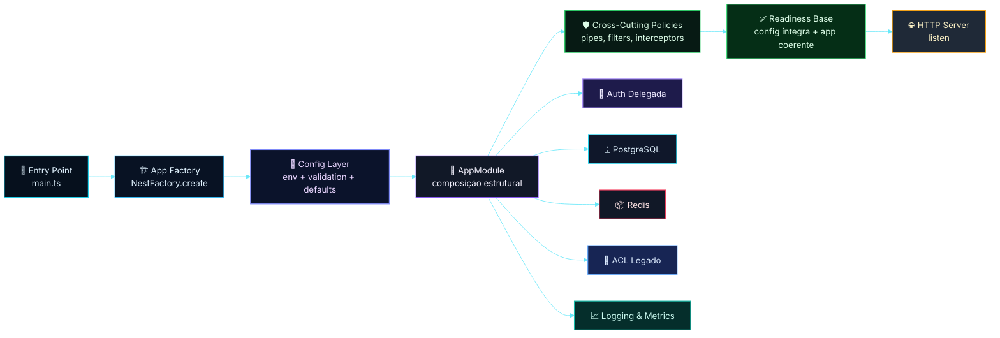
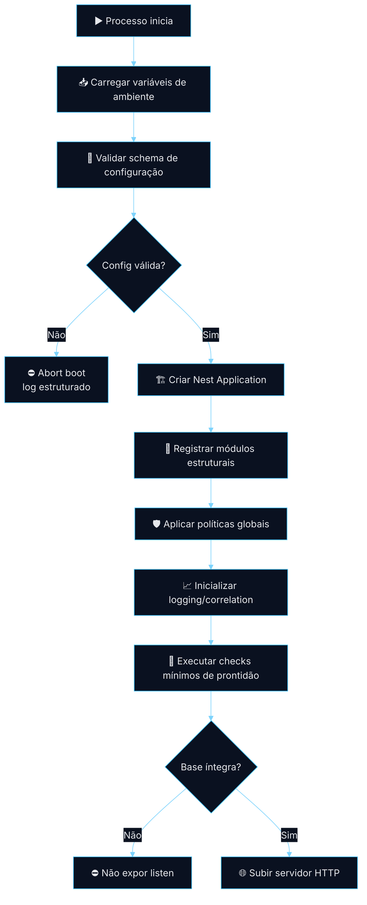
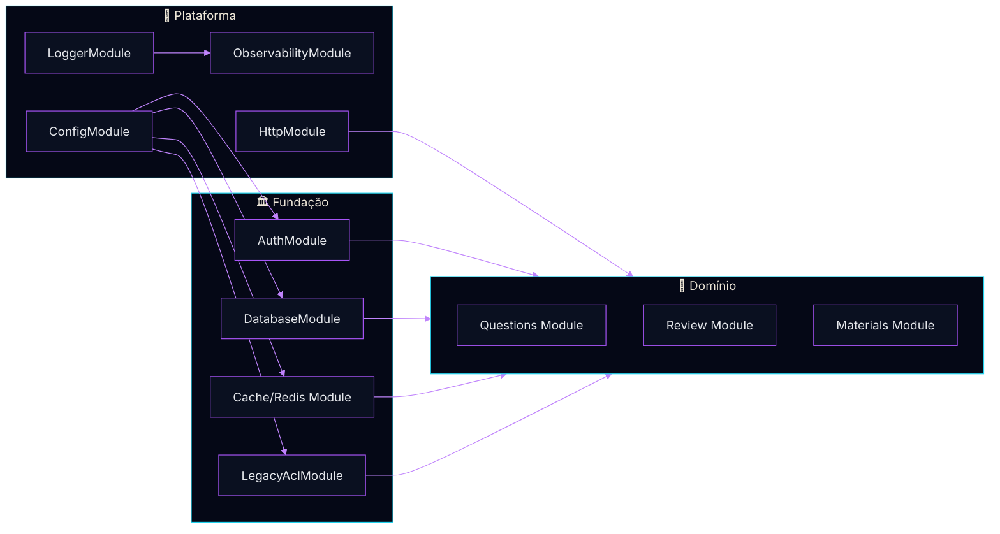
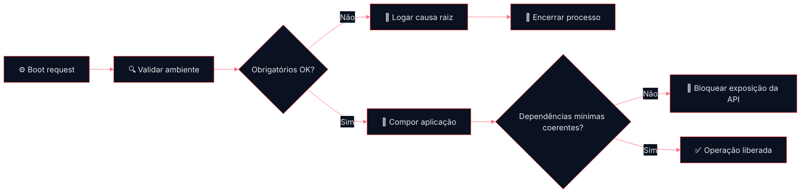
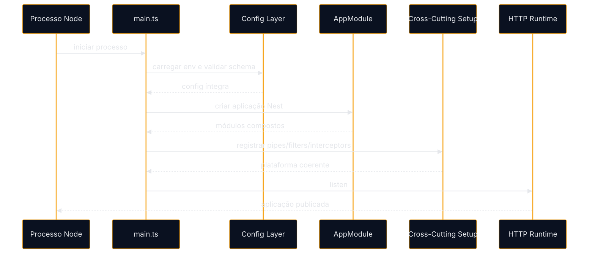
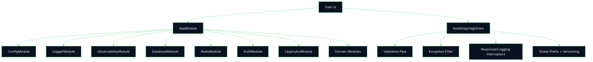

# Arquitetura de Bootstrap Base

## Fundação Operacional da Aplicação NestJS na Fase 1
### Recorte Arquitetural da Fase 1 — Inicialização, Configuração, Composição de Módulos e Padrões Transversais

* * *

<div align="center">


</div>

* * *

> [!IMPORTANT]
> Este documento descreve o recorte arquitetural da base de bootstrap da Fase 1.
> O foco aqui não é o domínio funcional completo da plataforma, mas a fundação operacional que garante inicialização previsível, composição segura de módulos, configuração consistente e padronização transversal para a evolução do produto.

* * *

# Sumário

- [**1. Resumo Executivo**](#1-resumo-executivo)
- [**2. Escopo do Documento**](#2-escopo-do-documento)
- [**3. Problema Arquitetural**](#3-problema-arquitetural)
- [**4. Decisão de Arquitetura**](#4-decisão-de-arquitetura)
- [**5. Contexto Técnico Validado**](#5-contexto-técnico-validado)
- [**6. Objetivos do Slice**](#6-objetivos-do-slice)
- [**7. Princípios Arquiteturais**](#7-princípios-arquiteturais)
- [**8. Arquitetura de Alto Nível**](#8-arquitetura-de-alto-nível)
- [**9. Fluxos Principais**](#9-fluxos-principais)
- [**10. Boundary e Responsabilidades**](#10-boundary-e-responsabilidades)
- [**11. Configuração e Contratos de Ambiente**](#11-configuração-e-contratos-de-ambiente)
- [**12. Ciclo de Inicialização da Aplicação**](#12-ciclo-de-inicialização-da-aplicação)
- [**13. Arquitetura Interna do Bootstrap**](#13-arquitetura-interna-do-bootstrap)
- [**14. Padrões Transversais de Fundação**](#14-padrões-transversais-de-fundação)
- [**15. Estrutura Técnica Recomendada**](#15-estrutura-técnica-recomendada)
- [**16. Segurança, Resiliência e Observabilidade**](#16-segurança-resiliência-e-observabilidade)
- [**17. ADR — Registro da Decisão**](#17-adr--registro-da-decisão)
- [**18. Plano de Implementação**](#18-plano-de-implementação)
- [**19. Critérios de Aceite Técnico**](#19-critérios-de-aceite-técnico)
- [**20. Próximos Passos**](#20-próximos-passos)
- [**21. Conclusão Executiva**](#21-conclusão-executiva)

* * *

# 1. Resumo Executivo

A base de bootstrap da plataforma deve estabelecer uma inicialização previsível, segura e evolutiva para a API de IA em NestJS. Em vez de tratar o bootstrap como um detalhe de framework, este slice o posiciona como fundação arquitetural da Fase 1: é nele que se consolidam contratos de ambiente, composição dos módulos estruturais, políticas transversais, inicialização de observabilidade, validação de configuração e regras mínimas de segurança operacional.

Em termos práticos, o bootstrap deixa de ser apenas o `main.ts` que sobe o servidor e passa a ser o mecanismo que garante que a aplicação só entre em operação quando o estado mínimo de execução estiver coerente com a arquitetura aprovada.

## Decisão central

- O bootstrap compõe a aplicação.
- O bootstrap valida o ambiente.
- O bootstrap aplica políticas transversais.
- O bootstrap só expõe a API quando a base estrutural estiver íntegra.

## Resultado esperado

- inicialização determinística;
- ambiente validado antes do start;
- composição modular previsível;
- políticas transversais centralizadas;
- baseline de segurança e observabilidade desde a Fase 1;
- compatibilidade real com as próximas fases do roadmap.

> [!NOTE]
> O bootstrap da Fase 1 deve ser tratado como fundação estrutural permanente do produto.
> Não é um arranjo provisório para o MVP, nem um atalho descartável antes das próximas fases.

* * *

# 2. Escopo do Documento

## Em escopo

- setup da aplicação NestJS + TypeScript;
- composição do `AppModule` e dos módulos fundacionais;
- validação tipada de ambiente e configuração;
- inicialização segura do servidor HTTP;
- registro de pipes, filters, interceptors e guards globais quando aplicável;
- políticas de serialização, validação e tratamento de erro;
- preparação de logging, correlação e métricas;
- readiness mínima para PostgreSQL, Redis e integrações controladas;
- contratos de bootstrap compatíveis com auth delegada, ACL e evolução assíncrona.

## Fora de escopo

- detalhamento do domínio funcional de questões;
- desenho completo da persistência de cada bounded context;
- implementação profunda de filas, jobs e workers da Fase 4;
- modelagem detalhada do front-end administrativo;
- definição final de todas as estratégias de deploy.

* * *

# 3. Problema Arquitetural

Uma aplicação orientada a domínio não pode depender de inicialização implícita, configuração dispersa ou acoplamento acidental entre framework, infraestrutura e domínio.

Sem uma base de bootstrap explícita, os riscos mais comuns são:

- start com variáveis obrigatórias ausentes;
- diferenças entre ambientes sem validação central;
- middlewares e políticas transversais registrados de forma inconsistente;
- dependências estruturais subindo fora de ordem lógica;
- vazamento de detalhes de infraestrutura para módulos de domínio;
- observabilidade tardia e troubleshooting difícil;
- crescimento desorganizado à medida que novas fases entram no produto.

## Formulação do problema

A Fase 1 precisa de uma base que permita a aplicação nascer pequena, mas corretamente organizada para crescer sem reescrita estrutural.

* * *

# 4. Decisão de Arquitetura

Adotar um modelo de **Bootstrap Base Centralizado e Modular**, no qual a entrada da aplicação é responsável por:

- carregar e validar configuração antes do start;
- compor os módulos fundacionais em ordem explícita;
- registrar políticas transversais de plataforma;
- preparar observabilidade mínima desde a subida;
- falhar cedo em caso de inconsistência estrutural;
- preservar boundaries entre domínio, aplicação e infraestrutura.

## Diretriz operacional

O bootstrap deve ser fino em regra de negócio e forte em orquestração estrutural.

## Regra de ouro

Tudo o que é transversal e obrigatório para a aplicação inteira deve nascer no bootstrap ou por módulos explicitamente carregados por ele.

* * *

# 5. Contexto Técnico Validado

O README principal da plataforma estabelece que a Fase 1 está em execução com foco explícito em bootstrap da aplicação NestJS, definição dos módulos fundacionais, contratos internos, validação e padrões transversais. Também define que o bootstrap da aplicação inclui setup de NestJS + TypeScript, estrutura inicial de módulos, configuração de ambiente, inicialização segura e padronização transversal. Além disso, a arquitetura oficial é de Monólito Modular Pragmático por Domínio, com PostgreSQL, Redis, integração controlada com legado e auth reaproveitado da `api/v1`.

## Leituras derivadas para este slice

1. O bootstrap é parte formal da Fase 1, não um detalhe secundário.
2. A composição inicial de módulos já precisa nascer compatível com PostgreSQL, Redis, ACL e auth delegada.
3. A base de inicialização deve suportar o roadmap futuro sem assumir descarte da estrutura atual.

* * *

# 6. Objetivos do Slice

## Objetivo principal

Definir a base arquitetural de bootstrap da aplicação para garantir previsibilidade operacional, padronização transversal e compatibilidade com o roadmap.

## Objetivos específicos

- formalizar a responsabilidade do bootstrap na Fase 1;
- separar configuração, composição e start do servidor;
- impedir boot parcial com estado inválido;
- centralizar validação e sane defaults;
- garantir base estável para auth, persistência, cache e ACL;
- estabelecer modelo de organização técnica reutilizável pelos próximos slices.

* * *

# 7. Princípios Arquiteturais

## 7.1 Fail fast estrutural

Se a configuração mínima não estiver íntegra, a aplicação não deve iniciar.

## 7.2 Bootstrap sem regra de negócio

O bootstrap coordena a plataforma, mas não implementa decisões do domínio.

## 7.3 Configuração tipada e explícita

Toda dependência estrutural deve ser resolvida por contrato de configuração validado.

## 7.4 Ordem de composição previsível

A montagem da aplicação deve refletir a arquitetura aprovada, e não a ordem acidental de imports.

## 7.5 Transversalidade centralizada

Validação, serialização, tratamento de exceção, CORS, versionamento, prefixos e observabilidade devem ser definidos de forma consistente.

## 7.6 Boundary preservado

Domínio não conhece detalhes do bootstrap; infraestrutura não invade a semântica do domínio.

## 7.7 Evolução sem ruptura

A base deve aceitar crescimento por novos módulos, workers e integrações sem reestruturar o núcleo de inicialização.

* * *

# 8. Arquitetura de Alto Nível

## 8.1 Visão macro do bootstrap na fundação



## 8.2 Leitura arquitetural

O bootstrap ocupa a fronteira entre runtime e arquitetura. Ele é o ponto em que o framework é transformado em plataforma operacional aderente às decisões da Fase 1.

* * *

# 9. Fluxos Principais

## 9.1 Fluxo de inicialização segura



## 9.2 Fluxo de composição transversal



## 9.3 Fluxo de falha controlada no boot



* * *

# 10. Boundary e Responsabilidades

## 10.1 Responsabilidade do bootstrap

O bootstrap é responsável por:

- inicializar a aplicação;
- validar configuração;
- compor módulos estruturais;
- aplicar políticas transversais;
- preparar runtime HTTP;
- publicar a aplicação apenas em estado consistente.

## 10.2 O que não pertence ao bootstrap

Não pertence ao bootstrap:

- regra de negócio do domínio;
- decisões de caso de uso;
- consultas de repositório de domínio;
- políticas específicas de um bounded context;
- mapeamentos funcionais do legado.

## 10.3 Relação com os módulos fundacionais

| Camada | Responsabilidade principal | Relação com bootstrap |
|---|---|---|
| Platform | config, logging, observabilidade, runtime | bootstrap instancia e conecta |
| Foundation | auth, banco, cache, ACL | bootstrap compõe e protege |
| Domain | casos de uso e regras do produto | bootstrap apenas hospeda |
| Interfaces | controllers, DTOs, contracts | bootstrap padroniza entrada e saída |

* * *

# 11. Configuração e Contratos de Ambiente

## 11.1 Princípio de configuração

Configuração deve ser tratada como contrato tipado, validado e versionável.

## 11.2 Blocos mínimos de configuração

- `APP_*` para dados de runtime da aplicação;
- `HTTP_*` para porta, prefixo, versionamento e CORS;
- `DB_*` para PostgreSQL;
- `REDIS_*` para cache e coordenação futura;
- `AUTH_*` para integração com a API principal;
- `LEGACY_*` para ACL com MySQL legado;
- `OBS_*` para logs, métricas e tracing progressivo.

## 11.3 Exemplo de contrato lógico

```ts
export interface AppConfig {
  app: {
    name: string;
    env: 'local' | 'dev' | 'staging' | 'prod' | 'test';
    port: number;
    globalPrefix: string;
    enableCors: boolean;
  };
  database: {
    host: string;
    port: number;
    username: string;
    password: string;
    database: string;
    ssl?: boolean;
  };
  redis: {
    host: string;
    port: number;
    password?: string;
  };
  auth: {
    baseUrl: string;
    introspectionPath: string;
    timeoutMs: number;
  };
}
```

## 11.4 Política de ambiente

- toda variável obrigatória deve ser validada antes do start;
- defaults só devem existir para parâmetros não críticos;
- configuração sensível deve ficar fora do código;
- o bootstrap deve logar contexto suficiente para troubleshooting, sem vazar segredo.

> [!TIP]
> Referência técnica: o uso de `ConfigModule` com schema explícito e fábrica tipada reduz drift entre ambientes e melhora o isolamento de falhas na subida.

* * *

# 12. Ciclo de Inicialização da Aplicação

## 12.1 Etapas formais do ciclo

1. carregar ambiente;
2. validar schema de configuração;
3. compor o `AppModule`;
4. registrar recursos transversais globais;
5. preparar integração mínima com logging e métricas;
6. verificar coerência estrutural do runtime;
7. publicar a aplicação.

## 12.2 Sequência recomendada



## 12.3 Regra de publicação

A API só deve expor o `listen` depois que a configuração mínima estiver validada e o container da aplicação estiver coerente para operação.

* * *

# 13. Arquitetura Interna do Bootstrap

## 13.1 Componentes recomendados

- `main.ts` como entry point fino;
- `AppModule` como raiz de composição;
- `config/` para factories, schemas e contracts;
- `bootstrap/` para registradores transversais;
- `shared/` para utilidades comuns de plataforma;
- módulos fundacionais independentes por responsabilidade.

## 13.2 Visão de composição interna



## 13.3 Responsabilidade por arquivo lógico

| Elemento | Papel |
|---|---|
| `main.ts` | criar app, chamar registradores, subir servidor |
| `app.module.ts` | compor módulos estruturais |
| `config/*.ts` | schema, factories, objetos tipados |
| `bootstrap/*.ts` | registrar políticas globais |
| `shared/*` | contratos e utilidades técnicas comuns |

* * *

# 14. Padrões Transversais de Fundação

## 14.1 Validação global

A plataforma deve registrar validação global consistente para DTOs, payloads e entradas externas.

## 14.2 Tratamento global de exceção

Erros devem ser padronizados para evitar vazamento indevido e melhorar troubleshooting.

## 14.3 Serialização e resposta

A resposta HTTP deve seguir contratos previsíveis, principalmente para erros, paginação e metadados de correlação.

## 14.4 Versionamento e prefixo

A API deve nascer com prefixo global e espaço claro para versionamento.

## 14.5 CORS e surface area

CORS deve ser configurado por ambiente e por política explícita, nunca por abertura irrestrita em produção.

## 14.6 Correlação e logging

Toda request relevante deve poder ser rastreada por `requestId`, contexto operacional e nível de severidade adequado.

* * *

# 15. Estrutura Técnica Recomendada

## 15.1 Tree view de alto nível

```text
src/
├── main.ts
├── app.module.ts
├── bootstrap/
│   ├── register-global-pipes.ts
│   ├── register-global-filters.ts
│   ├── register-global-interceptors.ts
│   ├── register-versioning.ts
│   └── register-cors.ts
├── config/
│   ├── app.config.ts
│   ├── database.config.ts
│   ├── redis.config.ts
│   ├── auth.config.ts
│   ├── legacy.config.ts
│   ├── observability.config.ts
│   └── env.schema.ts
├── modules/
│   ├── auth/
│   ├── database/
│   ├── redis/
│   ├── legacy-acl/
│   └── questions/
└── shared/
    ├── contracts/
    ├── exceptions/
    ├── interceptors/
    ├── filters/
    └── utils/
```

## 15.2 Tree view visual de alto nível

```mermaid
%%{init: {'theme':'base','themeVariables': {
  'background':'#020617',
  'primaryColor':'#081120',
  'primaryTextColor':'#e5e7eb',
  'primaryBorderColor':'#22d3ee',
  'lineColor':'#67e8f9',
  'secondaryColor':'#0b1220',
  'tertiaryColor':'#111827',
  'clusterBkg':'#040816',
  'clusterBorder':'#8b5cf6',
  'fontFamily':'Inter, Segoe UI, Arial'
}}}%%
flowchart TD
    ROOT["src"] --> M1["main.ts"]
    ROOT --> M2["app.module.ts"]
    ROOT --> B["bootstrap/"]
    ROOT --> C["config/"]
    ROOT --> MOD["modules/"]
    ROOT --> S["shared/"]

    B --> B1["global-pipes"]
    B --> B2["global-filters"]
    B --> B3["global-interceptors"]
    B --> B4["versioning/cors"]

    C --> C1["app.config"]
    C --> C2["database.config"]
    C --> C3["redis.config"]
    C --> C4["auth.config"]
    C --> C5["legacy.config"]
    C --> C6["env.schema"]

    MOD --> A1["auth"]
    MOD --> A2["database"]
    MOD --> A3["redis"]
    MOD --> A4["legacy-acl"]
    MOD --> A5["questions"]

    S --> S1["contracts"]
    S --> S2["exceptions"]
    S --> S3["filters"]
    S --> S4["interceptors"]
```



## 15.3 Exemplo de `main.ts` lógico

```ts
async function bootstrap() {
  const app = await NestFactory.create(AppModule, {
    bufferLogs: true,
  });

  const config = app.get(AppConfigService);

  registerVersioning(app, config);
  registerCors(app, config);
  registerGlobalPipes(app);
  registerGlobalFilters(app);
  registerGlobalInterceptors(app);

  await app.listen(config.port);
}

bootstrap();
```

## 15.4 Exemplo de montagem do `AppModule`

```ts
@Module({
  imports: [
    ConfigModule.forRoot({ isGlobal: true }),
    LoggerModule,
    ObservabilityModule,
    DatabaseModule,
    RedisModule,
    AuthModule,
    LegacyAclModule,
    QuestionsModule,
  ],
})
export class AppModule {}
```

* * *

# 16. Segurança, Resiliência e Observabilidade

## 16.1 Segurança mínima da fundação

- validação global de entrada;
- tratamento controlado de exceções;
- headers e surface area reduzidos;
- CORS restritivo por ambiente;
- configuração sensível isolada;
- negação de boot em configuração inválida.

## 16.2 Resiliência operacional

- start determinístico;
- logs de boot com contexto;
- falha rápida em inconsistência estrutural;
- readiness explícita antes de publicar tráfego;
- preparação para health checks e graceful shutdown.

## 16.3 Observabilidade mínima recomendada

- log estruturado de boot;
- correlação por request;
- métricas básicas de inicialização;
- distinção entre erro de configuração, erro de integração e erro de runtime;
- eventos claros para subida, falha e shutdown.

## 16.4 Matriz de falha esperada

| Situação | Resultado esperado |
|---|---|
| variável obrigatória ausente | abortar boot |
| schema inválido | abortar boot |
| módulo estrutural inconsistente | não publicar listen |
| CORS mal configurado em produção | bloquear start ou degradar com política explícita |
| falha em registrador global | encerrar boot com log estruturado |
| indisponibilidade de dependência opcional | tratar conforme política, sem mascarar estado |

## 16.5 Hardening adicional recomendado

### Segurança de plataforma

- helmet ou política equivalente;
- sanitização consistente de payloads;
- política de trusted proxies por ambiente;
- redução de headers informacionais.

### Proteção operacional

- readiness e liveness separados;
- graceful shutdown com sinais do processo;
- métricas de tempo de boot;
- alarmes por falha recorrente na subida.

> [!NOTE]
> O ponto central deste slice é simples: disponibilidade da aplicação sem coerência estrutural não é sucesso operacional.
> Bootstrap válido é pré-condição de confiança para todo o restante da Fase 1.

* * *

# 17. ADR — Registro da Decisão

## ADR-002 — Bootstrap Base Centralizado e Modular

### Status

Aceito

### Contexto

A Fase 1 exige uma base operacional estável para sustentar modularização por domínio, auth delegada, persistência principal, cache e integração controlada com legado. Sem um bootstrap explícito, a plataforma corre risco de crescer com configuração dispersa, subida inconsistente e políticas transversais fragmentadas.

### Decisão

Adotar uma arquitetura de bootstrap base centralizado, com validação de configuração, composição modular explícita e registro transversal padronizado antes da exposição do servidor HTTP.

### Consequências positivas

- reduz drift entre ambientes;
- melhora troubleshooting de subida;
- preserva coerência arquitetural;
- facilita onboarding técnico;
- cria fundação estável para as próximas fases.

### Trade-offs assumidos

- maior rigor na gestão de configuração;
- necessidade de contratos tipados desde o início;
- pequena sobrecarga inicial para formalizar registradores e módulos estruturais.

* * *

# 18. Plano de Implementação

## Núcleo de bootstrap

- criar `main.ts` fino e orientado a registradores;
- criar pasta `bootstrap/` para políticas globais;
- definir `AppModule` como raiz de composição estrutural;
- separar configuração por domínio técnico.

## Configuração

- criar `env.schema.ts`;
- validar variáveis obrigatórias;
- expor config tipada por factories;
- remover acesso solto a `process.env` fora da camada de configuração.

## Plataforma transversal

- registrar global pipes;
- registrar global filters;
- registrar interceptors transversais;
- registrar prefixo e versionamento;
- padronizar CORS por ambiente.

## Infraestrutura fundacional

- conectar `DatabaseModule`;
- conectar `RedisModule`;
- conectar `AuthModule`;
- conectar `LegacyAclModule`;
- preparar hooks para observabilidade.

## Testes obrigatórios

- boot com ambiente válido;
- boot com variável ausente;
- boot com schema inválido;
- registro correto de políticas globais;
- publicação da aplicação apenas em estado consistente.

* * *

# 19. Critérios de Aceite Técnico

## Critérios mínimos

- a aplicação inicia apenas com configuração validada;
- o bootstrap não contém regra de negócio;
- os módulos fundacionais são compostos explicitamente;
- pipes, filters e interceptors transversais estão centralizados;
- ambiente, logs e runtime seguem política unificada;
- a base suporta acoplamento controlado com auth, banco, Redis e ACL.

## Evidências esperadas

- tree técnico coerente com este documento;
- `main.ts` enxuto;
- configuração tipada;
- testes de boot cobrindo cenários de falha;
- logs de inicialização estruturados.

* * *

# 20. Próximos Passos

1. consolidar contrato de configuração da plataforma;
2. implementar registradores globais isolados por responsabilidade;
3. formalizar health/readiness da base;
4. integrar bootstrap com o slice de auth delegada;
5. preparar extensão futura para workers e processamento assíncrono.

* * *

# 21. Conclusão Executiva

A base de bootstrap da Fase 1 deve ser entendida como a fundação operacional do produto. É ela que transforma a diretriz de monólito modular em uma aplicação realmente previsível, validada e pronta para crescer com segurança.

Ao centralizar configuração, composição de módulos, políticas transversais e critérios de publicação da API, o bootstrap deixa de ser apenas etapa técnica de inicialização e passa a ser um ativo arquitetural do projeto.

Em síntese:

- a Fase 1 não começa no domínio;
- ela começa na forma correta de subir a plataforma.
